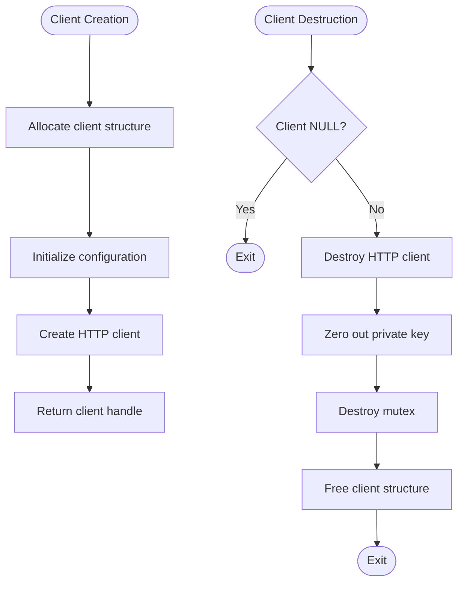
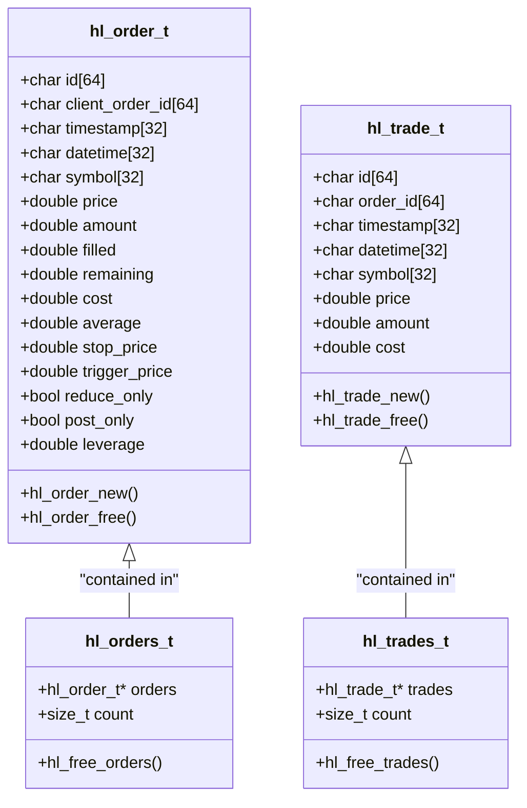
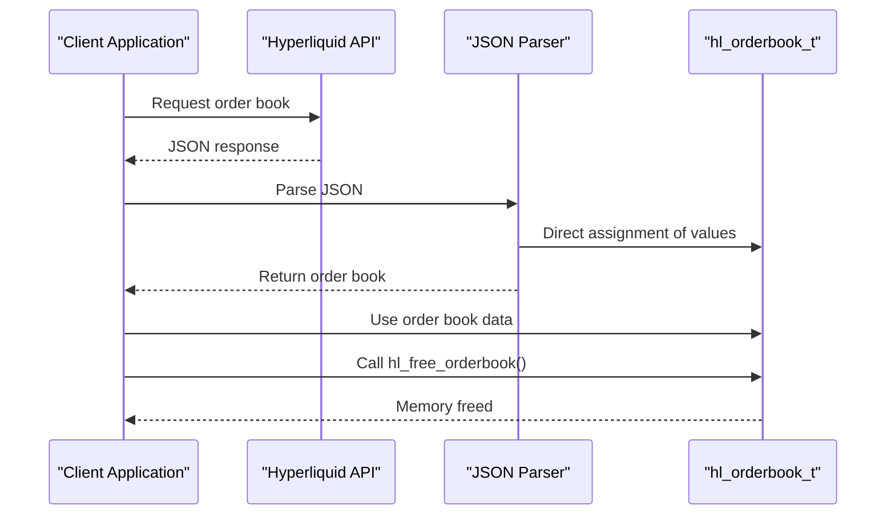
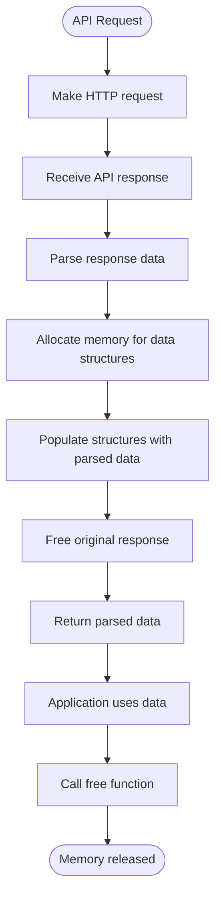
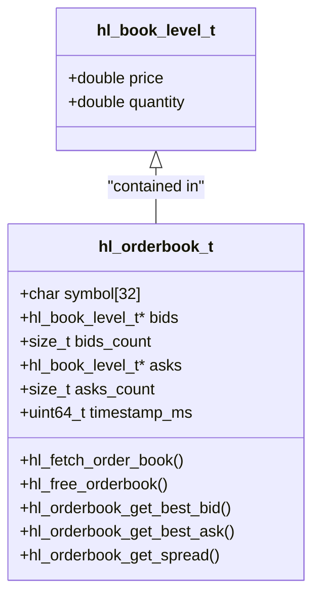
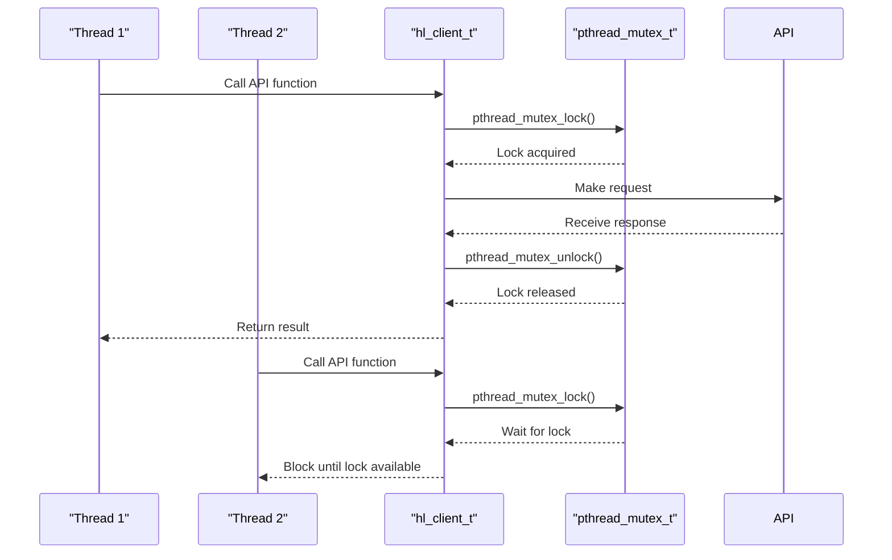
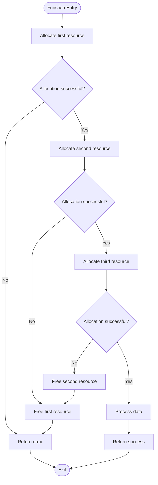

# Memory Management

<cite>
**Referenced Files in This Document**   
- [client.c](file://src/client.c)
- [types.c](file://src/types.c)
- [orderbook.c](file://src/orderbook.c)
- [hyperliquid.h](file://include/hyperliquid.h)
- [hl_types.h](file://include/hl_types.h)
- [hl_client.h](file://include/hl_client.h)
</cite>

## Table of Contents
1. [Introduction](#introduction)
2. [RAII-like Resource Management](#raii-like-resource-management)
3. [Internal Allocation Functions](#internal-allocation-functions)
4. [Zero-Copy Design Philosophy](#zero-copy-design-philosophy)
5. [Memory Management for API Responses](#memory-management-for-api-responses)
6. [Order Book Memory Handling](#order-book-memory-handling)
7. [Thread Safety and Cleanup Handlers](#thread-safety-and-cleanup-handlers)
8. [Common Memory Issues](#common-memory-issues)
9. [Debugging Strategies](#debugging-strategies)
10. [Best Practices](#best-practices)

## Introduction
The hyperliquid-c library implements a comprehensive memory management system designed for reliability, efficiency, and safety in financial trading applications. This document details the memory management practices employed throughout the codebase, focusing on the RAII-like pattern for resource acquisition and release, internal allocation functions, zero-copy design principles, and strategies for preventing common memory issues. The library emphasizes deterministic resource cleanup through explicit destroy functions and careful handling of dynamic data structures.

## RAII-like Resource Management
The hyperliquid-c library employs an RAII-like pattern for resource management, where resource acquisition occurs during object creation and release happens through explicit destroy functions. This approach ensures that all allocated resources are properly cleaned up, preventing memory leaks and resource exhaustion.

The primary example of this pattern is the client lifecycle management. When a client is created using `hl_client_new`, various resources are allocated including the client structure itself, HTTP client, configuration data, and internal state. The corresponding `hl_client_destroy` function is responsible for releasing all these resources in a proper sequence.

**Diagram sources**
- [client.c](file://src/client.c#L89-L107)
- [client_new.c](file://src/client_new.c#L234-L236)

**Section sources**
- [client.c](file://src/client.c#L89-L107)
- [client_new.c](file://src/client_new.c#L234-L236)
- [hyperliquid.h](file://include/hyperliquid.h#L229-L229)

## Internal Allocation Functions
The library provides dedicated allocation and deallocation functions for various data structures, ensuring consistent memory management practices across the codebase. These functions handle both allocation and initialization, reducing the likelihood of uninitialized memory usage.

For order management, the library provides `hl_order_new` and `hl_order_free` functions that handle the creation and destruction of order structures. Similarly, trade structures are managed through `hl_trade_new` and `hl_trade_free` functions. These functions use `calloc` for allocation, which not only allocates memory but also initializes it to zero, preventing the use of uninitialized data.

The library also provides functions for managing collections of orders and trades. The `hl_free_orders` function iterates through an array of orders and frees each individual order before releasing the array memory. This hierarchical cleanup ensures that all allocated memory is properly released.

**Diagram sources**
- [types.c](file://src/types.c#L10-L50)
- [hl_types.h](file://include/hl_types.h#L50-L144)

**Section sources**
- [types.c](file://src/types.c#L10-L50)
- [hl_types.h](file://include/hl_types.h#L50-L144)

## Zero-Copy Design Philosophy
The hyperliquid-c library follows a zero-copy design philosophy to minimize heap allocations and improve performance. This approach reduces memory allocation overhead and prevents memory fragmentation, which is critical for high-frequency trading applications.

The zero-copy principle is evident in how the library handles parsed data. Instead of creating copies of data during parsing, the library shares references to the original parsed data. This is particularly important for market data such as order books, tickers, and OHLCV data, which can be large and frequently updated.

For example, when parsing JSON responses from the API, the library extracts values directly into the target structures without creating intermediate copies. This is achieved through careful pointer management and direct assignment of parsed values to structure members. The `parse_orderbook_level` function in orderbook.c demonstrates this approach by directly assigning parsed price and quantity values to the level structure.

**Diagram sources**
- [orderbook.c](file://src/orderbook.c#L100-L150)
- [hyperliquid.h](file://include/hyperliquid.h#L300-L350)

## Memory Management for API Responses
The library implements careful memory management for API responses, ensuring that all dynamically allocated memory is properly tracked and released. API response handling follows a consistent pattern of allocation during parsing and deallocation through dedicated free functions.

When API responses contain complex data structures like order books or trade histories, the library allocates memory for these structures during the parsing phase. The parsing functions are responsible for allocating the necessary memory and populating the structures with data from the API response. After parsing, the original response data can be freed, while the parsed data remains available for use by the application.

The `hl_fetch_order_book` function exemplifies this pattern. It makes an HTTP request to fetch order book data, parses the JSON response into an `hl_orderbook_t` structure, and allocates memory for the bid and ask levels. The function returns the populated order book structure, and the caller is responsible for calling `hl_free_orderbook` when the data is no longer needed.

**Section sources**
- [orderbook.c](file://src/orderbook.c#L200-L300)
- [hyperliquid.h](file://include/hyperliquid.h#L500-L550)

## Order Book Memory Handling
Order book memory management is a critical aspect of the library's design, given the large amount of data involved in market depth information. The library provides dedicated functions for allocating and freeing order book structures, ensuring proper memory management.

The `hl_orderbook_t` structure contains pointers to arrays of bid and ask levels, which are allocated dynamically based on the depth of the order book. When `hl_fetch_order_book` is called, it allocates memory for these arrays using `calloc`, which initializes the memory to zero. The function also respects the requested depth parameter, limiting the number of levels to reduce memory usage when appropriate.

The `hl_free_orderbook` function is responsible for cleaning up order book memory. It first frees the bid and ask level arrays if they exist, then resets all structure members to their default values. This prevents use-after-free errors by ensuring that the structure is in a consistent state after cleanup.

**Diagram sources**
- [orderbook.c](file://src/orderbook.c#L250-L300)
- [hl_orderbook.h](file://include/hl_orderbook.h#L50-L100)

**Section sources**
- [orderbook.c](file://src/orderbook.c#L250-L300)
- [hl_orderbook.h](file://include/hl_orderbook.h#L50-L100)

## Thread Safety and Cleanup Handlers
The library incorporates thread safety mechanisms to protect shared resources and ensure proper cleanup in multi-threaded environments. The client structure includes a pthread mutex that is used to synchronize access to shared data, preventing race conditions during concurrent operations.

The mutex is initialized during client creation and destroyed during client destruction. This ensures that the mutex lifecycle is tied to the client lifecycle, preventing resource leaks. The library also follows the RAII-like pattern for mutex management, where acquisition and release are paired within function scopes.

In addition to mutex management, the library could benefit from pthread cleanup handlers to ensure proper resource cleanup in case of thread cancellation. While not explicitly implemented in the current code, this would be a valuable addition for applications that use thread cancellation.

**Section sources**
- [client.c](file://src/client.c#L50-L100)
- [hyperliquid.h](file://include/hyperliquid.h#L100-L150)

## Common Memory Issues
The library addresses several common memory management issues through careful design and implementation. These include double-free, use-after-free, and memory leaks from unhandled error paths.

To prevent double-free errors, the library follows the convention of setting pointers to NULL after freeing them. This is evident in the `hl_free_orderbook` function, which sets the bid and ask pointers to NULL after freeing the associated memory. This practice ensures that subsequent calls to free functions are safe, as they check for NULL pointers before attempting to free memory.

Use-after-free errors are prevented through proper lifecycle management and clear documentation of ownership semantics. The library clearly defines which functions allocate memory and which functions are responsible for freeing it. For example, functions that return dynamically allocated data clearly document that the caller is responsible for freeing the memory.

Memory leaks from unhandled error paths are mitigated through careful resource cleanup in error conditions. Functions that allocate multiple resources check for errors after each allocation and clean up previously allocated resources if a subsequent allocation fails. This is demonstrated in the `hl_client_new` function, which frees the client structure if configuration initialization fails.

**Section sources**
- [client_new.c](file://src/client_new.c#L18-L68)
- [types.c](file://src/types.c#L60-L90)
- [orderbook.c](file://src/orderbook.c#L150-L200)

## Debugging Strategies
Effective debugging of memory issues in the hyperliquid-c library requires the use of specialized tools and techniques. Valgrind is particularly valuable for detecting memory leaks, use-after-free errors, and double-free conditions.

When using Valgrind, it's important to test both normal operation and error paths to ensure that all memory is properly cleaned up. This includes testing client creation and destruction, API calls that succeed and fail, and edge cases such as network timeouts and invalid parameters.

The library could benefit from additional debugging features such as memory allocation tracking and logging. These features would help identify memory usage patterns and potential issues in production environments. Debug builds could include additional checks for common memory errors, such as writing to freed memory or accessing uninitialized data.

For applications with strict memory constraints, it's recommended to monitor memory usage over time and profile the application under realistic workloads. This helps identify potential memory leaks or excessive memory allocation patterns that could impact performance.

**Section sources**
- [client.c](file://src/client.c)
- [types.c](file://src/types.c)
- [orderbook.c](file://src/orderbook.c)

## Best Practices
When integrating the hyperliquid-c library into applications with strict memory constraints, several best practices should be followed to ensure optimal memory management.

First, always pair resource creation with destruction. For every `hl_client_new` call, there should be a corresponding `hl_client_destroy` call. This ensures that all allocated resources are properly cleaned up, preventing memory leaks.

Second, follow the library's ownership semantics carefully. When functions return dynamically allocated data, ensure that the appropriate free function is called when the data is no longer needed. This includes calling `hl_free_orderbook` for order books, `hl_free_orders` for order arrays, and `hl_free_trades` for trade arrays.

Third, handle error conditions properly. Check return values from all library functions and clean up any allocated resources in error paths. This prevents memory leaks when operations fail.

Fourth, consider the frequency of API calls and their memory impact. For high-frequency applications, cache data when possible and minimize the creation and destruction of client instances.

Finally, use debugging tools like Valgrind to verify memory management correctness, especially when integrating the library into new applications or making significant changes to existing code.

**Section sources**
- [client.c](file://src/client.c)
- [types.c](file://src/types.c)
- [orderbook.c](file://src/orderbook.c)
- [hyperliquid.h](file://include/hyperliquid.h)