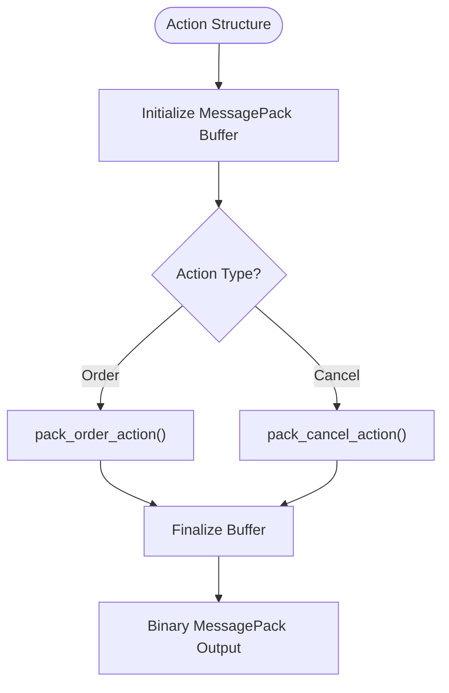
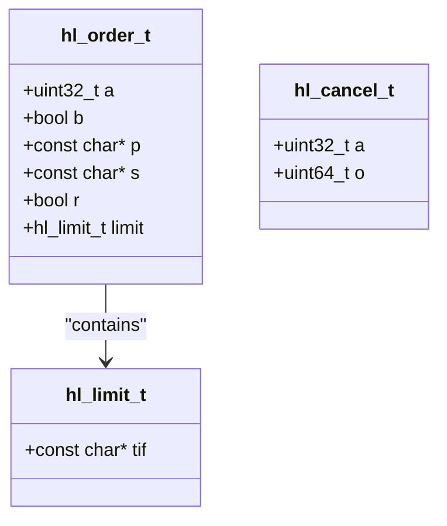
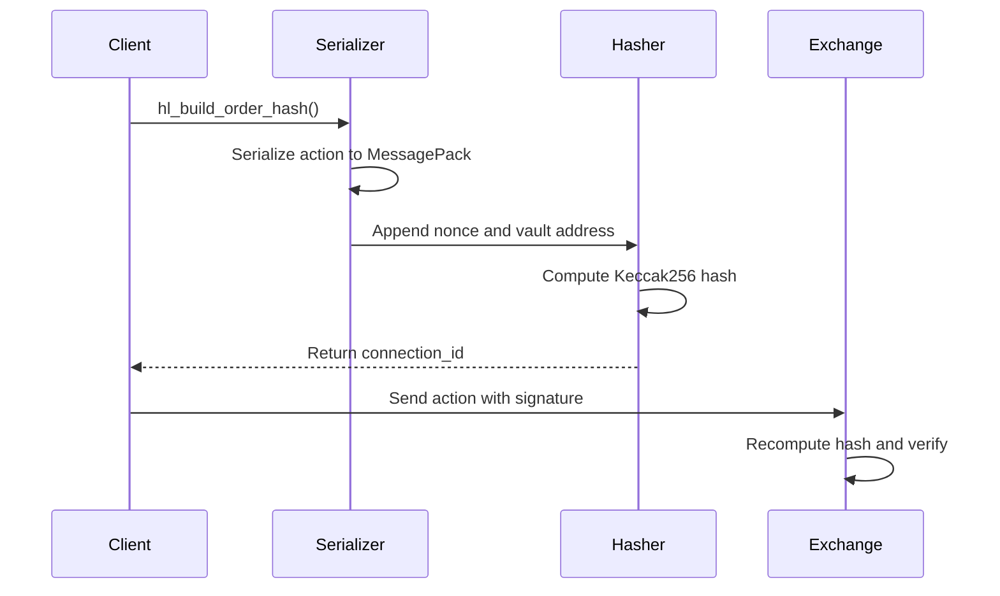

# MessagePack Serialization

<cite>
**Referenced Files in This Document**   
- [serialize.c](file://src/msgpack/serialize.c)
- [hl_msgpack.h](file://include/hl_msgpack.h)
- [hl_crypto_internal.h](file://include/hl_crypto_internal.h)
</cite>

## Table of Contents
1. [Introduction](#introduction)
2. [Rationale for MessagePack in High-Frequency Trading](#rationale-for-messagepack-in-high-frequency-trading)
3. [Serialization Process Overview](#serialization-process-overview)
4. [Field Ordering and Type Encoding](#field-ordering-and-type-encoding)
5. [Action Hash Computation and EIP-712 Signing](#action-hash-computation-and-eip-712-signing)
6. [Zero-Copy Operations and Memory Efficiency](#zero-copy-operations-and-memory-efficiency)
7. [Concrete Serialization Examples](#concrete-serialization-examples)
8. [Common Serialization Errors and Debugging](#common-serialization-errors-and-debugging)
9. [Performance Characteristics](#performance-characteristics)
10. [Best Practices for Efficient Serialization](#best-practices-for-efficient-serialization)

## Introduction
This document provides a comprehensive analysis of the MessagePack binary serialization implementation in the hyperliquid-c library, focusing on its role in enabling efficient payload encoding for high-frequency trading operations. The system leverages MessagePack's compact binary format to minimize network payload size and parsing latency, critical factors in low-latency trading environments. The serialization process is tightly integrated with cryptographic signing through EIP-712, where serialized actions are hashed and signed to authenticate trading operations.

**Section sources**
- [serialize.c](file://src/msgpack/serialize.c#L1-L235)
- [hl_msgpack.h](file://include/hl_msgpack.h#L1-L121)

## Rationale for MessagePack in High-Frequency Trading
MessagePack is selected over JSON for high-frequency trading contexts due to its superior performance characteristics. The binary format reduces payload size by eliminating verbose field names and using efficient type encodings, resulting in smaller network transmissions. This compact representation directly translates to reduced bandwidth consumption and faster transmission times. Additionally, MessagePack parsing is significantly faster than JSON parsing because it avoids string-based field name lookups and uses direct binary decoding. These advantages are critical in high-frequency trading where microseconds matter, network efficiency is paramount, and thousands of messages may be processed per second. The deterministic serialization also ensures consistent byte output across different platforms and implementations.

**Section sources**
- [serialize.c](file://src/msgpack/serialize.c#L1-L235)
- [hl_msgpack.h](file://include/hl_msgpack.h#L1-L121)

## Serialization Process Overview
The serialization process in hyperliquid-c follows a structured approach to convert trading actions into MessagePack format. Trading actions such as order placement and cancellation are represented as C structures (hl_order_action_t, hl_cancel_action_t) that are systematically encoded into MessagePack using the msgpack-c library. The process begins with initializing a MessagePack buffer and packer, followed by recursive packing of nested structures. Each action type has a dedicated packing function that ensures the correct structure and field ordering. The serialization output is used both for network transmission and cryptographic hashing. The implementation maintains strict compatibility with the Hyperliquid exchange API and matches the Go SDK's output byte-for-byte, ensuring interoperability across different client implementations.

**Diagram sources**
- [serialize.c](file://src/msgpack/serialize.c#L73-L131)
- [hl_msgpack.h](file://include/hl_msgpack.h#L48-L51)

**Section sources**
- [serialize.c](file://src/msgpack/serialize.c#L73-L131)
- [hl_msgpack.h](file://include/hl_msgpack.h#L48-L51)

## Field Ordering and Type Encoding
Field ordering is critical in the MessagePack serialization implementation, as it directly affects the resulting byte sequence and subsequent cryptographic hash. The implementation enforces strict field ordering to ensure compatibility with the Hyperliquid API and other client implementations. For order structures, fields must be packed in alphabetical order: "a" (asset_id), "b" (is_buy), "p" (price), "s" (size), "r" (reduce_only), and "t" (order type). Notably, "s" must precede "r" to match the Go SDK exactly. Similarly, action objects require specific field ordering: "type" first, followed by "orders" or "cancels", and then "grouping". Type encoding follows MessagePack specifications with uint32 for asset IDs, boolean values for flags, strings for price and size values, and uint64 for order IDs. This consistent encoding ensures predictable and reproducible serialization results.

**Diagram sources**
- [serialize.c](file://src/msgpack/serialize.c#L25-L69)
- [hl_msgpack.h](file://include/hl_msgpack.h#L27-L34)

**Section sources**
- [serialize.c](file://src/msgpack/serialize.c#L25-L69)
- [hl_msgpack.h](file://include/hl_msgpack.h#L27-L34)

## Action Hash Computation and EIP-712 Signing
The serialized MessagePack data plays a central role in the EIP-712 signing process, where the connection_id (action hash) is computed for authentication. After serialization, the MessagePack bytes are combined with additional data including the nonce (timestamp) and optional vault address. The nonce is appended as an 8-byte big-endian uint64 value, followed by the vault address flag and actual address bytes if present. This concatenated data is then hashed using Keccak256 to produce the 32-byte connection_id. The hl_build_action_hash function orchestrates this entire process, ensuring that the same input always produces identical output. This deterministic hashing is essential for EIP-712 compliance, as the hash must match exactly what the server computes to validate the signature. The integration between serialization and hashing ensures that any change in field ordering or encoding would result in a different hash and rejected transaction.

**Diagram sources**
- [serialize.c](file://src/msgpack/serialize.c#L133-L204)
- [hl_crypto_internal.h](file://include/hl_crypto_internal.h#L75-L75)

**Section sources**
- [serialize.c](file://src/msgpack/serialize.c#L133-L204)
- [hl_crypto_internal.h](file://include/hl_crypto_internal.h#L75-L75)

## Zero-Copy Operations and Memory Efficiency
The MessagePack implementation employs zero-copy operations to minimize memory allocations and improve performance. The serialization process writes directly to a msgpack_sbuffer, which manages a contiguous memory block that grows as needed. This approach eliminates intermediate buffers and unnecessary data copying. The packer writes serialized data directly to the buffer without creating temporary objects. For string fields, the implementation uses msgpack_pack_str_body to write directly from the source string without copying, leveraging the fact that the input data is already in memory. Memory allocation occurs only once for the final concatenated buffer that combines the MessagePack data with the nonce and vault address. The cleanup process uses a goto-based error handling pattern to ensure proper resource deallocation in all code paths, preventing memory leaks. This efficient memory management is crucial for high-throughput trading applications where garbage collection pauses or memory fragmentation could impact performance.

**Section sources**
- [serialize.c](file://src/msgpack/serialize.c#L133-L204)
- [hl_crypto_internal.h](file://include/hl_crypto_internal.h#L75-L75)

## Concrete Serialization Examples
The hyperliquid-c library provides concrete examples of how different trading actions are serialized into MessagePack format. For order requests, the hl_order_action_t structure is serialized as a map with three keys: "type" set to "order", "orders" containing an array of order objects, and "grouping" specifying the order grouping strategy. Each order object is a map with six fields in strict alphabetical order. For cancellation requests, the hl_cancel_action_t structure is serialized as a map with "type" set to "cancel" and "cancels" containing an array of cancellation objects, each with asset ID and order ID. Account updates and market data would follow similar patterns with their respective field structures. The examples in the codebase demonstrate how the serialization maintains compatibility with the Hyperliquid API specification and produces byte-identical output to the reference Go SDK, ensuring cross-platform consistency.

**Section sources**
- [serialize.c](file://src/msgpack/serialize.c#L73-L131)
- [hl_msgpack.h](file://include/hl_msgpack.h#L48-L51)

## Common Serialization Errors and Debugging
Common serialization errors in the hyperliquid-c library typically stem from incorrect field types, missing required fields, or improper field ordering. Using the wrong data type (e.g., passing an integer where a string is expected for price or size) will produce incorrect MessagePack encoding and a different cryptographic hash. Omitting required fields such as asset ID or order type will result in incomplete serialization and API rejection. The most subtle error is incorrect field ordering, particularly the critical "s" before "r" requirement in order structures, which would produce different bytes and an invalid signature. Debugging strategies include comparing the serialized output byte-for-byte with the Go SDK, using the library's error reporting (fprintf to stderr for allocation failures), and validating input data before serialization. The deterministic nature of the serialization allows for reliable testing and verification of correct implementation.

**Section sources**
- [serialize.c](file://src/msgpack/serialize.c#L1-L235)
- [hl_msgpack.h](file://include/hl_msgpack.h#L1-L121)

## Performance Characteristics
The MessagePack serialization implementation in hyperliquid-c demonstrates excellent performance characteristics suitable for high-frequency trading. The direct memory writing and zero-copy operations minimize CPU overhead and memory allocation costs. The use of short field names (single characters) reduces payload size significantly compared to verbose JSON field names. String values for price and size are preserved as strings to maintain precision, avoiding floating-point conversion costs. The entire serialization and hashing process is optimized for speed, with critical sections written in efficient C code. According to project documentation, the MessagePack module has been tested and verified to produce byte-identical output to the Go SDK, confirming its correctness and performance. The implementation has zero compilation warnings and has been verified to have no memory leaks, contributing to its reliability in production trading environments.

**Section sources**
- [serialize.c](file://src/msgpack/serialize.c#L1-L235)
- [PHASE2_COMPLETE.md](file://PHASE2_COMPLETE.md#L123-L182)

## Best Practices for Efficient Serialization
To ensure efficient and correct serialization in the hyperliquid-c library, several best practices should be followed. Always validate input data types and ensure required fields are present before initiating serialization. Maintain strict adherence to field ordering requirements, particularly the alphabetical ordering of order fields and the specific sequence of action object fields. Reuse serialization buffers when possible to minimize memory allocation overhead in high-throughput scenarios. Handle errors properly by checking return values from serialization functions and cleaning up resources in error conditions. When working with large datasets, consider batching operations to amortize the fixed costs of serialization and hashing. Finally, verify the correctness of serialized output by comparing hashes with known good values or the reference Go SDK implementation. These practices ensure reliable, efficient, and secure trading operations.

**Section sources**
- [serialize.c](file://src/msgpack/serialize.c#L1-L235)
- [hl_msgpack.h](file://include/hl_msgpack.h#L1-L121)