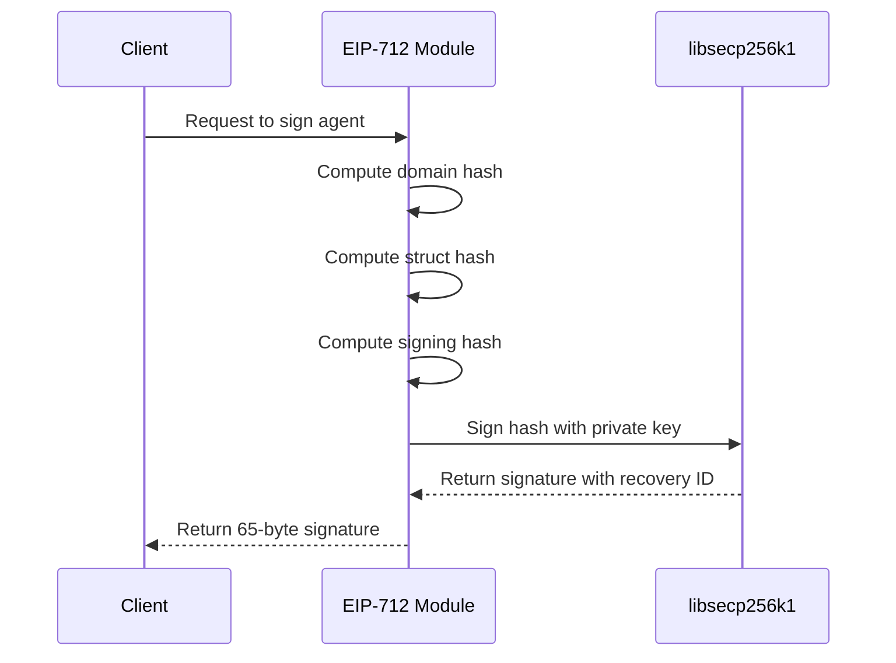
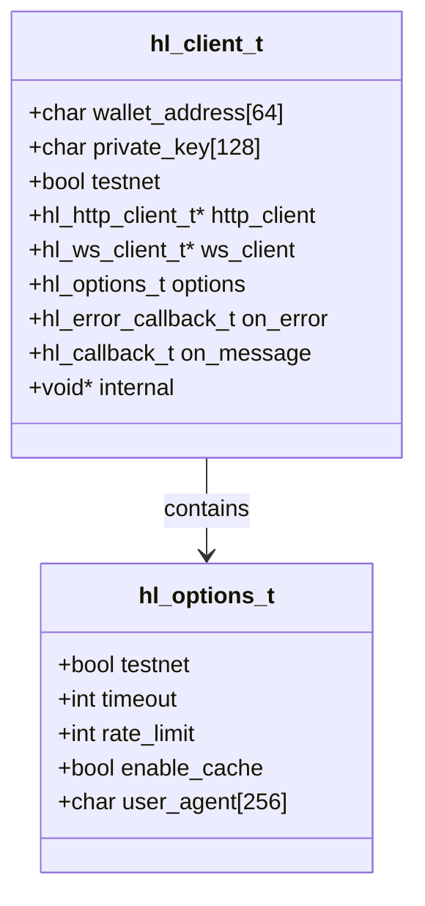
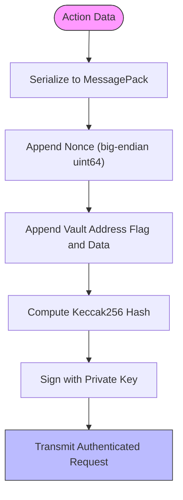
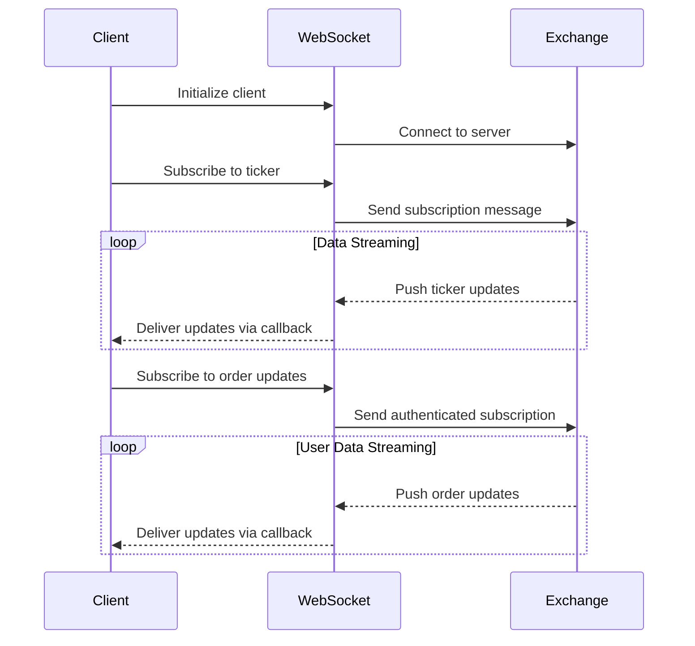

# Security Model

<cite>
**Referenced Files in This Document**   
- [eip712.c](file://src/crypto/eip712.c)
- [hl_client.h](file://include/hl_client.h)
- [client.c](file://src/client.c)
- [serialize.c](file://src/msgpack/serialize.c)
- [websocket.c](file://src/websocket.c)
- [hl_crypto_internal.h](file://include/hl_crypto_internal.h)
</cite>

## Table of Contents
1. [Introduction](#introduction)
2. [EIP-712 Typed Message Signing](#eip-712-typed-message-signing)
3. [Private Key Management in hl_client_t](#private-key-management-in-hl_client_t)
4. [MessagePack Serialization for Authenticated Requests](#messagepack-serialization-for-authenticated-requests)
5. [WebSocket Authentication and Channel Security](#websocket-authentication-and-channel-security)
6. [Threat Model and Attack Mitigations](#threat-model-and-attack-mitigations)
7. [Common Vulnerabilities and Secure Practices](#common-vulnerabilities-and-secure-practices)
8. [Secure Deployment and Key Management Recommendations](#secure-deployment-and-key-management-recommendations)

## Introduction
The hyperliquid-c client library implements a robust security model for interacting with the Hyperliquid exchange API. This document details the cryptographic authentication mechanisms, secure data handling practices, and threat mitigation strategies employed in the system. The security architecture centers around EIP-712 typed message signing, secure private key management, and deterministic serialization to ensure the integrity and authenticity of all trading operations.

## EIP-712 Typed Message Signing
The hyperliquid-c library implements EIP-712 typed message signing to authenticate API requests and trading operations. This standard provides a structured approach to signing data that prevents signature replay attacks and ensures message integrity.

The signing process follows the EIP-712 specification with three main components: the domain separator, the message type definition, and the message data. The domain separator includes critical context such as the domain name, chain ID, and verifying contract, ensuring signatures are bound to a specific application context.

For order authentication, the system constructs an "Agent" type with source and connection ID fields. The domain hash is computed using the EIP-712Domain type hash concatenated with the domain name hash, version hash, chain ID bytes, and verifying contract address, then hashed with keccak256. This domain hash is combined with the struct hash of the Agent message to produce the final signing hash.

The actual signing is performed using libsecp256k1, which provides production-grade ECDSA operations with proper recovery ID calculation. The implementation ensures the correct recovery ID is determined by comparing the derived public key's Ethereum address with the expected address, preventing signature malleability issues.

**Diagram sources**
- [eip712.c](file://src/crypto/eip712.c#L150-L297)

**Section sources**
- [eip712.c](file://src/crypto/eip712.c#L1-L297)

## Private Key Management in hl_client_t
The hl_client_t structure securely manages private keys throughout their lifecycle. The private key is stored in memory as a hexadecimal string within the client structure, with careful attention to secure handling practices.

When a client is created, the private key is copied into the structure, with optional stripping of the "0x" prefix if present. The implementation uses a dedicated mutex to ensure thread-safe access to the private key and other client state, preventing race conditions during concurrent operations.

Upon client destruction, the library implements secure memory handling by zeroing out the private key buffer before freeing the memory. This practice prevents sensitive data from persisting in memory after the client is destroyed, reducing the risk of private key exposure through memory dumps or other forensic techniques.

The client provides accessor functions to retrieve the private key, but these are intended for internal use by the library's cryptographic modules rather than direct exposure to application code. This encapsulation helps maintain the principle of least privilege in key access.

**Diagram sources**
- [hl_client.h](file://include/hl_client.h#L50-L188)
- [client.c](file://src/client.c#L25-L45)

**Section sources**
- [hl_client.h](file://include/hl_client.h#L50-L188)
- [client.c](file://src/client.c#L25-L197)

## MessagePack Serialization for Authenticated Requests
The hyperliquid-c library uses MessagePack serialization to create compact, deterministic payloads for authenticated requests. This binary serialization format provides efficient encoding while ensuring consistent byte representation across different platforms and implementations.

The serialization process for order actions follows a strict alphabetical ordering of keys to guarantee deterministic output. For order payloads, the fields are serialized in the order: "a" (asset_id), "b" (is_buy), "p" (price), "s" (size), "r" (reduce_only), and "t" (order type). This ordering matches the Go SDK implementation, ensuring cross-platform consistency.

The action structure itself follows a specific order: "type", "orders", and "grouping" for order actions, or "type" and "cancels" for cancel actions. This deterministic structure is critical for cryptographic hashing, as any variation in field ordering would produce a different hash and invalidate the signature.

Before hashing, the serialized MessagePack data is combined with a nonce (timestamp) and optional vault address information. The nonce prevents replay attacks by ensuring each request is unique, while the vault address field supports advanced account structures.

**Diagram sources**
- [serialize.c](file://src/msgpack/serialize.c#L133-L204)

**Section sources**
- [serialize.c](file://src/msgpack/serialize.c#L1-L234)

## WebSocket Authentication and Channel Security
WebSocket connections in the hyperliquid-c library are authenticated and secured through a subscription-based model that leverages the client's wallet address for user-specific data channels.

When initializing WebSocket functionality, the client creates a dedicated extension structure that manages the WebSocket client instance and active subscriptions. Each subscription is assigned a unique identifier generated using UUID, ensuring that subscription management operations can reference specific channels without ambiguity.

User-specific channels such as order updates and trade fills are authenticated by including the user's wallet address in the subscription message. This approach ensures that users can only receive data for their own account, providing a layer of access control at the protocol level.

The library implements proper connection lifecycle management, automatically connecting to the WebSocket server when the first subscription is created and maintaining the connection for subsequent subscriptions. Each subscription type corresponds to a specific data channel on the exchange, with messages formatted according to the exchange's WebSocket API specification.

**Diagram sources**
- [websocket.c](file://src/websocket.c#L104-L130)

**Section sources**
- [websocket.c](file://src/websocket.c#L1-L398)

## Threat Model and Attack Mitigations
The hyperliquid-c security model addresses several key threats to trading operations and account security. The primary threats include private key exposure, replay attacks, man-in-the-middle attacks, and unauthorized access to trading operations.

Private key exposure is mitigated through secure memory management practices, including zeroing memory upon client destruction and limiting direct access to the key material. The use of EIP-712 signing prevents certain classes of signature malleability attacks by ensuring the recovery ID is correctly calculated based on address matching.

Replay attacks are prevented through the inclusion of a nonce (timestamp) in the hashed payload. Since each request incorporates a unique timestamp, previously signed messages cannot be reused, even if intercepted. The deterministic MessagePack serialization ensures that the same logical request always produces the same byte representation, preventing ambiguity in signature validation.

The threat of man-in-the-middle attacks is addressed through the use of HTTPS for all REST API communications and authenticated WebSocket connections. The cryptographic signatures provide message integrity and authenticity, ensuring that commands cannot be modified in transit without detection.

For user-specific data channels, the inclusion of the wallet address in subscription messages prevents unauthorized access to sensitive trading data. This authentication mechanism ensures that users can only receive information about their own orders and trades.

## Common Vulnerabilities and Secure Practices
Several common vulnerabilities are addressed in the hyperliquid-c implementation. Improper key storage is mitigated by keeping the private key within the encapsulated client structure and zeroing memory upon destruction. The library avoids storing keys in global variables or less secure memory regions.

Timing attacks are minimized through the use of cryptographic libraries (libsecp256k1) that implement constant-time operations where possible. The string comparison functions used in the codebase should be reviewed for potential timing vulnerabilities, particularly in authentication contexts.

Memory safety issues are addressed through careful buffer management, including proper bounds checking when copying wallet addresses and private keys into the client structure. The use of functions like strncpy with explicit size limits prevents buffer overflows.

The implementation avoids common pitfalls in cryptographic operations, such as using the correct keccak256 variant (as opposed to NIST SHA3) and properly handling the recovery ID in ECDSA signatures. The recovery ID is validated by comparing the derived address with the expected address, ensuring signature correctness.

## Secure Deployment and Key Management Recommendations
For secure deployment of applications using the hyperliquid-c library, several key management practices are recommended:

1. **Private Key Protection**: Store private keys in secure environments such as hardware security modules (HSMs) or secure key management services rather than in application configuration files.

2. **Memory Security**: Ensure that systems running the client have appropriate memory protection mechanisms, and consider using operating system features to lock sensitive memory pages to prevent swapping to disk.

3. **Access Control**: Implement strict access controls for applications that use trading keys, following the principle of least privilege.

4. **Monitoring and Alerting**: Set up monitoring for unusual trading patterns or authentication failures that might indicate compromise.

5. **Regular Rotation**: Consider implementing key rotation policies for long-lived trading accounts, though this must be balanced against operational requirements.

6. **Network Security**: Use firewalls and network segmentation to protect systems running the client library, and ensure all communications occur over encrypted channels.

7. **Audit Logging**: Maintain comprehensive logs of all trading operations and authentication attempts for security auditing and incident response.

8. **Dependency Management**: Keep all cryptographic dependencies, including libsecp256k1 and the SHA3 library, updated to their latest secure versions.

These practices, combined with the inherent security features of the hyperliquid-c library, provide a robust foundation for secure trading operations on the Hyperliquid exchange.