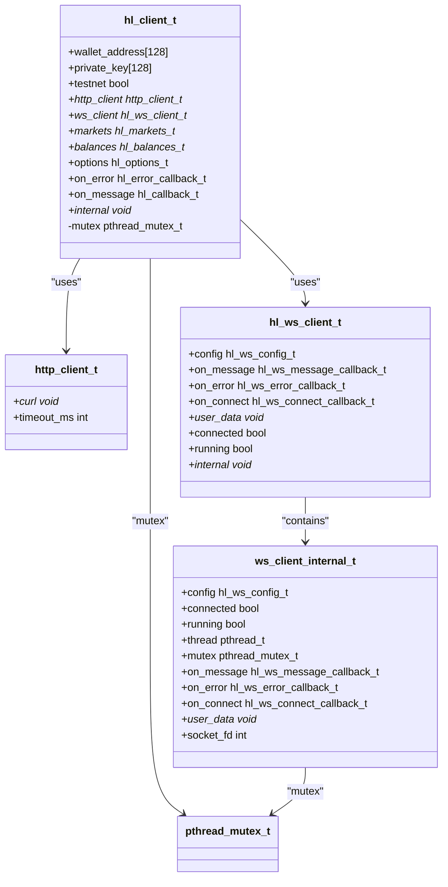
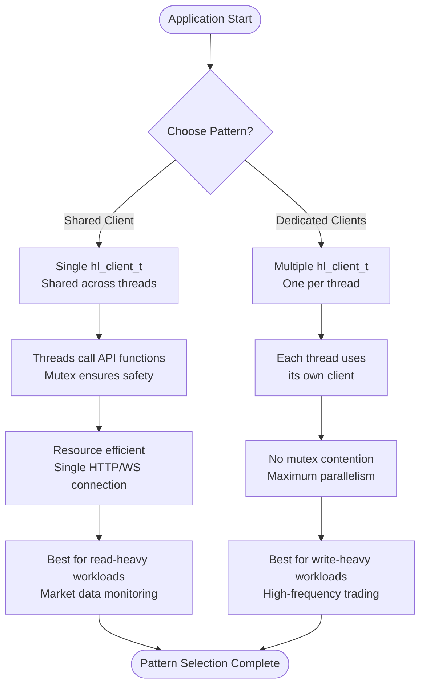

# Thread Safety

<cite>
**Referenced Files in This Document**   
- [hl_client.h](file://include/hl_client.h)
- [hl_http.h](file://include/hl_http.h)
- [hl_ws_client.h](file://include/hl_ws_client.h)
- [client.c](file://src/client.c)
- [http/client.c](file://src/http/client.c)
- [ws_client.c](file://src/ws_client.c)
</cite>

## Table of Contents
1. [Introduction](#introduction)
2. [Reentrant API Design](#reentrant-api-design)
3. [Internal Synchronization Mechanisms](#internal-synchronization-mechanisms)
4. [Thread Safety of hl_client_t Functions](#thread-safety-of-hl_client_t-functions)
5. [Caller Responsibilities for Concurrent Access](#caller-responsibilities-for-concurrent-access)
6. [Safe Multi-threaded Usage Patterns](#safe-multi-threaded-usage-patterns)
7. [Race Conditions in Order Submission and Account State](#race-conditions-in-order-submission-and-account-state)
8. [Deadlock Prevention in Blocking API Calls](#deadlock-prevention-in-blocking-api-calls)
9. [Performance Implications of Thread Synchronization](#performance-implications-of-thread-synchronization)
10. [Recommendations for High-throughput Trading Systems](#recommendations-for-high-throughput-trading-systems)

## Introduction
The hyperliquid-c library provides a C interface for interacting with the Hyperliquid exchange, supporting both REST and WebSocket communications. This document details the thread safety guarantees of the library, focusing on the reentrant design of the API, internal synchronization mechanisms, and safe usage patterns in multi-threaded environments. Understanding these aspects is critical for developing reliable, high-performance trading applications that leverage concurrent execution.

## Reentrant API Design
The hyperliquid-c API is designed to be reentrant, allowing multiple threads to safely invoke functions on shared client instances. The core `hl_client_t` structure serves as the central coordination point for all operations, encapsulating authentication credentials, HTTP and WebSocket clients, cached market data, and configuration options. This design enables multiple threads to share a single client instance while maintaining data integrity through internal synchronization.

The API achieves reentrancy through careful management of shared state and the use of mutexes to protect critical sections. Functions that modify or access shared resources—such as the HTTP client, WebSocket connection state, or cached market and balance data—are protected by mutexes to prevent race conditions. This allows the API to support concurrent access patterns without requiring callers to implement external synchronization in most cases.

**Section sources**
- [hl_client.h](file://include/hl_client.h#L14-L189)
- [client.c](file://src/client.c#L34-L87)

## Internal Synchronization Mechanisms
The hyperliquid-c library employs mutex-based synchronization to protect shared resources across threads. Each `hl_client_t` instance contains a dedicated `pthread_mutex_t` that is initialized during client creation and destroyed when the client is freed. This mutex is used to serialize access to critical sections of code, particularly those involving network operations and state modifications.

The HTTP client (`http_client_t`) used internally by `hl_client_t` is also protected by synchronization mechanisms. Although the HTTP client itself does not expose explicit locking, it relies on libcurl, which is thread-safe when used with proper initialization. The library ensures thread safety by initializing libcurl globally and managing the HTTP client lifecycle within the context of the `hl_client_t` mutex.

Similarly, the WebSocket client (`hl_ws_client_t`) incorporates its own mutex to protect connection state, callback registration, and message sending operations. The `ws_client_internal_t` structure contains a `pthread_mutex_t` that is used to synchronize access to the WebSocket connection, ensuring that operations like connecting, disconnecting, and sending messages are atomic.

**Diagram sources**
- [hl_client.h](file://include/hl_client.h#L14-L189)
- [hl_http.h](file://include/hl_http.h#L15-L18)
- [hl_ws_client.h](file://include/hl_ws_client.h#L12-L136)
- [client.c](file://src/client.c#L34-L87)
- [http/client.c](file://src/http/client.c#L38-L69)
- [ws_client.c](file://src/ws_client.c#L56-L93)

**Section sources**
- [client.c](file://src/client.c#L34-L87)
- [http/client.c](file://src/http/client.c#L38-L69)
- [ws_client.c](file://src/ws_client.c#L56-L93)

## Thread Safety of hl_client_t Functions
Most functions operating on `hl_client_t` instances are thread-safe due to internal mutex protection. Key functions such as `hl_client_test_connection`, `hl_client_load_markets`, and `hl_client_get_market` acquire the client's mutex before performing operations, ensuring that concurrent calls do not interfere with each other.

Functions that modify client state, such as `hl_client_set_error_callback` and `hl_client_set_message_callback`, are also protected by the mutex, preventing race conditions when updating callback handlers from multiple threads. Similarly, accessors like `hl_client_get_wallet_address` and `hl_client_get_private_key` are safe to call concurrently, as they operate on immutable data after client creation.

However, not all functions are equally protected. Functions that involve complex state transitions or long-running operations—such as order submission or WebSocket message handling—may have more nuanced thread safety characteristics. Callers should assume that any function not explicitly documented as thread-unsafe is protected by the client mutex, but should still exercise caution when coordinating complex workflows across threads.

**Section sources**
- [hl_client.h](file://include/hl_client.h#L14-L189)
- [client.c](file://src/client.c#L34-L87)

## Caller Responsibilities for Concurrent Access
While the hyperliquid-c library provides internal synchronization for shared resources, callers have responsibilities to ensure safe concurrent access. The primary responsibility is to avoid holding the client mutex for extended periods, as this can lead to contention and degraded performance in multi-threaded applications.

Callers should also avoid making blocking API calls from multiple threads without considering the potential for deadlock, especially when callbacks are involved. For example, a callback registered via `hl_client_set_message_callback` should not attempt to acquire the client mutex or make blocking API calls, as this could create circular dependencies.

Additionally, callers must ensure that `hl_client_t` instances are not destroyed while in use by other threads. Proper lifecycle management requires coordinating client destruction with all threads that may be using the client, typically through reference counting or explicit synchronization primitives.

**Section sources**
- [hl_client.h](file://include/hl_client.h#L14-L189)
- [client.c](file://src/client.c#L34-L87)

## Safe Multi-threaded Usage Patterns
Two primary patterns are recommended for safe multi-threaded usage of the hyperliquid-c library: shared client with thread-safe operations and dedicated clients per thread.

In the shared client pattern, a single `hl_client_t` instance is used by multiple threads. This approach is efficient in terms of resource usage, as it shares the HTTP and WebSocket connections across threads. All API functions are protected by the client mutex, allowing threads to safely call functions like `hl_client_load_markets` or `hl_client_get_market` concurrently. This pattern is suitable for applications where threads primarily perform read operations on market data or account state.

Alternatively, the dedicated client per thread pattern creates separate `hl_client_t` instances for each thread. This eliminates contention on the client mutex and allows for maximum parallelism, at the cost of increased resource usage. Each thread has its own HTTP client and WebSocket connection, enabling truly independent operation. This pattern is recommended for high-frequency trading strategies where low latency and maximum throughput are critical.

**Diagram sources**
- [hl_client.h](file://include/hl_client.h#L14-L189)
- [client.c](file://src/client.c#L34-L87)

**Section sources**
- [hl_client.h](file://include/hl_client.h#L14-L189)
- [client.c](file://src/client.c#L34-L87)

## Race Conditions in Order Submission and Account State
Order submission and account state updates are particularly susceptible to race conditions in multi-threaded environments. When multiple threads submit orders concurrently, there is a risk of inconsistent account state due to the time delay between order submission and confirmation.

The library mitigates this risk by serializing order submission through the client mutex, ensuring that only one order is being processed at a time. However, callers must still manage the logical sequence of operations, such as checking available balance before submitting an order, as the balance check and order submission are separate operations that could be interleaved with operations from other threads.

To address this, callers should implement application-level coordination when performing related operations across threads. For example, maintaining a local copy of account state that is updated only through a single coordination thread can prevent race conditions while still allowing other threads to submit orders based on the latest known state.

**Section sources**
- [client.c](file://src/client.c#L34-L87)
- [trading.c](file://src/trading.c#L757-L811)

## Deadlock Prevention in Blocking API Calls
Deadlock can occur when making blocking API calls from multiple threads, particularly when callbacks are involved. For example, if a callback attempts to make a blocking API call, it may try to acquire the client mutex while already holding it, resulting in a deadlock.

To prevent deadlocks, callers should ensure that callbacks do not make blocking API calls or acquire the client mutex directly. Instead, callbacks should post work to a queue or signal an event that is processed by a dedicated thread, breaking the potential for circular dependencies.

Additionally, callers should avoid making long-running operations while holding the client mutex. Timeouts should be implemented for all blocking operations to prevent indefinite blocking, and asynchronous patterns should be preferred when possible to maintain responsiveness in multi-threaded applications.

**Section sources**
- [client.c](file://src/client.c#L34-L87)
- [ws_client.c](file://src/ws_client.c#L56-L93)

## Performance Implications of Thread Synchronization
Thread synchronization introduces overhead that can impact performance, particularly in high-throughput trading systems. The client mutex creates a serialization point that can become a bottleneck when multiple threads frequently access the API.

The performance impact depends on the usage pattern. In read-heavy workloads, where threads primarily access cached market data, the overhead is minimal as read operations are fast and do not block for extended periods. However, in write-heavy workloads involving frequent order submission, the mutex contention can significantly reduce throughput.

To mitigate this, applications should minimize the time spent holding the client mutex by batching operations when possible and avoiding unnecessary API calls within critical sections. For maximum performance, the dedicated client per thread pattern eliminates mutex contention entirely, at the cost of increased memory and connection overhead.

**Section sources**
- [client.c](file://src/client.c#L34-L87)
- [http/client.c](file://src/http/client.c#L38-L69)

## Recommendations for High-throughput Trading Systems
For high-throughput trading systems, the following recommendations should be followed to maximize performance while maintaining thread safety:

1. Use dedicated `hl_client_t` instances per thread to eliminate mutex contention
2. Implement connection pooling at the application level to manage resource usage
3. Use asynchronous patterns for order submission and state updates to avoid blocking
4. Maintain local copies of frequently accessed data (e.g., market prices, account balances) to reduce API call frequency
5. Implement timeout mechanisms for all blocking operations to prevent hangs
6. Use dedicated threads for callback processing to avoid deadlock risks
7. Monitor mutex contention and adjust threading strategy based on performance metrics

These recommendations balance the need for high performance with the requirements of thread safety, enabling the development of robust, scalable trading applications using the hyperliquid-c library.

**Section sources**
- [hl_client.h](file://include/hl_client.h#L14-L189)
- [client.c](file://src/client.c#L34-L87)
- [http/client.c](file://src/http/client.c#L38-L69)
- [ws_client.c](file://src/ws_client.c#L56-L93)