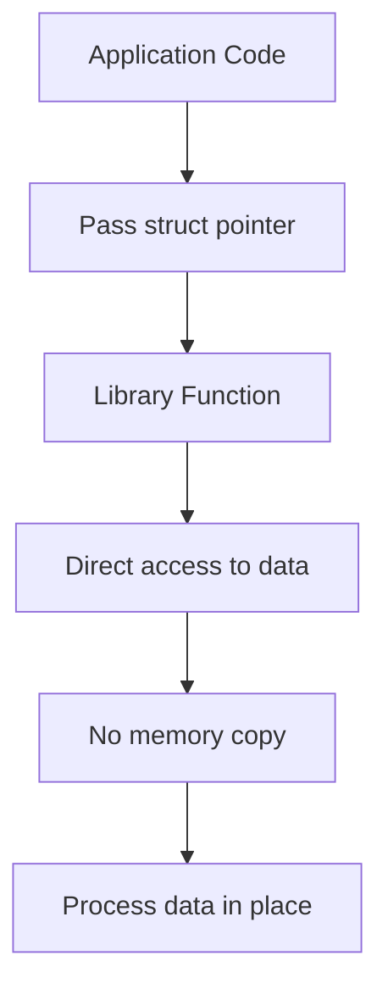
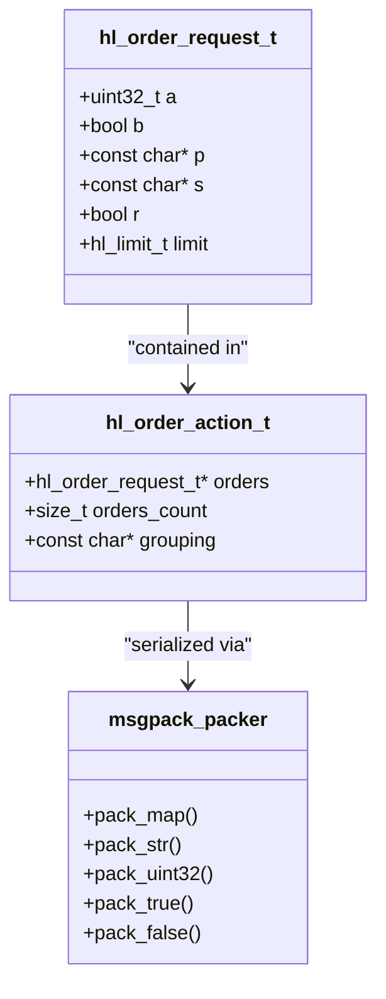
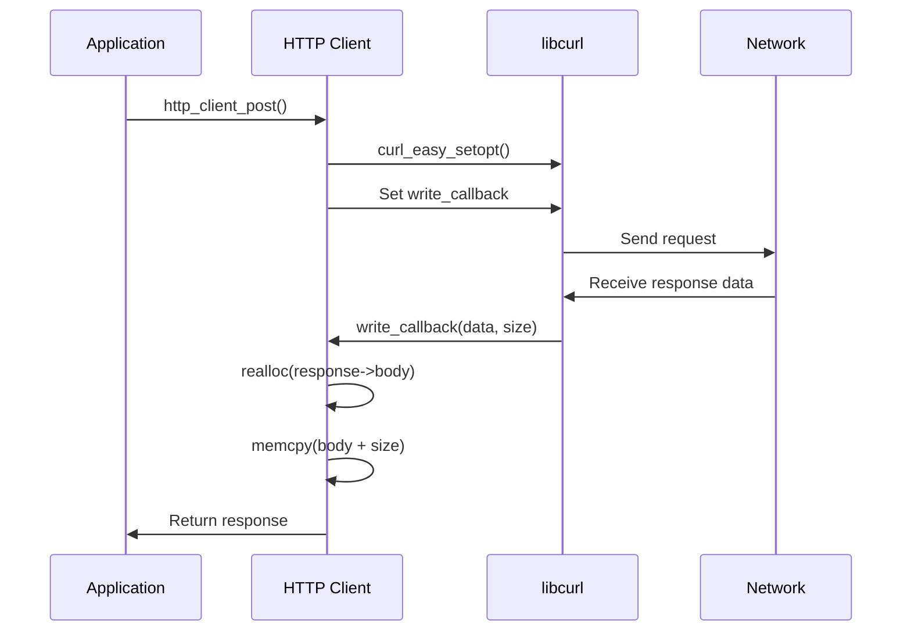
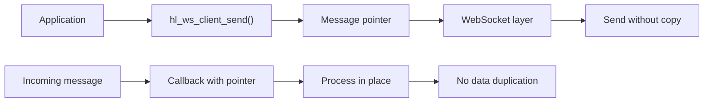
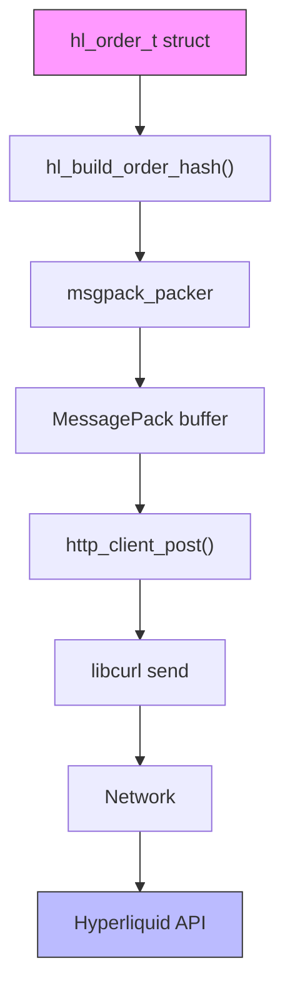

# Zero-Copy Design

<cite>
**Referenced Files in This Document**   
- [ARCHITECTURE.md](file://ARCHITECTURE.md)
- [src/msgpack/serialize.c](file://src/msgpack/serialize.c)
- [include/hl_msgpack.h](file://include/hl_msgpack.h)
- [src/http/client.c](file://src/http/client.c)
- [include/hl_http.h](file://include/hl_http.h)
- [src/websocket.c](file://src/websocket.c)
- [include/hl_ws_client.h](file://include/hl_ws_client.h)
- [src/client_new.c](file://src/client_new.c)
- [include/hl_client.h](file://include/hl_client.h)
</cite>

## Table of Contents
1. [Introduction](#introduction)
2. [Zero-Copy Design Philosophy](#zero-copy-design-philosophy)
3. [Core Implementation Areas](#core-implementation-areas)
4. [Direct Struct Passing](#direct-struct-passing)
5. [In-Place Serialization](#in-place-serialization)
6. [Buffer Reuse in HTTP Operations](#buffer-reuse-in-http-operations)
7. [WebSocket Message Handling](#websocket-message-handling)
8. [Data Flow Analysis](#data-flow-analysis)
9. [Performance Implications](#performance-implications)
10. [Trade-Offs and Challenges](#trade-offs-and-challenges)
11. [Best Practices for API Users](#best-practices-for-api-users)
12. [Conclusion](#conclusion)

## Introduction
The hyperliquid-c library implements a zero-copy design philosophy to minimize memory allocations and data copying, which is critical for high-frequency trading applications where latency directly impacts profitability. This document details how the zero-copy approach is implemented across key components of the library, including message serialization, HTTP operations, and WebSocket communications. The design reduces unnecessary memory operations, decreases garbage collection pressure, and improves overall system throughput and predictability.

## Zero-Copy Design Philosophy
The zero-copy design in hyperliquid-c is centered on eliminating redundant memory allocations and data transfers between buffers. As stated in the architecture documentation, this is one of the core design principles alongside thread-safety and explicit error handling. The library achieves zero-copy through several techniques: direct struct passing without intermediate copies, in-place MessagePack serialization, and reuse of internal buffers for HTTP and WebSocket operations. This approach ensures that data moves through the system with minimal overhead, reducing both latency and memory footprint.

**Section sources**
- [ARCHITECTURE.md](file://ARCHITECTURE.md#L1-L20)

## Core Implementation Areas
The zero-copy design is implemented in three primary areas: struct parameter passing, MessagePack serialization, and network communication layers. These components work together to ensure data flows efficiently from application code to the network without unnecessary duplication. The design leverages C's ability to pass pointers to structs, direct memory manipulation for serialization, and buffer reuse patterns in both HTTP and WebSocket clients.

## Direct Struct Passing
The library uses direct struct passing throughout its API to avoid copying data. Functions accept pointers to structs rather than copying them by value, which is especially important for larger data structures. This approach is evident in the client interface where functions receive pointers to order structures and other complex types. The ownership model is clearly defined, with the client owning internal resources while user-allocated arrays must be explicitly freed using provided cleanup functions.

**Diagram sources**
- [include/hl_client.h](file://include/hl_client.h#L14-L189)
- [src/client_new.c](file://src/client_new.c#L0-L241)

**Section sources**
- [include/hl_client.h](file://include/hl_client.h#L14-L189)
- [src/client_new.c](file://src/client_new.c#L0-L241)

## In-Place Serialization
The MessagePack serialization implementation uses in-place operations to minimize memory allocations. The `hl_build_action_hash` function in the msgpack module directly packs data into a MessagePack buffer without creating intermediate representations. This is achieved by using the msgpack-c library's streaming interface, which allows direct writing to a shared buffer. The serialization process maintains strict field ordering to ensure byte-perfect compatibility with other Hyperliquid SDKs while avoiding temporary data structures.

**Diagram sources**
- [src/msgpack/serialize.c](file://src/msgpack/serialize.c#L0-L234)
- [include/hl_msgpack.h](file://include/hl_msgpack.h#L0-L120)

**Section sources**
- [src/msgpack/serialize.c](file://src/msgpack/serialize.c#L0-L234)
- [include/hl_msgpack.h](file://include/hl_msgpack.h#L0-L120)

## Buffer Reuse in HTTP Operations
The HTTP client implementation reuses internal buffers to avoid repeated memory allocations. The `http_response_t` structure contains pointers to dynamically allocated memory for the response body, but these buffers are managed internally by the client and can be reused across requests. The write callback function directly appends received data to the response buffer without intermediate copies. This design reduces the number of malloc/free operations during high-frequency trading operations.

**Diagram sources**
- [src/http/client.c](file://src/http/client.c#L0-L229)
- [include/hl_http.h](file://include/hl_http.h#L0-L129)

**Section sources**
- [src/http/client.c](file://src/http/client.c#L0-L229)
- [include/hl_http.h](file://include/hl_http.h#L0-L129)

## WebSocket Message Handling
The WebSocket implementation follows zero-copy principles by passing message pointers directly to callbacks without copying the data. The `hl_ws_client_send` function accepts a const char pointer and size parameter, allowing the caller to pass data without the library making a copy. Similarly, incoming messages are delivered via callback with a pointer to the original buffer, enabling applications to process data in place. This approach minimizes memory operations in the critical path of real-time market data processing.

**Diagram sources**
- [src/websocket.c](file://src/websocket.c#L0-L398)
- [include/hl_ws_client.h](file://include/hl_ws_client.h#L0-L136)

**Section sources**
- [src/websocket.c](file://src/websocket.c#L0-L398)
- [include/hl_ws_client.h](file://include/hl_ws_client.h#L0-L136)

## Data Flow Analysis
The zero-copy design enables an efficient data flow from application code through serialization and network transmission. When placing an order, the application passes a pointer to an order structure, which is directly serialized into MessagePack format without intermediate copies. The resulting data is then passed to the HTTP client, which sends it over the network using libcurl's streaming interface. Throughout this process, data remains in contiguous memory regions with minimal copying, reducing both latency and memory pressure.

**Diagram sources**
- [src/msgpack/serialize.c](file://src/msgpack/serialize.c#L0-L234)
- [src/http/client.c](file://src/http/client.c#L0-L229)

## Performance Implications
The zero-copy design has significant performance implications for high-frequency trading scenarios. By minimizing memory allocations and data copying, the library reduces both latency and jitter in trading operations. The elimination of garbage collection overhead (common in higher-level languages) ensures predictable performance. Buffer reuse patterns in HTTP and WebSocket operations reduce pressure on the memory allocator, which is particularly important during bursts of trading activity. The design enables the library to achieve sub-millisecond processing times for local operations, with network latency becoming the dominant factor.

## Trade-Offs and Challenges
While the zero-copy design provides performance benefits, it introduces several challenges. Memory lifetime management becomes more complex, requiring careful coordination between the application and library to avoid dangling pointers. The API places greater responsibility on developers to manage memory correctly, increasing the potential for bugs if best practices are not followed. Additionally, the use of direct pointers and in-place operations can make the code more difficult to debug and test. The trade-off between performance and safety requires developers to have a strong understanding of C memory management.

## Best Practices for API Users
Developers using the hyperliquid-c API should follow several best practices to safely leverage the zero-copy design. First, ensure that data passed to library functions remains valid for the duration of the operation. Second, always use the provided cleanup functions (e.g., `hl_free_positions`) to release memory allocated by the library. Third, avoid holding references to data returned by the library beyond the scope of the callback or function call. Finally, thoroughly test memory management in high-frequency scenarios to identify potential issues with buffer reuse and lifetime management.

## Conclusion
The zero-copy design philosophy implemented throughout the hyperliquid-c library significantly reduces memory allocations and data copying, resulting in lower latency and improved performance for high-frequency trading applications. Through direct struct passing, in-place serialization, and buffer reuse in HTTP and WebSocket operations, the library minimizes unnecessary memory operations while maintaining compatibility with the Hyperliquid API. While this approach introduces complexity in memory management, the performance benefits make it well-suited for latency-sensitive trading scenarios. Developers can maximize the benefits of this design by following best practices for memory management and understanding the ownership semantics of the API.