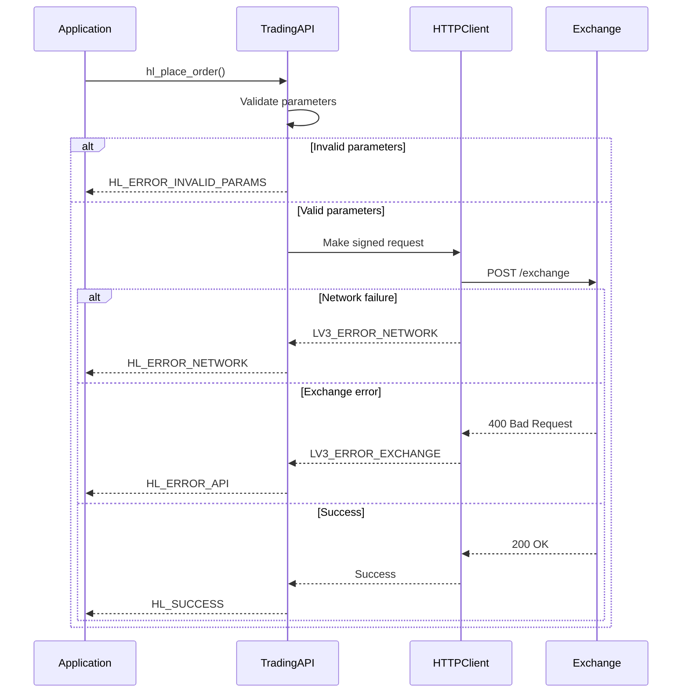
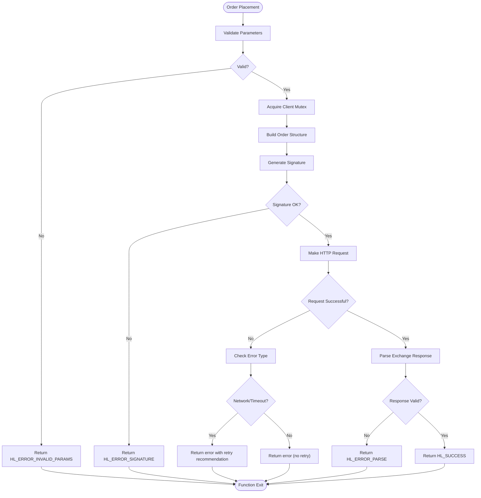
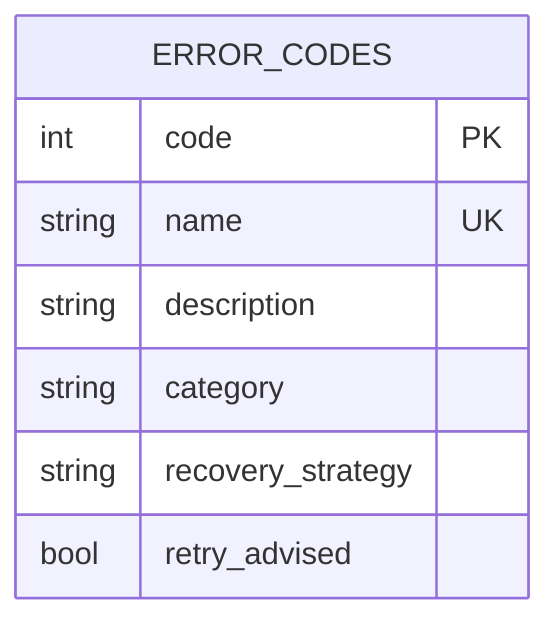

# Error Handling

<cite>
**Referenced Files in This Document**   
- [hl_error.h](file://include/hl_error.h)
- [client.c](file://src/client.c)
- [trading_api.c](file://src/trading_api.c)
- [orders.c](file://src/orders.c)
- [ARCHITECTURE.md](file://ARCHITECTURE.md)
</cite>

## Table of Contents
1. [Error Code Enumeration](#error-code-enumeration)
2. [Error Retrieval Mechanisms](#error-retrieval-mechanisms)
3. [Error Propagation Across Layers](#error-propagation-across-layers)
4. [Error Handling in Trading Workflows](#error-handling-in-trading-workflows)
5. [Validation vs System Errors](#validation-vs-system-errors)
6. [Error Code Reference](#error-code-reference)

## Error Code Enumeration

The Hyperliquid C SDK defines a comprehensive error enumeration through the `hl_error_t` type, which provides standardized error codes across all API operations. These error codes follow a consistent pattern where `HL_SUCCESS = 0` indicates successful execution, and all error conditions are represented by negative integer values.

The enumeration provides clear semantic meaning for different failure modes, enabling developers to implement appropriate recovery strategies based on the specific error type encountered. The error codes are designed to be stable and backward compatible, ensuring consistent error handling across SDK versions.

**Section sources**
- [hl_error.h](file://include/hl_error.h#L15-L35)

## Error Retrieval Mechanisms

The SDK provides two primary functions for retrieving error information: `hl_get_last_error()` (represented by return value patterns) and `hl_get_error_message()` (implemented as `hl_error_string()`). These functions work in tandem to provide both programmatic and human-readable error information.

The `hl_error_string()` function converts error codes into descriptive messages, facilitating debugging and logging. This function is thread-safe and can be called from any context where error information needs to be presented to users or written to logs. The error message system is designed to be lightweight and does not require dynamic memory allocation, making it suitable for use in constrained environments.

Error retrieval follows a immediate-consumption pattern where the error state is typically returned directly from function calls rather than maintained in a global state, reducing the risk of error state corruption in multi-threaded applications.

**Section sources**
- [client.c](file://src/client.c#L142-L183)

## Error Propagation Across Layers

### HTTP Layer Error Propagation

Errors originating from the HTTP layer are systematically converted to the SDK's error code system through the `lv3_to_hl_error()` function. Network connectivity issues, timeouts, and HTTP protocol errors are mapped to appropriate SDK error codes such as `HL_ERROR_NETWORK` and `HL_ERROR_TIMEOUT`. The HTTP client implementation ensures that all network-related failures are properly propagated up the call stack with appropriate error context.

### WebSocket Layer Error Propagation

WebSocket errors are handled through callback mechanisms that convert low-level WebSocket events into SDK error codes. Connection failures, message parsing errors, and subscription issues are translated into appropriate error codes and made available through the SDK's error handling interface. The WebSocket client implementation includes automatic reconnection logic for transient failures, with error propagation occurring only when reconnection attempts are exhausted.

### Business Logic Error Propagation

Business logic errors follow a consistent propagation pattern where functions return error codes directly to callers. The implementation ensures that errors are not silently consumed and are propagated up the call stack until handled. In composite operations like order editing (implemented as cancel + create), the error handling system preserves the first encountered error while continuing to process remaining operations when appropriate.

**Diagram sources**
- [trading_api.c](file://src/trading_api.c#L46-L74)
- [trading_api.c](file://src/trading_api.c#L110-L182)

**Section sources**
- [trading_api.c](file://src/trading_api.c#L46-L74)
- [trading_api.c](file://src/trading_api.c#L110-L182)
- [websocket.c](file://src/websocket.c#L88-L138)

## Error Handling in Trading Workflows

### Robust Order Placement

Trading workflows implement comprehensive error handling to ensure reliability in volatile market conditions. The `hl_place_order()` function performs parameter validation, signature generation, and HTTP request execution, with appropriate error codes returned for each potential failure point. The implementation uses mutex locking to ensure thread safety during order placement.

### Order Management Operations

The `hl_edit_order()` function demonstrates a sophisticated error handling pattern by implementing order modification as a cancel-then-create sequence. This approach handles partial failures gracefully: if the cancellation succeeds but creation fails, the error from the creation step is propagated, leaving the application responsible for handling the orphaned cancellation. The function returns the first error encountered, ensuring that callers are aware of failure conditions.

### Retry Strategies for Transient Failures

While explicit retry logic is not implemented in the core functions, the error code system enables applications to implement appropriate retry strategies. Transient failures such as `HL_ERROR_NETWORK`, `HL_ERROR_TIMEOUT`, and `HL_ERROR_API` should trigger exponential backoff retry mechanisms in client applications. The SDK's thread-safe design allows retry operations to be safely executed from background threads without corrupting client state.

**Diagram sources**
- [orders.c](file://src/orders.c#L693-L726)
- [trading_api.c](file://src/trading_api.c#L110-L182)

**Section sources**
- [orders.c](file://src/orders.c#L693-L726)
- [trading_api.c](file://src/trading_api.c#L110-L182)

## Validation vs System Errors

### Validation Errors for Malformed Requests

Validation errors occur when client-provided parameters fail to meet API requirements. These are typically represented by `HL_ERROR_INVALID_PARAMS` and `HL_ERROR_INVALID_SYMBOL`. The SDK performs extensive input validation before attempting network operations, preventing unnecessary API calls for malformed requests. Parameter validation includes checking for null pointers, invalid string formats, and out-of-range numeric values.

### System Errors for Connectivity Issues

System errors indicate problems with the underlying infrastructure or external services. These include `HL_ERROR_NETWORK`, `HL_ERROR_TIMEOUT`, and `HL_ERROR_API`. Unlike validation errors, system errors often represent transient conditions that may resolve with retry attempts. The distinction between validation and system errors is crucial for implementing appropriate recovery strategies, as validation errors require code changes while system errors may resolve with retry.

The error handling system clearly separates these error categories, enabling applications to implement different logging, alerting, and recovery strategies based on the error type. This separation improves operational visibility and reduces false alerts for transient system issues.

**Section sources**
- [ARCHITECTURE.md](file://ARCHITECTURE.md#L129-L200)
- [client.c](file://src/client.c#L142-L183)

## Error Code Reference

| Error Code | Value | Category | Meaning | Recovery Recommendations |
|------------|-------|----------|---------|--------------------------|
| **HL_SUCCESS** | 0 | Success | Operation completed successfully | No action required |
| **HL_ERROR_INVALID_PARAMS** | -1 | Validation | Invalid function parameters provided | Validate input parameters before retrying |
| **HL_ERROR_NETWORK** | -2 | System | Network connectivity failure | Implement exponential backoff retry (3-5 attempts) |
| **HL_ERROR_API** | -3 | System | Exchange API returned error | Retry with backoff; check exchange status |
| **HL_ERROR_AUTH** | -4 | Security | Authentication failed | Verify credentials and wallet permissions |
| **HL_ERROR_INSUFFICIENT_BALANCE** | -5 | Business Logic | Insufficient funds for operation | Check balance and reduce order size |
| **HL_ERROR_INVALID_SYMBOL** | -6 | Validation | Trading symbol not recognized | Verify symbol format and supported pairs |
| **HL_ERROR_ORDER_REJECTED** | -7 | Business Logic | Exchange rejected order | Check order parameters and market conditions |
| **HL_ERROR_SIGNATURE** | -8 | Security | Signature generation or verification failed | Verify private key and timestamp synchronization |
| **HL_ERROR_MSGPACK** | -9 | Serialization | MessagePack encoding/decoding error | Check data structure integrity |
| **HL_ERROR_JSON** | -10 | Serialization | JSON parsing or generation failed | Validate JSON structure and formatting |
| **HL_ERROR_MEMORY** | -11 | System | Memory allocation failure | Reduce memory usage or increase system resources |
| **HL_ERROR_TIMEOUT** | -12 | System | Operation exceeded timeout threshold | Increase timeout settings; check network quality |
| **HL_ERROR_NOT_IMPLEMENTED** | -13 | Feature | Requested functionality not available | Check API documentation for alternatives |
| **HL_ERROR_NOT_FOUND** | -14 | System | Requested resource not found | Verify resource identifier and existence |
| **HL_ERROR_PARSE** | -15 | Serialization | Response parsing failed | Check API version compatibility |

**Section sources**
- [hl_error.h](file://include/hl_error.h#L15-L35)
- [client.c](file://src/client.c#L142-L183)