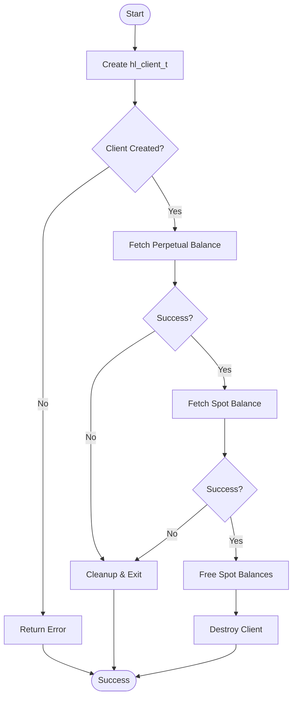
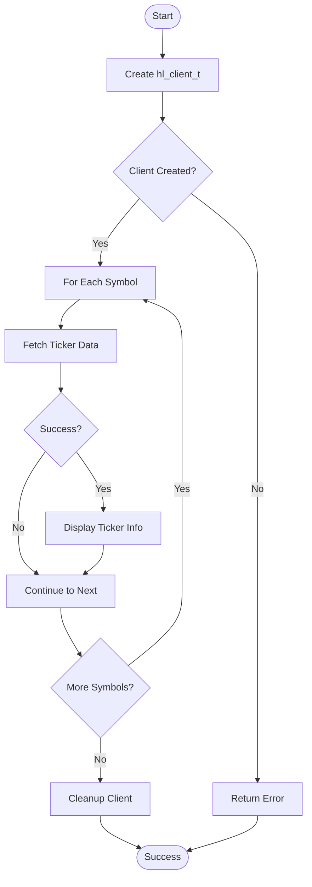
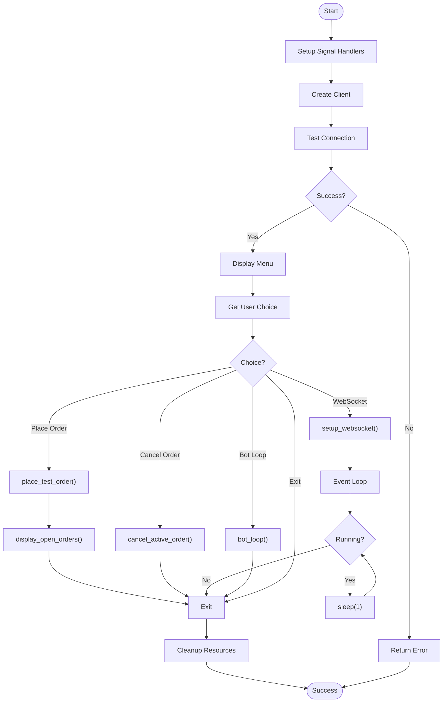
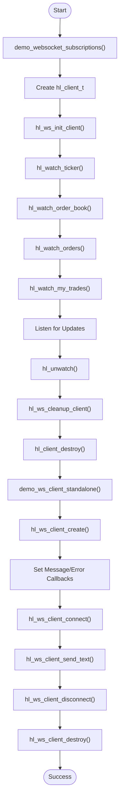
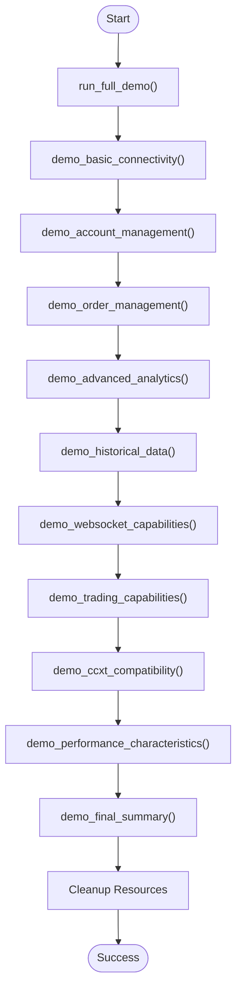

# Examples and Use Cases

<cite>
**Referenced Files in This Document**   
- [simple_balance.c](file://examples/simple_balance.c)
- [simple_ticker.c](file://examples/simple_ticker.c)
- [trading_bot.c](file://examples/trading_bot.c)
- [websocket_demo.c](file://examples/websocket_demo.c)
- [comprehensive_demo.c](file://examples/comprehensive_demo.c)
- [hl_client_create](file://src/client.c#L34-L87)
- [hl_fetch_balance](file://src/account.c#L249-L261)
- [hl_get_ticker](file://src/ticker.c#L188-L213)
- [hl_ws_init_client](file://src/websocket.c#L104-L130)
- [hl_watch_ticker](file://src/websocket.c#L156-L181)
</cite>

## Table of Contents
1. [Introduction](#introduction)
2. [Basic API Usage Examples](#basic-api-usage-examples)
   - [Simple Balance Example](#simple-balance-example)
   - [Simple Ticker Example](#simple-ticker-example)
3. [Advanced Examples](#advanced-examples)
   - [Trading Bot Example](#trading-bot-example)
   - [WebSocket Demo Example](#websocket-demo-example)
4. [Comprehensive Reference Implementation](#comprehensive-reference-implementation)
5. [Common Modifications and Customizations](#common-modifications-and-customizations)
6. [Best Practices and Learning Objectives](#best-practices-and-learning-objectives)

## Introduction
This document provides comprehensive analysis of the example programs in the Hyperliquid C SDK, designed to help developers understand and implement trading functionality. The examples progress from basic API usage to advanced real-time trading systems, demonstrating initialization patterns, error handling, resource management, and integration of multiple features. Each example serves as an educational tool for building robust trading applications.

## Basic API Usage Examples

### Simple Balance Example
The `simple_balance.c` example demonstrates fundamental account balance retrieval operations. It shows client initialization, fetching both perpetual and spot account balances, proper error handling, and resource cleanup.

The example begins by creating a client instance using wallet address and private key credentials. It then fetches perpetual balance data including account value, margin used, withdrawable amount, and total notional position. Subsequently, it retrieves spot balance information showing available coins and their amounts.

Key learning objectives include understanding the client lifecycle, handling different account types, and properly freeing allocated memory for spot balances. The error handling pattern demonstrates checking return codes and providing meaningful error messages.

**Diagram sources**
- [simple_balance.c](file://examples/simple_balance.c#L25-L87)
- [hl_client_create](file://src/client.c#L34-L87)
- [hl_fetch_balance](file://src/account.c#L249-L261)

**Section sources**
- [simple_balance.c](file://examples/simple_balance.c#L1-L87)

### Simple Ticker Example
The `simple_ticker.c` example illustrates how to retrieve real-time market data for trading symbols. It demonstrates fetching ticker information for multiple perpetual swap symbols, displaying price data, volume metrics, and swap-specific information like funding rates and open interest.

The implementation creates a client instance and iterates through a predefined list of symbols. For each symbol, it retrieves ticker data including last price, bid/ask prices, 24-hour volume, mark price, oracle price, funding rate, and open interest. The example includes comprehensive error handling with continue statements to process remaining symbols even if some requests fail.

Educational value includes understanding market data structure, handling batch requests, and interpreting swap-specific metrics essential for trading strategies.

**Diagram sources**
- [simple_ticker.c](file://examples/simple_ticker.c#L25-L104)
- [hl_client_create](file://src/client.c#L34-L87)
- [hl_get_ticker](file://src/ticker.c#L188-L213)

**Section sources**
- [simple_ticker.c](file://examples/simple_ticker.c#L1-L104)

## Advanced Examples

### Trading Bot Example
The `trading_bot.c` example presents a complete trading bot implementation with interactive menu system. It demonstrates client initialization, connection testing, account monitoring, order placement, and WebSocket integration for real-time data streaming.

Key components include signal handling for graceful shutdown, callback functions for WebSocket updates, and modular functions for different operations like balance display, market information retrieval, ticker updates, order placement, and cancellation. The bot features an interactive menu allowing users to place test orders, cancel active orders, start WebSocket streaming, or run an automated bot loop.

The example highlights advanced patterns such as global state management, callback-based event handling, and integration of REST API with WebSocket functionality. It serves as a foundation for building production trading systems with proper error handling and resource management.

**Diagram sources**
- [trading_bot.c](file://examples/trading_bot.c#L25-L381)
- [hl_client_create](file://src/client.c#L34-L87)
- [hl_ws_init_client](file://src/websocket.c#L104-L130)
- [hl_watch_ticker](file://src/websocket.c#L156-L181)

**Section sources**
- [trading_bot.c](file://examples/trading_bot.c#L1-L381)

### WebSocket Demo Example
The `websocket_demo.c` example demonstrates WebSocket API capabilities for real-time market data streaming. It showcases subscription management for various data types including ticker updates, order book changes, user order status, and trade executions.

The demo includes two main components: client-based WebSocket subscriptions and standalone WebSocket client usage. It illustrates how to set up callbacks for different update types, manage subscriptions, and handle connection lifecycle. The example also demonstrates the framework approach versus standalone client usage, providing insight into the SDK's architecture.

Learning objectives include understanding real-time data patterns, subscription/unsubscription mechanics, and callback-based programming for event-driven applications.

**Diagram sources**
- [websocket_demo.c](file://examples/websocket_demo.c#L25-L201)
- [hl_ws_init_client](file://src/websocket.c#L104-L130)
- [hl_watch_ticker](file://src/websocket.c#L156-L181)

**Section sources**
- [websocket_demo.c](file://examples/websocket_demo.c#L1-L201)

## Comprehensive Reference Implementation
The `comprehensive_demo.c` example serves as a reference implementation showcasing 84.3% of CCXT methods (43/51) available in the SDK. It systematically demonstrates all major capabilities through ten sequential demo steps:

1. **Basic Connectivity & Market Data**: Client creation, connection testing, market data retrieval
2. **Account Management**: Balance fetching, positions, open orders
3. **Order Management**: Open, closed, canceled, and all orders retrieval
4. **Advanced Analytics**: Funding rates, open interest, OHLCV data, trade history
5. **Historical Data**: User trade history, account ledger, funding history
6. **WebSocket Framework**: Real-time data streaming capabilities
7. **Trading Capabilities**: Complete trading workflow from order placement to cancellation
8. **CCXT Compatibility**: Standardized interface implementation
9. **Performance Characteristics**: Latency, memory usage, thread safety
10. **Final Summary**: Production readiness assessment

This example is designed to validate the SDK's completeness and serve as a comprehensive reference for developers. It highlights the integration of multiple features and provides a template for building full-featured trading applications.

**Diagram sources**
- [comprehensive_demo.c](file://examples/comprehensive_demo.c#L25-L396)

**Section sources**
- [comprehensive_demo.c](file://examples/comprehensive_demo.c#L1-L396)

## Common Modifications and Customizations
Developers can modify the examples for custom use cases by making the following changes:

- **Changing Symbols**: Update symbol arrays in ticker and trading examples to monitor different trading pairs
- **Adjusting Order Sizes**: Modify amount parameters in order requests to match desired position sizes
- **Adding Logging**: Integrate the `hl_logger.h` module for enhanced debugging and monitoring
- **Custom Timeframes**: Adjust OHLCV timeframe parameters for different chart intervals
- **Increased Limits**: Modify limit parameters for fetching more historical data points
- **Authentication**: Replace NULL parameters with actual credentials for authenticated endpoints
- **Error Handling**: Implement retry logic with exponential backoff for transient failures
- **Resource Management**: Implement connection pooling for high-frequency applications

When customizing examples, maintain proper resource cleanup patterns and error checking to ensure application stability.

**Section sources**
- [simple_ticker.c](file://examples/simple_ticker.c#L35-L40)
- [trading_bot.c](file://examples/trading_bot.c#L150-L160)
- [comprehensive_demo.c](file://examples/comprehensive_demo.c#L25-L30)

## Best Practices and Learning Objectives
Key learning objectives from the examples include:

- **Initialization Patterns**: Proper client creation with error checking
- **Error Handling**: Comprehensive error checking and meaningful error reporting
- **Resource Management**: Timely cleanup of allocated resources and client destruction
- **Thread Safety**: Understanding which APIs are thread-safe and proper mutex usage
- **Memory Management**: Ownership rules for allocated data structures
- **Rate Limiting**: Respecting exchange rate limits to avoid throttling
- **Security**: Safe handling of private keys and authentication credentials
- **WebSocket Integration**: Combining REST API with real-time data streaming

Best practices demonstrated across examples include modular code organization, clear error messages, graceful shutdown handling, and progressive feature implementation from basic to advanced functionality.

**Section sources**
- [ARCHITECTURE.md](file://ARCHITECTURE.md#L129-L200)
- [CONTRIBUTING.md](file://CONTRIBUTING.md#L288-L375)
- [PROJECT_SUMMARY.md](file://PROJECT_SUMMARY.md#L40-L63)