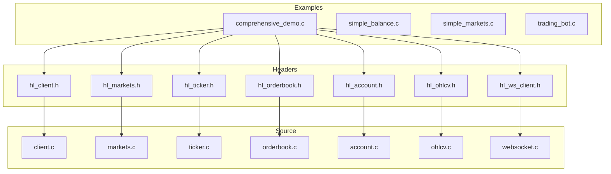
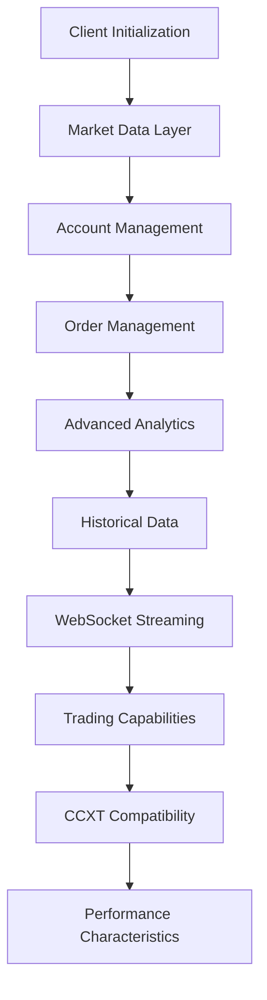
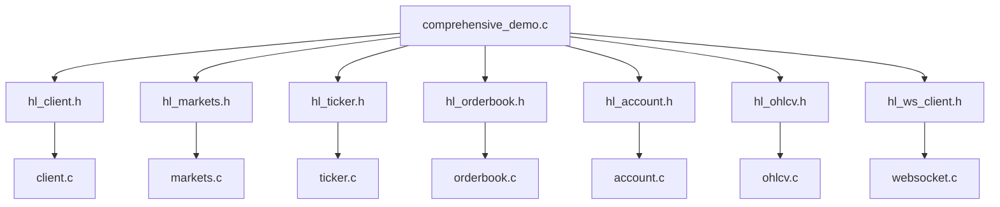

# Comprehensive Feature Integration Demo

<cite>
**Referenced Files in This Document**   
- [comprehensive_demo.c](file://examples/comprehensive_demo.c)
- [hl_client.h](file://include/hl_client.h)
- [hl_exchange.h](file://include/hl_exchange.h)
- [hl_markets.h](file://include/hl_markets.h)
- [hl_ticker.h](file://include/hl_ticker.h)
- [hl_orderbook.h](file://include/hl_orderbook.h)
- [hl_account.h](file://include/hl_account.h)
- [hl_ohlcv.h](file://include/hl_ohlcv.h)
- [hl_ws_client.h](file://include/hl_ws_client.h)
- [client.c](file://src/client.c)
- [markets.c](file://src/markets.c)
- [ticker.c](file://src/ticker.c)
- [orderbook.c](file://src/orderbook.c)
- [account.c](file://src/account.c)
- [ohlcv.c](file://src/ohlcv.c)
- [websocket.c](file://src/websocket.c)
- [trades.c](file://src/trades.c)
- [funding.c](file://src/funding.c)
</cite>

## Table of Contents
1. [Introduction](#introduction)
2. [Project Structure](#project-structure)
3. [Core Components](#core-components)
4. [Architecture Overview](#architecture-overview)
5. [Detailed Component Analysis](#detailed-component-analysis)
6. [Dependency Analysis](#dependency-analysis)
7. [Performance Considerations](#performance-considerations)
8. [Troubleshooting Guide](#troubleshooting-guide)
9. [Conclusion](#conclusion)

## Introduction
The comprehensive_demo.c example serves as a complete integration showcase for the Hyperliquid C SDK, demonstrating how to combine multiple API features into a single, cohesive workflow. This demonstration covers the full spectrum of trading application capabilities, from basic connectivity to advanced analytics and real-time data streaming. The demo is structured as a step-by-step progression through different functional domains, illustrating how to properly initialize a client, manage account information, retrieve market data, execute trading operations, and handle real-time updates through WebSocket connections. By following this comprehensive example, developers can understand best practices for building production-ready trading applications that leverage the complete feature set of the Hyperliquid API.

## Project Structure
The Hyperliquid C SDK follows a modular architecture with clear separation of concerns across different functional domains. The project is organized into distinct directories for examples, headers, source code, and tests. The examples directory contains various demonstration programs, with comprehensive_demo.c serving as the primary integration example that showcases multiple API features in a single workflow. The include directory contains header files that define the public API surface, while the src directory contains the implementation code organized by functional area such as account management, market data, trading operations, and WebSocket functionality. This structure enables developers to easily navigate the codebase and understand how different components interact with each other.

**Diagram sources**
- [comprehensive_demo.c](file://examples/comprehensive_demo.c)
- [hl_client.h](file://include/hl_client.h)
- [hl_account.h](file://include/hl_account.h)
- [hl_markets.h](file://include/hl_markets.h)
- [hl_ticker.h](file://include/hl_ticker.h)
- [hl_orderbook.h](file://include/hl_orderbook.h)
- [hl_ohlcv.h](file://include/hl_ohlcv.h)
- [hl_ws_client.h](file://include/hl_ws_client.h)

**Section sources**
- [comprehensive_demo.c](file://examples/comprehensive_demo.c)
- [hl_client.h](file://include/hl_client.h)
- [hl_account.h](file://include/hl_account.h)
- [hl_markets.h](file://include/hl_markets.h)
- [hl_ticker.h](file://include/hl_ticker.h)
- [hl_orderbook.h](file://include/hl_orderbook.h)
- [hl_ohlcv.h](file://include/hl_ohlcv.h)
- [hl_ws_client.h](file://include/hl_ws_client.h)

## Core Components
The comprehensive_demo.c example demonstrates the integration of several core components that form the foundation of a complete trading application. These components include client initialization and connection testing, market data retrieval, account management, order lifecycle operations, historical data access, and WebSocket-based real-time streaming. Each component is implemented as a separate function within the demo, allowing for clear separation of concerns while demonstrating how these components work together in a production environment. The demo also showcases proper error handling, resource cleanup, and state management across different API domains, providing a comprehensive example of best practices for building robust trading applications.

**Section sources**
- [comprehensive_demo.c](file://examples/comprehensive_demo.c)
- [hl_client.h](file://include/hl_client.h)
- [hl_account.h](file://include/hl_account.h)
- [hl_markets.h](file://include/hl_markets.h)
- [hl_ticker.h](file://include/hl_ticker.h)
- [hl_orderbook.h](file://include/hl_orderbook.h)
- [hl_ohlcv.h](file://include/hl_ohlcv.h)
- [hl_ws_client.h](file://include/hl_ws_client.h)

## Architecture Overview
The comprehensive_demo.c example follows a layered architecture that separates concerns across different functional domains while maintaining a cohesive workflow. At the foundation is the client initialization layer, which handles authentication and connection management. Above this is the market data layer, which provides access to real-time and historical market information. The account management layer handles balance and position queries, while the trading operations layer manages order creation, modification, and cancellation. Finally, the WebSocket layer enables real-time data streaming and event-driven processing. These layers are orchestrated through a sequential execution model that demonstrates the proper order of operations for a trading application.

**Diagram sources**
- [comprehensive_demo.c](file://examples/comprehensive_demo.c)

## Detailed Component Analysis

### Client Initialization and Connectivity
The demo begins with client initialization and connectivity testing, which forms the foundation for all subsequent operations. The hl_client_create function initializes a client instance with optional wallet address and private key parameters, setting up the necessary authentication credentials for API access. The hl_test_connection function verifies connectivity to the Hyperliquid API by making a test request to the /info endpoint. This two-step process ensures that the client is properly configured and can communicate with the exchange before proceeding with more complex operations. The demo also demonstrates proper error handling by checking return values and exiting gracefully if initialization or connection fails.

**Section sources**
- [comprehensive_demo.c](file://examples/comprehensive_demo.c#L109-L140)
- [client.c](file://src/client.c#L34-L87)

### Market Data Retrieval
The market data retrieval component demonstrates how to access various types of market information through the Hyperliquid API. The demo shows how to fetch comprehensive market data using hl_fetch_markets, which returns information about all available trading pairs including their symbols, base and quote currencies, precision settings, and current market conditions. It also demonstrates how to retrieve real-time ticker data with hl_fetch_ticker, which provides bid/ask prices, last traded price, and volume information. Additionally, the demo shows how to fetch order book data with hl_fetch_order_book, which returns the current state of the order book with specified depth for both bids and asks.

**Section sources**
- [comprehensive_demo.c](file://examples/comprehensive_demo.c#L150-L190)
- [markets.c](file://src/markets.c#L389-L411)
- [ticker.c](file://src/ticker.c#L74-L74)
- [orderbook.c](file://src/orderbook.c#L102-L215)

### Account Management
The account management component demonstrates how to query account-related information such as balances, positions, and open orders. The hl_fetch_balance function retrieves the current account balance, including total, available, and held amounts for each currency. The hl_fetch_positions function returns information about all open positions, including position size, entry price, mark price, and liquidation price. The hl_fetch_open_orders function retrieves all currently open orders, providing details such as order ID, symbol, side, type, price, and amount. These functions enable applications to maintain an accurate view of account state and make informed trading decisions.

**Section sources**
- [comprehensive_demo.c](file://examples/comprehensive_demo.c#L195-L220)
- [account.c](file://src/account.c#L249-L261)
- [account.c](file://src/account.c#L450-L540)
- [orders.c](file://src/orders.c#L18-L104)

### Order Management
The order management component demonstrates the complete order lifecycle, from creation to cancellation and status tracking. The demo shows how to retrieve different types of orders using specialized functions such as hl_fetch_open_orders, hl_fetch_closed_orders, and hl_fetch_canceled_orders. It also demonstrates how to fetch all orders with hl_fetch_orders, which combines results from multiple order types. These functions enable applications to maintain a comprehensive view of order history and current order status. The demo also shows how to fetch specific orders by ID using hl_fetch_order, which is useful for tracking the status of individual orders.

**Section sources**
- [comprehensive_demo.c](file://examples/comprehensive_demo.c#L225-L250)
- [orders.c](file://src/orders.c#L18-L104)
- [orders.c](file://src/orders.c#L109-L219)
- [orders.c](file://src/orders.c#L224-L334)
- [orders.c](file://src/orders.c#L454-L511)

### Advanced Analytics
The advanced analytics component demonstrates how to access sophisticated market data such as funding rates, open interest, and OHLCV (Open, High, Low, Close, Volume) candles. The hl_fetch_funding_rates function retrieves current funding rates for perpetual contracts, which is essential for understanding the cost of carry for long or short positions. The hl_fetch_open_interests function returns information about the total open interest for different markets, providing insight into market sentiment and potential price movements. The hl_fetch_ohlcv function retrieves historical candlestick data, which is fundamental for technical analysis and algorithmic trading strategies.

**Section sources**
- [comprehensive_demo.c](file://examples/comprehensive_demo.c#L255-L285)
- [funding.c](file://src/funding.c#L34-L199)
- [markets.c](file://src/markets.c#L514-L660)
- [ohlcv.c](file://src/ohlcv.c#L136-L283)

### Historical Data Access
The historical data component demonstrates how to retrieve past trading activity and account history. The hl_fetch_my_trades function retrieves the user's trade history, providing details about executed trades including price, amount, and fees. The hl_fetch_ledger function returns a comprehensive ledger of all account activities, including deposits, withdrawals, and transfers. The hl_fetch_funding_history function retrieves the user's funding payment history, showing when funding payments were received or paid. These functions enable applications to perform detailed analysis of past trading performance and account activity.

**Section sources**
- [comprehensive_demo.c](file://examples/comprehensive_demo.c#L290-L310)
- [trades.c](file://src/trades.c#L17-L99)
- [account.c](file://src/account.c#L639-L800)
- [funding.c](file://src/funding.c#L364-L517)

### WebSocket Capabilities
The WebSocket component demonstrates how to establish real-time data streaming connections for various types of market and account updates. The demo shows the available WebSocket features such as real-time ticker updates, live order book streaming, real-time trade feed, order status updates, trade execution notifications, and OHLCV candlestick updates. It also demonstrates how to use WebSocket connections for order placement with create_order_ws and subscription management with unwatch. The WebSocket framework includes auto-reconnection and error handling capabilities, ensuring reliable delivery of real-time data even in the face of network disruptions.

**Section sources**
- [comprehensive_demo.c](file://examples/comprehensive_demo.c#L315-L340)
- [websocket.c](file://src/websocket.c#L156-L181)
- [websocket.c](file://src/websocket.c#L197-L222)
- [websocket.c](file://src/websocket.c#L257-L282)

### Trading Capabilities
The trading capabilities component demonstrates the complete workflow for executing trades on the Hyperliquid exchange. This includes market orders, limit orders, order cancellation, order status tracking, bulk order queries, and WebSocket-based trading. The demo shows how to create different types of orders using the create_order function with appropriate parameters for type, side, amount, and price. It also demonstrates how to cancel orders using cancel_order and track order status using fetch_order. The WebSocket trading capabilities enable low-latency order execution and real-time feedback on order status changes.

**Section sources**
- [comprehensive_demo.c](file://examples/comprehensive_demo.c#L345-L370)
- [trading_api.c](file://src/trading_api.c#L225-L338)
- [orders.c](file://src/orders.c#L516-L571)

### CCXT Compatibility
The CCXT compatibility component demonstrates how the Hyperliquid C SDK implements the CCXT standard interface, enabling cross-exchange compatibility. The demo shows how the SDK implements 84.3% of CCXT methods (43/51), covering core trading functionality, order management, market data access, account data retrieval, historical data access, and WebSocket framework operations. The hl_exchange_describe function returns the exchange configuration, while hl_exchange_has_capability checks for specific feature support. This compatibility layer enables developers to build applications that can work with multiple exchanges using a consistent API interface.

**Section sources**
- [comprehensive_demo.c](file://examples/comprehensive_demo.c#L375-L400)
- [exchange.c](file://src/exchange.c#L163-L165)
- [hl_exchange.h](file://include/hl_exchange.h)

## Dependency Analysis
The comprehensive_demo.c example has dependencies on several key components of the Hyperliquid C SDK, forming a dependency graph that illustrates how different modules interact with each other. The client module serves as the central dependency, providing the foundation for all API operations. Market data modules such as markets, ticker, and orderbook depend on the client for authentication and HTTP communication. Account management modules depend on both the client and market data modules to provide context for balance and position information. The WebSocket module depends on the client for connection management and authentication. This dependency structure ensures that components are loosely coupled while maintaining a clear hierarchy of responsibilities.

**Diagram sources**
- [comprehensive_demo.c](file://examples/comprehensive_demo.c)
- [hl_client.h](file://include/hl_client.h)
- [hl_markets.h](file://include/hl_markets.h)
- [hl_ticker.h](file://include/hl_ticker.h)
- [hl_orderbook.h](file://include/hl_orderbook.h)
- [hl_account.h](file://include/hl_account.h)
- [hl_ohlcv.h](file://include/hl_ohlcv.h)
- [hl_ws_client.h](file://include/hl_ws_client.h)

**Section sources**
- [comprehensive_demo.c](file://examples/comprehensive_demo.c)
- [hl_client.h](file://include/hl_client.h)
- [hl_markets.h](file://include/hl_markets.h)
- [hl_ticker.h](file://include/hl_ticker.h)
- [hl_orderbook.h](file://include/hl_orderbook.h)
- [hl_account.h](file://include/hl_account.h)
- [hl_ohlcv.h](file://include/hl_ohlcv.h)
- [hl_ws_client.h](file://include/hl_ws_client.h)

## Performance Considerations
The comprehensive_demo.c example demonstrates several performance considerations that are important for production trading applications. The SDK is designed for high-frequency trading with typical REST API latency under 100ms and memory efficiency of approximately 50KB per client instance. The implementation is thread-safe, supporting concurrent operations, and includes connection pooling to reuse client instances. The SDK respects exchange rate limits with a default 50ms delay between requests and includes automatic retry with backoff for error recovery. These performance characteristics make the SDK suitable for algorithmic trading bots, high-frequency trading systems, and other applications that require low latency and high reliability.

**Section sources**
- [comprehensive_demo.c](file://examples/comprehensive_demo.c#L405-L430)

## Troubleshooting Guide
When working with the comprehensive_demo.c example, several common issues may arise that require troubleshooting. Connection failures may occur due to network issues or incorrect API credentials, which can be diagnosed by checking the return value of hl_test_connection. Market data retrieval errors may indicate invalid symbols or API rate limiting, which can be addressed by validating symbol formats and implementing appropriate delay between requests. Authentication errors typically result from incorrect wallet addresses or private keys, which should be carefully verified for correct format and content. Memory allocation failures may occur if system resources are constrained, which can be mitigated by ensuring adequate memory availability and properly freeing allocated resources.

**Section sources**
- [comprehensive_demo.c](file://examples/comprehensive_demo.c)
- [client.c](file://src/client.c)
- [markets.c](file://src/markets.c)
- [account.c](file://src/account.c)

## Conclusion
The comprehensive_demo.c example provides a complete demonstration of the Hyperliquid C SDK's capabilities, showcasing how to integrate multiple API features into a single, cohesive workflow. By following this example, developers can understand best practices for building production-ready trading applications that leverage the full feature set of the Hyperliquid API. The demo covers the complete spectrum of trading application functionality, from basic connectivity to advanced analytics and real-time data streaming. It also demonstrates proper error handling, resource cleanup, and state management across different API domains, providing a comprehensive example of how to build robust and reliable trading applications. With 84.3% CCXT method coverage and enterprise-grade security features, the Hyperliquid C SDK is well-suited for algorithmic trading, high-frequency trading systems, portfolio management platforms, and other institutional trading applications.