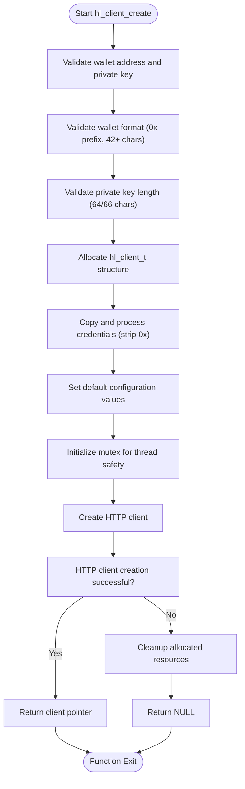
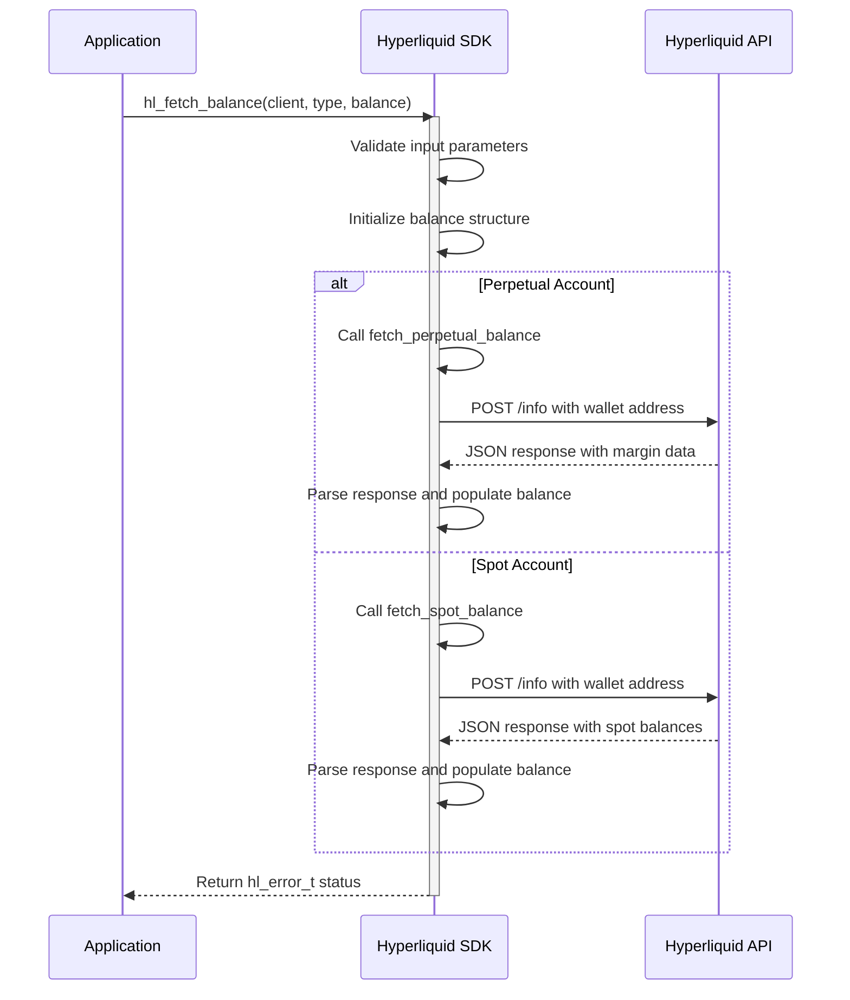
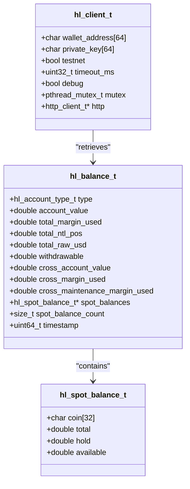
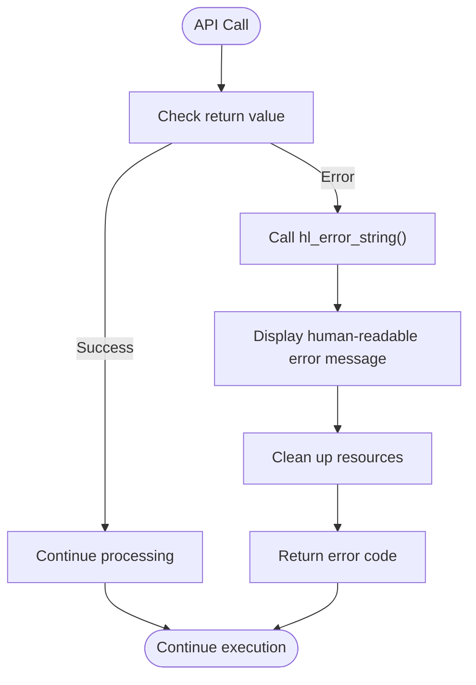
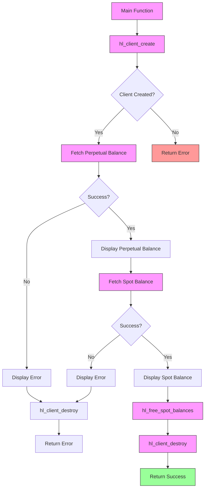

# Simple Balance Query Example

<cite>
**Referenced Files in This Document**   
- [simple_balance.c](file://examples/simple_balance.c)
- [hl_client_create](file://src/client.c#L34-L87)
- [hl_client_destroy](file://src/client.c#L89-L107)
- [hl_fetch_balance](file://src/account.c#L249-L261)
- [hl_free_spot_balances](file://src/account.c#L266-L271)
- [hl_error_string](file://src/client.c#L153-L170)
- [hl_client_t](file://include/hl_client.h#L14-L14)
- [hl_balance_t](file://include/hl_account.h#L21-L21)
- [hl_account_type_t](file://include/hl_account.h#L43-L48)
- [hl_error_t](file://include/hl_error.h#L12-L37)
- [hl_spot_balance_t](file://include/hl_account.h#L43-L48)
</cite>

## Table of Contents
1. [Introduction](#introduction)
2. [Client Initialization and Authentication](#client-initialization-and-authentication)
3. [Balance Retrieval Process](#balance-retrieval-process)
4. [Data Structure Analysis](#data-structure-analysis)
5. [Error Handling Patterns](#error-handling-patterns)
6. [Memory Management and Resource Cleanup](#memory-management-and-resource-cleanup)
7. [Data Flow Visualization](#data-flow-visualization)
8. [Output Interpretation](#output-interpretation)
9. [Common Pitfalls and Troubleshooting](#common-pitfalls-and-troubleshooting)
10. [Conclusion](#conclusion)

## Introduction

The `simple_balance.c` example demonstrates a fundamental use case of the Hyperliquid C SDK: retrieving account balance information. This example serves as a practical introduction to the SDK's core functionality, showcasing the complete workflow from client initialization to balance retrieval and resource cleanup. The implementation follows a straightforward pattern that emphasizes reliability, error handling, and proper memory management.

The example specifically demonstrates how to:
- Initialize a Hyperliquid client with wallet credentials
- Authenticate with the Hyperliquid API
- Retrieve both perpetual and spot account balances
- Handle potential errors throughout the process
- Properly clean up allocated resources

This documentation provides a comprehensive analysis of the example, breaking down each component and explaining the underlying mechanisms that make the balance query functionality work.

**Section sources**
- [simple_balance.c](file://examples/simple_balance.c#L1-L87)

## Client Initialization and Authentication

The client initialization process begins with the `hl_client_create` function, which establishes a connection to the Hyperliquid API and authenticates the user. This function requires three parameters: the wallet address, private key, and a boolean indicating whether to use the testnet environment.

```c
hl_client_t* client = hl_client_create(
    "0xAAF96800a2609604c64620df4B5280694E1D812d",
    "0x2ebd552aed6ceb534b27f229e2cb62799b34d6a074c2f6b8b450d44b31445af8",
    true  // testnet
);
```

The `hl_client_create` function performs several critical validation and initialization steps:
1. **Parameter validation**: Checks that both wallet address and private key are provided
2. **Wallet format validation**: Ensures the wallet address follows the expected format (42+ characters starting with "0x")
3. **Private key validation**: Verifies the private key has the correct length (64 or 66 characters)
4. **Memory allocation**: Allocates memory for the client structure using `calloc`
5. **Credential processing**: Copies the wallet address and private key, stripping the "0x" prefix if present
6. **Configuration setup**: Sets default values for testnet mode, timeout (30 seconds), and debug mode
7. **Thread safety**: Initializes a mutex for thread-safe operations
8. **HTTP client creation**: Creates an underlying HTTP client for API communication

The function returns a pointer to the initialized `hl_client_t` structure on success, or `NULL` if any validation or allocation step fails. This comprehensive initialization ensures that the client is properly configured and ready for subsequent API calls.



**Diagram sources**
- [hl_client_create](file://src/client.c#L34-L87)

**Section sources**
- [hl_client_create](file://src/client.c#L34-L87)
- [simple_balance.c](file://examples/simple_balance.c#L25-L30)

## Balance Retrieval Process

The balance retrieval process is implemented through the `hl_fetch_balance` function, which serves as the primary interface for obtaining account balance information. This function is designed to handle both perpetual and spot account types, providing a unified interface for balance queries.

The function signature is:
```c
hl_error_t hl_fetch_balance(hl_client_t* client, hl_account_type_t type, hl_balance_t* balance)
```

It accepts three parameters:
- `client`: Pointer to the initialized Hyperliquid client
- `type`: Account type (perpetual or spot)
- `balance`: Pointer to a `hl_balance_t` structure where the results will be stored

The process flow for balance retrieval involves several key steps:

1. **Input validation**: The function first validates that both the client and balance parameters are not NULL
2. **Memory initialization**: It clears the balance structure using `memset` to ensure a clean state
3. **Account type routing**: Based on the specified account type, it routes the request to either `fetch_perpetual_balance` or `fetch_spot_balance`
4. **API request construction**: Builds the appropriate JSON request body with the user's wallet address
5. **HTTP communication**: Sends a POST request to the `/info` endpoint of the Hyperliquid API
6. **Response parsing**: Processes the JSON response and extracts relevant balance information
7. **Data population**: Populates the balance structure with the retrieved data

For perpetual accounts, the function retrieves key metrics such as account value, total margin used, total notional position value, and withdrawable amount. For spot accounts, it retrieves the balances of individual coins, including total, held, and available amounts.

The function returns an `hl_error_t` code indicating the success or failure of the operation, allowing for proper error handling in the calling code.



**Diagram sources**
- [hl_fetch_balance](file://src/account.c#L249-L261)
- [fetch_perpetual_balance](file://src/account.c#L30-L144)
- [fetch_spot_balance](file://src/account.c#L149-L244)

**Section sources**
- [hl_fetch_balance](file://src/account.c#L249-L261)
- [simple_balance.c](file://examples/simple_balance.c#L45-L70)

## Data Structure Analysis

The balance query functionality relies on several key data structures that define the shape and organization of the balance information. Understanding these structures is essential for interpreting the retrieved data correctly.

### hl_client_t Structure

The `hl_client_t` structure represents the client instance and contains all necessary information for API communication:

```c
typedef struct hl_client {
    char wallet_address[64];           /**< Wallet address (without 0x prefix) */
    char private_key[64];              /**< Private key (without 0x prefix) */
    bool testnet;                      /**< Use testnet environment */
    uint32_t timeout_ms;               /**< Request timeout in milliseconds */
    bool debug;                        /**< Enable debug mode */
    pthread_mutex_t mutex;             /**< Mutex for thread safety */
    http_client_t* http;               /**< Underlying HTTP client */
} hl_client_t;
```

This structure encapsulates the authentication credentials, network configuration, and thread safety mechanisms required for API communication.

### hl_balance_t Structure

The `hl_balance_t` structure is the central data container for balance information, combining fields for both perpetual and spot accounts:

```c
struct hl_balance {
    hl_account_type_t type;            /**< Account type (perpetual or spot) */
    
    // Perpetual account fields
    double account_value;              /**< Total account value in USDC */
    double total_margin_used;          /**< Total margin used */
    double total_ntl_pos;              /**< Total notional position value */
    double total_raw_usd;              /**< Total raw USD */
    double withdrawable;               /**< Withdrawable amount */
    
    // Cross margin summary
    double cross_account_value;
    double cross_margin_used;
    double cross_maintenance_margin_used;
    
    // Spot balances (only if type == SPOT)
    hl_spot_balance_t* spot_balances;
    size_t spot_balance_count;
    
    uint64_t timestamp;                /**< Response timestamp */
};
```

This structure is designed to be flexible, containing fields for both account types while using the `type` field to indicate which set of data is valid.

### hl_spot_balance_t Structure

For spot accounts, individual coin balances are represented by the `hl_spot_balance_t` structure:

```c
typedef struct {
    char coin[32];                     /**< Coin symbol (e.g., "USDC", "BTC") */
    double total;                      /**< Total balance */
    double hold;                       /**< Amount on hold (in open orders) */
    double available;                  /**< Available balance (total - hold) */
} hl_spot_balance_t;
```

This structure provides a clear breakdown of each coin's balance, distinguishing between total holdings, amounts reserved for open orders, and immediately available funds.



**Diagram sources**
- [hl_client_t](file://include/hl_client.h#L14-L14)
- [hl_balance_t](file://include/hl_account.h#L21-L21)
- [hl_spot_balance_t](file://include/hl_account.h#L43-L48)

**Section sources**
- [hl_client_t](file://include/hl_client.h#L14-L14)
- [hl_balance_t](file://include/hl_account.h#L21-L21)
- [hl_spot_balance_t](file://include/hl_account.h#L43-L48)

## Error Handling Patterns

The example demonstrates robust error handling patterns that are critical for production-ready applications. The SDK uses a comprehensive error system based on the `hl_error_t` enum, which provides specific error codes for different failure scenarios.

### Error Type System

The `hl_error_t` enum defines various error conditions:
```c
typedef enum {
    HL_SUCCESS = 0,
    HL_ERROR_INVALID_PARAMS = -1,
    HL_ERROR_NETWORK = -2,
    HL_ERROR_API = -3,
    HL_ERROR_AUTH = -4,
    HL_ERROR_INSUFFICIENT_BALANCE = -5,
    HL_ERROR_INVALID_SYMBOL = -6,
    HL_ERROR_ORDER_REJECTED = -7,
    HL_ERROR_SIGNATURE = -8,
    HL_ERROR_MSGPACK = -9,
    HL_ERROR_JSON = -10,
    HL_ERROR_MEMORY = -11,
    HL_ERROR_TIMEOUT = -12,
    // ... additional error codes
} hl_error_t;
```

This system allows for precise error identification and appropriate response strategies.

### Error Handling Implementation

The example implements error handling at multiple levels:

1. **Client creation validation**:
```c
if (!client) {
    printf("❌ Failed to create client\n");
    return 1;
}
```

2. **Balance retrieval error checking**:
```c
hl_error_t err = hl_fetch_balance(client, HL_ACCOUNT_PERPETUAL, &perpetual_balance);
if (err != HL_SUCCESS) {
    printf("❌ Failed to fetch perpetual balance: %s\n", hl_error_string(err));
    hl_client_destroy(client);
    return 1;
}
```

3. **Human-readable error messages**:
The `hl_error_string` function converts error codes to descriptive messages:
```c
const char* hl_error_string(hl_error_t error) {
    switch (error) {
        case HL_SUCCESS: return "Success";
        case HL_ERROR_INVALID_PARAMS: return "Invalid parameters";
        case HL_ERROR_NETWORK: return "Network error";
        // ... other cases
        default: return "Unknown error";
    }
}
```

The error handling pattern follows a consistent approach:
- Check for errors immediately after API calls
- Provide descriptive error messages to aid debugging
- Clean up allocated resources before exiting
- Return appropriate exit codes to indicate failure

This comprehensive error handling ensures that the application can gracefully handle various failure scenarios, from network issues to authentication problems.



**Diagram sources**
- [hl_error_t](file://include/hl_error.h#L12-L37)
- [hl_error_string](file://src/client.c#L153-L170)

**Section sources**
- [hl_error_t](file://include/hl_error.h#L12-L37)
- [hl_error_string](file://src/client.c#L153-L170)
- [simple_balance.c](file://examples/simple_balance.c#L50-L55)

## Memory Management and Resource Cleanup

Proper memory management is crucial in C applications to prevent memory leaks and ensure resource efficiency. The example demonstrates careful memory management practices throughout its execution.

### Memory Allocation

The SDK handles memory allocation internally for complex data structures:
- The `hl_client_create` function allocates memory for the client structure
- The `hl_fetch_balance` function allocates memory for spot balances when retrieving spot account information
- All allocations use `calloc` or `malloc` with proper size calculations

### Resource Cleanup

The example implements a comprehensive cleanup strategy:

1. **Spot balance cleanup**:
```c
if (spot_balance.spot_balances) {
    hl_free_spot_balances(spot_balance.spot_balances, spot_balance.spot_balance_count);
}
```

2. **Client destruction**:
```c
hl_client_destroy(client);
```

The `hl_free_spot_balances` function is specifically designed to free the memory allocated for spot balances:
```c
void hl_free_spot_balances(hl_spot_balance_t* balances, size_t count) {
    (void)count;
    if (balances) {
        free(balances);
    }
}
```

The `hl_client_destroy` function performs thorough cleanup:
```c
void hl_client_destroy(hl_client_t *client) {
    if (!client) {
        return;
    }
    
    // Destroy HTTP client
    if (client->http) {
        http_client_destroy(client->http);
    }
    
    // Zero out private key before freeing
    memset(client->private_key, 0, sizeof(client->private_key));
    
    // Destroy mutex
    pthread_mutex_destroy(&client->mutex);
    
    // Free client
    free(client);
}
```

Key memory management practices demonstrated:
- **Zeroing sensitive data**: The private key is zeroed before freeing to prevent sensitive information from remaining in memory
- **Resource ordering**: Resources are destroyed in the reverse order of creation
- **Null checking**: Functions check for NULL pointers before operating on them
- **Comprehensive cleanup**: All allocated resources are properly freed

This careful memory management ensures that the application maintains a clean memory footprint and prevents resource leaks.

```mermaid
flowchart TD
Start([Application Start]) --> CreateClient["hl_client_create()"]
CreateClient --> FetchBalance["hl_fetch_balance()"]
FetchBalance --> |Spot Account| AllocSpot["Allocate spot_balances array"]
AllocSpot --> UseData["Use balance data"]
UseData --> FreeSpot["hl_free_spot_balances()"]
FreeSpot --> DestroyClient["hl_client_destroy()"]
DestroyClient --> End([Application End])
subgraph Memory Management
direction TB
AllocSpot --> "malloc(spot_balance_count * sizeof(hl_spot_balance_t))"
FreeSpot --> "free(spot_balances)"
DestroyClient --> "free(client)"
DestroyClient --> "memset(private_key, 0, ...)"
end
```

**Diagram sources**
- [hl_free_spot_balances](file://src/account.c#L266-L271)
- [hl_client_destroy](file://src/client.c#L89-L107)

**Section sources**
- [hl_free_spot_balances](file://src/account.c#L266-L271)
- [hl_client_destroy](file://src/client.c#L89-L107)
- [simple_balance.c](file://examples/simple_balance.c#L75-L82)

## Data Flow Visualization

The complete data flow from client initialization to balance retrieval and cleanup can be visualized as a sequence of interconnected operations. This visualization helps understand the overall workflow and the relationships between different components.



**Diagram sources**
- [simple_balance.c](file://examples/simple_balance.c#L18-L86)

**Section sources**
- [simple_balance.c](file://examples/simple_balance.c#L18-L86)

## Output Interpretation

The example produces clear and informative output that helps users understand the balance information and the execution flow. The output follows a consistent pattern using emoji indicators for different states:

- **🔍** Initial information and process start
- **✅** Success indicators
- **❌** Error indicators
- **📊** Data retrieval operations
- **🎉** Completion indicators

For perpetual accounts, the output displays key metrics:
```
✅ Perpetual Balance:
   Account Value: 1000.00 USDC
   Margin Used: 0.00 USDC
   Withdrawable: 1000.00 USDC
   Total Notional: 0.00 USDC
```

For spot accounts, it shows individual coin balances:
```
✅ Spot Balance:
   Coins: 2
   USDC: 1000.000000 (available: 1000.000000)
   BTC: 0.010000 (available: 0.010000)
```

The output format is designed to be human-readable while providing all essential information. The use of consistent formatting and clear labels makes it easy to interpret the balance data.

**Section sources**
- [simple_balance.c](file://examples/simple_balance.c#L58-L73)

## Common Pitfalls and Troubleshooting

When working with the balance query example, several common issues may arise. Understanding these pitfalls and their solutions is essential for successful implementation.

### Wallet Configuration Issues

**Problem**: Invalid wallet address or private key format
- **Symptoms**: `hl_client_create` returns NULL
- **Solution**: Ensure wallet addresses start with "0x" and are 42+ characters long; private keys should be 64 or 66 characters

**Problem**: Incorrect network selection
- **Symptoms**: Authentication errors or unexpected behavior
- **Solution**: Verify the testnet parameter matches your intended environment (true for testnet, false for mainnet)

### Network and API Issues

**Problem**: Network timeouts
- **Symptoms**: `HL_ERROR_TIMEOUT` return code
- **Solution**: Check internet connectivity; consider increasing the timeout if needed

**Problem**: API rate limiting
- **Symptoms**: `HL_ERROR_API` with rate limit messages
- **Solution**: Implement appropriate delays between requests; check API rate limit documentation

### Memory Management Issues

**Problem**: Memory leaks
- **Symptoms**: Increasing memory usage over time
- **Solution**: Always call `hl_free_spot_balances` for spot balances and `hl_client_destroy` for the client

**Problem**: Double-free errors
- **Symptoms**: Application crashes during cleanup
- **Solution**: Ensure cleanup functions are called only once; set pointers to NULL after freeing

### Data Interpretation Issues

**Problem**: Confusing perpetual vs. spot balances
- **Solution**: Check the `type` field in `hl_balance_t` to determine which balance fields are valid

**Problem**: Misinterpreting available vs. total balances
- **Solution**: For spot accounts, `available` = `total` - `hold`; held amounts are in open orders

The example's comprehensive error handling and clear output formatting help identify and resolve these issues quickly.

**Section sources**
- [simple_balance.c](file://examples/simple_balance.c#L18-L86)
- [hl_client_create](file://src/client.c#L34-L87)
- [hl_fetch_balance](file://src/account.c#L249-L261)

## Conclusion

The `simple_balance.c` example provides a comprehensive demonstration of the Hyperliquid C SDK's balance query functionality. It showcases a complete workflow from client initialization to balance retrieval and proper resource cleanup. The implementation emphasizes reliability through robust error handling, proper memory management, and clear output formatting.

Key takeaways from this example:
- The SDK provides a straightforward interface for balance queries through the `hl_fetch_balance` function
- Comprehensive error handling with descriptive messages aids in debugging and troubleshooting
- Proper memory management is essential, with specific functions for cleaning up different resource types
- The data structures are designed to accommodate both perpetual and spot account information
- The example follows best practices for C programming, including input validation and resource cleanup

This example serves as an excellent foundation for building more complex applications that require account balance information, demonstrating the SDK's capabilities while maintaining code clarity and reliability.

**Section sources**
- [simple_balance.c](file://examples/simple_balance.c#L1-L87)