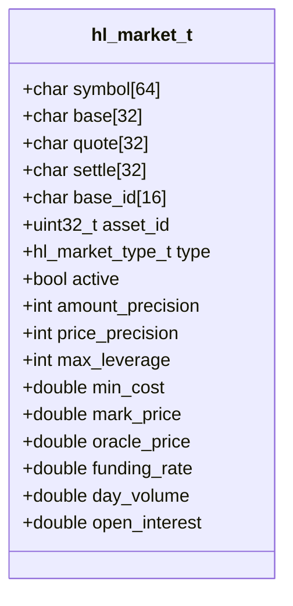
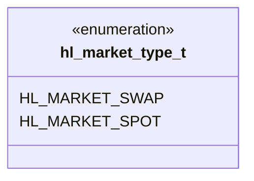
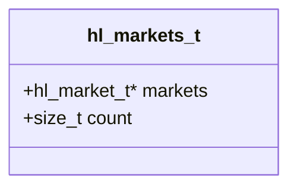
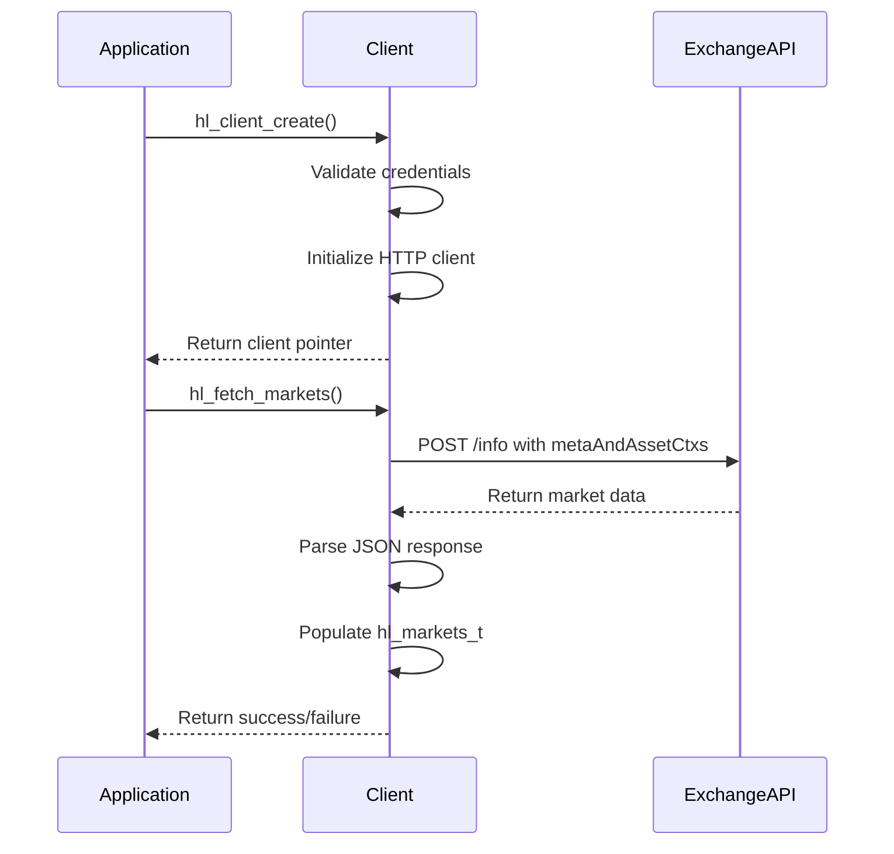
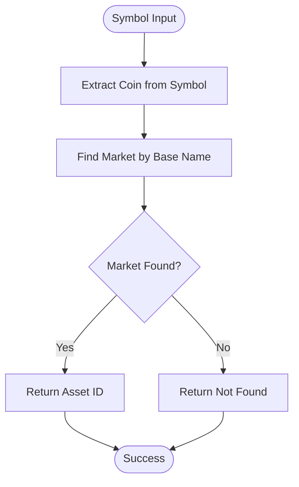

# Simple Markets Discovery Example

<cite>
**Referenced Files in This Document**   
- [simple_markets.c](file://examples/simple_markets.c)
- [hl_markets.h](file://include/hl_markets.h)
- [hl_types.h](file://include/hl_types.h)
- [markets.c](file://src/markets.c)
- [hl_error.h](file://include/hl_error.h)
</cite>

## Table of Contents
1. [Introduction](#introduction)
2. [Market Data Structure](#market-data-structure)
3. [Initialization and Request Flow](#initialization-and-request-flow)
4. [Market Metadata Usage](#market-metadata-usage)
5. [Production Considerations](#production-considerations)
6. [Conclusion](#conclusion)

## Introduction

The `simple_markets.c` example demonstrates how to retrieve and utilize market metadata from the Hyperliquid exchange API. This information is essential for trading applications as it provides critical details about available trading pairs, their configurations, and constraints. The example shows the complete workflow from client initialization to market data retrieval and utilization.

The program fetches both perpetual swap and spot markets, displaying key information such as symbols, base/quote assets, lot sizes, tick sizes, and leverage limits. This market discovery process is fundamental for any trading application, enabling proper order validation and user interface rendering.

**Section sources**
- [simple_markets.c](file://examples/simple_markets.c#L1-L155)

## Market Data Structure

The market information is represented by the `hl_market_t` structure, which contains comprehensive metadata about each trading market. This structure includes both static configuration data and dynamic market information.

### Core Market Fields

The `hl_market_t` structure contains the following key fields:

- **Symbol**: Unified symbol format (e.g., "BTC/USDC:USDC")
- **Base/Quote Assets**: Base currency (e.g., "BTC") and quote currency (e.g., "USDC")
- **Asset ID**: Integer identifier used in API requests
- **Market Type**: Distinguishes between swap and spot markets
- **Precision**: Amount and price precision values
- **Limits**: Maximum leverage and minimum order cost
- **Current Prices**: Mark price, oracle price, and funding rate

**Diagram sources**
- [hl_markets.h](file://include/hl_markets.h#L22-L84)

### Market Type Enumeration

The `hl_market_type_t` enumeration defines the two market types supported by the exchange:

**Diagram sources**
- [hl_markets.h](file://include/hl_markets.h#L18-L20)

### Markets Collection Structure

The `hl_markets_t` structure serves as a container for multiple market entries:

**Diagram sources**
- [hl_markets.h](file://include/hl_markets.h#L90-L92)

**Section sources**
- [hl_markets.h](file://include/hl_markets.h#L15-L130)
- [hl_types.h](file://include/hl_types.h#L15-L16)

## Initialization and Request Flow

The example demonstrates a complete workflow for retrieving market data, from client creation to data processing and cleanup.

### Client Initialization

The process begins with creating a client instance using wallet credentials and testnet configuration. This client handles all HTTP communication with the exchange API.

**Diagram sources**
- [simple_markets.c](file://examples/simple_markets.c#L18-L154)
- [markets.c](file://src/markets.c#L389-L411)

### Market Retrieval Process

The `hl_fetch_markets` function orchestrates the retrieval of both swap and spot markets through a two-step process:

1. First, it fetches perpetual swap markets using the `metaAndAssetCtxs` endpoint
2. Then, it fetches spot markets using the `spotMetaAndAssetCtxs` endpoint
3. Both results are combined into a single `hl_markets_t` structure

The function handles error conditions and memory management, ensuring that partial results are properly cleaned up in case of failure.

### Data Processing and Display

After retrieving the market data, the example processes and displays the information in a structured format:

- Counts and displays the number of swap and spot markets
- Shows detailed information for the first 10 swap markets
- Lists all available spot markets
- Demonstrates market lookup functionality

The example also includes error handling for failed market retrieval, providing descriptive error messages through the `hl_error_string` function.

**Section sources**
- [simple_markets.c](file://examples/simple_markets.c#L18-L154)
- [markets.c](file://src/markets.c#L116-L384)

## Market Metadata Usage

Market metadata plays a crucial role in both order validation and UI rendering for trading applications.

### Order Validation

The retrieved market data enables proper order validation by providing:

- **Precision constraints**: Amount and price precision values ensure orders are formatted correctly
- **Minimum cost requirements**: Prevents submission of orders below the minimum threshold
- **Leverage limits**: For swap markets, ensures leverage settings are within allowed ranges
- **Active status**: Verifies that the market is currently tradable

These validation rules prevent rejected orders and improve the reliability of trading operations.

### UI Rendering

Market metadata enhances the user interface by enabling:

- Proper formatting of prices and amounts based on precision settings
- Display of relevant market information (mark price, funding rate)
- Differentiation between swap and spot markets
- Accurate representation of trading pairs and their configurations

The example demonstrates how to use the `hl_get_market` function to retrieve specific market information by symbol, which is essential for displaying detailed market data in trading interfaces.

### Asset ID Lookup

The `hl_get_asset_id` function provides a convenient way to convert human-readable symbols to the integer asset IDs required by the exchange API:

**Diagram sources**
- [markets.c](file://src/markets.c#L427-L457)

**Section sources**
- [markets.c](file://src/markets.c#L427-L475)
- [hl_markets.h](file://include/hl_markets.h#L103-L113)

## Production Considerations

When implementing market data retrieval in production systems, several important considerations must be addressed.

### Caching Strategy

Market data changes infrequently, making it an excellent candidate for caching:

- Cache the `hl_markets_t` structure to avoid repeated API calls
- Implement a refresh mechanism (e.g., periodic updates or on-demand refresh)
- Consider using the client's built-in `hl_client_load_markets` function for automatic caching

Caching improves performance and reduces API rate limit consumption.

### Handling Symbol Changes

Exchange listings may change over time, requiring robust handling:

- Implement error handling for `HL_ERROR_NOT_FOUND` when looking up markets
- Provide fallback mechanisms for missing markets
- Monitor for new market listings and delistings
- Update cached data when market configurations change

The example demonstrates proper error handling with the `hl_get_asset_id` and `hl_get_market` functions, returning appropriate error codes when markets are not found.

### Detecting New Listings

To stay current with exchange offerings:

- Periodically refresh market data (e.g., hourly or daily)
- Compare current market count with previous counts to detect changes
- Implement notifications for new market listings
- Update trading strategies to incorporate new markets

The `hl_fetch_markets` function can be called periodically to ensure the application has the most current market information.

### Memory Management

Proper memory management is critical when working with market data:

- Always call `hl_markets_free` to release allocated memory
- Handle memory allocation failures gracefully
- Avoid memory leaks by ensuring cleanup in all code paths

The example demonstrates proper cleanup with the `hl_markets_free` function call before program termination.

**Section sources**
- [markets.c](file://src/markets.c#L416-L422)
- [client_new.c](file://src/client_new.c#L154-L181)

## Conclusion

The `simple_markets.c` example provides a comprehensive demonstration of market discovery functionality in the Hyperliquid C SDK. By retrieving and utilizing market metadata, trading applications can ensure proper order validation and provide rich user interfaces. The `hl_fetch_markets` function, combined with supporting functions like `hl_get_asset_id` and `hl_get_market`, enables robust market data handling for both swap and spot trading pairs.

Understanding market metadata is essential for building reliable trading applications, as it provides the foundation for order formatting, validation, and user interface rendering. The example serves as a template for implementing market discovery in production systems, with considerations for caching, error handling, and memory management.