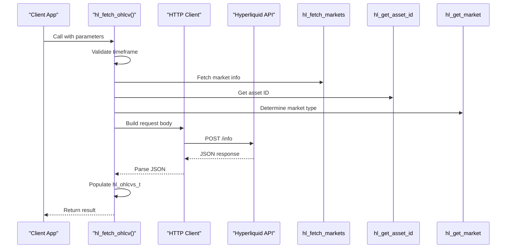

# Simple OHLCV Data Retrieval Example

<cite>
**Referenced Files in This Document**   
- [simple_ohlcv.c](file://examples/simple_ohlcv.c)
- [hl_ohlcv.h](file://include/hl_ohlcv.h)
- [ohlcv.c](file://src/ohlcv.c)
</cite>

## Table of Contents
1. [Introduction](#introduction)
2. [OHLCV Data Retrieval with hl_fetch_ohlcv](#ohlcv-data-retrieval-with-hl_fetch_ohlcv)
3. [Parameter Impact on Response](#parameter-impact-on-response)
4. [hl_ohlcv_t Array Structure and Iteration](#hl_ohlcv_t-array-structure-and-iteration)
5. [Use Cases for Technical Analysis and Backtesting](#use-cases-for-technical-analysis-and-backtesting)
6. [Best Practices](#best-practices)
7. [Conclusion](#conclusion)

## Introduction
The `simple_ohlcv.c` example demonstrates how to retrieve and analyze historical OHLCV (Open, High, Low, Close, Volume) candlestick data using the Hyperliquid C SDK. This functionality is essential for technical analysis, algorithmic trading strategies, and backtesting systems. The example shows how to fetch data, analyze price movements, calculate indicators like Simple Moving Average (SMA), and handle various API parameters effectively.

**Section sources**
- [simple_ohlcv.c](file://examples/simple_ohlcv.c#L1-L192)

## OHLCV Data Retrieval with hl_fetch_ohlcv
The `hl_fetch_ohlcv` function is the primary interface for retrieving candlestick data from the Hyperliquid API. It allows clients to request historical price data for a given trading symbol and timeframe. The function internally handles market type detection (swap vs. spot), constructs the appropriate HTTP request, parses the JSON response, and populates a structured `hl_ohlcvs_t` object.

The process begins with client creation using `hl_client_create`, which requires a wallet address, private key, and a boolean indicating whether to use the testnet. Once the client is established, `hl_fetch_ohlcv` can be called with the desired parameters to retrieve candle data.

**Diagram sources**
- [ohlcv.c](file://src/ohlcv.c#L136-L283)
- [hl_ohlcv.h](file://include/hl_ohlcv.h#L83-L85)

**Section sources**
- [simple_ohlcv.c](file://examples/simple_ohlcv.c#L1-L192)
- [ohlcv.c](file://src/ohlcv.c#L136-L283)
- [hl_ohlcv.h](file://include/hl_ohlcv.h#L83-L85)

## Parameter Impact on Response
The `hl_fetch_ohlcv` function accepts several parameters that directly influence the data returned:

- **symbol**: Specifies the trading pair (e.g., "BTC/USDC:USDC"). The function resolves this to an asset ID or coin name based on whether it's a spot or swap market.
- **timeframe**: Defines the candle duration. Supported values include "1m", "5m", "15m", "1h", "1d", etc. Invalid timeframes return `HL_ERROR_INVALID_PARAMS`.
- **since**: Optional start timestamp (in milliseconds). If not provided, the function calculates a default start time based on the limit or uses the last 24 hours.
- **limit**: Maximum number of candles to return. If not specified, up to 24 hours of data is returned. When provided, the function limits the response accordingly.
- **until**: Optional end timestamp (in milliseconds). Defaults to the current time if not provided.

When `since` is not provided but `limit` is, the function calculates the start time by subtracting the appropriate duration (based on timeframe and limit) from the end time. This ensures that exactly `limit` candles are requested, assuming sufficient data exists.

**Section sources**
- [ohlcv.c](file://src/ohlcv.c#L136-L283)
- [hl_ohlcv.h](file://include/hl_ohlcv.h#L83-L85)

## hl_ohlcv_t Array Structure and Iteration
The `hl_ohlcv_t` structure represents a single candlestick with the following fields:
- `timestamp`: Candle open time in milliseconds
- `open`: Opening price
- `high`: Highest price during the period
- `low`: Lowest price during the period
- `close`: Closing price
- `volume`: Trading volume

The `hl_ohlcvs_t` structure contains an array of `hl_ohlcv_t` candles along with metadata:
- `candles`: Pointer to the array of candle data
- `count`: Number of candles in the array
- `symbol`: Trading symbol
- `timeframe`: Timeframe string

To iterate through multiple candles, use the `hl_ohlcvs_get_candle` function to access individual candles by index, or use `hl_ohlcvs_get_latest` to get the most recent candle. The example demonstrates iterating through the first few candles to display their values and calculate price changes.

**Section sources**
- [hl_ohlcv.h](file://include/hl_ohlcv.h#L22-L23)
- [ohlcv.c](file://src/ohlcv.c#L389-L394)
- [simple_ohlcv.c](file://examples/simple_ohlcv.c#L20-L75)

## Use Cases for Technical Analysis and Backtesting
The retrieved OHLCV data enables various technical analysis operations:
- **Simple Moving Average (SMA)**: Calculated using `hl_ohlcvs_calculate_sma`, which supports using either close prices or average of high/low.
- **Range Analysis**: Functions like `hl_ohlcvs_highest_high` and `hl_ohlcvs_lowest_low` help identify price extremes over a specified period.
- **Price Change Calculation**: By comparing first and last candles, users can compute absolute and percentage price changes.

For backtesting, historical OHLCV data allows strategy simulation over past market conditions. Traders can test entry/exit rules, position sizing, and risk management techniques against real price movements. The ability to filter by time range (`since` and `until`) enables testing on specific market regimes (e.g., bull markets, high volatility periods).

**Section sources**
- [simple_ohlcv.c](file://examples/simple_ohlcv.c#L45-L75)
- [ohlcv.c](file://src/ohlcv.c#L313-L338)
- [ohlcv.c](file://src/ohlcv.c#L343-L361)
- [ohlcv.c](file://src/ohlcv.c#L366-L384)

## Best Practices
### Time Range Selection
When fetching large datasets, use time-based filtering (`since` and `until`) rather than relying solely on `limit`. This provides more predictable results and avoids gaps in data due to missing candles.

### Handling Incomplete Candles
Be aware that the most recent candle may be incomplete (still forming). For analysis requiring complete periods, consider excluding the latest candle or using real-time data feeds for confirmation.

### Managing API Rate Limits
- Use appropriate timeframes: Higher timeframes (e.g., 1h, 1d) require fewer API calls for the same historical coverage.
- Cache results when possible to avoid redundant requests.
- On testnet, note that historical OHLCV data may not be available—this is normal behavior. Use mainnet for real historical analysis.
- Always free allocated memory using `hl_ohlcvs_free` after processing to prevent memory leaks.

### Error Handling
Check the return value of `hl_fetch_ohlcv` and use `hl_error_string` to get human-readable error messages. Common errors include invalid parameters, network issues, and API errors.

**Section sources**
- [simple_ohlcv.c](file://examples/simple_ohlcv.c#L1-L192)
- [ohlcv.c](file://src/ohlcv.c#L136-L283)
- [hl_ohlcv.h](file://include/hl_ohlcv.h#L92)

## Conclusion
The `simple_ohlcv.c` example provides a comprehensive demonstration of retrieving and analyzing OHLCV data using the Hyperliquid C SDK. By understanding the parameters of `hl_fetch_ohlcv`, the structure of the returned data, and the available analysis functions, developers can build robust trading systems capable of technical analysis and backtesting. The example also highlights important considerations for working with financial time series data, including proper memory management, error handling, and awareness of testnet limitations.