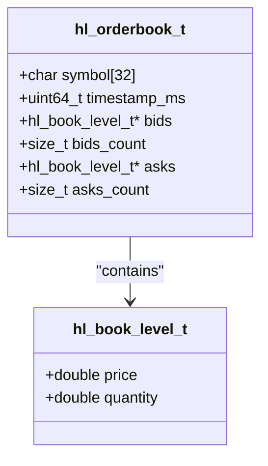
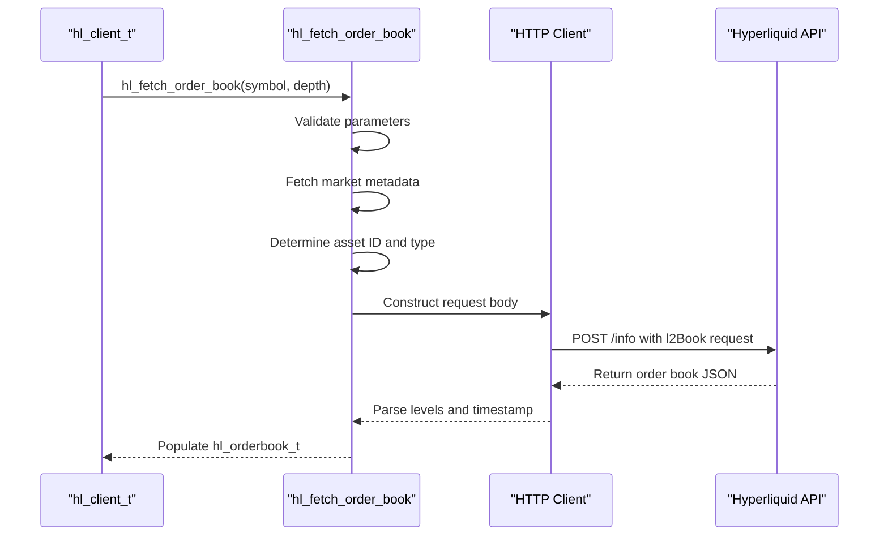

# Simple Order Book Fetching Example

<cite>
**Referenced Files in This Document**   
- [simple_orderbook.c](file://examples/simple_orderbook.c)
- [hl_orderbook.h](file://include/hl_orderbook.h)
- [hl_types.h](file://include/hl_types.h)
- [orderbook.c](file://src/orderbook.c)
</cite>

## Table of Contents
1. [Introduction](#introduction)
2. [Order Book Data Structure](#order-book-data-structure)
3. [Fetching Order Book Snapshots](#fetching-order-book-snapshots)
4. [Analyzing Market Depth and Liquidity](#analyzing-market-depth-and-liquidity)
5. [Memory Management and Resource Cleanup](#memory-management-and-resource-cleanup)
6. [Trading Strategy Implications](#trading-strategy-implications)
7. [Performance and Latency Considerations](#performance-and-latency-considerations)

## Introduction

The `simple_orderbook.c` example demonstrates how to retrieve and analyze real-time Level 2 (L2) order book data from the Hyperliquid exchange using the C SDK. This example showcases the process of initializing a client, fetching full order book snapshots for various trading symbols, analyzing bid-ask spreads, calculating volume at different depth levels, and comparing liquidity across assets. The implementation provides insights into market microstructure analysis, which is essential for developing algorithmic trading strategies that rely on order book dynamics.

**Section sources**
- [simple_orderbook.c](file://examples/simple_orderbook.c#L1-L50)

## Order Book Data Structure

The `hl_orderbook_t` structure, defined in `hl_types.h`, represents a complete order book snapshot containing both bid and ask price levels. This structure includes the trading symbol, timestamp of the snapshot, arrays of bid and ask levels, and their respective counts. Each price level is represented by a price-quantity pair, with bids sorted in descending order (highest to lowest) and asks sorted in ascending order (lowest to highest). The structure also includes utility functions for accessing key metrics such as best bid, best ask, spread, and aggregated volume at specified depths.

**Diagram sources**
- [hl_types.h](file://include/hl_types.h#L19-L20)
- [hl_orderbook.h](file://include/hl_orderbook.h#L19-L20)

**Section sources**
- [hl_types.h](file://include/hl_types.h#L19-L20)
- [hl_orderbook.h](file://include/hl_orderbook.h#L19-L20)

## Fetching Order Book Snapshots

The `hl_fetch_order_book` function retrieves a real-time order book snapshot for a specified trading symbol. This function takes a client instance, symbol string, depth parameter, and output structure pointer. The depth parameter controls the number of price levels returned, with 0 indicating all available levels. Internally, the function first fetches market metadata to determine the asset ID and market type (swap or spot), then constructs an appropriate HTTP request to the Hyperliquid API. For swap markets, the request uses the coin name, while spot markets use the asset ID. The response is parsed into the `hl_orderbook_t` structure, with bids and asks properly sorted.

**Diagram sources**
- [orderbook.c](file://src/orderbook.c#L102-L215)
- [hl_orderbook.h](file://include/hl_orderbook.h#L39-L39)

**Section sources**
- [orderbook.c](file://src/orderbook.c#L102-L215)
- [hl_orderbook.h](file://include/hl_orderbook.h#L39-L39)

## Analyzing Market Depth and Liquidity

The example demonstrates various analytical functions for extracting meaningful insights from order book data. The `hl_orderbook_get_best_bid` and `hl_orderbook_get_best_ask` functions return the highest bid and lowest ask prices, respectively, enabling calculation of the bid-ask spread through `hl_orderbook_get_spread`. Volume analysis is performed using `hl_orderbook_get_bid_volume` and `hl_orderbook_get_ask_volume`, which sum quantities across a specified number of price levels. These functions support depth-limited analysis (e.g., top 5 levels) or full-book aggregation (depth = 0). The example uses these utilities to compare spreads and liquidity across different assets, revealing that higher-volume assets typically exhibit tighter spreads and greater market depth.

**Section sources**
- [simple_orderbook.c](file://examples/simple_orderbook.c#L20-L100)
- [orderbook.c](file://src/orderbook.c#L240-L310)

## Memory Management and Resource Cleanup

Proper memory management is critical when working with dynamically allocated order book data. The `hl_fetch_order_book` function allocates memory for bid and ask level arrays, which must be freed using `hl_free_orderbook`. This cleanup function releases the memory allocated for both bid and ask arrays, resets count variables, and clears the symbol field. The example consistently calls `hl_free_orderbook` after processing each order book to prevent memory leaks. Client resources are also properly cleaned up using `hl_client_destroy` at the end of execution. This pattern ensures that all dynamically allocated resources are properly released, maintaining application stability during prolonged operation.

**Section sources**
- [orderbook.c](file://src/orderbook.c#L220-L235)
- [simple_orderbook.c](file://examples/simple_orderbook.c#L150-L195)

## Trading Strategy Implications

Order book depth plays a crucial role in trading strategy development, particularly for market-making, arbitrage, and high-frequency trading algorithms. The depth parameter in `hl_fetch_order_book` allows traders to balance between data granularity and network overhead. Shallow depth requests (e.g., 3-5 levels) provide faster response times for latency-sensitive strategies, while deeper snapshots enable more sophisticated liquidity analysis. The example's spread comparison across BTC, ETH, and SOL highlights how market depth correlates with trading volume and volatility. Strategies can use this information to select optimal trading pairs, adjust order placement, and manage execution risk based on real-time market conditions.

**Section sources**
- [simple_orderbook.c](file://examples/simple_orderbook.c#L110-L150)

## Performance and Latency Considerations

When processing order book data, latency considerations are paramount for algorithmic trading applications. The example demonstrates a synchronous request pattern, which may introduce delays in high-frequency scenarios. For latency-critical applications, developers should consider implementing asynchronous processing or switching to WebSocket-based real-time updates. The depth parameter directly impacts both response time and bandwidth usage, with deeper books requiring more processing and transmission time. Memory allocation patterns in `hl_fetch_order_book` involve dynamic allocation based on the number of levels received, which can introduce variability in execution time. Applications requiring deterministic performance should implement connection pooling, response caching, and pre-allocation strategies to minimize latency spikes.

**Section sources**
- [orderbook.c](file://src/orderbook.c#L102-L215)
- [simple_orderbook.c](file://examples/simple_orderbook.c#L50-L100)