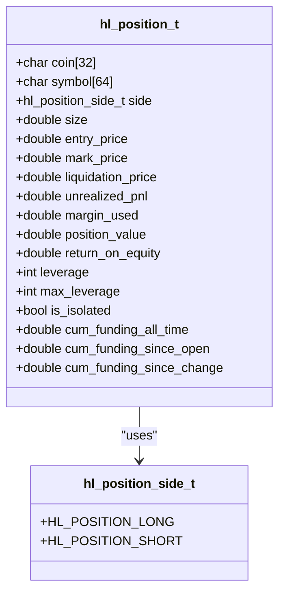
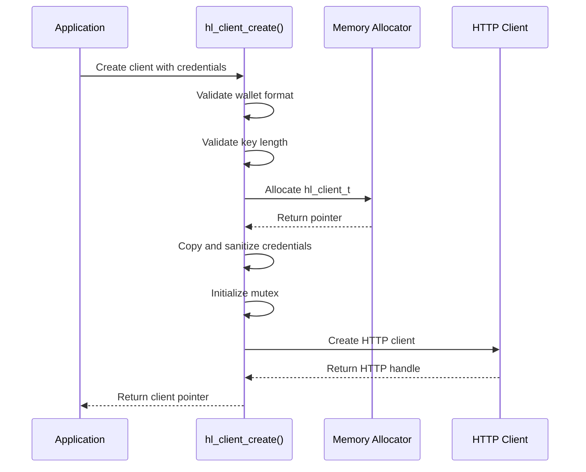
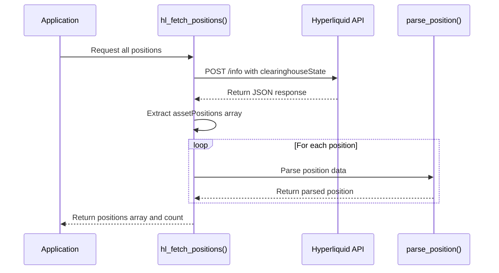

# Simple Positions Query Example

<cite>
**Referenced Files in This Document**   
- [simple_positions.c](file://examples/simple_positions.c)
- [hl_account.h](file://include/hl_account.h)
- [account.c](file://src/account.c)
- [client.c](file://src/client.c)
- [hl_error.h](file://include/hl_error.h)
</cite>

## Table of Contents
1. [Introduction](#introduction)
2. [Position Data Structure](#position-data-structure)
3. [Client Authentication and Initialization](#client-authentication-and-initialization)
4. [Fetching Position Data](#fetching-position-data)
5. [Displaying Position Metrics](#displaying-position-metrics)
6. [Portfolio Monitoring and Risk Management](#portfolio-monitoring-and-risk-management)
7. [Common Issues and Debugging Strategies](#common-issues-and-debugging-strategies)
8. [Conclusion](#conclusion)

## Introduction
The `simple_positions.c` example demonstrates how to retrieve and analyze open trading positions from a Hyperliquid account using the C SDK. This document provides a detailed breakdown of the implementation, focusing on the `hl_fetch_positions` function, the `hl_position_t` data structure, authentication workflow, and practical applications for portfolio monitoring. The example illustrates both bulk position retrieval and individual position queries, along with associated trading fee information.

## Position Data Structure
The `hl_position_t` structure defines the schema for representing open trading positions in the Hyperliquid C SDK. It contains comprehensive information about each position, enabling detailed risk assessment and performance tracking.

### Key Fields in hl_position_t
The structure includes the following critical fields:

- **coin**: Base cryptocurrency symbol (e.g., "BTC", "ETH")
- **symbol**: Full market symbol in format "COIN/USDC:USDC"
- **side**: Position direction (LONG or SHORT) via `hl_position_side_t` enum
- **size**: Absolute position size in base currency units
- **entry_price**: Average entry price in quote currency (USDC)
- **unrealized_pnl**: Current unrealized profit/loss in quote currency
- **leverage**: Current leverage multiplier (e.g., 10x, 20x)
- **is_isolated**: Boolean indicating isolated margin mode
- **liquidation_price**: Price level that would trigger liquidation
- **position_value**: Notional value of the position in USDC
- **margin_used**: Margin capital allocated to maintain the position
- **return_on_equity**: ROE percentage for the position
- **cumulative_funding**: Historical funding payment data

This comprehensive structure enables sophisticated portfolio analysis and risk management calculations directly from the retrieved position data.

**Diagram sources**
- [hl_account.h](file://include/hl_account.h#L86-L109)

**Section sources**
- [hl_account.h](file://include/hl_account.h#L86-L109)

## Client Authentication and Initialization
The example begins by creating an authenticated client instance using wallet credentials. This client serves as the primary interface for all subsequent API interactions.

### Client Creation Process
The `hl_client_create` function initializes a client with the following parameters:
- Wallet address (public identifier)
- Private key (authentication credential)
- Testnet flag (boolean indicating testnet usage)

The function validates input parameters, strips optional "0x" prefixes, and allocates memory for the client structure. It also initializes an HTTP client for API communication and sets up thread safety with a mutex.

Authentication failures occur if:
- Invalid wallet address format (must be 42+ characters starting with "0x")
- Incorrect private key length (must be 64 or 66 characters)
- Memory allocation failure during client creation

Successful client creation returns a pointer to `hl_client_t`, which is required for all position-related operations.

**Diagram sources**
- [client.c](file://src/client.c#L34-L87)

**Section sources**
- [client.c](file://src/client.c#L34-L87)
- [simple_positions.c](file://examples/simple_positions.c#L15-L25)

## Fetching Position Data
The core functionality revolves around retrieving position data through the `hl_fetch_positions` and `hl_fetch_position` functions.

### Bulk Position Retrieval
The `hl_fetch_positions` function retrieves all open positions for the authenticated account:

1. Validates input parameters (client, positions pointer, count pointer)
2. Retrieves wallet address from client context
3. Constructs API request body with "clearinghouseState" type and user address
4. Sends POST request to `/info` endpoint
5. Parses JSON response and extracts "assetPositions" array
6. Allocates memory for position array and parses each position
7. Returns position count and array pointer

The function handles various error conditions including network failures, API errors, and JSON parsing issues. An empty positions array is not considered an error, as users may legitimately have no open positions.

### Individual Position Query
The `hl_fetch_position` function retrieves a single position by symbol:

1. Extracts the base coin from the symbol (e.g., "BTC" from "BTC/USDC:USDC")
2. Calls `hl_fetch_positions` to retrieve all positions
3. Iterates through positions to find matching coin
4. Copies matching position to output parameter
5. Frees temporary positions array

This implementation leverages the bulk retrieval function rather than making a dedicated single-position API call, simplifying the codebase at the cost of potentially retrieving more data than needed.

**Diagram sources**
- [account.c](file://src/account.c#L450-L540)
- [account.c](file://src/account.c#L545-L587)

**Section sources**
- [account.c](file://src/account.c#L450-L587)
- [simple_positions.c](file://examples/simple_positions.c#L35-L55)

## Displaying Position Metrics
The example demonstrates how to extract and present key position metrics in a human-readable format.

### Key Metrics Displayed
For each position, the example outputs:
- **Symbol and Coin**: Identifies the trading pair
- **Side**: Indicates long or short position
- **Size**: Shows position magnitude in base currency
- **Entry Price**: Displays average entry cost
- **Current Value**: Shows notional position value in USDC
- **Unrealized PnL**: Highlights current profit/loss
- **Leverage**: Indicates risk multiplier
- **Margin Mode**: Shows isolated vs. cross margin
- **Liquidation Price**: Critical risk management parameter

The formatting uses appropriate precision for different data types (6 decimal places for size, 2 for prices, 6 for PnL). When no positions exist, the example gracefully handles this case with an informative message rather than treating it as an error.

### Error Handling in Display
The example includes comprehensive error handling:
- Checks return value of `hl_fetch_positions`
- Uses `hl_error_string` to convert error codes to descriptive messages
- Properly cleans up resources (positions array, client) even when errors occur
- Handles the `HL_ERROR_NOT_FOUND` case specifically when querying individual positions

This robust error handling ensures the application remains stable even when API conditions are not met.

**Section sources**
- [simple_positions.c](file://examples/simple_positions.c#L45-L100)

## Portfolio Monitoring and Risk Management
The retrieved position data serves as the foundation for portfolio monitoring and risk management applications.

### Portfolio Monitoring Applications
The position data enables several monitoring use cases:
- **Exposure Tracking**: Monitor total exposure to specific assets
- **PnL Analysis**: Track unrealized profits and losses across positions
- **Leverage Management**: Monitor leverage levels to avoid excessive risk
- **Margin Utilization**: Track margin usage relative to account value
- **Liquidation Risk**: Monitor proximity to liquidation prices

By combining multiple position metrics, traders can assess overall portfolio health and make informed decisions about position adjustments.

### Risk Management Calculations
The data structure supports various risk calculations:
- **Liquidation Distance**: Percentage difference between current price and liquidation price
- **ROE Analysis**: Evaluate return on equity for each position
- **Funding Cost Tracking**: Monitor cumulative funding payments
- **Concentration Risk**: Identify overexposure to single assets

These metrics help traders maintain disciplined risk management practices and avoid catastrophic losses.

**Section sources**
- [hl_account.h](file://include/hl_account.h#L86-L109)
- [simple_positions.c](file://examples/simple_positions.c#L60-L85)

## Common Issues and Debugging Strategies
Several common issues may arise when working with position data retrieval, along with corresponding debugging strategies.

### Delayed Position Updates
Position data may appear stale due to:
- **API Caching**: The exchange may cache position data
- **Network Latency**: Delays in request/response transmission
- **Processing Delays**: Time required for the exchange to update state

**Debugging Strategy**: Implement timestamp comparison using the response timestamp field and retry with exponential backoff if data appears stale.

### Missing Positions
Positions may not appear in results due to:
- **Symbol Filtering**: Incorrect symbol format when querying individual positions
- **Account Type**: Positions exist in different account types (perpetual vs. spot)
- **Timing Issues**: Position closed between query and display

**Debugging Strategy**: Verify the symbol format matches exactly, check both account types, and implement retry logic for critical operations.

### Authentication Failures
Client creation may fail due to:
- **Invalid Credentials**: Incorrect wallet address or private key format
- **Network Issues**: Inability to reach the exchange API
- **Rate Limiting**: Excessive request frequency

**Debugging Strategy**: Validate credential formats, test network connectivity, and implement proper error handling with descriptive messages.

### Memory Management Issues
Potential memory problems include:
- **Memory Leaks**: Failing to call `hl_free_positions`
- **Buffer Overflows**: Exceeding fixed-size buffers in structure fields
- **Double Free**: Freeing the same memory twice

**Debugging Strategy**: Always pair `hl_fetch_positions` with `hl_free_positions`, use static analysis tools, and follow the example's cleanup pattern.

**Section sources**
- [simple_positions.c](file://examples/simple_positions.c#L105-L115)
- [account.c](file://src/account.c#L450-L540)
- [hl_error.h](file://include/hl_error.h#L14-L38)

## Conclusion
The `simple_positions.c` example provides a comprehensive demonstration of retrieving and analyzing open trading positions using the Hyperliquid C SDK. By understanding the `hl_position_t` structure, authentication workflow, and data retrieval patterns, developers can build robust portfolio monitoring and risk management applications. The example's error handling and resource management practices serve as a model for production-quality code. When encountering issues such as delayed updates or missing positions, the debugging strategies outlined in this document can help identify and resolve problems efficiently.