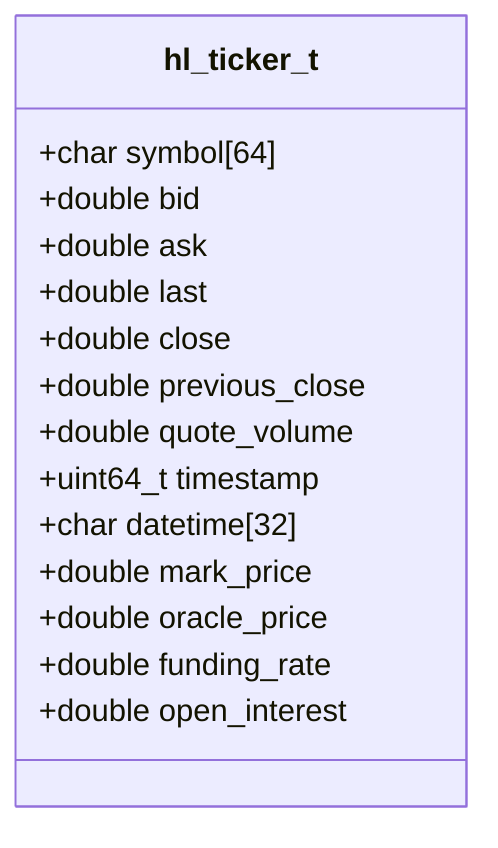
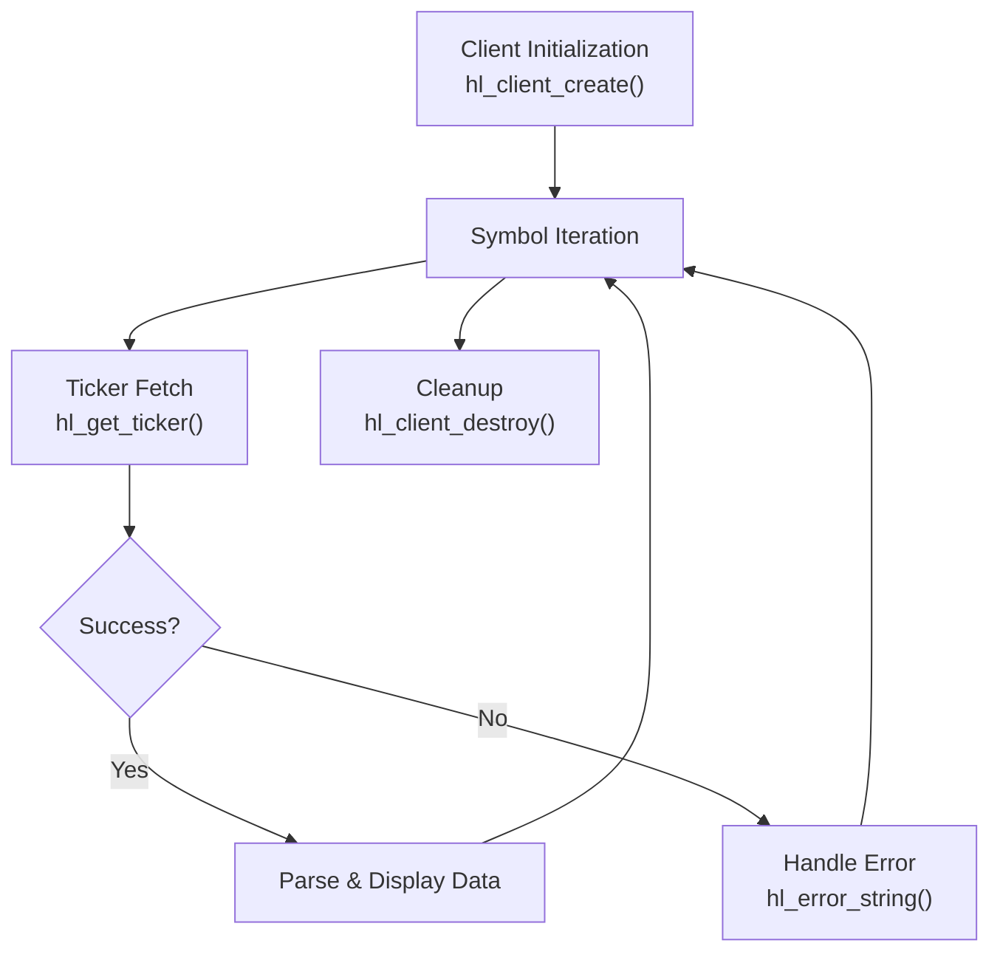
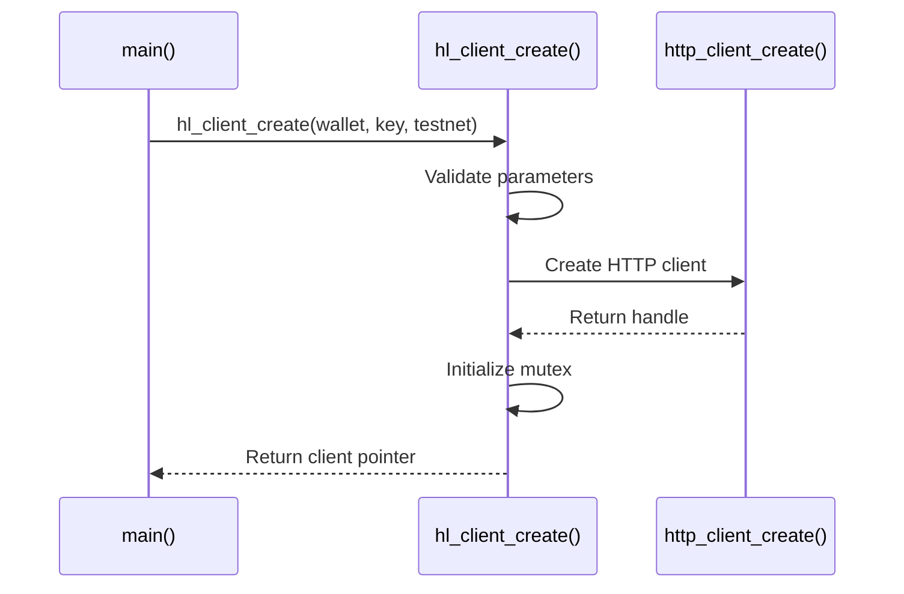
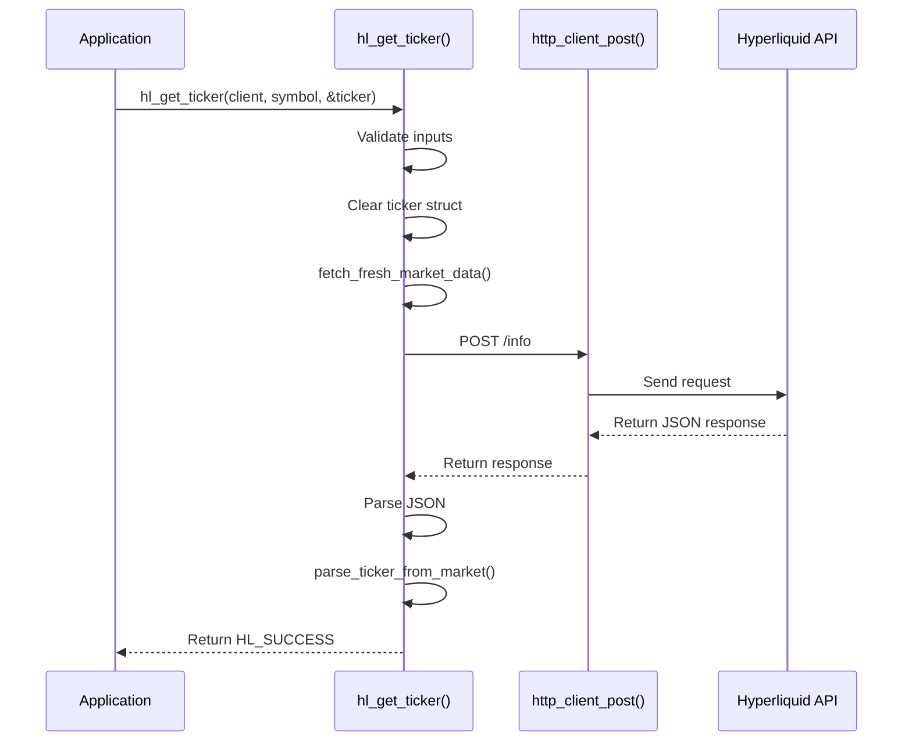
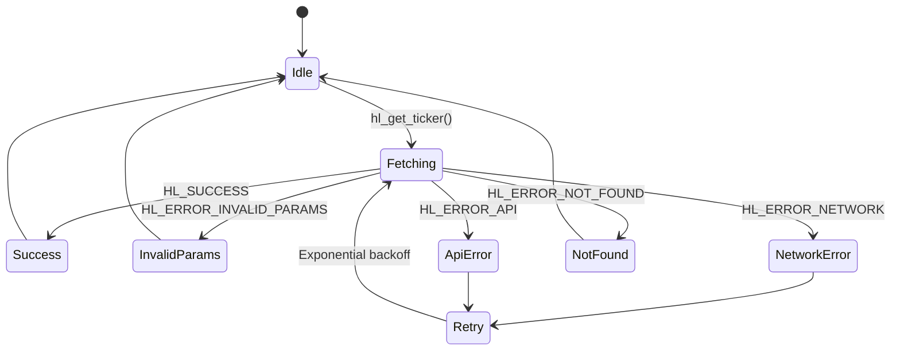

# Simple Ticker Data Retrieval Example

<cite>
**Referenced Files in This Document**   
- [examples/simple_ticker.c](file://examples/simple_ticker.c)
- [include/hl_ticker.h](file://include/hl_ticker.h)
- [src/ticker.c](file://src/ticker.c)
- [src/client.c](file://src/client.c)
- [src/markets.c](file://src/markets.c)
- [include/hl_markets.h](file://include/hl_markets.h)
- [include/hyperliquid.h](file://include/hyperliquid.h)
- [include/hl_error.h](file://include/hl_error.h)
</cite>

## Table of Contents
1. [Introduction](#introduction)
2. [Core Data Structure: hl_ticker_t](#core-data-structure-hl_ticker_t)
3. [Workflow Overview](#workflow-overview)
4. [Client Initialization](#client-initialization)
5. [Ticker Data Retrieval Process](#ticker-data-retrieval-process)
6. [Field Definitions and Market Data Interpretation](#field-definitions-and-market-data-interpretation)
7. [Price Discovery and Market Analysis Applications](#price-discovery-and-market-analysis-applications)
8. [Production Considerations](#production-considerations)
9. [Error Handling and Diagnostics](#error-handling-and-diagnostics)

## Introduction

The `simple_ticker.c` example demonstrates how to retrieve real-time ticker data for cryptocurrency trading symbols on the Hyperliquid exchange using the C SDK. This document provides a comprehensive analysis of the implementation, focusing on the `hl_fetch_ticker` function (exposed as `hl_get_ticker`), the `hl_ticker_t` data structure, and the complete workflow from client initialization to response parsing. The example showcases fetching price information, volume metrics, and swap-specific data such as funding rates and open interest for perpetual contracts.

**Section sources**
- [examples/simple_ticker.c](file://examples/simple_ticker.c#L1-L104)

## Core Data Structure: hl_ticker_t

The `hl_ticker_t` structure is the central data container for ticker information, defined in `hl_ticker.h`. It encapsulates all relevant market data points for a single trading symbol.

**Diagram sources**
- [include/hl_ticker.h](file://include/hl_ticker.h#L22-L66)

**Section sources**
- [include/hl_ticker.h](file://include/hl_ticker.h#L22-L66)

## Workflow Overview

The ticker data retrieval process follows a clear sequence of operations, starting with client creation and ending with data display and cleanup.

**Diagram sources**
- [examples/simple_ticker.c](file://examples/simple_ticker.c#L1-L104)
- [src/ticker.c](file://src/ticker.c#L188-L213)

## Client Initialization

The process begins with creating a client instance using `hl_client_create`, which requires a wallet address, private key, and a boolean flag to specify the network (testnet or mainnet). This function validates the input parameters, initializes internal state including an HTTP client and thread mutex, and returns a handle for subsequent API calls.

**Diagram sources**
- [src/client.c](file://src/client.c#L34-L87)
- [src/http/client.c](file://src/http/client.c#L45-L64)

**Section sources**
- [src/client.c](file://src/client.c#L34-L87)

## Ticker Data Retrieval Process

The `hl_get_ticker` function orchestrates the retrieval of ticker data by first fetching fresh market data from the API and then parsing the relevant information for the requested symbol. This involves an HTTP POST request to the `/info` endpoint with a `metaAndAssetCtxs` payload to retrieve both market metadata and real-time context.

**Diagram sources**
- [src/ticker.c](file://src/ticker.c#L188-L213)
- [src/ticker.c](file://src/ticker.c#L145-L186)
- [src/http/client.c](file://src/http/client.c#L135-L177)

**Section sources**
- [src/ticker.c](file://src/ticker.c#L188-L213)

## Field Definitions and Market Data Interpretation

The `hl_ticker_t` structure contains a comprehensive set of fields that provide insight into the current market state. Each field serves a specific purpose in price discovery and market analysis.

| Field | Type | Description | Source |
|-------|------|-------------|--------|
| **symbol** | char[64] | Unified market symbol (e.g., "BTC/USDC:USDC") | [include/hl_ticker.h](file://include/hl_ticker.h#L24) |
| **bid** | double | Best bid price (calculated from mark price) | [include/hl_ticker.h](file://include/hl_ticker.h#L27) |
| **ask** | double | Best ask price (calculated from mark price) | [include/hl_ticker.h](file://include/hl_ticker.h#L28) |
| **last** | double | Last traded price (set to mark price) | [include/hl_ticker.h](file://include/hl_ticker.h#L29) |
| **close** | double | Close price (set to mark price) | [include/hl_ticker.h](file://include/hl_ticker.h#L30) |
| **quote_volume** | double | 24-hour quote volume in USDC | [include/hl_ticker.h](file://include/hl_ticker.h#L33) |
| **timestamp** | uint64_t | Timestamp in milliseconds | [include/hl_ticker.h](file://include/hl_ticker.h#L35) |
| **datetime** | char[32] | ISO 8601 formatted datetime string | [include/hl_ticker.h](file://include/hl_ticker.h#L36) |
| **mark_price** | double | Current mark price for the perpetual | [include/hl_ticker.h](file://include/hl_ticker.h#L39) |
| **oracle_price** | double | Oracle price from underlying index | [include/hl_ticker.h](file://include/hl_ticker.h#L40) |
| **funding_rate** | double | Current hourly funding rate | [include/hl_ticker.h](file://include/hl_ticker.h#L41) |
| **open_interest** | double | Total open interest in base currency | [include/hl_ticker.h](file://include/hl_ticker.h#L42) |

**Section sources**
- [include/hl_ticker.h](file://include/hl_ticker.h#L22-L66)
- [src/ticker.c](file://src/ticker.c#L88-L143)

## Price Discovery and Market Analysis Applications

The ticker data provided by this example is fundamental for various trading and analytical use cases. The bid/ask spread, calculated as the difference between the ask and bid prices, serves as a key indicator of market liquidity. A narrow spread typically indicates high liquidity and lower trading costs, while a wide spread suggests the opposite.

The funding rate is particularly important for perpetual swap traders, as it represents the cost of carry and can signal market sentiment. Positive funding rates indicate long dominance, while negative rates suggest short dominance. Traders can use this information to inform their position strategies.

The open interest metric provides insight into market participation and potential volatility. Increasing open interest alongside rising prices often confirms an uptrend, while decreasing open interest during a price rise may signal a weakening trend.

**Section sources**
- [examples/simple_ticker.c](file://examples/simple_ticker.c#L70-L85)

## Production Considerations

When using ticker data in production environments, several important considerations must be addressed. Polling frequency should be carefully managed to avoid rate limiting by the exchange API. The example does not specify rate limits, but best practices suggest implementing exponential backoff and respecting any documented limits.

Stale data is another critical concern. The current implementation fetches fresh market data on each `hl_get_ticker` call, which ensures data freshness but may impact performance. In high-frequency trading scenarios, a caching layer with a defined TTL (Time To Live) might be more appropriate, balancing freshness with performance.

Network resilience should also be considered, with proper timeout settings and retry logic for transient failures. The client's default timeout is 30 seconds, which can be adjusted using `hl_set_timeout` based on network conditions and application requirements.

**Section sources**
- [src/ticker.c](file://src/ticker.c#L145-L186)
- [src/client.c](file://src/client.c#L180-L185)

## Error Handling and Diagnostics

The SDK provides a robust error handling system through the `hl_error_t` enum and the `hl_error_string` function. The `hl_get_ticker` function can return various error codes, including `HL_ERROR_INVALID_PARAMS` for null inputs, `HL_ERROR_NETWORK` for connectivity issues, `HL_ERROR_API` for HTTP errors, and `HL_ERROR_NOT_FOUND` when the requested symbol is not available.

The example demonstrates proper error handling by checking the return value of `hl_get_ticker` and using `hl_error_string` to obtain a human-readable error message for display. This pattern should be followed in production code to ensure reliable operation and meaningful diagnostics.

**Diagram sources**
- [include/hl_error.h](file://include/hl_error.h#L12-L32)
- [src/client.c](file://src/client.c#L153-L170)

**Section sources**
- [include/hl_error.h](file://include/hl_error.h#L12-L32)
- [examples/simple_ticker.c](file://examples/simple_ticker.c#L54-L58)