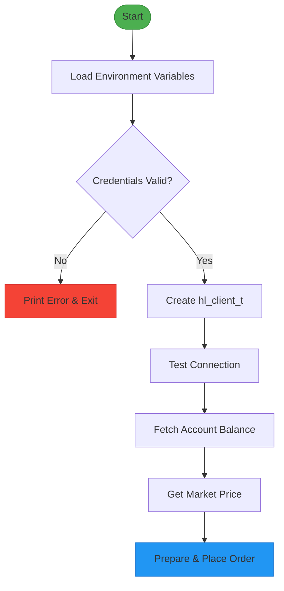
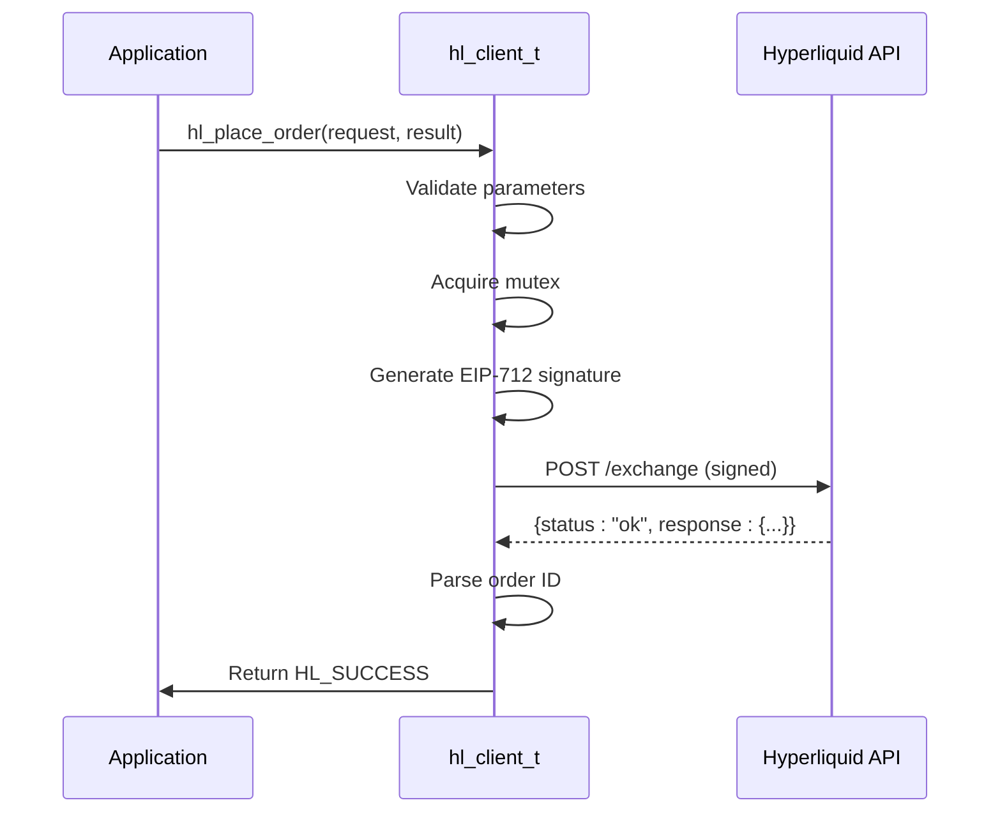
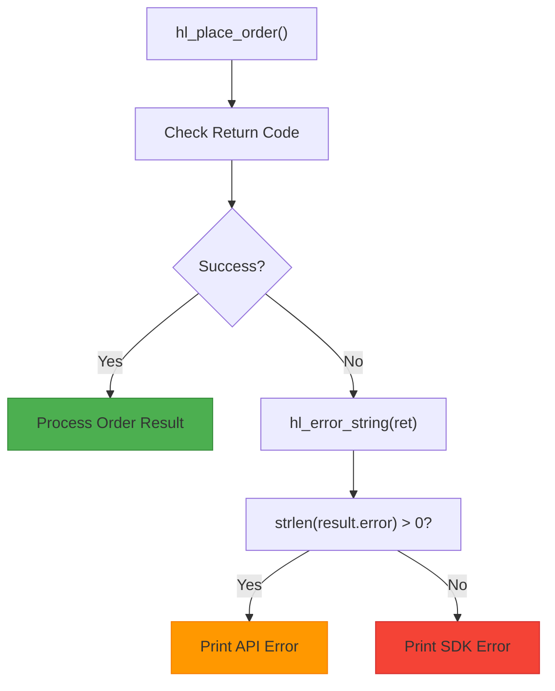

# Simple Trade Execution Example

<cite>
**Referenced Files in This Document**   
- [simple_trade.c](file://examples/simple_trade.c)
- [trading_api.c](file://src/trading_api.c)
- [hyperliquid.h](file://include/hyperliquid.h)
- [hl_client.h](file://include/hl_client.h)
- [client.c](file://src/client.c)
- [hl_account.h](file://include/hl_account.h)
</cite>

## Table of Contents
1. [Introduction](#introduction)
2. [Client Initialization and Setup](#client-initialization-and-setup)
3. [Order Placement Process](#order-placement-process)
4. [Order Result Handling](#order-result-handling)
5. [Error Handling and Rejection Cases](#error-handling-and-rejection-cases)
6. [Resource Cleanup and Best Practices](#resource-cleanup-and-best-practices)
7. [Practical Tips for Order Configuration](#practical-tips-for-order-configuration)

## Introduction
This document provides a comprehensive walkthrough of the `simple_trade.c` example from the Hyperliquid C SDK, focusing on the complete lifecycle of placing a limit order. The example demonstrates key trading operations including client initialization, market data retrieval, order submission, response interpretation, and proper resource management. The implementation uses synchronous API calls to ensure predictable execution flow and clear error reporting.

## Client Initialization and Setup

The example begins by retrieving wallet credentials and network configuration from environment variables, ensuring sensitive information remains external to the source code. The client is initialized using `hl_client_create`, which validates the wallet address format and private key length before allocating resources.

**Diagram sources**
- [simple_trade.c](file://examples/simple_trade.c#L15-L50)

**Section sources**
- [simple_trade.c](file://examples/simple_trade.c#L15-L50)
- [client.c](file://src/client.c#L34-L87)
- [hyperliquid.h](file://include/hyperliquid.h#L154-L156)

## Order Placement Process

The order placement process involves configuring an `hl_order_request_t` structure with essential parameters: symbol, side, price, quantity, order type, and time-in-force. The example places a conservative limit order at 20% below the current market price to ensure it does not execute immediately, demonstrating safe testing behavior.

The `hl_place_order` function handles the complete order lifecycle including EIP-712 signature generation, HTTP request construction, and response parsing. It uses mutex locking to ensure thread safety during the signing process and constructs the appropriate JSON payload for the Hyperliquid exchange API.

**Diagram sources**
- [simple_trade.c](file://examples/simple_trade.c#L90-L110)
- [trading_api.c](file://src/trading_api.c#L79-L220)

**Section sources**
- [simple_trade.c](file://examples/simple_trade.c#L90-L110)
- [trading_api.c](file://src/trading_api.c#L79-L220)
- [hyperliquid.h](file://include/hyperliquid.h#L210-L212)

## Order Result Handling

The `hl_order_result_t` structure captures the outcome of the order placement operation, including the order ID, status, filled quantity, average fill price, and any error messages. The example checks the return value of `hl_place_order` to determine success and then inspects the result structure to provide detailed feedback.

When successful, the order status will be either `HL_ORDER_STATUS_OPEN` (indicating the order is resting on the book) or `HL_ORDER_STATUS_FILLED` (if it matched immediately). The example demonstrates canceling open orders to clean up the order book after testing.

**Section sources**
- [simple_trade.c](file://examples/simple_trade.c#L112-L130)
- [hyperliquid.h](file://include/hyperliquid.h#L120-L126)

## Error Handling and Rejection Cases

The example implements robust error handling by checking the return value of `hl_place_order` and inspecting the `result.error` field when available. Common rejection cases include insufficient balance, invalid parameters, network issues, and API-level rejections.

The error handling flow follows a clear pattern:
1. Check function return code
2. Use `hl_error_string()` for SDK-level errors
3. Check `result.error` for exchange-provided error messages
4. Provide actionable feedback to the user

This layered approach ensures both technical and business logic errors are properly communicated.

**Diagram sources**
- [simple_trade.c](file://examples/simple_trade.c#L130-L136)

**Section sources**
- [simple_trade.c](file://examples/simple_trade.c#L130-L136)

## Resource Cleanup and Best Practices

Proper resource management is demonstrated through the use of `hl_client_destroy`, which safely cleans up all allocated resources including HTTP client state, mutexes, and sensitive data. The function explicitly zeros out the private key before freeing memory to prevent information leakage.

The example follows best practices by:
- Validating environment variables before use
- Testing connectivity before placing orders
- Fetching current market data to inform order pricing
- Cleaning up open orders after testing
- Destroying the client to release all resources

**Section sources**
- [simple_trade.c](file://examples/simple_trade.c#L150-L155)
- [client.c](file://src/client.c#L89-L107)

## Practical Tips for Order Configuration

When configuring orders in production environments, consider the following tips:

- **Validate Parameters**: Always check that price, quantity, and symbol are valid before submission
- **Use Appropriate Slippage**: For market orders, set `slippage_bps` to acceptable levels (e.g., 50-100 bps)
- **Handle Partial Fills**: Design systems to handle cases where only part of an order fills
- **Rate Limiting**: Be aware of API rate limits and implement appropriate delays
- **Test on Testnet**: Always test trading logic on the testnet before deploying to mainnet

The example's approach of placing conservative limit orders is recommended for testing and development environments to avoid unintended executions.

**Section sources**
- [simple_trade.c](file://examples/simple_trade.c#L90-L110)
- [trading_api.c](file://src/trading_api.c#L79-L220)