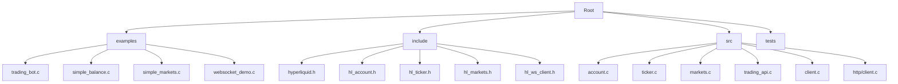
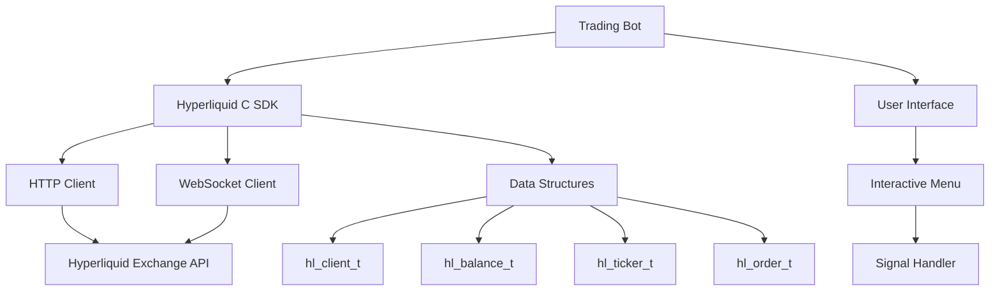
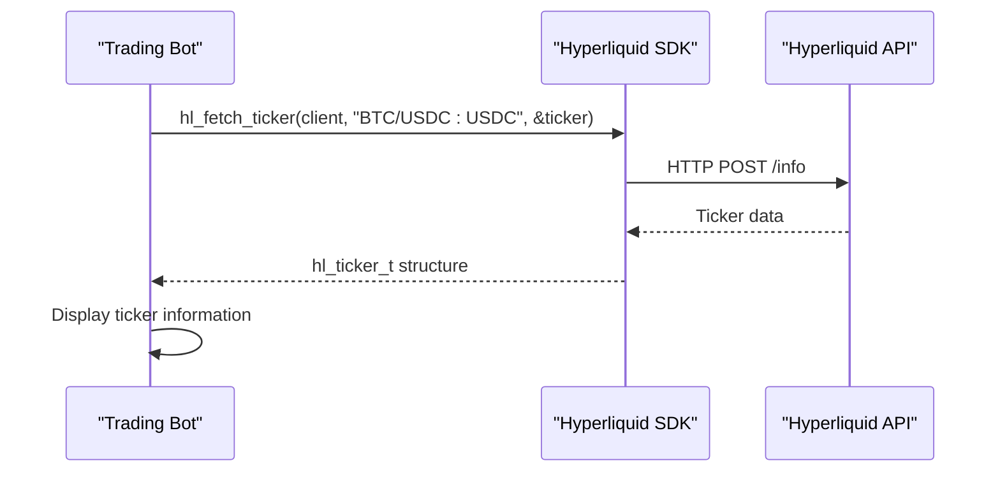
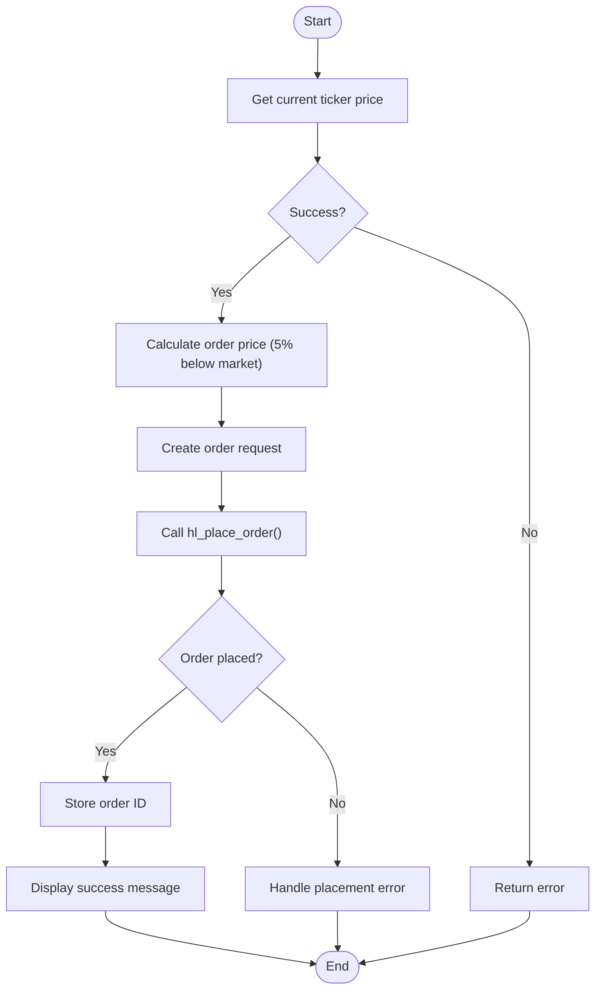
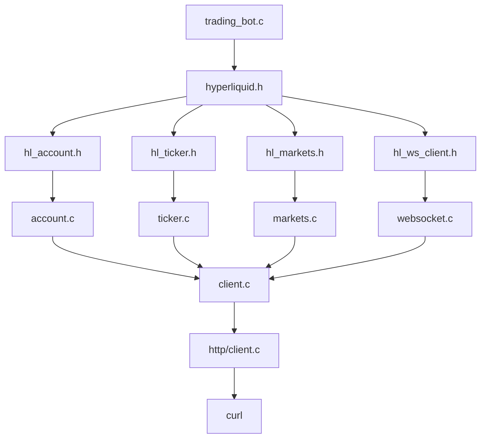

# Trading Bot Implementation Example

<cite>
**Referenced Files in This Document**   
- [trading_bot.c](file://examples/trading_bot.c)
- [hyperliquid.h](file://include/hyperliquid.h)
- [hl_account.h](file://include/hl_account.h)
- [hl_ticker.h](file://include/hl_ticker.h)
- [hl_markets.h](file://include/hl_markets.h)
- [account.c](file://src/account.c)
- [ticker.c](file://src/ticker.c)
- [markets.c](file://src/markets.c)
- [trading_api.c](file://src/trading_api.c)
- [client.c](file://src/client.c)
- [client.c](file://src/http/client.c)
</cite>

## Table of Contents
1. [Introduction](#introduction)
2. [Project Structure](#project-structure)
3. [Core Components](#core-components)
4. [Architecture Overview](#architecture-overview)
5. [Detailed Component Analysis](#detailed-component-analysis)
6. [Dependency Analysis](#dependency-analysis)
7. [Performance Considerations](#performance-considerations)
8. [Troubleshooting Guide](#troubleshooting-guide)
9. [Conclusion](#conclusion)

## Introduction
The `trading_bot.c` example demonstrates a complete implementation of a trading bot using the Hyperliquid C SDK. This bot showcases essential trading operations such as market data polling, order placement, balance monitoring, and WebSocket integration for real-time updates. The implementation follows a modular design pattern, leveraging the SDK's API to interact with the Hyperliquid exchange for executing trading strategies. The bot includes comprehensive error handling, resource management, and a user-friendly interactive menu system.

## Project Structure
The Hyperliquid C SDK follows a well-organized directory structure that separates concerns and promotes modularity. The project is divided into examples, include files, source implementations, and test files.

**Diagram sources**
- [trading_bot.c](file://examples/trading_bot.c)
- [hyperliquid.h](file://include/hyperliquid.h)
- [client.c](file://src/client.c)

**Section sources**
- [trading_bot.c](file://examples/trading_bot.c)
- [hyperliquid.h](file://include/hyperliquid.h)

## Core Components
The trading bot implementation consists of several core components that work together to provide a complete trading solution. These include client initialization, market data fetching, order management, balance monitoring, and WebSocket integration. The bot uses a global client instance (`g_client`) and implements signal handling for graceful shutdown. It provides functions for displaying account balance, market information, ticker data, and open orders. The bot also includes functionality for placing test orders, canceling orders, and setting up WebSocket subscriptions for real-time data streaming.

**Section sources**
- [trading_bot.c](file://examples/trading_bot.c#L1-L381)
- [hyperliquid.h](file://include/hyperliquid.h#L1-L617)

## Architecture Overview
The trading bot follows a client-server architecture where the bot acts as a client that communicates with the Hyperliquid exchange server through HTTP and WebSocket protocols. The architecture is layered, with the trading bot at the top level, the Hyperliquid C SDK in the middle layer, and the exchange API at the bottom.

**Diagram sources**
- [trading_bot.c](file://examples/trading_bot.c#L1-L381)
- [hyperliquid.h](file://include/hyperliquid.h#L1-L617)
- [client.c](file://src/client.c#L1-L197)

## Detailed Component Analysis

### Main Bot Loop
The main bot loop is implemented in the `bot_loop` function, which runs continuously while the `running` flag is set. The loop executes a series of operations on each cycle, including displaying the current balance (every 10 cycles), showing open orders, and displaying the current BTC price. The loop includes a 10-second delay between cycles to prevent excessive API calls. This polling mechanism allows the bot to monitor market conditions and account status at regular intervals.

**Section sources**
- [trading_bot.c](file://examples/trading_bot.c#L258-L285)

### Market Data Polling
The bot implements market data polling through several functions that interact with the Hyperliquid API. The `display_ticker` function fetches the current ticker information for a specified symbol using the `hl_fetch_ticker` function. This function retrieves key market data such as the last price, bid, ask, and volume. The bot also includes the `display_markets` function, which fetches and displays information about available markets. These polling operations are performed synchronously through HTTP requests to the exchange API.

**Diagram sources**
- [trading_bot.c](file://examples/trading_bot.c#L138-L165)
- [ticker.c](file://src/ticker.c#L1-L214)
- [hyperliquid.h](file://include/hyperliquid.h#L358-L365)

### Decision Logic and Order Placement
The bot's decision logic is demonstrated in the `place_test_order` function, which implements a simple trading strategy. The function first fetches the current ticker price for BTC/USDC:USDC, then places a limit buy order at 5% below the current market price. This represents a basic contrarian strategy where the bot attempts to buy at a discount to the current market price. The order placement process involves creating an `hl_order_request_t` structure with the necessary parameters and calling `hl_place_order` to submit the order to the exchange.

**Diagram sources**
- [trading_bot.c](file://examples/trading_bot.c#L167-L220)
- [trading_api.c](file://src/trading_api.c#L79-L220)
- [hyperliquid.h](file://include/hyperliquid.h#L210-L212)

### Risk Management
The bot implements several risk management features, including position sizing and order validation. In the `place_test_order` function, the bot uses a small fixed amount of 0.001 BTC for testing, which limits potential losses. The order validation occurs at multiple levels: the SDK validates input parameters before making API calls, and the exchange performs additional validation on the server side. The bot also stores the active order ID in a global variable (`g_active_order_id`), which allows for proper order tracking and cancellation.

**Section sources**
- [trading_bot.c](file://examples/trading_bot.c#L167-L220)
- [trading_api.c](file://src/trading_api.c#L79-L220)

### Error Recovery Mechanisms
The bot includes comprehensive error recovery mechanisms to handle various failure scenarios. Signal handling is implemented through the `signal_handler` function, which allows for graceful shutdown when the user presses Ctrl+C. The bot checks return values from all SDK functions and displays appropriate error messages when operations fail. For example, when fetching the balance, ticker, or markets, the bot checks the return code and displays an error message if the operation fails. The bot also properly cleans up resources, including freeing the active order ID and destroying the client instance.

**Section sources**
- [trading_bot.c](file://examples/trading_bot.c#L29-L40)
- [trading_bot.c](file://examples/trading_bot.c#L222-L244)

### Resource Management
The bot demonstrates proper resource management practices throughout its implementation. The client instance is created at the beginning of the `main` function and destroyed at the end, ensuring that all associated resources are properly released. Memory allocated for the active order ID is freed in the cleanup section of the `main` function. The bot also uses a mutex internally within the client structure to ensure thread safety when making API calls. The HTTP client implementation uses curl for HTTP operations and properly manages memory for response data.

**Section sources**
- [trading_bot.c](file://examples/trading_bot.c#L358-L375)
- [client.c](file://src/client.c#L1-L197)
- [client.c](file://src/http/client.c#L1-L229)

## Dependency Analysis
The trading bot has dependencies on several components of the Hyperliquid C SDK, which in turn depend on external libraries. The dependency graph shows the relationships between these components.

**Diagram sources**
- [trading_bot.c](file://examples/trading_bot.c)
- [hyperliquid.h](file://include/hyperliquid.h)
- [client.c](file://src/client.c)
- [client.c](file://src/http/client.c)

## Performance Considerations
The trading bot implementation considers performance in several ways. The polling interval in the main loop is set to 10 seconds, which balances the need for timely market data with the constraints of API rate limits. The bot uses efficient data structures and minimizes memory allocations where possible. The HTTP client implementation uses curl with appropriate timeout settings to prevent hanging requests. However, the current implementation could be improved by using WebSocket for real-time market data instead of periodic polling, which would reduce latency and API usage.

## Troubleshooting Guide
When troubleshooting issues with the trading bot, consider the following common problems and solutions:

1. **Connection failures**: Ensure that the wallet address and private key are correctly formatted and that the network connection is stable.
2. **Authentication errors**: Verify that the private key is correct and that the testnet flag matches the intended environment.
3. **Order placement failures**: Check that the symbol is valid, sufficient balance is available, and order parameters are within acceptable ranges.
4. **Memory leaks**: Ensure that all allocated memory is properly freed, particularly the active order ID and any data structures returned by SDK functions.
5. **WebSocket connection issues**: Verify that the WebSocket URL is correct and that the firewall allows WebSocket connections.

**Section sources**
- [trading_bot.c](file://examples/trading_bot.c)
- [client.c](file://src/client.c)
- [trading_api.c](file://src/trading_api.c)

## Conclusion
The `trading_bot.c` example provides a comprehensive demonstration of how to implement a trading bot using the Hyperliquid C SDK. It showcases essential trading operations, proper error handling, and resource management. The bot could be enhanced with additional features such as stop-loss logic, comprehensive logging, and WebSocket integration for lower latency market data. These enhancements would make the bot more robust and suitable for real-world trading scenarios.