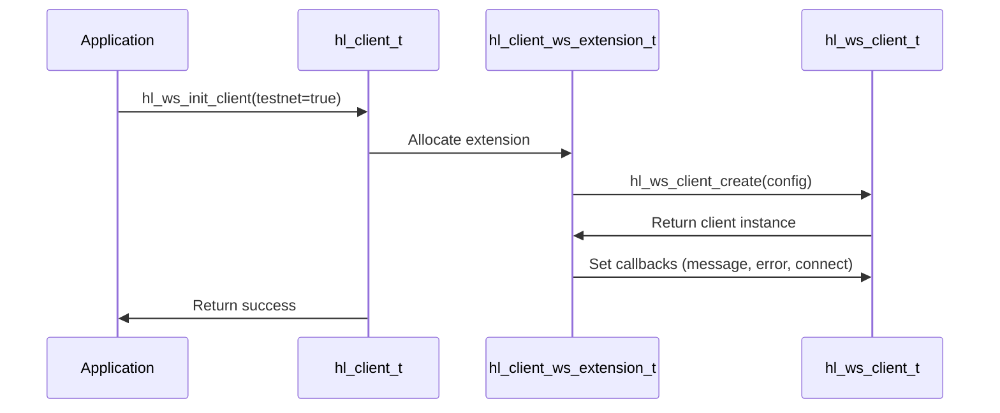
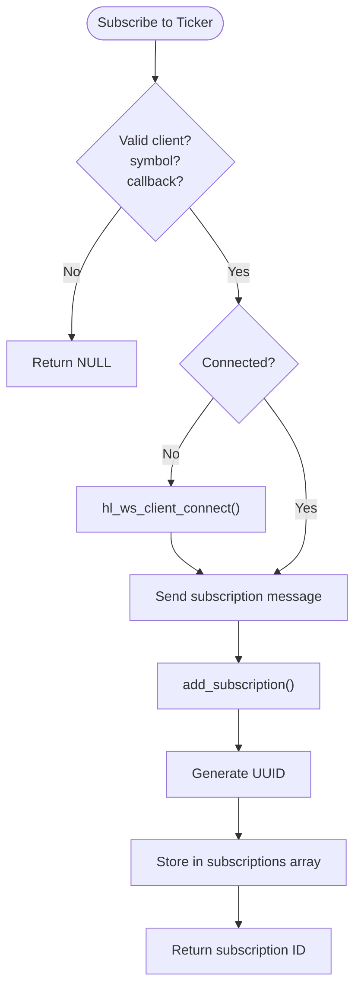
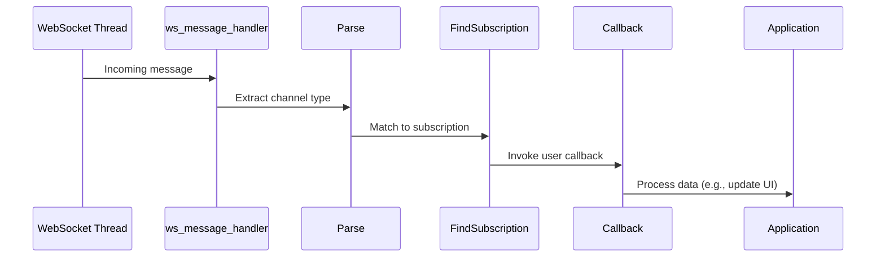

# WebSocket Real-Time Data Demo

<cite>
**Referenced Files in This Document**   
- [websocket_demo.c](file://examples/websocket_demo.c)
- [hl_ws_client.h](file://include/hl_ws_client.h)
- [websocket.c](file://src/websocket.c)
- [hl_ticker.h](file://include/hl_ticker.h)
- [hl_orderbook.h](file://include/hl_orderbook.h)
</cite>

## Table of Contents
1. [Introduction](#introduction)
2. [WebSocket Connection Initialization](#websocket-connection-initialization)
3. [Subscription Mechanism for Real-Time Data](#subscription-mechanism-for-real-time-data)
4. [Event Loop and Callback Handling](#event-loop-and-callback-handling)
5. [Parsing hl_ws_message_t Payloads](#parsing-hl_ws_message_t-payloads)
6. [Advantages of WebSocket Over Polling](#advantages-of-websocket-over-polling)
7. [Connection Resilience and Reconnection Strategies](#connection-resilience-and-reconnection-strategies)
8. [Handling Message Backpressure](#handling-message-backpressure)
9. [Conclusion](#conclusion)

## Introduction
The `websocket_demo.c` example demonstrates how to use the Hyperliquid C SDK to establish real-time data streams via WebSocket for financial market data. This includes ticker updates, order book changes, user order status, and trade executions. The demo showcases both high-level subscription functions and low-level WebSocket client control, providing insight into the event-driven architecture that enables low-latency communication with the exchange.

**Section sources**
- [websocket_demo.c](file://examples/websocket_demo.c#L1-L50)

## WebSocket Connection Initialization
The WebSocket connection is initialized using `hl_ws_init_client`, which configures a WebSocket client with default settings for either testnet or production environments. This function creates an internal `hl_client_ws_extension_t` structure that holds the WebSocket client instance and manages subscriptions. The initialization process includes setting up message, error, and connect callbacks that are triggered during the lifecycle of the connection.

Connection establishment is handled by `hl_ws_client_connect`, which performs the WebSocket handshake and starts a background thread for message processing. If not already connected, subscription functions like `hl_watch_ticker` automatically invoke the connection process.

**Diagram sources**
- [websocket.c](file://src/websocket.c#L104-L130)
- [hl_ws_client.h](file://include/hl_ws_client.h#L66-L66)

**Section sources**
- [websocket.c](file://src/websocket.c#L104-L151)
- [hl_ws_client.h](file://include/hl_ws_client.h#L66-L66)

## Subscription Mechanism for Real-Time Data
The SDK provides a set of `hl_watch_*` functions to subscribe to different data streams. Each subscription sends a JSON-formatted message to the server specifying the desired channel (e.g., "ticker", "l2Book") and parameters such as symbol or user address.

For public market data:
- `hl_watch_ticker` subscribes to price updates for a given symbol
- `hl_watch_order_book` subscribes to Level 2 order book changes
- `hl_watch_trades` monitors recent trades

For private user data:
- `hl_watch_orders` tracks order status changes using the wallet address
- `hl_watch_my_trades` receives notifications of executed trades

Each successful subscription returns a unique ID generated via UUID, which can later be used to unsubscribe using `hl_unwatch`.

**Diagram sources**
- [websocket.c](file://src/websocket.c#L156-L181)
- [websocket.c](file://src/websocket.c#L197-L222)

**Section sources**
- [websocket.c](file://src/websocket.c#L156-L375)
- [websocket_demo.c](file://examples/websocket_demo.c#L75-L125)

## Event Loop and Callback Handling
The event loop is managed internally by the WebSocket client through a dedicated background thread. When messages arrive, the `ws_message_handler` processes them and dispatches to user-defined callbacks based on the subscription channel. The callback signature `void (*hl_ws_data_callback_t)(void* data, void* user_data)` allows custom handling of incoming payloads.

In the demo, placeholder callbacks such as `on_ticker_update` and `on_orderbook_update` simply print notifications. In production, these would parse the `data` parameter into structured types like `hl_ticker_t` or `hl_orderbook_t`.

The client maintains an array of active subscriptions, enabling routing of incoming messages to the appropriate callback. This decouples the network layer from business logic, supporting modular and scalable application design.

**Diagram sources**
- [websocket.c](file://src/websocket.c#L72-L81)
- [websocket.c](file://src/websocket.c#L32-L67)

**Section sources**
- [websocket.c](file://src/websocket.c#L72-L81)
- [websocket_demo.c](file://examples/websocket_demo.c#L15-L55)

## Parsing hl_ws_message_t Payloads
While the current demo uses `void* data` in callbacks, real implementations must parse incoming JSON messages into structured data. The expected payload formats depend on the subscription type:

- **Ticker updates**: Contains best bid/ask, last price, mark price, funding rate
- **Order book**: Includes arrays of bids and asks with price and size
- **User orders**: Reports order ID, status, filled amount, average price
- **Trades**: Provides trade ID, price, amount, fee, and timestamp

Parsing should leverage the SDK’s data structures defined in headers like `hl_ticker.h` and `hl_orderbook.h`. For example, ticker data maps directly to `hl_ticker_t`, which includes fields such as `bid`, `ask`, `mark_price`, and `funding_rate`.

Applications should validate message integrity and handle schema variations gracefully to ensure robustness.

**Section sources**
- [hl_ticker.h](file://include/hl_ticker.h#L25-L55)
- [hl_orderbook.h](file://include/hl_orderbook.h#L15-L25)

## Advantages of WebSocket Over Polling
WebSocket offers significant advantages for latency-sensitive trading applications:

- **Lower Latency**: Real-time push updates eliminate polling delays
- **Reduced Bandwidth**: Only changed data is transmitted, not full snapshots
- **Higher Frequency**: Enables access to microsecond-level market events
- **Scalability**: Single connection supports multiple data streams
- **Efficiency**: No overhead from repeated HTTP handshakes

Compared to REST polling, WebSocket reduces round-trip time and server load while improving data freshness—critical for algorithmic trading, arbitrage, and market-making strategies.

## Connection Resilience and Reconnection Strategies
The SDK supports resilient connectivity through configurable reconnection logic. The `hl_ws_config_t` structure includes parameters such as `reconnect_delay_ms`, `auto_reconnect`, and `max_reconnect_attempts`. These settings allow applications to recover gracefully from network interruptions.

When a disconnection occurs, the client can automatically attempt to reconnect and re-establish all active subscriptions. Developers should implement idempotent subscription logic and track connection state to avoid duplicate registrations.

Additionally, applications should monitor the `on_error` and `on_connect` callbacks to respond to transient failures and resume operations after recovery.

**Section sources**
- [hl_ws_client.h](file://include/hl_ws_client.h#L15-L20)

## Handling Message Backpressure
High-frequency data streams can overwhelm consumers, leading to message backlog. To handle backpressure:

- Use non-blocking message processing
- Offload parsing to worker threads
- Implement message queues with bounded buffers
- Monitor callback execution time
- Consider selective subscription (e.g., reduced order book depth)

The SDK does not currently implement flow control, so applications must ensure timely processing to avoid dropped messages or memory exhaustion.

## Conclusion
The `websocket_demo.c` example provides a comprehensive foundation for building real-time trading applications using the Hyperliquid C SDK. By leveraging the WebSocket framework, developers can access live market and user data with minimal latency. Proper use of subscription management, callback handling, and connection resilience patterns ensures reliable and performant operation in production environments.

**Section sources**
- [websocket_demo.c](file://examples/websocket_demo.c#L1-L202)