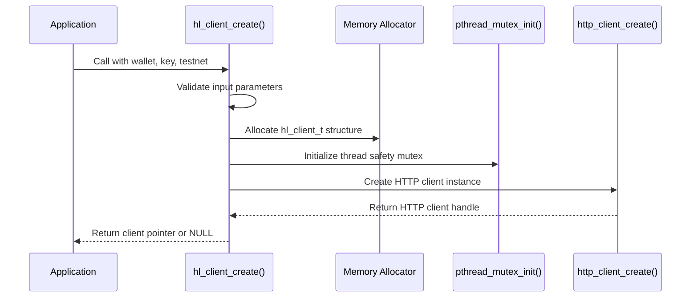
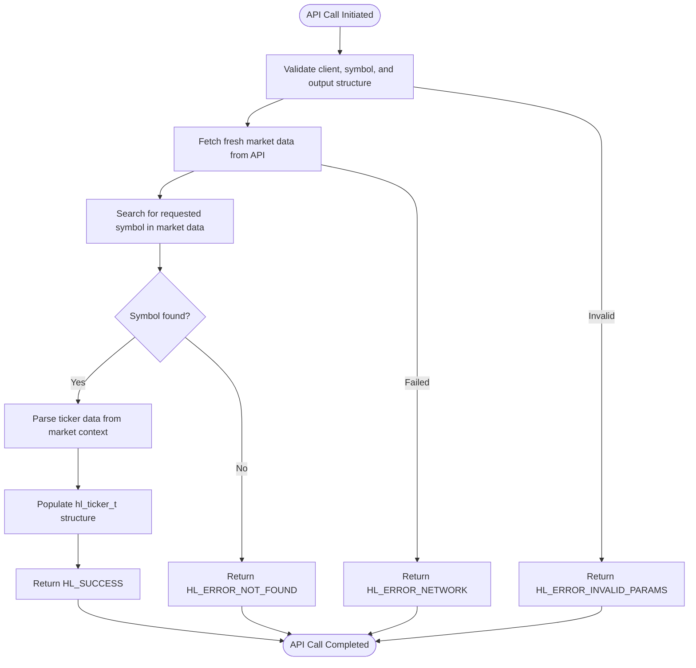
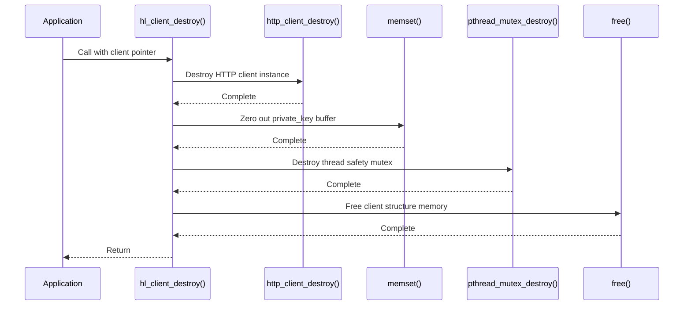

# Getting Started

<cite>
**Referenced Files in This Document**   
- [simple_ticker.c](file://examples/simple_ticker.c)
- [hyperliquid.h](file://include/hyperliquid.h)
- [hl_client.h](file://include/hl_client.h)
- [client.c](file://src/client.c)
- [ticker.c](file://src/ticker.c)
</cite>

## Table of Contents
1. [Introduction](#introduction)
2. [Prerequisites and Environment Setup](#prerequisites-and-environment-setup)
3. [Dependency Installation](#dependency-installation)
4. [Client Initialization](#client-initialization)
5. [Making API Calls](#making-api-calls)
6. [Resource Cleanup](#resource-cleanup)
7. [Complete Working Example](#complete-working-example)
8. [Common Pitfalls and Troubleshooting](#common-pitfalls-and-troubleshooting)
9. [Security Best Practices](#security-best-practices)

## Introduction
This guide provides a comprehensive walkthrough for developers new to both C programming and cryptocurrency trading APIs who want to start using the hyperliquid-c library. The documentation covers the complete lifecycle of using the SDK, from initial environment setup through making API calls and proper resource management. The hyperliquid-c library offers a robust C interface to the Hyperliquid decentralized exchange, enabling developers to build high-performance trading applications with full access to market data and trading functionality.

## Prerequisites and Environment Setup
Before using the hyperliquid-c library, ensure your development environment meets the following requirements. The library requires a C11-compliant compiler such as GCC or Clang, which are standard on most modern development systems. For Windows users, MSYS2 or MinGW-w64 provides the necessary toolchain. Network connectivity is essential as the library communicates with Hyperliquid's API endpoints over HTTPS. When working with private keys, ensure your development environment is secure and not exposed to untrusted networks. The library supports both testnet and mainnet environments, with testnet recommended for initial development and testing. Your system must also have sufficient memory and processing power to handle cryptographic operations, particularly ECDSA signing using the secp256k1 curve, which is used for authenticating trading operations.

**Section sources**
- [hyperliquid.h](file://include/hyperliquid.h#L124-L124)
- [README.md](file://README.md#L10-L20)

## Dependency Installation
The hyperliquid-c library depends on several external libraries that must be installed before compilation. These dependencies provide essential functionality for HTTP communication, JSON parsing, cryptographic operations, and system utilities. On Linux systems, use your distribution's package manager to install the required development packages. For Ubuntu/Debian-based systems, install libcurl4-openssl-dev for HTTP operations, libcjson-dev for JSON handling, libsecp256k1-dev for ECDSA cryptography, and uuid-dev for UUID generation. macOS users can leverage Homebrew to install these dependencies with the command "brew install curl cjson libsecp256k1 ossp-uuid". Windows developers using MSYS2 can install the dependencies via pacman with "pacman -S mingw-w64-x86_64-curl mingw-w64-x86_64-cjson mingw-w64-x86_64-libsecp256k1". After installing the dependencies, verify their presence by checking that the header files are available in your system's include path and that the shared libraries can be linked during compilation.

**Section sources**
- [README.md](file://README.md#L100-L120)
- [QUICKSTART.md](file://QUICKSTART.md#L10-L30)

## Client Initialization
Initializing the hyperliquid-c client requires calling the hl_client_create() function with appropriate parameters. This function takes three arguments: the wallet address, private key, and a boolean indicating whether to use the testnet. The wallet address must be a valid Ethereum address in hexadecimal format with a "0x" prefix, while the private key should be a 64-character hexadecimal string without the "0x" prefix. The function performs validation on these inputs, returning NULL if they fail format checks. Upon successful creation, the client allocates memory for internal structures, initializes a mutex for thread safety, creates an HTTP client instance, and securely stores the authentication credentials. The client maintains a connection to the Hyperliquid API endpoints and handles EIP-712 signing for authenticated requests. It's crucial to check the return value of hl_client_create() as it indicates whether the client was successfully initialized or if there were issues with the provided credentials or system resources.

**Diagram sources**
- [client.c](file://src/client.c#L34-L87)
- [hyperliquid.h](file://include/hyperliquid.h#L220-L222)

**Section sources**
- [client.c](file://src/client.c#L34-L87)
- [hyperliquid.h](file://include/hyperliquid.h#L220-L222)

## Making API Calls
Once the client is initialized, you can make API calls to retrieve market data or perform trading operations. The hl_get_ticker() function demonstrates a typical API call pattern, taking a client pointer, symbol string, and a pointer to a hl_ticker_t structure where the response data will be stored. The function validates its parameters, fetches fresh market data from the API, searches for the requested symbol, and populates the ticker structure with relevant information such as bid/ask prices, volume, and timestamps. Error handling is critical when making API calls, as network issues, invalid symbols, or rate limiting can cause operations to fail. Always check the return value of API functions against HL_SUCCESS to determine if the operation completed successfully. The hl_error_string() function can convert error codes into human-readable messages for debugging purposes. For trading operations that modify account state, ensure you have sufficient balance and that your private key has the necessary permissions.

**Diagram sources**
- [ticker.c](file://src/ticker.c#L188-L213)
- [hl_ticker.h](file://include/hl_ticker.h#L65-L70)

**Section sources**
- [ticker.c](file://src/ticker.c#L188-L213)
- [hyperliquid.h](file://include/hyperliquid.h#L368-L370)

## Resource Cleanup
Proper resource cleanup is essential to prevent memory leaks and ensure secure handling of sensitive information. When you're finished using the hyperliquid-c client, call hl_client_destroy() with the client pointer as its argument. This function performs several critical cleanup operations in sequence: it destroys the HTTP client instance, securely erases the private key from memory by zeroing the buffer, destroys the thread safety mutex, and finally frees the client structure itself. The order of operations is important - the private key is zeroed before the memory is freed to prevent potential exposure through memory dumps or other forensic methods. After calling hl_client_destroy(), the client pointer becomes invalid and should not be used for any further operations. This cleanup process ensures that no sensitive authentication data remains in memory after the client is destroyed, which is particularly important in production environments where multiple clients might be created and destroyed during application lifetime.

**Diagram sources**
- [client.c](file://src/client.c#L89-L107)
- [hyperliquid.h](file://include/hyperliquid.h#L229-L229)

**Section sources**
- [client.c](file://src/client.c#L89-L107)
- [hyperliquid.h](file://include/hyperliquid.h#L229-L229)

## Complete Working Example
The following example demonstrates the complete workflow of using the hyperliquid-c library, based on the simple_ticker.c example from the examples directory. This program initializes a client with testnet credentials, fetches ticker data for multiple cryptocurrency symbols, displays the market information, and properly cleans up resources. The example shows proper error checking after each operation, including client creation and API calls. It uses the hl_get_ticker() function to retrieve real-time price information, bid/ask spreads, trading volumes, and swap-specific data like funding rates and open interest. The program formats and displays this information in a human-readable format, making it easy to understand the current market conditions. After processing all symbols, the example demonstrates proper resource cleanup by calling hl_client_destroy() to free all allocated memory and securely erase sensitive data.

**Section sources**
- [simple_ticker.c](file://examples/simple_ticker.c#L1-L105)

## Common Pitfalls and Troubleshooting
Several common issues can occur when setting up and using the hyperliquid-c library. Missing dependencies are a frequent cause of compilation failures - ensure all required libraries are installed and their development headers are accessible. Incorrect private key formats often cause client creation to fail; remember that the private key should be exactly 64 hexadecimal characters without the "0x" prefix. Network connectivity issues can prevent API calls from succeeding, so verify that your system can reach Hyperliquid's API endpoints. When encountering "Connection failed" errors, check firewall settings and ensure that HTTPS traffic is allowed. For "Order rejected" errors, verify that you have sufficient balance and that your order parameters are within acceptable ranges. Signature verification failures may indicate issues with the libsecp256k1 library installation or mismatched private keys. Always test on the testnet before using mainnet credentials, and consult the error codes defined in the library to diagnose specific issues.

**Section sources**
- [QUICKSTART.md](file://QUICKSTART.md#L200-L250)
- [README.md](file://README.md#L500-L520)

## Security Best Practices
When working with cryptocurrency trading APIs, security should be a top priority. Never hardcode private keys in source files that might be committed to version control systems. Instead, use environment variables or secure configuration files with appropriate permissions. The hyperliquid-c library securely handles private keys by storing them in memory and zeroing them during cleanup, but additional precautions are recommended. Use the testnet environment for development and testing to avoid risking real funds. Implement proper error handling to prevent crashes that might expose sensitive information. Consider using hardware security modules or secure enclaves for private key storage in production environments. Regularly update the library and its dependencies to incorporate security patches. When deploying applications, run them with minimal privileges and monitor for suspicious activity. The library's use of EIP-712 signing and HTTPS communication provides strong security foundations, but developer practices ultimately determine the overall security posture.

**Section sources**
- [README.md](file://README.md#L600-L620)
- [QUICKSTART.md](file://QUICKSTART.md#L270-L290)