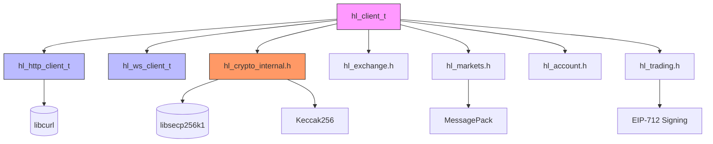

# Introduction

<cite>
**Referenced Files in This Document**   
- [hyperliquid.h](file://include/hyperliquid.h)
- [hl_client.h](file://include/hl_client.h)
- [hl_exchange.h](file://include/hl_exchange.h)
- [hl_types.h](file://include/hl_types.h)
- [hl_http.h](file://include/hl_http.h)
- [hl_ws_client.h](file://include/hl_ws_client.h)
- [hl_crypto_internal.h](file://include/hl_crypto_internal.h)
- [eip712.c](file://src/crypto/eip712.c)
- [serialize.c](file://src/msgpack/serialize.c)
- [client.c](file://src/client.c)
- [client_new.c](file://src/client_new.c)
</cite>

## Table of Contents
1. [Introduction](#introduction)
2. [Core Capabilities](#core-capabilities)
3. [Target Audience and Benefits](#target-audience-and-benefits)
4. [Architecture Overview](#architecture-overview)
5. [Real-World Use Cases](#real-world-use-cases)
6. [Component Relationships](#component-relationships)

## Core Capabilities

The hyperliquid-c library provides comprehensive access to the Hyperliquid decentralized exchange through a high-performance C interface. The library supports three primary functional domains: trading operations, market data retrieval, and account management.

Trading capabilities include order creation and modification through `hl_place_order()` and `hl_edit_order()` functions, order cancellation via `hl_cancel_order()`, and batch operations with `hl_create_orders()` and `hl_cancel_orders()`. The library also supports advanced trading features such as leverage management through `hl_set_leverage()` and margin adjustments with `hl_add_margin()` and `hl_reduce_margin()`.

Market data retrieval is facilitated through a comprehensive set of functions including `hl_fetch_ticker()` for current price information, `hl_fetch_order_book()` for order book depth data, `hl_fetch_ohlcv()` for historical candle data, and `hl_fetch_trades()` for recent trade history. The library also provides market metadata through `hl_fetch_markets()`, `hl_fetch_swap_markets()`, and `hl_fetch_spot_markets()` functions.

Account management functionality enables users to retrieve balance information with `hl_fetch_balance()`, access position data through `hl_fetch_positions()` and `hl_fetch_position()`, obtain trading fees via `hl_fetch_trading_fee()`, and retrieve transaction history with `hl_fetch_ledger()`. The library also supports funding rate queries through `hl_fetch_funding_rates()` and `hl_fetch_funding_rate_history()`.

**Section sources**
- [hyperliquid.h](file://include/hyperliquid.h#L1-L688)
- [hl_account.h](file://include/hl_account.h#L1-L214)
- [hl_markets.h](file://include/hl_markets.h#L1-L127)
- [hl_ticker.h](file://include/hl_ticker.h#L1-L99)

## Target Audience and Benefits

The hyperliquid-c library is specifically designed for C developers building high-performance trading systems and financial applications. Its primary target audience includes developers creating algorithmic trading bots, quantitative trading platforms, and embedded financial applications that require low-latency access to the Hyperliquid DEX.

Key benefits of the library include thread safety, which allows concurrent operations from multiple threads without data corruption. The implementation uses mutex protection in the `hl_client` structure to ensure safe concurrent access to shared resources. Zero-copy operations are employed throughout the library to minimize memory allocation overhead and improve performance, particularly important in high-frequency trading scenarios.

The library offers full CCXT compatibility, enabling seamless integration with existing CCXT-based applications and tools. This compatibility is achieved through standardized data structures, naming conventions, and the implementation of the complete CCXT feature set. The library exposes all 51 CCXT methods with identical signatures and behavior, allowing developers to leverage their existing CCXT knowledge and codebases.

Additional benefits include comprehensive error handling with detailed error codes, support for both testnet and mainnet environments, and production-ready WebSocket streaming capabilities. The library is built to C99 standards, ensuring broad compiler compatibility across different platforms and environments.

**Section sources**
- [README.md](file://README.md#L1-L695)
- [hyperliquid.h](file://include/hyperliquid.h#L1-L688)
- [hl_client.h](file://include/hl_client.h#L1-L188)

## Architecture Overview

The hyperliquid-c library employs a modular architecture with clear separation of concerns between components. At the core of the architecture is the opaque pointer pattern implemented through the `hl_client_t` structure, which encapsulates all client state and provides a clean API interface while hiding implementation details.

The library follows a layered design with distinct modules for different functional areas: HTTP communication, cryptographic operations, message serialization, and exchange-specific logic. The HTTP layer, implemented in `hl_http.h` and associated source files, handles all REST API communications with the Hyperliquid exchange using libcurl for network operations.

Cryptographic operations are centralized in the crypto module, with EIP-712 signing implemented in `eip712.c` and supporting functions in `hl_crypto_internal.h`. This module integrates with libsecp256k1 for ECDSA signature generation and SHA3/Keccak256 hashing for message digest computation.

MessagePack serialization is handled by the msgpack module, which ensures byte-perfect compatibility with the Hyperliquid API's expected message format. The serialization logic in `serialize.c` carefully constructs messages with fields in the exact order required by the exchange, including proper handling of nested structures and type information.

The architecture emphasizes separation of concerns, with each module responsible for a specific aspect of functionality. This modular design enables easier maintenance, testing, and potential replacement of individual components without affecting the overall system.

**Section sources**
- [hl_client.h](file://include/hl_client.h#L1-L188)
- [hl_exchange.h](file://include/hl_exchange.h#L1-L216)
- [hl_http.h](file://include/hl_http.h#L1-L129)
- [hl_crypto_internal.h](file://include/hl_crypto_internal.h#L1-L86)
- [serialize.c](file://src/msgpack/serialize.c#L1-L234)

## Real-World Use Cases

The hyperliquid-c library supports a variety of real-world applications in the financial technology domain. One primary use case is algorithmic trading bots that require low-latency access to exchange data and trading capabilities. The library's high-performance characteristics and zero-copy operations make it well-suited for high-frequency trading strategies where microseconds matter.

Embedded financial applications represent another important use case, particularly in environments with constrained resources where the efficiency of C code provides significant advantages over higher-level languages. The library's small memory footprint and efficient resource management enable deployment on edge devices and embedded systems.

Market making applications benefit from the library's comprehensive market data access and rapid order execution capabilities. The ability to quickly retrieve order book data, calculate pricing models, and execute orders with minimal latency is critical for successful market making strategies.

Risk management systems can leverage the library's account monitoring capabilities to track positions, calculate margin requirements, and implement automated risk controls. The real-time WebSocket streaming interface allows for immediate response to market changes and position updates.

The CCXT compatibility opens additional use cases, allowing developers to create unified trading interfaces that work across multiple exchanges using standard CCXT patterns. This enables the development of multi-exchange arbitrage systems, portfolio management tools, and cross-exchange analytics platforms.

**Section sources**
- [examples/trading_bot.c](file://examples/trading_bot.c)
- [examples/websocket_demo.c](file://examples/websocket_demo.c)
- [README.md](file://README.md#L1-L695)

## Component Relationships

**Diagram sources**
- [hl_client.h](file://include/hl_client.h#L1-L188)
- [hl_http.h](file://include/hl_http.h#L1-L129)
- [hl_ws_client.h](file://include/hl_ws_client.h#L1-L136)
- [hl_crypto_internal.h](file://include/hl_crypto_internal.h#L1-L86)
- [hl_exchange.h](file://include/hl_exchange.h#L1-L216)

**Section sources**
- [hl_client.h](file://include/hl_client.h#L1-L188)
- [hl_http.h](file://include/hl_http.h#L1-L129)
- [hl_ws_client.h](file://include/hl_ws_client.h#L1-L136)
- [hl_crypto_internal.h](file://include/hl_crypto_internal.h#L1-L86)
- [src/client.c](file://src/client.c#L1-L197)
- [src/client_new.c](file://src/client_new.c#L1-L241)