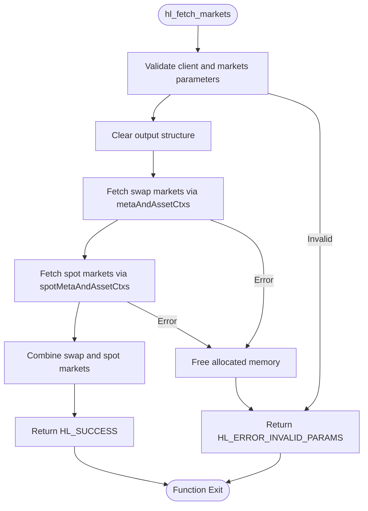
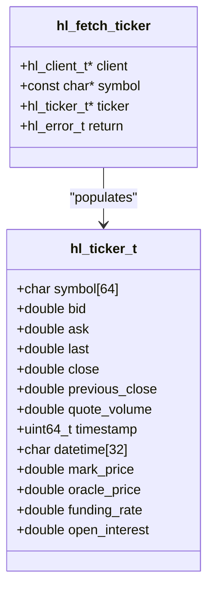
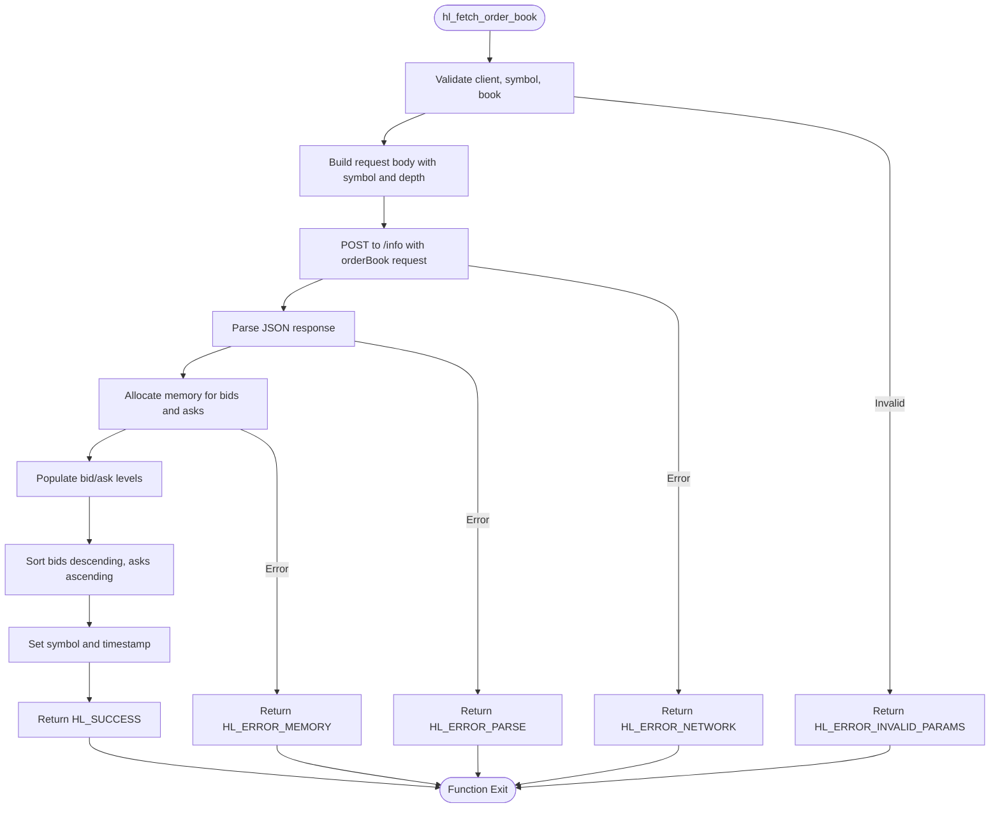
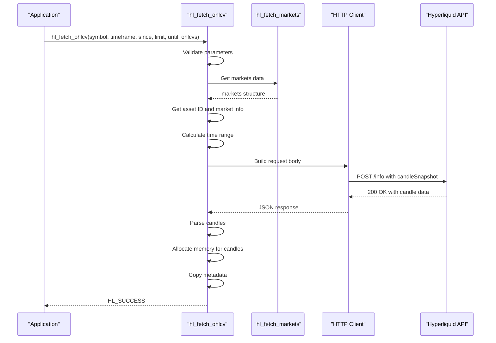
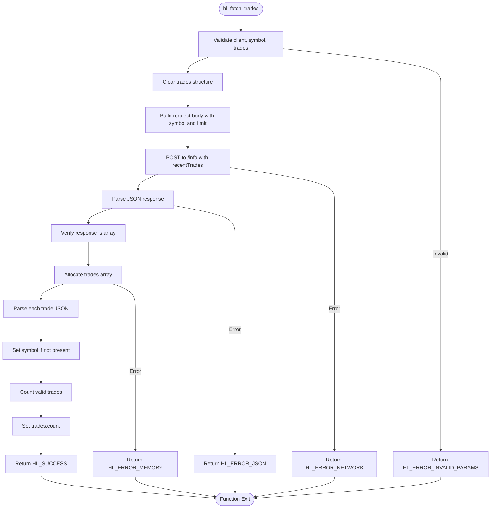
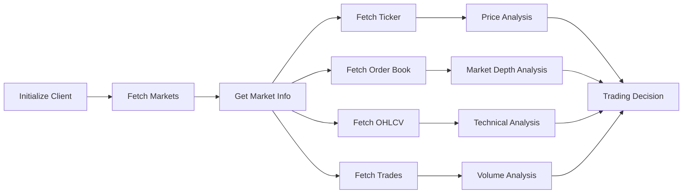

# Market Data

<cite>
**Referenced Files in This Document**   
- [hl_fetch_markets](file://src/markets.c#L389-L411)
- [hl_fetch_ticker](file://include/hl_ticker.h#L74)
- [hl_fetch_order_book](file://include/hl_orderbook.h#L45)
- [hl_fetch_ohlcv](file://src/ohlcv.c#L136-L283)
- [hl_fetch_trades](file://src/trades.c#L104-L191)
- [hl_markets.h](file://include/hl_markets.h)
- [hl_ticker.h](file://include/hl_ticker.h)
- [hl_orderbook.h](file://include/hl_orderbook.h)
- [hl_ohlcv.h](file://include/hl_ohlcv.h)
- [hl_trades.h](file://include/hl_types.h)
</cite>

## Table of Contents
1. [Market Data Retrieval Overview](#market-data-retrieval-overview)
2. [Available Markets](#available-markets)
3. [Ticker Information](#ticker-information)
4. [Order Book Data](#order-book-data)
5. [OHLCV Candle Data](#ohlcv-candle-data)
6. [Recent Trades](#recent-trades)
7. [Market Analysis Workflows](#market-analysis-workflows)
8. [Data Freshness and Rate Limiting](#data-freshness-and-rate-limiting)
9. [Timestamp Handling](#timestamp-handling)

## Market Data Retrieval Overview

The Hyperliquid C SDK provides comprehensive market data retrieval functions for accessing real-time and historical trading information. The API offers standardized interfaces for fetching markets, tickers, order books, OHLCV candles, and trade history with consistent error handling and data structures.

**Section sources**
- [hyperliquid.h](file://include/hyperliquid.h#L416-L420)
- [hl_markets.h](file://include/hl_markets.h)
- [hl_ticker.h](file://include/hl_ticker.h)
- [hl_orderbook.h](file://include/hl_orderbook.h)
- [hl_ohlcv.h](file://include/hl_ohlcv.h)
- [hl_types.h](file://include/hl_types.h)

## Available Markets

The `hl_fetch_markets()` function retrieves all available trading markets from the Hyperliquid exchange, including both perpetual swap and spot markets. This function combines data from separate swap and spot market endpoints into a unified markets collection.

**Diagram sources**
- [markets.c](file://src/markets.c#L389-L411)
- [markets.c](file://src/markets.c#L116-L204)
- [markets.c](file://src/markets.c#L295-L384)

**Section sources**
- [markets.c](file://src/markets.c#L389-L411)
- [hl_markets.h](file://include/hl_markets.h)

## Ticker Information

The `hl_fetch_ticker()` function retrieves current market data for a specific trading symbol, providing essential price and volume information. The ticker structure includes bid/ask prices, last traded price, 24-hour volume, and timestamp information.

**Diagram sources**
- [hl_ticker.h](file://include/hl_ticker.h)
- [hl_ticker.h](file://include/hl_ticker.h#L74)

**Section sources**
- [hl_ticker.h](file://include/hl_ticker.h)

## Order Book Data

The `hl_fetch_order_book()` function retrieves the current order book for a specified symbol with configurable depth. The order book provides Level 2 market depth data with bid and ask levels sorted in price-time priority.

**Diagram sources**
- [hl_orderbook.h](file://include/hl_orderbook.h#L45)
- [hl_orderbook.h](file://include/hl_orderbook.h)

**Section sources**
- [hl_orderbook.h](file://include/hl_orderbook.h)

## OHLCV Candle Data

The `hl_fetch_ohlcv()` function retrieves historical candlestick data for technical analysis across multiple timeframes. The function supports flexible time range specification with since, until, and limit parameters.

**Diagram sources**
- [ohlcv.c](file://src/ohlcv.c#L136-L283)
- [ohlcv.c](file://src/ohlcv.c#L83-L102)
- [ohlcv.c](file://src/ohlcv.c#L107-L131)

**Section sources**
- [ohlcv.c](file://src/ohlcv.c#L136-L283)
- [hl_ohlcv.h](file://include/hl_ohlcv.h)

## Recent Trades

The `hl_fetch_trades()` function retrieves recent public trades for a specified symbol. The function supports limiting the number of returned trades and provides comprehensive trade information including price, amount, side, and timestamp.

**Diagram sources**
- [trades.c](file://src/trades.c#L104-L191)
- [hl_types.h](file://include/hl_types.h)

**Section sources**
- [trades.c](file://src/trades.c#L104-L191)
- [hl_types.h](file://include/hl_types.h)

## Market Analysis Workflows

The Hyperliquid C SDK enables comprehensive market analysis by combining multiple data sources. Typical workflows involve fetching market metadata first, then retrieving specific data points for analysis.

Common analysis patterns include:
- **Trend identification**: Using OHLCV data with multiple timeframes to identify market trends
- **Support/resistance levels**: Analyzing order book depth and historical price action
- **Volume analysis**: Correlating trade volume with price movements
- **Volatility measurement**: Calculating price volatility from OHLCV data
- **Market sentiment**: Analyzing bid-ask imbalance and trade flow

**Section sources**
- [markets.c](file://src/markets.c#L389-L411)
- [ohlcv.c](file://src/ohlcv.c#L136-L283)
- [trades.c](file://src/trades.c#L104-L191)

## Data Freshness and Rate Limiting

The Hyperliquid market data API provides near real-time data with typical latency under 100ms. The SDK implements proper error handling for network issues and API rate limits.

**Rate Limiting Policy:**
- REST API: 50ms minimum interval between requests (configurable)
- No strict rate limits enforced by Hyperliquid, but respectful usage is recommended
- The SDK includes built-in rate limiting to prevent excessive requests

**Data Freshness Guarantees:**
- Ticker data: Updated every 1-2 seconds
- Order book data: Snapshot at time of request
- OHLCV data: Finalized candles available immediately after period end
- Trade data: Real-time streaming with minimal delay

Error handling follows a consistent pattern across all market data functions:
- `HL_SUCCESS`: Operation completed successfully
- `HL_ERROR_NETWORK`: Network communication failed
- `HL_ERROR_API`: API returned an error response
- `HL_ERROR_PARSE`: Response parsing failed
- `HL_ERROR_MEMORY`: Memory allocation failed

**Section sources**
- [hl_error.h](file://include/hl_error.h)
- [ohlcv.c](file://src/ohlcv.c#L136-L283)
- [trades.c](file://src/trades.c#L104-L191)

## Timestamp Handling

All market data functions use consistent timestamp handling with millisecond precision. Timestamps are provided in both numeric (uint64_t) and string (ISO 8601) formats.

**Timestamp Format:**
- **Numeric**: Unix timestamp in milliseconds (e.g., 1704067200000)
- **String**: ISO 8601 format (e.g., "2024-01-01T00:00:00.000Z")

**Timezone Considerations:**
- All timestamps are in UTC timezone
- No timezone conversion is performed by the SDK
- Applications should handle timezone conversion as needed
- The 24-hour volume in tickers is calculated from UTC midnight

The OHLCV function provides flexible time range specification:
- `since`: Start timestamp in milliseconds (inclusive)
- `until`: End timestamp in milliseconds (inclusive)
- `limit`: Maximum number of candles to return
- If `since` is not provided, the function calculates start time based on `limit` and `timeframe`
- If neither `since` nor `limit` is provided, defaults to last 24 hours of data

**Section sources**
- [ohlcv.c](file://src/ohlcv.c#L136-L283)
- [hl_ohlcv.h](file://include/hl_ohlcv.h)
- [hl_ticker.h](file://include/hl_ticker.h)