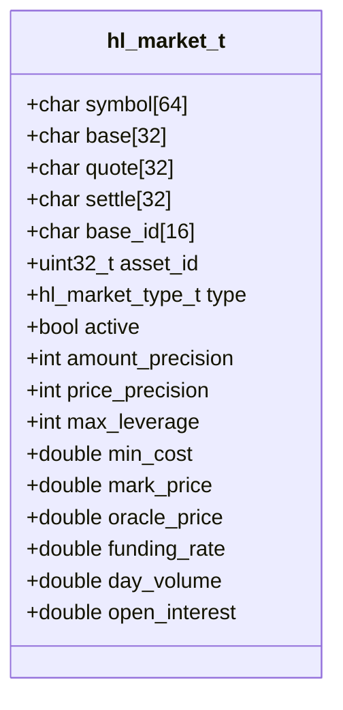
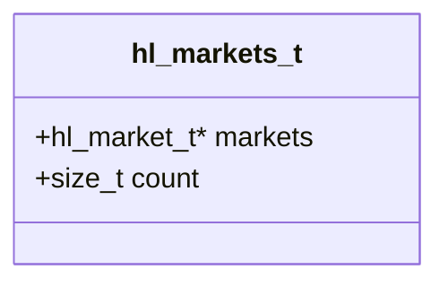
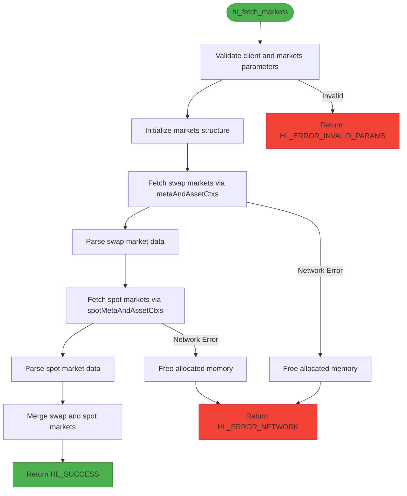
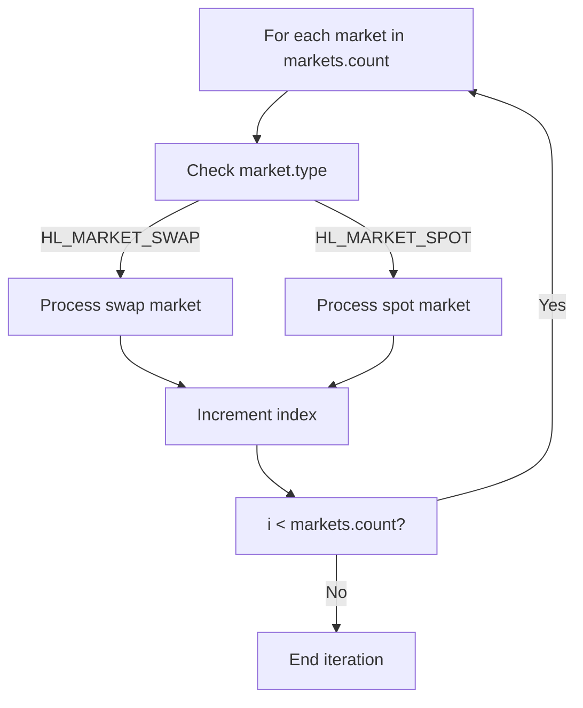
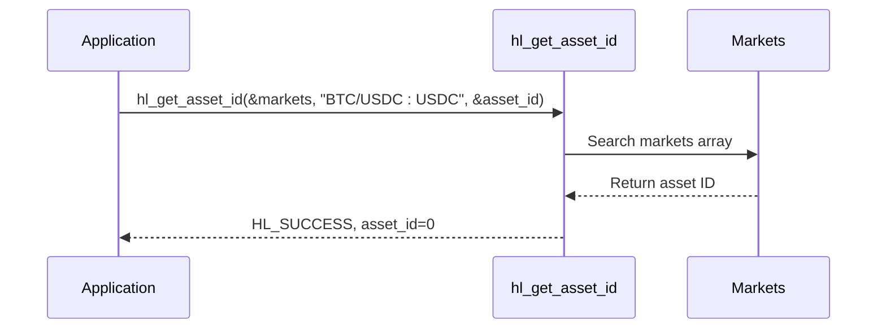
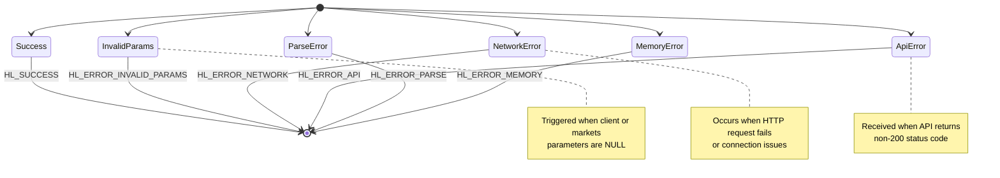
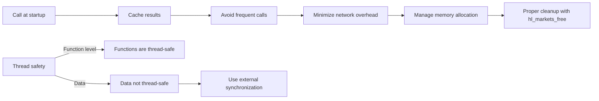
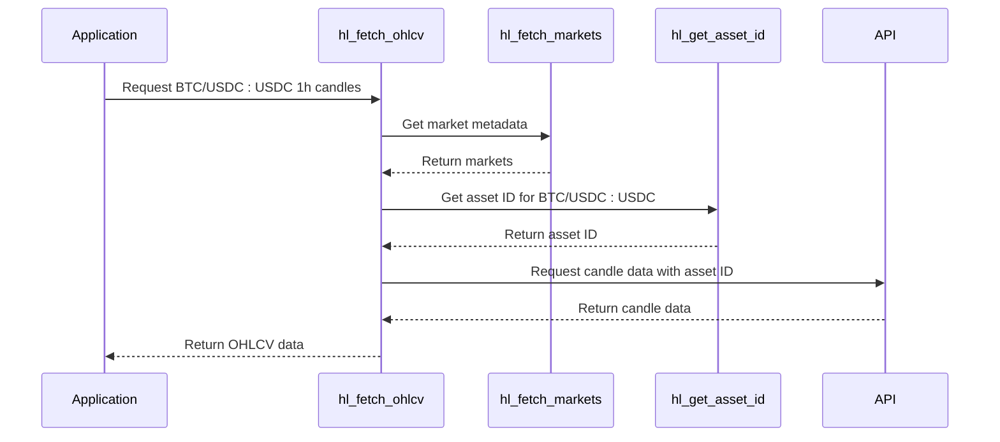

# Markets

<cite>
**Referenced Files in This Document**   
- [hl_markets.h](file://include/hl_markets.h)
- [markets.c](file://src/markets.c)
- [hl_ohlcv.h](file://include/hl_ohlcv.h)
- [ohlcv.c](file://src/ohlcv.c)
- [hl_orderbook.h](file://include/hl_orderbook.h)
- [hl_error.h](file://include/hl_error.h)
- [simple_markets.c](file://examples/simple_markets.c)
</cite>

## Table of Contents
1. [Introduction](#introduction)
2. [Core Functionality: hl_fetch_markets()](#core-functionality-hl_fetch_markets)
3. [Data Structures: hl_markets_t and hl_market_t](#data-structures-hl_markets_t-and-hl_market_t)
4. [Market Discovery Workflow](#market-discovery-workflow)
5. [Usage Patterns and Examples](#usage-patterns-and-examples)
6. [Error Handling](#error-handling)
7. [Performance Considerations](#performance-considerations)
8. [Integration with Market Data Functions](#integration-with-market-data-functions)
9. [Conclusion](#conclusion)

## Introduction
This document provides comprehensive documentation for the market discovery functionality in the Hyperliquid C SDK. It focuses on the `hl_fetch_markets()` function, which retrieves all available trading markets from the Hyperliquid exchange. The system supports both perpetual swap and spot markets, providing essential metadata for trading operations. Market information is crucial for subsequent operations such as placing trades, fetching OHLCV data, and retrieving order books. The SDK provides a unified interface for accessing market data, enabling developers to build robust trading applications with proper symbol mapping and asset identification.

## Core Functionality: hl_fetch_markets()

The `hl_fetch_markets()` function serves as the primary interface for discovering all available trading markets on the Hyperliquid exchange. This function populates a `hl_markets_t` structure with comprehensive market information, including both perpetual swap and spot markets. The function follows a sequential workflow: first retrieving swap markets, then spot markets, and merging them into a single collection. This approach ensures that applications have complete market visibility at startup or when market data needs refreshing. The function is designed to be called during application initialization to establish the trading universe. It handles network communication, JSON parsing, and data transformation internally, providing a clean interface for consumers. The resulting market data includes static metadata (such as precision and leverage limits) and dynamic information (like mark prices and funding rates) when available.

**Section sources**
- [hl_markets.h](file://include/hl_markets.h#L86-L86)
- [markets.c](file://src/markets.c#L389-L411)

## Data Structures: hl_markets_t and hl_market_t

### hl_market_t Structure
The `hl_market_t` structure represents individual market information with comprehensive metadata fields:

**Diagram sources**
- [hl_markets.h](file://include/hl_markets.h#L24-L84)

### hl_markets_t Collection
The `hl_markets_t` structure serves as a container for multiple market entries:

**Diagram sources**
- [hl_markets.h](file://include/hl_markets.h#L85-L87)

The `hl_market_t` structure contains essential fields for trading operations:
- **Symbol Information**: Unified symbol, base/quote currencies, and settlement currency
- **Identification**: Asset ID as both string and integer for different use cases
- **Market Type**: Distinguishes between swap and spot markets
- **Precision**: Amount and price precision for proper order formatting
- **Trading Limits**: Maximum leverage and minimum order cost
- **Pricing Data**: Mark price, oracle price, and funding rate (for swaps)
- **Volume Metrics**: 24-hour volume and open interest

The `hl_markets_t` collection provides a simple array-based structure with a count field, enabling efficient iteration and lookup operations.

**Section sources**
- [hl_markets.h](file://include/hl_markets.h#L22-L87)

## Market Discovery Workflow

The market discovery process follows a systematic workflow to ensure comprehensive market coverage:

**Diagram sources**
- [markets.c](file://src/markets.c#L389-L411)

The workflow begins with parameter validation, ensuring both the client and markets output parameters are valid. The function then initializes the markets structure by zeroing memory. It proceeds to fetch swap markets by calling the `metaAndAssetCtxs` endpoint, which returns comprehensive information about perpetual contracts. After successfully retrieving and parsing swap markets, the function fetches spot markets using the `spotMetaAndAssetCtxs` endpoint. The spot market data is parsed and appended to the existing markets array. Throughout this process, the function maintains proper memory management, allocating arrays for market entries and handling potential memory allocation failures. Error conditions trigger appropriate cleanup to prevent memory leaks.

## Usage Patterns and Examples

### Iterating Through Markets
Applications can iterate through all available markets to discover trading opportunities or filter markets by specific criteria:

**Diagram sources**
- [simple_markets.c](file://examples/simple_markets.c#L65-L75)

### Asset ID Mapping
The SDK provides functions to map between symbols and asset IDs, which are required for certain trading operations:

**Diagram sources**
- [hl_markets.h](file://include/hl_markets.h#L104-L111)

Common usage patterns include:
- Displaying market summaries with counts of swap and spot markets
- Filtering markets by type to separate perpetuals from spot pairs
- Extracting asset IDs for use in trading operations
- Validating symbol availability before executing trades
- Building user interfaces that display market information

The example code demonstrates how to count and display different market types, perform asset ID lookups, and retrieve specific market information by symbol.

**Section sources**
- [simple_markets.c](file://examples/simple_markets.c#L65-L150)

## Error Handling

The market discovery functions implement comprehensive error handling for various failure scenarios:

**Diagram sources**
- [hl_error.h](file://include/hl_error.h#L12-L35)
- [markets.c](file://src/markets.c#L389-L411)

The primary error conditions include:
- **HL_ERROR_INVALID_PARAMS**: Triggered when the client or markets parameters are NULL
- **HL_ERROR_NETWORK**: Occurs when the HTTP request fails due to connectivity issues
- **HL_ERROR_API**: Returned when the API responds with a non-200 status code
- **HL_ERROR_PARSE**: Indicates JSON parsing failures or malformed responses
- **HL_ERROR_MEMORY**: Triggered when memory allocation fails during market data processing

The functions follow a consistent error handling pattern: validating parameters first, then proceeding with network operations while ensuring proper cleanup on failure. Memory allocated for market arrays is freed when errors occur, preventing leaks. Applications should check the return value and handle errors appropriately, potentially implementing retry logic for transient network issues.

**Section sources**
- [hl_error.h](file://include/hl_error.h#L12-L35)
- [markets.c](file://src/markets.c#L389-L411)

## Performance Considerations

When integrating market discovery functionality, several performance considerations should be addressed:

**Diagram sources**
- [markets.c](file://src/markets.c#L389-L411)
- [hl_markets.h](file://include/hl_markets.h#L96-L99)

Key performance recommendations:
- **Call at Startup**: Retrieve markets during application initialization rather than before each trading operation
- **Cache Results**: Store the markets collection to avoid repeated network requests
- **Memory Management**: Always call `hl_markets_free()` to release allocated memory
- **Thread Safety**: The functions themselves are thread-safe, but the returned data should be protected by external synchronization if accessed from multiple threads
- **Network Efficiency**: The function makes two separate HTTP requests (for swaps and spots), so frequent calls will increase latency and network usage

The `hl_fetch_markets()` function is designed to be called once at application startup, with the results cached for the duration of the session. Repeated calls should be avoided unless market data is expected to change significantly.

**Section sources**
- [markets.c](file://src/markets.c#L389-L411)
- [hl_markets.h](file://include/hl_markets.h#L96-L99)

## Integration with Market Data Functions

Market information serves as a foundation for other market data operations, particularly OHLCV and order book requests:

**Diagram sources**
- [ohlcv.c](file://src/ohlcv.c#L136-L283)
- [hl_ohlcv.h](file://include/hl_ohlcv.h#L83-L85)

The integration workflow demonstrates how market discovery enables other data functions:
- **OHLCV Requests**: The `hl_fetch_ohlcv()` function first retrieves market data to determine the market type and obtain the asset ID before making the candle data request
- **Order Book Requests**: Market information provides the symbol format and validation needed for order book queries
- **Trading Operations**: Asset IDs obtained from market data are required for placing orders

This dependency chain ensures that applications have the necessary metadata to format requests correctly according to the exchange's requirements. The unified symbol format in the market data allows applications to work with human-readable symbols while converting to the numeric asset IDs required by the API.

**Section sources**
- [ohlcv.c](file://src/ohlcv.c#L136-L283)
- [hl_ohlcv.h](file://include/hl_ohlcv.h#L83-L85)
- [hl_orderbook.h](file://include/hl_orderbook.h#L35-L42)

## Conclusion
The market discovery functionality in the Hyperliquid C SDK provides a robust foundation for trading applications. The `hl_fetch_markets()` function offers comprehensive access to both swap and spot markets, delivering essential metadata for trading operations. The well-defined data structures (`hl_market_t` and `hl_markets_t`) encapsulate all necessary market information, from basic symbol data to advanced trading parameters. Proper error handling ensures reliable operation even in adverse network conditions. By following performance best practices—particularly caching market data and minimizing redundant calls—applications can achieve optimal efficiency. The integration with other market data functions demonstrates the central role of market discovery in the overall trading workflow, enabling features like OHLCV analysis and order book monitoring. Developers should leverage this functionality during application initialization to establish a complete view of the available trading universe.