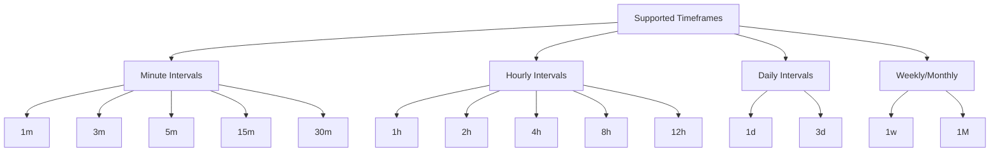
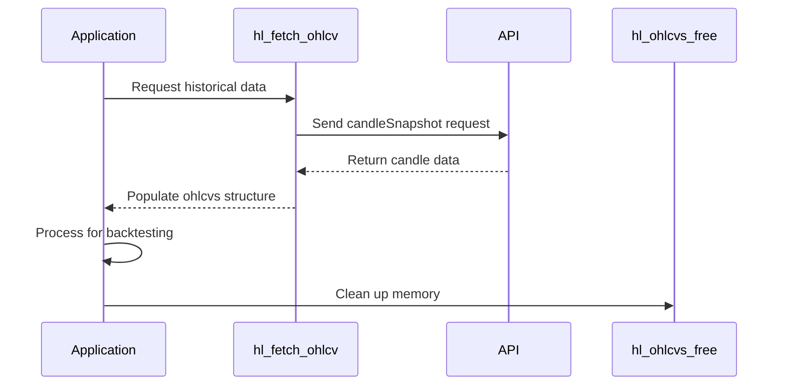

# OHLCV Candles

<cite>
**Referenced Files in This Document**   
- [hl_ohlcv.h](file://include/hl_ohlcv.h)
- [ohlcv.c](file://src/ohlcv.c)
- [hl_markets.h](file://include/hl_markets.h)
- [hl_types.h](file://include/hl_types.h)
- [simple_ohlcv.c](file://examples/simple_ohlcv.c)
</cite>

## Table of Contents
1. [Introduction](#introduction)
2. [Function Parameters](#function-parameters)
3. [Data Structures](#data-structures)
4. [Timeframe Support](#timeframe-support)
5. [Market Type Differences](#market-type-differences)
6. [Memory Management](#memory-management)
7. [Usage Examples](#usage-examples)
8. [Pagination and Data Retrieval](#pagination-and-data-retrieval)
9. [Common Issues and Solutions](#common-issues-and-solutions)

## Introduction
The OHLCV (Open, High, Low, Close, Volume) candle data retrieval system provides historical price and volume information for technical analysis and trading strategies. The `hl_fetch_ohlcv()` function enables developers to retrieve candlestick data with flexible time range and limit controls. This documentation covers the complete functionality of the OHLCV data retrieval system, including parameter details, data structures, memory management, and practical usage patterns.

**Section sources**
- [hl_ohlcv.h](file://include/hl_ohlcv.h#L83-L85)
- [ohlcv.c](file://src/ohlcv.c#L136-L283)

## Function Parameters
The `hl_fetch_ohlcv()` function accepts several parameters to control data retrieval:

- **client**: Client instance for API communication
- **symbol**: Market symbol in format "BASE/QUOTE:SETTLEMENT" (e.g., "BTC/USDC:USDC")
- **timeframe**: Candle timeframe (e.g., "1m", "1h", "1d")
- **since**: Start timestamp in milliseconds (optional)
- **limit**: Maximum number of candles to return (optional)
- **until**: End timestamp in milliseconds (optional)
- **ohlcvs**: Output structure for retrieved OHLCV data

When `since` is not provided, the function calculates the start time based on the `limit` parameter. If neither `since` nor `limit` is specified, it defaults to the last 24 hours of data. The `until` parameter defaults to the current time if not provided.

**Section sources**
- [hl_ohlcv.h](file://include/hl_ohlcv.h#L83-L85)
- [ohlcv.c](file://src/ohlcv.c#L136-L283)

## Data Structures
The OHLCV system uses two primary data structures:

### hl_ohlcv_t Structure
Represents a single OHLCV candle with the following fields:
- **timestamp**: Candle open timestamp in milliseconds
- **open**: Opening price
- **high**: Highest price during the period
- **low**: Lowest price during the period
- **close**: Closing price
- **volume**: Trading volume

### hl_ohlcvs_t Structure
Represents a collection of OHLCV candles with metadata:
- **candles**: Array of hl_ohlcv_t structures
- **count**: Number of candles in the array
- **symbol**: Trading symbol
- **timeframe**: Timeframe of the candles

**Section sources**
- [hl_ohlcv.h](file://include/hl_ohlcv.h#L22-L23)
- [hl_ohlcv.h](file://include/hl_ohlcv.h#L28-L47)
- [hl_ohlcv.h](file://include/hl_ohlcv.h#L52-L64)

## Timeframe Support
The system supports multiple timeframe intervals for candle data:



**Diagram sources**
- [hl_ohlcv.h](file://include/hl_ohlcv.h#L67-L81)

## Market Type Differences
The OHLCV retrieval system handles spot and swap markets differently:

### Request Construction
For **swap markets**, the request uses the coin name (baseName):
```json
{"type":"candleSnapshot","req":{"coin":"BTC","interval":"1m","startTime":1234567890000,"endTime":1234567950000}}
```

For **spot markets**, the request uses the asset ID:
```json
{"type":"candleSnapshot","req":{"coin":"1","interval":"1m","startTime":1234567890000,"endTime":1234567950000}}
```

The system automatically determines the market type by querying the market information and constructs the appropriate request format.

**Section sources**
- [ohlcv.c](file://src/ohlcv.c#L220-L235)
- [hl_markets.h](file://include/hl_markets.h#L113-L113)

## Memory Management
Proper memory management is critical when working with OHLCV data:

### Memory Allocation
The `hl_fetch_ohlcv()` function allocates memory for the candles array using `calloc()`. The caller is responsible for freeing this memory.

### Memory Deallocation
Use `hl_ohlcvs_free()` to properly free OHLCV data:
- Frees the candles array
- Resets count to zero
- Clears symbol and timeframe strings

### Helper Functions
The system provides utility functions for safe memory operations:
- `hl_ohlcvs_free()`: Safely frees OHLCV data and nulls pointers
- Automatic cleanup in error conditions within `hl_fetch_ohlcv()`

**Section sources**
- [ohlcv.c](file://src/ohlcv.c#L288-L298)
- [hl_ohlcv.h](file://include/hl_ohlcv.h#L92-L92)

## Usage Examples
The OHLCV system supports various use cases for trading and analysis:

### Backtesting Data Preparation


**Diagram sources**
- [simple_ohlcv.c](file://examples/simple_ohlcv.c#L75-L191)
- [ohlcv.c](file://src/ohlcv.c#L136-L283)

### Charting and Technical Indicators
The system includes built-in functions for technical analysis:
- **SMA Calculation**: `hl_ohlcvs_calculate_sma()` computes simple moving averages
- **Range Analysis**: `hl_ohlcvs_highest_high()` and `hl_ohlcvs_lowest_low()` find price extremes
- **Candle Access**: `hl_ohlcvs_get_candle()` and `hl_ohlcvs_get_latest()` provide indexed access

These functions enable immediate technical analysis without additional processing.

**Section sources**
- [hl_ohlcv.h](file://include/hl_ohlcv.h#L111-L141)
- [ohlcv.c](file://src/ohlcv.c#L313-L394)

## Pagination and Data Retrieval
Effective pagination strategies are essential for handling large datasets:

### Timestamp Normalization
All timestamps are in milliseconds and follow UTC timezone. The system automatically handles:
- Current time calculation using `time(NULL) * 1000`
- Time range validation
- Proper ordering of candles (oldest to newest)

### Partial Data Handling
When requesting data across large time ranges:
- The system limits results based on the `limit` parameter
- Returns available data even if fewer candles exist
- Handles edge cases like market inception dates

### Pagination Strategy
For retrieving large historical datasets:
1. Start with a known `since` timestamp
2. Use `limit` to control response size
3. Use the last candle's timestamp as the next `since` value
4. Repeat until desired data range is covered

**Section sources**
- [ohlcv.c](file://src/ohlcv.c#L185-L198)
- [ohlcv.c](file://src/ohlcv.c#L245-L255)

## Common Issues and Solutions
### Missing Data Points
Common causes and solutions:
- **Testnet Limitations**: Testnet may not have historical OHLCV data; use mainnet for real data
- **Invalid Timeframes**: Ensure timeframe matches supported values
- **Symbol Errors**: Verify symbol format and market availability

### Rate Limiting
During bulk requests:
- Implement request throttling
- Use larger timeframes for historical data
- Consider caching strategies
- Monitor API response codes for rate limit warnings

### Error Handling
The system returns specific error codes:
- `HL_ERROR_INVALID_PARAMS`: Invalid input parameters
- `HL_ERROR_NETWORK`: Network communication failure
- `HL_ERROR_API`: API returned non-200 status
- `HL_ERROR_PARSE`: Response parsing failure
- `HL_ERROR_MEMORY`: Memory allocation failure

Always check the return value and handle errors appropriately.

**Section sources**
- [hl_error.h](file://include/hl_error.h#L15-L37)
- [ohlcv.c](file://src/ohlcv.c#L136-L283)