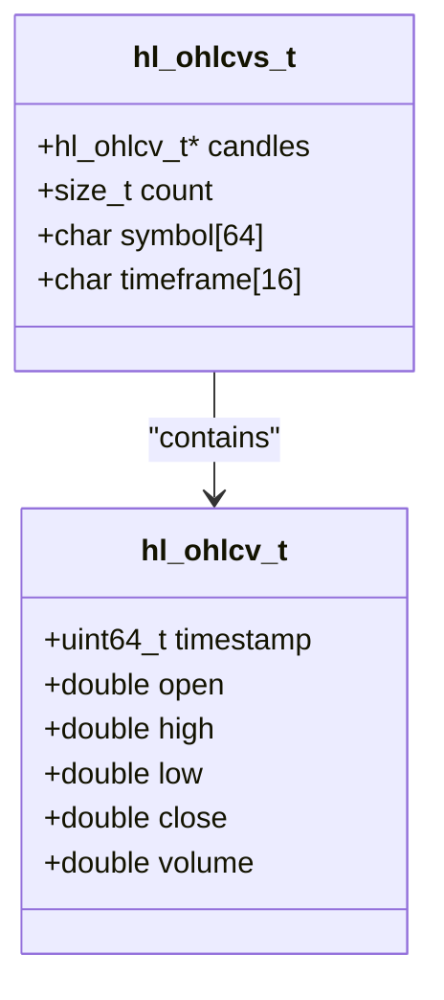
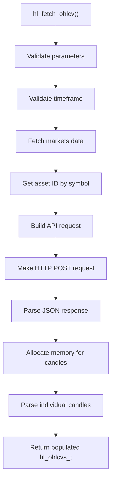
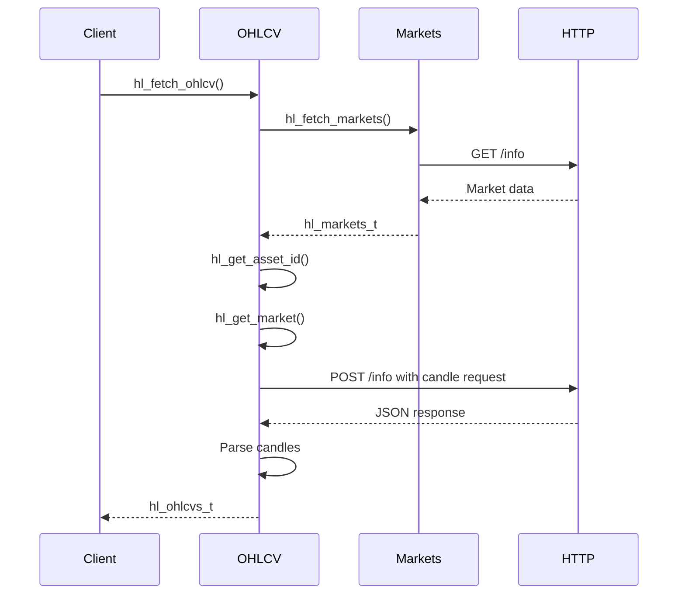
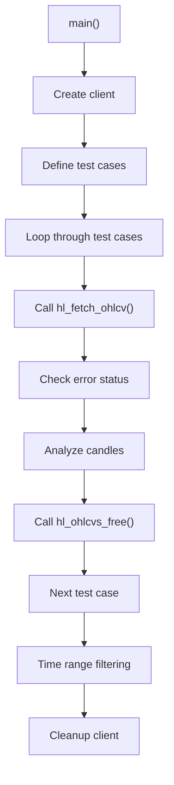
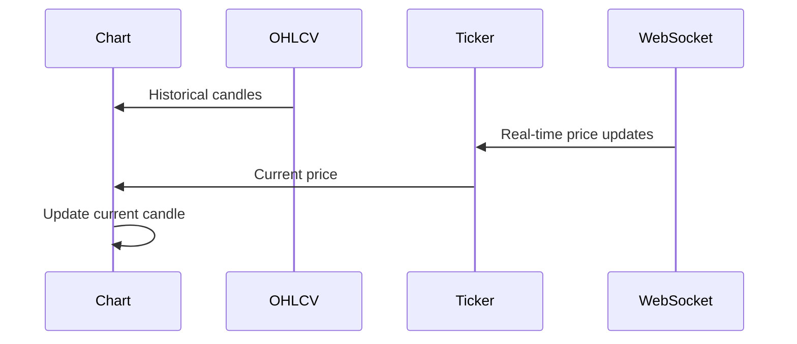

# OHLCV Candles

<cite>
**Referenced Files in This Document**   
- [ohlcv.c](file://src/ohlcv.c)
- [hl_ohlcv.h](file://include/hl_ohlcv.h)
- [simple_ohlcv.c](file://examples/simple_ohlcv.c)
- [hl_markets.h](file://include/hl_markets.h)
- [hl_http.h](file://include/hl_http.h)
- [hl_ticker.h](file://include/hl_ticker.h)
</cite>

## Table of Contents
1. [Introduction](#introduction)
2. [Core Data Structure](#core-data-structure)
3. [Function Parameters](#function-parameters)
4. [Implementation Workflow](#implementation-workflow)
5. [Usage Example](#usage-example)
6. [Common Pitfalls](#common-pitfalls)
7. [Rate Limiting and Caching](#rate-limiting-and-caching)
8. [Data Synchronization](#data-synchronization)
9. [Conclusion](#conclusion)

## Introduction

The OHLCV (Open, High, Low, Close, Volume) candlestick data retrieval feature provides historical price and volume information for technical analysis and trading strategies. This documentation explains the `hl_fetch_ohlcv` function, its parameters, data structures, implementation details, and best practices for usage in charting applications.

**Section sources**
- [hl_ohlcv.h](file://include/hl_ohlcv.h#L1-L20)
- [ohlcv.c](file://src/ohlcv.c#L1-L20)

## Core Data Structure

The `hl_ohlcv_t` structure represents a single candlestick with timestamp, price levels, and volume information. Each candle contains six key data points that form the basis of technical analysis.

**Diagram sources**
- [hl_ohlcv.h](file://include/hl_ohlcv.h#L25-L32)
- [hl_ohlcv.h](file://include/hl_ohlcv.h#L45-L52)

The `hl_ohlcvs_t` structure wraps an array of `hl_ohlcv_t` candles with metadata including symbol, timeframe, and count. This collection structure enables efficient memory management and data access patterns.

**Section sources**
- [hl_ohlcv.h](file://include/hl_ohlcv.h#L25-L52)

## Function Parameters

The `hl_fetch_ohlcv` function accepts several parameters to customize data retrieval:

- **client**: Client instance for API authentication and configuration
- **symbol**: Trading symbol in unified format (e.g., "BTC/USDC:USDC")
- **timeframe**: Candle interval specified as string (e.g., "1m", "5m", "1h")
- **since**: Start timestamp in milliseconds (optional)
- **limit**: Maximum number of candles to return (optional)
- **until**: End timestamp in milliseconds (optional)
- **ohlcvs**: Output parameter for returned candle data

The function supports multiple timeframe constants defined in the header file, including HL_TIMEFRAME_1M, HL_TIMEFRAME_5M, HL_TIMEFRAME_1H, and others.

**Diagram sources**
- [ohlcv.c](file://src/ohlcv.c#L150-L300)
- [hl_ohlcv.h](file://include/hl_ohlcv.h#L72-L88)

**Section sources**
- [hl_ohlcv.h](file://include/hl_ohlcv.h#L72-L88)
- [ohlcv.c](file://src/ohlcv.c#L150-L300)

## Implementation Workflow

The OHLCV retrieval process follows a systematic workflow involving market data lookup, HTTP communication, JSON parsing, and memory management.

### Market Information Lookup

Before making the OHLCV request, the function retrieves market information to determine the asset ID and market type (swap or spot). This requires calling `hl_fetch_markets` to get all available markets, then using `hl_get_asset_id` and `hl_get_market` to find the specific market details.

**Diagram sources**
- [ohlcv.c](file://src/ohlcv.c#L190-L250)
- [hl_markets.h](file://include/hl_markets.h#L83-L110)

### HTTP Request and Response Processing

The implementation makes an HTTP POST request to the `/info` endpoint with a JSON payload containing the candle snapshot request. The request body format differs between swap and spot markets, using either the coin name or asset ID.

After receiving the response, the function parses the JSON array using cJSON, validates the structure, and extracts individual candle data. Memory is dynamically allocated for the candle array using calloc, with proper error handling for memory allocation failures.

**Section sources**
- [ohlcv.c](file://src/ohlcv.c#L250-L300)
- [hl_http.h](file://include/hl_http.h#L97-L108)

## Usage Example

The `simple_ohlcv.c` example demonstrates proper configuration, invocation, and iteration over returned candle data. The example shows how to create a client, fetch OHLCV data for multiple symbols and timeframes, and analyze the results.

**Diagram sources**
- [simple_ohlcv.c](file://examples/simple_ohlcv.c#L100-L150)

The example includes comprehensive error handling and demonstrates the use of utility functions like `hl_ohlcvs_get_latest`, `hl_ohlcvs_calculate_sma`, and `hl_ohlcvs_highest_high` for technical analysis.

**Section sources**
- [simple_ohlcv.c](file://examples/simple_ohlcv.c#L1-L193)

## Common Pitfalls

Several common issues can occur when working with OHLCV data retrieval:

### Invalid Timeframe Handling

The function validates timeframes against a predefined list of supported intervals. Using an unsupported timeframe like "2m" or "10m" will result in HL_ERROR_INVALID_PARAMS. Always use the defined constants (HL_TIMEFRAME_1M, HL_TIMEFRAME_5M, etc.) to avoid this issue.

### Out-of-Range Timestamps

When specifying time ranges, ensure that the start time is before the end time and within the exchange's available data history. The API may return empty results for requests outside the valid range.

### Partial Candle Data

The OHLCV endpoint may return incomplete candles if requested near the current time. For accurate technical analysis, consider discarding the most recent candle or supplementing with real-time ticker data.

**Section sources**
- [ohlcv.c](file://src/ohlcv.c#L100-L150)
- [simple_ohlcv.c](file://examples/simple_ohlcv.c#L150-L180)

## Rate Limiting and Caching

### Rate Limiting Considerations

Historical data queries should be rate-limited to avoid overwhelming the API. Implement exponential backoff for retry logic and consider the following guidelines:

- Limit requests to 1-2 per second for historical data
- Use larger timeframes when possible to reduce request frequency
- Cache results locally to minimize redundant API calls

### Caching Strategies

For charting applications, implement a multi-level caching strategy:

1. **Memory Cache**: Store recently fetched data in memory for quick access
2. **Disk Cache**: Persist frequently accessed data to disk for application restarts
3. **Cache Expiration**: Implement TTL-based expiration for stale data
4. **Cache Invalidation**: Clear cache when new real-time data arrives

The `hl_ohlcvs_free` function must be called to properly release allocated memory and prevent memory leaks.

**Section sources**
- [ohlcv.c](file://src/ohlcv.c#L300-L310)
- [simple_ohlcv.c](file://examples/simple_ohlcv.c#L180-L193)

## Data Synchronization

### Real-Time Data Integration

To synchronize OHLCV data with real-time updates, combine historical candle data with streaming ticker or order book data:

**Diagram sources**
- [hl_ticker.h](file://include/hl_ticker.h#L72-L72)
- [hl_ohlcv.h](file://include/hl_ohlcv.h#L97-L97)

Use the `hl_fetch_ticker` function to get current market prices and update the active candle's high, low, and close values in real-time.

### Best Practices

1. **Timestamp Alignment**: Ensure candle timestamps align with the specified timeframe boundaries
2. **Data Consistency**: Verify that the last historical candle connects properly with the first real-time update
3. **Gap Handling**: Detect and handle gaps in data due to exchange downtime or network issues
4. **Update Frequency**: Refresh historical data periodically to capture any corrections or adjustments

**Section sources**
- [hl_ticker.h](file://include/hl_ticker.h#L72-L72)
- [hl_ohlcv.h](file://include/hl_ohlcv.h#L97-L138)

## Conclusion

The OHLCV candlestick data retrieval feature provides a robust foundation for technical analysis and charting applications. By understanding the function parameters, data structures, and implementation details, developers can effectively integrate historical price data into their trading strategies. Proper error handling, rate limiting, caching, and real-time data synchronization are essential for building reliable and performant applications.

The combination of the `hl_fetch_ohlcv` function with supporting utilities for technical analysis creates a comprehensive toolkit for working with candlestick data. Following the demonstrated patterns and best practices will ensure efficient and accurate data retrieval and processing.