# Order Book Data

<cite>
**Referenced Files in This Document**   
- [src/orderbook.c](file://src/orderbook.c)
- [include/hyperliquid.h](file://include/hyperliquid.h)
- [include/hl_orderbook.h](file://include/hl_orderbook.h)
- [examples/simple_orderbook.c](file://examples/simple_orderbook.c)
- [src/markets.c](file://src/markets.c)
- [include/hl_markets.h](file://include/hl_markets.h)
- [include/hl_http.h](file://include/hl_http.h)
</cite>

## Table of Contents
1. [Introduction](#introduction)
2. [Function Interface: hl_fetch_order_book](#function-interface-hl_fetch_order_book)
3. [Order Book Structure: hl_orderbook_t](#order-book-structure-hl_orderbook_t)
4. [Level Arrays and Sorting](#level-arrays-and-sorting)
5. [Usage Example: simple_orderbook.c](#usage-example-simple_orderbookc)
6. [Internal Processing Flow](#internal-processing-flow)
7. [Common Issues and Solutions](#common-issues-and-solutions)
8. [Performance Considerations](#performance-considerations)
9. [Integration with Trading Strategies](#integration-with-trading-strategies)
10. [Conclusion](#conclusion)

## Introduction
The Hyperliquid C SDK provides robust functionality for retrieving real-time order book data through its `hl_fetch_order_book` function. This document details the implementation, usage, and best practices for working with order book data in the Hyperliquid ecosystem. The system supports both swap and spot markets, with comprehensive error handling and memory management. Order books are essential for algorithmic trading, market analysis, and real-time decision making, providing visibility into market depth, liquidity, and price discovery mechanisms.

## Function Interface: hl_fetch_order_book
The `hl_fetch_order_book` function serves as the primary interface for retrieving order book data from the Hyperliquid exchange. It accepts four parameters: a client instance, symbol string, depth limit, and output order book structure. The function returns an error code indicating success or failure. The depth parameter controls how many price levels are returned in the response, allowing clients to balance data granularity with network and processing overhead. A depth value of 0 requests all available levels. The function handles both swap and spot markets by determining the appropriate request format based on market type. Error handling is comprehensive, with specific codes for invalid parameters, network issues, API errors, and parsing failures.

**Section sources**
- [src/orderbook.c](file://src/orderbook.c#L102-L215)
- [include/hl_orderbook.h](file://include/hl_orderbook.h#L39-L39)

## Order Book Structure: hl_orderbook_t
The `hl_orderbook_t` structure contains all relevant data from a market's order book snapshot. It includes the symbol identifier, bid and ask level arrays, count of levels for each side, and a timestamp in milliseconds. The bids array contains price-quantity pairs sorted from highest to lowest price, while the asks array is sorted from lowest to highest price. This sorting enables efficient access to the best available prices. The timestamp field indicates when the snapshot was taken, which is crucial for determining data freshness. Memory for the bid and ask arrays is dynamically allocated during parsing and must be freed using `hl_free_orderbook` to prevent memory leaks.

**Diagram sources**
- [include/hyperliquid.h](file://include/hyperliquid.h#L191-L194)
- [include/hyperliquid.h](file://include/hyperliquid.h#L197-L204)

**Section sources**
- [include/hyperliquid.h](file://include/hyperliquid.h#L191-L204)

## Level Arrays and Sorting
The `hl_book_level_t` arrays for bids and asks are sorted according to market conventions: bids in descending order by price (highest first) and asks in ascending order (lowest first). This arrangement allows immediate access to the best available prices at index 0 of each array. The sorting is performed server-side by the exchange, ensuring consistency across clients. The depth parameter in `hl_fetch_order_book` limits the number of levels returned, which directly affects the size of these arrays. When depth is specified, only the top N levels are included, where N is the depth value. This enables clients to request only the data they need for their specific use case, reducing bandwidth and processing requirements.

**Section sources**
- [src/orderbook.c](file://src/orderbook.c#L55-L97)
- [include/hyperliquid.h](file://include/hyperliquid.h#L191-L194)

## Usage Example: simple_orderbook.c
The `simple_orderbook.c` example demonstrates proper usage patterns for order book retrieval and analysis. It shows how to create a client, fetch order books for multiple symbols with varying depth settings, and analyze the results. The example includes comprehensive error checking after each `hl_fetch_order_book` call, ensuring robust operation. Memory management is handled correctly by calling `hl_free_orderbook` after processing each order book. The code also demonstrates utility functions for calculating spreads, volume at different depths, and market depth analysis. These patterns serve as a template for real-world applications requiring order book data.

**Diagram sources**
- [examples/simple_orderbook.c](file://examples/simple_orderbook.c#L0-L195)
- [src/orderbook.c](file://src/orderbook.c#L102-L215)

**Section sources**
- [examples/simple_orderbook.c](file://examples/simple_orderbook.c#L0-L195)

## Internal Processing Flow
The internal process of order book retrieval involves several sequential steps. First, the function validates input parameters and initializes the output structure. It then fetches market metadata using `hl_fetch_markets` to determine the asset ID and market type. Based on whether the market is a swap or spot, it constructs the appropriate request body using either the coin name or asset ID. The HTTP POST request is sent to the `/info` endpoint with JSON payload specifying the "l2Book" type. Upon receiving the response, the JSON is parsed to extract the levels array containing bids and asks. Each level is parsed from string values to double precision numbers, and the arrays are populated up to the requested depth limit. The timestamp is extracted from the response or set to the current time as fallback.

```mermaid
flowchart TD
Start([Start hl_fetch_order_book]) --> Validate["Validate Parameters"]
Validate --> FetchMarkets["Fetch Markets Data"]
FetchMarkets --> GetAssetID["Get Asset ID"]
GetAssetID --> DetermineType["Determine Market Type"]
DetermineType --> BuildRequest["Build Request Body"]
BuildRequest --> MakeRequest["Make HTTP POST Request"]
MakeRequest --> CheckResponse["Check Status Code"]
CheckResponse --> ParseJSON["Parse JSON Response"]
ParseJSON --> ExtractLevels["Extract Levels Array"]
ExtractLevels --> ParseBids["Parse Bid Levels"]
ParseBids --> ParseAsks["Parse Ask Levels"]
ParseAsks --> ExtractTime["Extract Timestamp"]
ExtractTime --> ReturnSuccess["Return HL_SUCCESS"]
Validate -- "Invalid" --> ReturnError["Return HL_ERROR_INVALID_PARAMS"]
FetchMarkets -- "Failure" --> ReturnError
GetAssetID -- "Failure" --> ReturnError
MakeRequest -- "Network Error" --> ReturnError
MakeRequest -- "Status ≠ 200" --> ReturnError
ParseJSON -- "Invalid JSON" --> ReturnError
ExtractLevels -- "Invalid" --> ReturnError
ReturnError --> End([Function Exit])
ReturnSuccess --> End
```

**Diagram sources**
- [src/orderbook.c](file://src/orderbook.c#L102-L215)
- [src/markets.c](file://src/markets.c#L389-L411)
- [include/hl_http.h](file://include/hl_http.h#L97-L97)

**Section sources**
- [src/orderbook.c](file://src/orderbook.c#L102-L215)
- [src/markets.c](file://src/markets.c#L389-L411)
- [src/markets.c](file://src/markets.c#L427-L457)
- [src/markets.c](file://src/markets.c#L462-L475)

## Common Issues and Solutions
Several common issues can occur when working with order book data. Depth limitations may result in insufficient market depth for certain strategies; this can be mitigated by requesting higher depth values or using multiple snapshots over time. Stale data can affect trading decisions; the timestamp field should be checked to ensure data freshness, and frequent updates should be implemented for time-sensitive applications. Memory leaks are a risk if `hl_free_orderbook` is not called after use; implementing RAII-style patterns or using smart pointers can help prevent this. Network errors may occur during high volatility periods; implementing retry logic with exponential backoff can improve reliability. Parsing errors can happen with malformed responses; validating JSON structure before processing helps catch these issues early.

**Section sources**
- [src/orderbook.c](file://src/orderbook.c#L220-L235)
- [src/orderbook.c](file://src/orderbook.c#L102-L215)
- [include/hl_orderbook.h](file://include/hl_orderbook.h#L46-L46)

## Performance Considerations
For high-frequency order book updates, several performance optimizations should be considered. The depth parameter should be set according to the specific use case: market makers may need deeper books while scalpers might only require top-of-book data. Batch requests should be used when monitoring multiple symbols to reduce connection overhead. The polling interval should be balanced against API rate limits and network capacity. Memory allocation for level arrays occurs on each request, so frequent updates can cause memory pressure; reusing order book structures when possible can reduce allocation overhead. For ultra-low latency applications, consider implementing WebSocket-based updates instead of HTTP polling, though this requires more complex connection management.

**Section sources**
- [src/orderbook.c](file://src/orderbook.c#L55-L97)
- [src/orderbook.c](file://src/orderbook.c#L102-L215)

## Integration with Trading Strategies
Order book data integrates directly with various trading strategies and analytics systems. Market-making algorithms use the bid-ask spread and depth to determine optimal quote placement. Statistical arbitrage strategies analyze order book imbalances to identify pricing inefficiencies. Liquidity detection algorithms monitor volume at different price levels to anticipate large trades. Real-time analytics dashboards display order book heatmaps and depth charts for situational awareness. The provided utility functions like `hl_orderbook_get_spread` and `hl_orderbook_get_bid_volume` simplify common calculations. When integrating with trading systems, it's important to timestamp all order book snapshots and maintain historical records for backtesting and analysis.

**Section sources**
- [src/orderbook.c](file://src/orderbook.c#L240-L310)
- [include/hl_orderbook.h](file://include/hl_orderbook.h#L54-L88)

## Conclusion
The Hyperliquid C SDK provides a comprehensive and efficient interface for retrieving and working with order book data. The `hl_fetch_order_book` function, combined with the `hl_orderbook_t` structure and associated utilities, enables developers to build sophisticated trading applications with access to real-time market depth information. Proper usage requires attention to parameter validation, error handling, and memory management. The depth parameter offers flexibility in balancing data granularity with performance requirements. By following the patterns demonstrated in the examples and understanding the internal processing flow, developers can effectively integrate order book data into their trading strategies and analytics platforms.