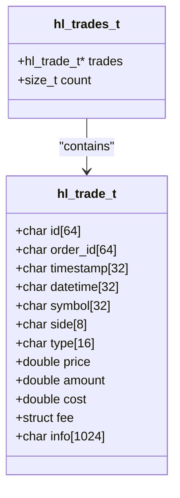
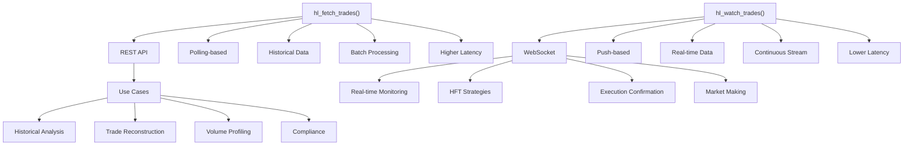

# Recent Trades

<cite>
**Referenced Files in This Document**   
- [trades.c](file://src/trades.c#L104-L191)
- [hl_types.h](file://include/hl_types.h#L25-L33)
- [hyperliquid.h](file://include/hyperliquid.h#L416-L420)
- [hl_error.h](file://include/hl_error.h#L1-L38)
- [websocket.c](file://src/websocket.c#L257-L282)
</cite>

## Table of Contents
1. [Introduction](#introduction)
2. [Core Data Structures](#core-data-structures)
3. [Function Parameters](#function-parameters)
4. [Usage Examples](#usage-examples)
5. [Error Handling](#error-handling)
6. [Use Cases](#use-cases)
7. [WebSocket Comparison](#websocket-comparison)

## Introduction

The `hl_fetch_trades()` function provides access to recent trade data on the Hyperliquid exchange, enabling users to retrieve historical trade information for market analysis and order execution verification. Trade history plays a critical role in understanding market activity by revealing price movements, volume patterns, and liquidity conditions. This endpoint is particularly valuable for confirming order fills, reconstructing trading sequences, and analyzing market microstructure. The function retrieves public trade data through an HTTP POST request to the `/info` endpoint with a `recentTrades` payload, returning a structured array of trade records that can be analyzed programmatically.

**Section sources**
- [trades.c](file://src/trades.c#L104-L191)
- [hyperliquid.h](file://include/hyperliquid.h#L416-L420)

## Core Data Structures

The trade retrieval system uses two primary data structures: `hl_trades_t` and `hl_trade_t`. The `hl_trades_t` structure serves as a container that holds an array of individual trade records and tracks the total count of trades retrieved. It contains a pointer to `hl_trade_t` elements and a `count` field indicating how many trades are stored. The `hl_trade_t` structure represents a single trade with essential market data fields including price, amount, side, timestamp, and symbol. Each trade includes the transaction price (`price`), quantity (`amount`), direction (`side` as "buy" or "sell"), millisecond timestamp (`timestamp`), and trading symbol (`symbol`). Additional fields include the trade ID (`id`), order ID (`order_id`), total cost (`cost`), and fee information. These structures follow CCXT-compatible formatting to ensure consistency with industry standards.

**Diagram sources**
- [hl_types.h](file://include/hl_types.h#L25-L33)

**Section sources**
- [hl_types.h](file://include/hl_types.h#L25-L33)

## Function Parameters

The `hl_fetch_trades()` function accepts five parameters that control the trade data retrieval process. The `client` parameter is a required client instance that handles authentication and connection management. The `symbol` parameter specifies the trading pair for which to retrieve trades (e.g., "BTC" or "ETH"). The `since` parameter allows time-based filtering by specifying a timestamp to retrieve trades only after that point, though it is currently not implemented in the request body. The `limit` parameter controls the response size by specifying the maximum number of trades to return, with values from 1 to 100 supported (default is 50 if not specified). The `trades` parameter is an output pointer where the retrieved trade data will be stored. When `limit` is set to 0, no limit field is included in the request, potentially returning a larger default set of trades.

**Section sources**
- [trades.c](file://src/trades.c#L104-L191)

## Usage Examples

The recent trades endpoint supports various analytical scenarios for market participants. For trade flow analysis, developers can retrieve a batch of recent trades and calculate metrics such as buy/sell imbalance, volume-weighted average price (VWAP), and trade size distribution. To detect large transactions, applications can filter the returned trades by amount threshold, identifying potential institutional activity or significant market moves. For order fill verification, traders can compare their executed orders against the trade history to confirm execution price, timing, and completeness. Volume profiling can be achieved by aggregating trades over specific time intervals to identify periods of high liquidity. The function can also support latency-sensitive monitoring by implementing frequent polling to detect sudden changes in trading activity or price dislocations.

**Section sources**
- [trades.c](file://src/trades.c#L104-L191)

## Error Handling

The function implements comprehensive error handling to manage various failure scenarios. Input validation checks for null pointers in the `client`, `symbol`, and `trades` parameters, returning `HL_ERROR_INVALID_PARAMS` if any required parameter is missing. Network communication errors are handled by checking the HTTP response status and connection results, returning `HL_ERROR_NETWORK` for failed requests or non-200 status codes. JSON parsing errors are detected during response processing and result in `HL_ERROR_JSON` return codes. Memory allocation failures during trade array creation trigger `HL_ERROR_MEMORY`. Empty responses are handled gracefully with `HL_SUCCESS` return code and zero count. Applications should implement retry logic with exponential backoff for network errors and validate the return code before processing the trade data to ensure robust operation in production environments.

**Section sources**
- [trades.c](file://src/trades.c#L104-L191)
- [hl_error.h](file://include/hl_error.h#L1-L38)

## Use Cases

The recent trades endpoint serves multiple critical functions in trading systems. Trade reconstruction allows developers to piece together market activity by analyzing the sequence of trades, helping to understand price formation and market impact. Volume profiling enables the identification of liquidity patterns by aggregating trade sizes over time, which is valuable for algorithmic trading strategies. Latency-sensitive monitoring applications can use frequent calls to detect sudden bursts of trading activity or price movements before they are reflected in other indicators. Market sentiment analysis can be performed by calculating the ratio of buy to sell trades over specific periods. The data also supports backtesting of trading strategies by providing historical execution data for simulation. Additionally, compliance and audit functions can use the trade history to verify trading activity and ensure regulatory requirements are met.

**Section sources**
- [trades.c](file://src/trades.c#L104-L191)

## WebSocket Comparison

While `hl_fetch_trades()` provides historical trade data through REST API calls, WebSocket streams offer real-time trade updates for latency-sensitive applications. The `hl_watch_trades()` WebSocket function establishes a persistent connection that pushes new trades to the client as they occur, eliminating the polling delay inherent in the REST approach. This makes WebSocket ideal for high-frequency trading, real-time dashboards, and immediate execution confirmation. The REST endpoint is better suited for batch processing, historical analysis, and situations where eventual consistency is acceptable. WebSocket connections require more complex connection management but provide lower latency and reduced network overhead for continuous data consumption. Developers should choose REST for on-demand historical queries and WebSocket for real-time market monitoring, with the two approaches often used complementarily in comprehensive trading systems.

**Diagram sources**
- [trades.c](file://src/trades.c#L104-L191)
- [websocket.c](file://src/websocket.c#L257-L282)

**Section sources**
- [trades.c](file://src/trades.c#L104-L191)
- [websocket.c](file://src/websocket.c#L257-L282)