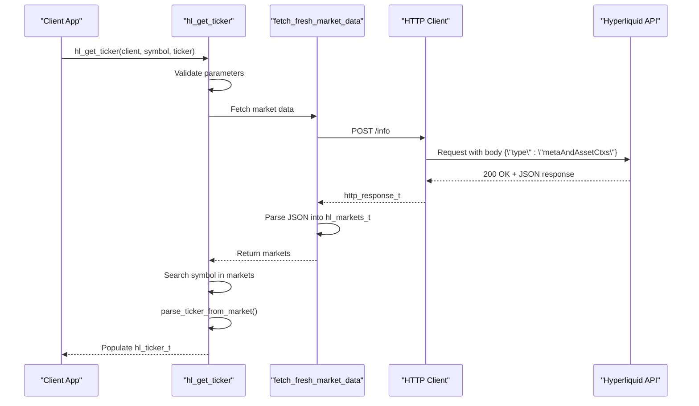
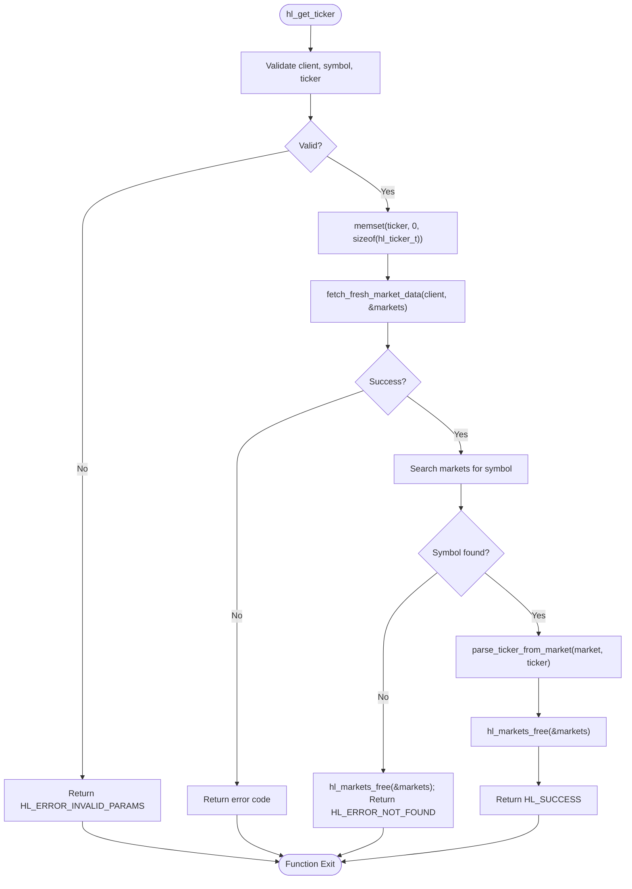
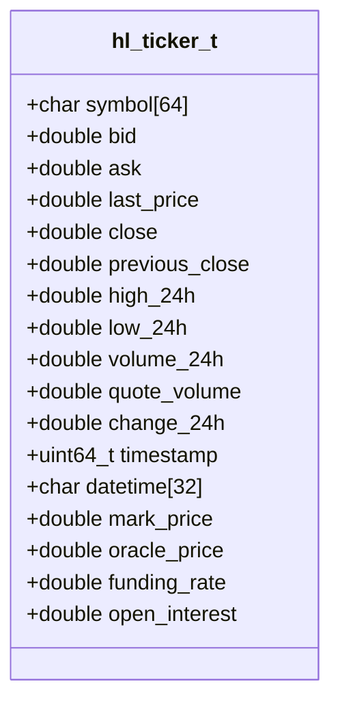

# Ticker Information

<cite>
**Referenced Files in This Document**   
- [src/ticker.c](file://src/ticker.c)
- [include/hyperliquid.h](file://include/hyperliquid.h)
- [include/hl_ticker.h](file://include/hl_ticker.h)
- [include/hl_markets.h](file://include/hl_markets.h)
- [examples/simple_ticker.c](file://examples/simple_ticker.c)
- [src/markets.c](file://src/markets.c)
- [include/hl_http.h](file://include/hl_http.h)
</cite>

## Table of Contents
1. [Introduction](#introduction)
2. [Core Components](#core-components)
3. [Architecture Overview](#architecture-overview)
4. [Detailed Component Analysis](#detailed-component-analysis)
5. [Performance and Optimization](#performance-and-optimization)
6. [Error Handling and Troubleshooting](#error-handling-and-troubleshooting)
7. [Integration and Thread Safety](#integration-and-thread-safety)
8. [Conclusion](#conclusion)

## Introduction
The ticker information retrieval feature provides real-time market data for trading symbols on the Hyperliquid exchange. This document details the implementation of `hl_get_ticker`, which enables clients to fetch current price, volume, and derivative-specific data such as funding rates and open interest. The system is designed for simplicity and reliability, fetching fresh market data from the API endpoint `/info` with type `metaAndAssetCtxs`. It supports both perpetual swap and spot markets, though the primary focus is on perpetual contracts. The feature integrates seamlessly with other market data modules and follows CCXT-compatible data structures for interoperability.

## Core Components

The ticker system consists of three main components: the public API function `hl_get_ticker`, the internal market data fetcher `fetch_fresh_market_data`, and the data parser `parse_ticker_from_market`. These components work together to validate input parameters, retrieve market context from the exchange, and populate the `hl_ticker_t` structure with relevant data. The implementation ensures thread safety through the client's mutex and handles memory allocation and deallocation properly using `calloc` and `hl_markets_free`.

**Section sources**
- [src/ticker.c](file://src/ticker.c#L188-L213)
- [src/ticker.c](file://src/ticker.c#L95-L183)
- [src/ticker.c](file://src/ticker.c#L47-L90)
- [include/hl_ticker.h](file://include/hl_ticker.h#L26-L48)
- [include/hyperliquid.h](file://include/hyperliquid.h#L368-L370)

## Architecture Overview

**Diagram sources**
- [src/ticker.c](file://src/ticker.c#L188-L213)
- [src/ticker.c](file://src/ticker.c#L95-L183)
- [include/hl_http.h](file://include/hl_http.h)

## Detailed Component Analysis

### hl_get_ticker Implementation
The `hl_get_ticker` function serves as the entry point for retrieving ticker data. It begins with parameter validation, ensuring that the client, symbol, and output ticker structure are not null. If any parameter is invalid, it returns `HL_ERROR_INVALID_PARAMS`. After validation, it initializes the ticker structure to zero using `memset`. The function then calls `fetch_fresh_market_data` to retrieve the latest market information from the exchange. Once the market data is obtained, it iterates through the list of markets to find a match for the requested symbol using `strcmp`. Upon finding a match, it parses the market data into the ticker structure and returns success. If no match is found, it returns `HL_ERROR_NOT_FOUND`.

**Diagram sources**
- [src/ticker.c](file://src/ticker.c#L188-L213)

**Section sources**
- [src/ticker.c](file://src/ticker.c#L188-L213)

### Market Data Fetching Process
The `fetch_fresh_market_data` function is responsible for making the HTTP request to retrieve market data. It first obtains the HTTP client from the `hl_client_t` structure using `hl_client_get_http`. It then constructs a POST request with the body `{"type":"metaAndAssetCtxs"}` to the `/info` endpoint of the Hyperliquid API. The base URL is determined by the client's testnet setting. After sending the request, it checks the HTTP status code and parses the JSON response using cJSON. The function extracts the universe and asset contexts from the response and iterates through them to parse each market using `parse_swap_market`. Memory is allocated for the markets array using `calloc`, and any parsing errors result in appropriate error codes being returned. The function ensures proper cleanup by freeing the HTTP response and JSON objects.

**Section sources**
- [src/ticker.c](file://src/ticker.c#L95-L183)
- [src/markets.c](file://src/markets.c#L100-L150)

### Ticker Data Structure
The `hl_ticker_t` structure contains comprehensive market data for a trading symbol. Key fields include:
- **symbol**: Market symbol (e.g., "BTC/USDC:USDC")
- **bid/ask**: Best bid and ask prices (calculated from mark price with 0.01% spread)
- **last_price**: Last trade price (set to mark price)
- **volume_24h**: 24-hour trading volume
- **quote_volume**: 24-hour quote volume
- **timestamp/datetime**: Timestamp in milliseconds and ISO 8601 format
- **mark_price**: Current mark price for perpetuals
- **oracle_price**: Oracle price from the underlying index
- **funding_rate**: Current funding rate (critical for perpetual swaps)
- **open_interest**: Total open interest for the market

Note that some fields like `high_24h`, `low_24h`, and `change_24h` are not available in the current market data and are set to 0.0.

**Diagram sources**
- [include/hl_ticker.h](file://include/hl_ticker.h#L26-L48)
- [include/hyperliquid.h](file://include/hyperliquid.h#L168-L188)

**Section sources**
- [include/hl_ticker.h](file://include/hl_ticker.h#L26-L48)

### Practical Example: simple_ticker.c
The `simple_ticker.c` example demonstrates how to use the ticker API in practice. It creates a client instance with wallet address and private key, specifying testnet mode. It then defines an array of symbols to query and iterates through them, calling `hl_get_ticker` for each. On success, it displays price information (last, bid, ask, spread), volume data, timestamps, and swap-specific metrics (mark price, oracle price, funding rate, open interest). The example includes proper error handling, printing descriptive error messages using `hl_error_string`. It concludes with cleanup by calling `hl_client_destroy`.

**Section sources**
- [examples/simple_ticker.c](file://examples/simple_ticker.c#L1-L105)

## Performance and Optimization

### Frequent Polling Considerations
For applications requiring frequent ticker updates, direct use of `hl_get_ticker` may lead to excessive API calls and network overhead. Each call fetches the complete market data set, which can be inefficient when monitoring multiple symbols. Instead, consider using `hl_fetch_tickers` for batch requests or implementing a WebSocket-based solution with `watch_ticker` for real-time updates with minimal latency.

### Caching Strategies
Implement client-side caching to reduce API load and improve response times:
- Cache the entire `hl_markets_t` structure and refresh it periodically (e.g., every 30 seconds)
- Use the cached markets to serve multiple ticker requests without additional network calls
- Implement a time-to-live (TTL) mechanism to ensure data freshness
- Consider using the client's built-in market cache if available through `hl_client_load_markets`

The current implementation does not use caching within `hl_get_ticker` itself, ensuring data freshness at the cost of higher network usage.

## Error Handling and Troubleshooting

### Error Conditions
The ticker system handles several error conditions:
- **HL_ERROR_INVALID_PARAMS**: Null client, symbol, or ticker pointer
- **HL_ERROR_NETWORK**: HTTP request failure (network issues, DNS resolution)
- **HL_ERROR_API**: Non-200 HTTP status code from the exchange
- **HL_ERROR_PARSE**: JSON parsing failure or malformed response
- **HL_ERROR_MEMORY**: Memory allocation failure during market data fetch
- **HL_ERROR_NOT_FOUND**: Requested symbol not found in available markets

### Common Issues and Solutions
- **Invalid symbol**: Verify the symbol format (e.g., "BTC/USDC:USDC") and check against available markets using `hl_fetch_markets`
- **Network failures**: Ensure internet connectivity and verify API endpoint accessibility
- **Authentication issues**: While ticker data is public, ensure the client is properly initialized
- **Memory leaks**: Always ensure `hl_markets_free` is called (handled internally)
- **Rate limiting**: Implement exponential backoff for retry logic when encountering API limits

## Integration and Thread Safety

### Module Integration
The ticker feature integrates with several other modules:
- **HTTP Client**: Uses `hl_client_get_http` to access the underlying HTTP transport
- **Market Data**: Shares the `hl_markets_t` structure and parsing logic with `markets.c`
- **Error System**: Uses the standard `hl_error_t` enum and `hl_error_string` for consistent error reporting
- **Time Utilities**: Uses standard C time functions for timestamp generation

### Thread Safety
The implementation is thread-safe due to the client's internal mutex. The `hl_client_t` structure contains a `pthread_mutex_t` that is locked during HTTP operations. This ensures that concurrent calls to `hl_get_ticker` from multiple threads will be serialized, preventing race conditions on the HTTP client and shared state. However, applications should still avoid excessive concurrent calls to prevent API rate limiting.

**Section sources**
- [src/client.c](file://src/client.c#L189-L191)
- [include/hl_client.h](file://include/hl_client.h)

## Conclusion
The ticker information retrieval system provides a robust and straightforward interface for accessing real-time market data on Hyperliquid. The `hl_get_ticker` function encapsulates the complexity of HTTP requests, JSON parsing, and data transformation, presenting a clean API to developers. While optimized for correctness and simplicity, performance-conscious applications should consider caching strategies or WebSocket alternatives for high-frequency use cases. The system's integration with the broader SDK architecture ensures consistency in error handling, memory management, and thread safety.