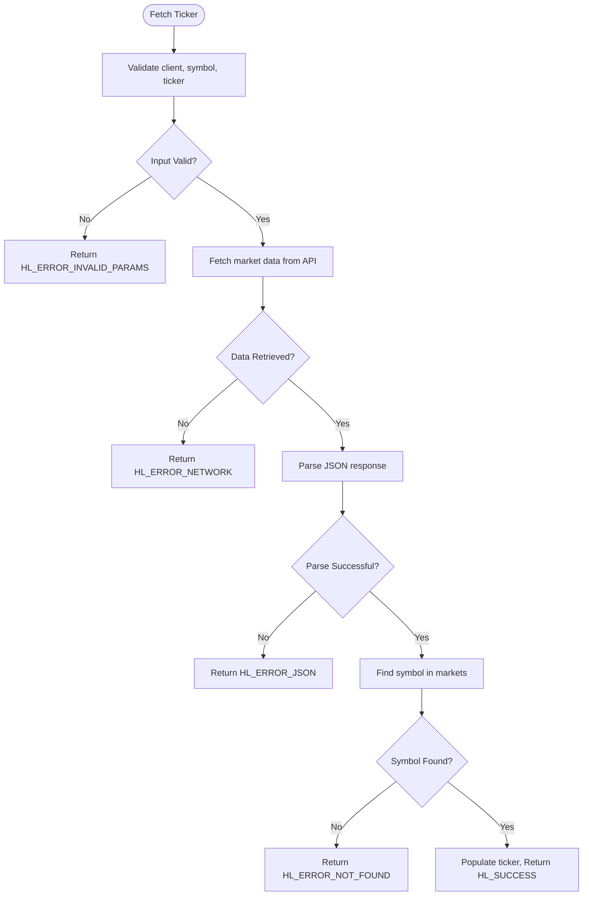

# Ticker

<cite>
**Referenced Files in This Document**   
- [hl_ticker.h](file://include/hl_ticker.h)
- [ticker.c](file://src/ticker.c)
- [simple_ticker.c](file://examples/simple_ticker.c)
- [market_extended.c](file://src/market_extended.c)
- [hl_types.h](file://include/hl_types.h)
- [types.c](file://src/types.c)
</cite>

## Table of Contents
1. [Introduction](#introduction)
2. [Purpose of Ticker Data in Trading](#purpose-of-ticker-data-in-trading)
3. [hl_ticker_t Structure and Fields](#hl_ticker_t-structure-and-fields)
4. [Usage Examples](#usage-examples)
5. [Polling Frequency and Rate Limiting](#polling-frequency-and-rate-limiting)
6. [Error Handling](#error-handling)
7. [Practical Use Cases](#practical-use-cases)
8. [Integration with Other Market Data](#integration-with-other-market-data)

## Introduction

The Hyperliquid C SDK provides real-time ticker data retrieval functionality through the `hl_fetch_ticker()` and related functions. This document details the implementation, usage, and best practices for accessing market ticker information such as last price, 24-hour volume, price changes, and swap-specific metrics like funding rates and open interest. The ticker system enables traders to monitor market conditions and make informed trading decisions based on up-to-date pricing and volume data.

**Section sources**
- [hl_ticker.h](file://include/hl_ticker.h#L74-L74)
- [simple_ticker.c](file://examples/simple_ticker.c#L1-L105)

## Purpose of Ticker Data in Trading

Ticker data plays a critical role in trading decisions by providing real-time market insights. Key metrics include:

- **Last Price**: The most recent trade price, used as a reference for current market value
- **24h Volume**: Total trading volume over the past 24 hours, indicating market activity and liquidity
- **Price Change Metrics**: Percentage change over 24 hours, helping identify trending assets
- **Bid/Ask Spread**: Difference between buying and selling prices, reflecting market depth
- **Funding Rate**: Critical for perpetual swap positions, affecting holding costs
- **Open Interest**: Total outstanding contracts, indicating market participation

These metrics help traders assess market sentiment, identify potential entry/exit points, detect volatility, and manage risk in both spot and derivatives markets.

**Section sources**
- [PHASE5_DAY6_COMPLETE.md](file://PHASE5_DAY6_COMPLETE.md#L16-L56)
- [simple_ticker.c](file://examples/simple_ticker.c#L42-L75)

## hl_ticker_t Structure and Fields

The `hl_ticker_t` structure contains comprehensive market data for a trading symbol:

```c
struct hl_ticker {
    char symbol[64];           /**< Market symbol (e.g., "BTC/USDC:USDC") */
    
    // Price data
    double bid;                /**< Best bid price */
    double ask;                /**< Best ask price */
    double last;               /**< Last traded price */
    double close;              /**< Close price */
    double previous_close;     /**< Previous day close price */

    // Volume data
    double quote_volume;       /**< 24h quote volume */

    // Timestamps
    uint64_t timestamp;        /**< Timestamp in milliseconds */
    char datetime[32];         /**< ISO 8601 formatted datetime */

    // Swap-specific data
    double mark_price;         /**< Mark price for perpetual swaps */
    double oracle_price;       /**< Oracle price from external sources */
    double funding_rate;       /**< Current funding rate */
    double open_interest;      /**< Open interest in base asset */
};
```

Additional fields like 24h high/low and price change percentage are planned for future implementation. The structure is designed to be compatible with CCXT standards while extending support for Hyperliquid-specific swap data.

**Section sources**
- [hl_ticker.h](file://include/hl_ticker.h#L22-L72)
- [PHASE5_DAY6_COMPLETE.md](file://PHASE5_DAY6_COMPLETE.md#L16-L56)

## Usage Examples

### Fetching Ticker for a Single Symbol

```c
hl_ticker_t ticker = {0};
hl_error_t err = hl_get_ticker(client, "BTC/USDC:USDC", &ticker);

if (err == HL_SUCCESS) {
    printf("Last Price: $%.2f\n", ticker.last);
    printf("24h Volume: $%.0f\n", ticker.quote_volume);
    printf("Funding Rate: %.6f%%\n", ticker.funding_rate * 100);
}
```

### Fetching Multiple Tickers

```c
const char* symbols[] = {"BTC/USDC:USDC", "ETH/USDC:USDC"};
hl_tickers_t tickers = {0};

hl_error_t err = hl_fetch_tickers(client, symbols, 2, &tickers);
if (err == HL_SUCCESS) {
    for (size_t i = 0; i < tickers.count; i++) {
        printf("%s: $%.2f\n", 
               tickers.tickers[i].symbol, 
               tickers.tickers[i].last);
    }
    hl_tickers_free(&tickers);
}
```

The `hl_fetch_tickers()` function retrieves mid prices for multiple symbols efficiently, while `hl_get_ticker()` provides more comprehensive data by combining market context information.

**Section sources**
- [simple_ticker.c](file://examples/simple_ticker.c#L42-L75)
- [market_extended.c](file://src/market_extended.c#L14-L135)

## Polling Frequency and Rate Limiting

When retrieving ticker data, consider these guidelines:

- **Real-time Monitoring**: Poll every 1-5 seconds for active trading dashboards
- **Strategic Analysis**: Update every 15-30 seconds for position monitoring
- **Bulk Data Collection**: Use `hl_fetch_tickers()` for multiple symbols to reduce API calls
- **Rate Limiting**: The API may limit frequent requests; implement exponential backoff on errors
- **Efficiency**: Cache results when possible and avoid redundant requests

The `hl_fetch_tickers()` function with the "allMids" endpoint is optimized for bulk requests, making it more efficient than individual symbol queries when monitoring multiple assets.

**Section sources**
- [market_extended.c](file://src/market_extended.c#L14-L135)
- [ticker.c](file://src/ticker.c#L178-L213)

## Error Handling

Common error conditions and their handling:



**Diagram sources**
- [ticker.c](file://src/ticker.c#L178-L213)
- [hl_error.h](file://include/hl_error.h)

**Section sources**
- [ticker.c](file://src/ticker.c#L178-L213)
- [market_extended.c](file://src/market_extended.c#L14-L135)

## Practical Use Cases

### Price Monitoring Dashboard

Implement real-time price tracking for a watchlist of symbols, updating every few seconds to display current prices, 24h volume, and funding rates for perpetual swaps.

### Volatility Detection

Monitor price changes and volume spikes to identify volatile market conditions. High volume combined with significant price movements may indicate breakout opportunities or increased risk.

### Funding Rate Arbitrage

Track funding rates across different perpetual swap pairs to identify arbitrage opportunities between positive and negative funding environments.

### Position Risk Management

Combine ticker data with position information to assess unrealized P&L, liquidation risks, and adjust positions based on current market conditions and funding costs.

**Section sources**
- [simple_ticker.c](file://examples/simple_ticker.c#L42-L75)
- [PHASE5_DAY6_COMPLETE.md](file://PHASE5_DAY6_COMPLETE.md#L16-L56)

## Integration with Other Market Data

Ticker data can be combined with other market information for comprehensive analysis:

- **Order Book Data**: Enhance bid/ask prices with real order book depth
- **OHLCV Data**: Compare current prices with historical trends and patterns
- **Trade History**: Correlate ticker volume with recent trade activity
- **Account Positions**: Monitor ticker changes relative to open positions
- **Market Metadata**: Combine with leverage and margin information for risk assessment

This integration enables sophisticated trading strategies that consider multiple data points simultaneously for better decision-making.

**Section sources**
- [hl_ticker.h](file://include/hl_ticker.h#L74-L94)
- [market_extended.c](file://src/market_extended.c#L14-L135)
- [ticker.c](file://src/ticker.c#L178-L213)