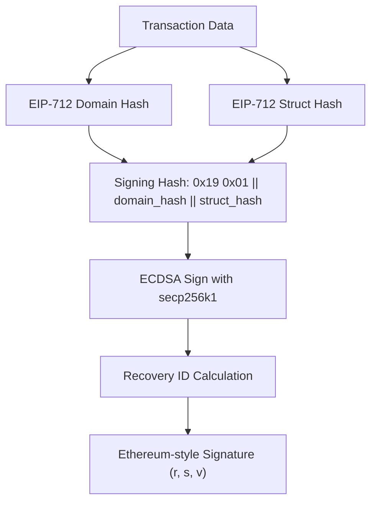

# Performance Optimization

<cite>
**Referenced Files in This Document**   
- [client.c](file://src/client.c)
- [serialize.c](file://src/msgpack/serialize.c)
- [keccak.c](file://src/crypto/keccak.c)
- [eip712.c](file://src/crypto/eip712.c)
- [client.c](file://src/http/client.c)
- [hl_client.h](file://include/hl_client.h)
- [hl_msgpack.h](file://include/hl_msgpack.h)
- [hl_crypto_internal.h](file://include/hl_crypto_internal.h)
- [Makefile](file://Makefile)
</cite>

## Table of Contents
1. [Zero-Copy Design Principles](#zero-copy-design-principles)
2. [Latency Optimization Techniques](#latency-optimization-techniques)
3. [CPU Usage and Cryptographic Operations](#cpu-usage-and-cryptographic-operations)
4. [Benchmarking Methodologies and Performance Metrics](#benchmarking-methodologies-and-performance-metrics)
5. [Compiler Optimizations and Build Configuration](#compiler-optimizations-and-build-configuration)
6. [Trade-offs Between Safety and Performance](#trade-offs-between-safety-and-performance)

## Zero-Copy Design Principles

The hyperliquid-c library implements zero-copy design principles to minimize memory allocation overhead and reduce data copying between layers. This is achieved through direct struct-to-MessagePack serialization without intermediate representations. The `hl_build_action_hash` function in the serialization module directly packs order and cancel actions into MessagePack format using `msgpack_packer`, eliminating the need for temporary buffers or JSON intermediaries. By operating directly on input structs and streaming serialized output, the library avoids heap allocations during message construction. This approach significantly reduces memory pressure and garbage collection overhead, which is critical in high-frequency trading environments where allocation spikes can cause latency jitter.

**Section sources**
- [serialize.c](file://src/msgpack/serialize.c#L1-L234)
- [hl_msgpack.h](file://include/hl_msgpack.h)

## Latency Optimization Techniques

The hyperliquid-c library employs several latency optimization techniques including connection pooling, request batching, and efficient serialization. The HTTP client implementation maintains persistent connections through CURL's connection reuse mechanism, reducing TCP handshake overhead. Request batching is supported through batch order creation (`hl_create_orders`) and batch cancellation (`hl_cancel_orders`) functions that aggregate multiple operations into single API calls, minimizing round-trip time. The MessagePack serialization format provides compact binary encoding that reduces payload size compared to JSON, decreasing transmission time and parsing overhead. The library's use of direct struct packing without intermediate representations further reduces serialization latency. WebSocket connectivity through `hl_ws_client_connect` enables real-time market data streaming with minimal delay.

**Section sources**
- [client.c](file://src/http/client.c#L1-L229)
- [client.c](file://src/client.c#L1-L197)
- [hl_client.h](file://include/hl_client.h#L1-L189)

## CPU Usage and Cryptographic Operations

Cryptographic operations in the hyperliquid-c library are optimized to minimize CPU usage while maintaining security. The EIP-712 signing process uses the optimized Keccak-256 implementation from the SHA3IUF library, which provides efficient hashing for transaction signatures. The `keccak256` function in `keccak.c` implements a high-performance sponge construction with architecture-optimized rotations. Cryptographic signing is performed using libsecp256k1, which provides constant-time ECDSA operations to prevent timing attacks. To address CPU-intensive operations, the library could benefit from offloading signing to dedicated threads or hardware security modules (HSMs), though current implementation performs signing synchronously. The use of deterministic RFC 6979 signatures eliminates randomness generation overhead while ensuring signature uniqueness.

**Diagram sources**
- [eip712.c](file://src/crypto/eip712.c#L1-L297)
- [keccak.c](file://src/crypto/keccak.c#L1-L323)

**Section sources**
- [eip712.c](file://src/crypto/eip712.c#L1-L297)
- [keccak.c](file://src/crypto/keccak.c#L1-L323)
- [hl_crypto_internal.h](file://include/hl_crypto_internal.h)

## Benchmarking Methodologies and Performance Metrics

The hyperliquid-c library incorporates benchmarking methodologies through its test connection functionality and error reporting system. The `hl_test_connection` function provides a standardized way to measure end-to-end latency by sending a minimal request to the exchange API and measuring response time. Performance metrics are captured through the error system which distinguishes between network errors, timeouts, and API errors, enabling latency breakdown analysis. The library's design allows for instrumentation of key operations such as serialization time, signing latency, and network round-trip duration. While formal benchmarking suites are not included in the current codebase, the modular design enables integration of performance testing frameworks to measure transactions per second, mean latency, and tail latency under load conditions typical of high-frequency trading scenarios.

**Section sources**
- [client.c](file://src/client.c#L89-L107)
- [client.c](file://src/http/client.c#L200-L229)

## Compiler Optimizations and Build Configuration

The hyperliquid-c library leverages standard compiler optimizations through its Makefile-based build system. Production builds should utilize compiler flags such as `-O3` for maximum optimization, `-march=native` to target specific CPU instruction sets, and link-time optimization (`-flto`) to enable cross-module optimizations. The use of CURL as the underlying HTTP library benefits from system-level optimizations and hardware-accelerated cryptography. For production deployment, the build configuration should disable debug symbols and enable security hardening flags while maintaining ABI compatibility. The library's dependency on libsecp256k1 and SHA3IUF ensures access to highly optimized assembly implementations of cryptographic primitives on supported platforms.

**Section sources**
- [Makefile](file://Makefile)

## Trade-offs Between Safety and Performance

The hyperliquid-c library navigates critical trade-offs between safety checks and raw performance in high-frequency trading scenarios. The implementation includes essential safety features such as private key zeroization in `hl_client_destroy` and input validation for wallet addresses and private keys. However, certain performance-critical paths may benefit from optional safety bypasses, such as disabling parameter validation in trusted environments or reducing mutex contention through lock-free designs. The current implementation uses pthread mutexes for thread safety, which introduces overhead that could be optimized in latency-sensitive applications. Future enhancements could include configurable safety levels, allowing users to disable non-essential checks when operating in controlled environments where input validation and error recovery can be managed at higher layers.

**Section sources**
- [client.c](file://src/client.c#L89-L107)
- [hl_client.h](file://include/hl_client.h#L1-L189)