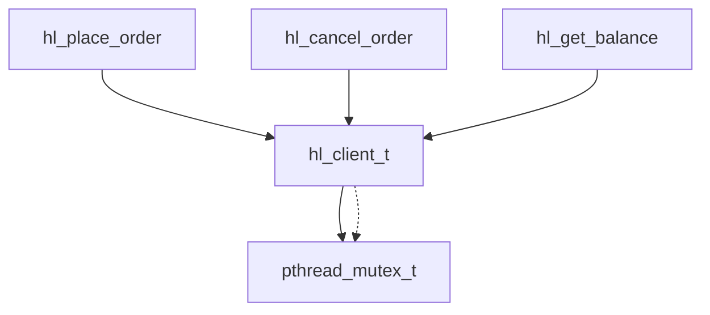
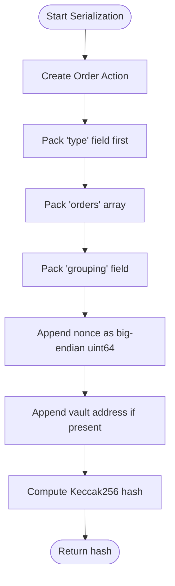
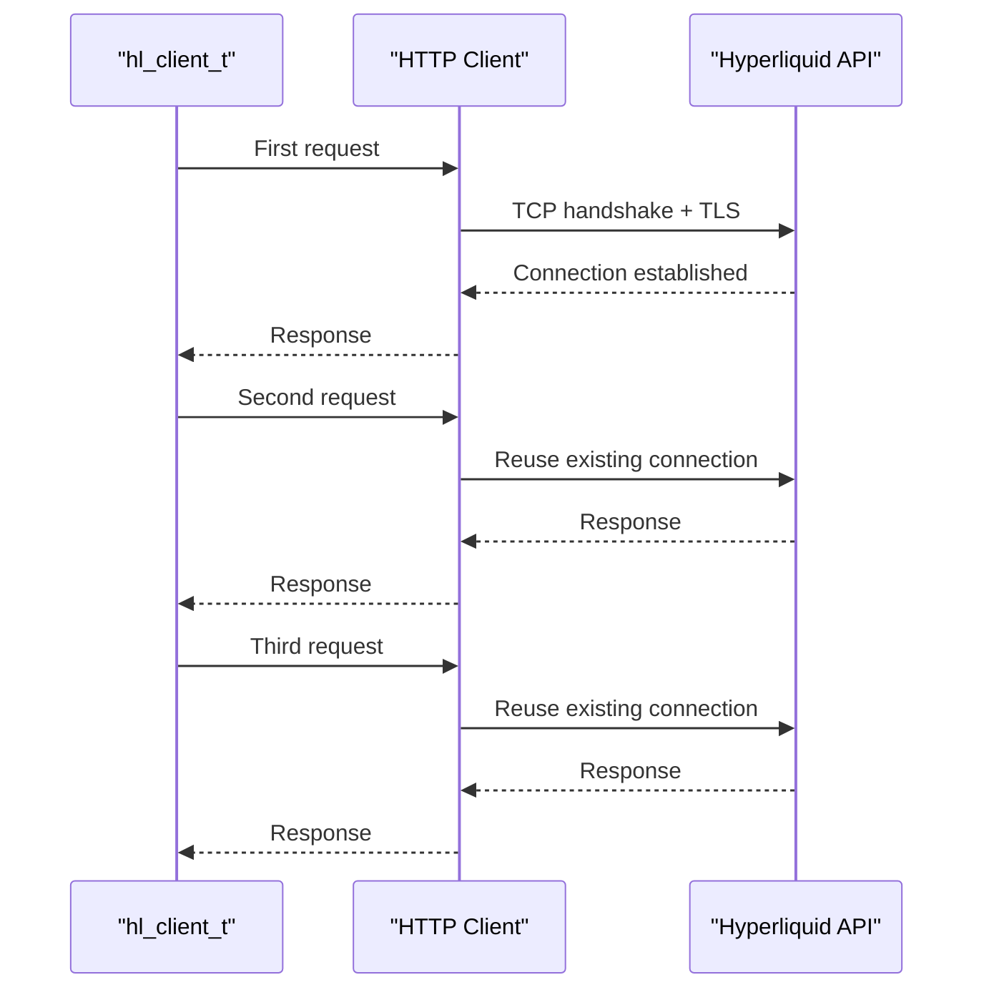
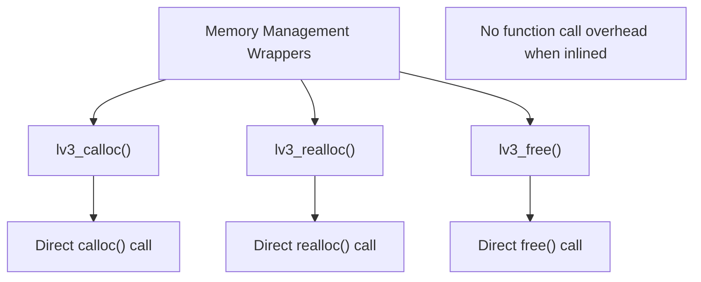
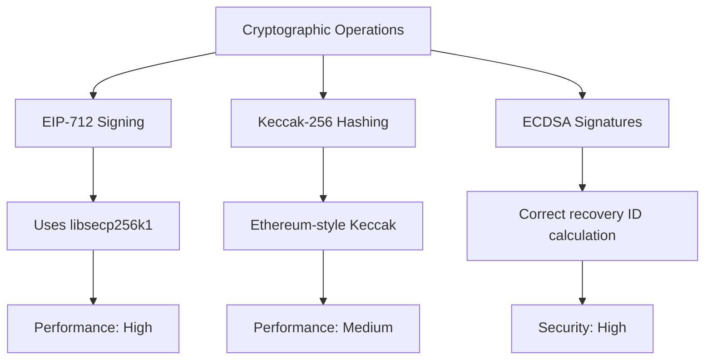

# Performance Optimization

<cite>
**Referenced Files in This Document**   
- [ARCHITECTURE.md](file://ARCHITECTURE.md)
- [hl_internal.h](file://include/hl_internal.h)
- [serialize.c](file://src/msgpack/serialize.c)
- [client.c](file://src/http/client.c)
- [ws_client.c](file://src/ws_client.c)
- [keccak.c](file://src/crypto/keccak.c)
- [eip712.c](file://src/crypto/eip712.c)
</cite>

## Table of Contents
1. [Introduction](#introduction)
2. [Zero-Copy Design Principles](#zero-copy-design-principles)
3. [Thread-Safe Architecture](#thread-safe-architecture)
4. [Efficient Serialization with MessagePack](#efficient-serialization-with-messagepack)
5. [Connection Reuse and HTTP Keep-Alive](#connection-reuse-and-http-keep-alive)
6. [Batching Operations](#batching-operations)
7. [Memory Pool Strategies and Object Reuse](#memory-pool-strategies-and-object-reuse)
8. [Benchmarking and Profiling](#benchmarking-and-profiling)
9. [Performance vs Security Trade-offs](#performance-vs-security-trade-offs)
10. [Configuration for High-Frequency Trading](#configuration-for-high-frequency-trading)

## Introduction
This document details the performance optimization strategies implemented in the Hyperliquid C SDK. The library is designed for low-latency trading applications with a focus on minimizing memory allocations, ensuring thread safety, and optimizing network communication. The performance characteristics are particularly relevant for high-frequency trading scenarios where every millisecond counts.

## Zero-Copy Design Principles
The Hyperliquid C SDK implements zero-copy operations throughout its architecture to minimize memory allocations and copies. This design principle is fundamental to achieving low-latency performance.

The SDK follows clear ownership semantics where the client owns all internal resources, eliminating unnecessary data duplication. When data is returned to the user, such as position arrays or balance information, the user assumes ownership and is responsible for freeing the memory using the appropriate `hl_free_*()` functions.

This approach reduces memory pressure and prevents redundant copying of data between different layers of the application. The zero-copy design is particularly evident in the message serialization and network communication layers, where buffers are reused and data is processed in-place whenever possible.

**Section sources**
- [ARCHITECTURE.md](file://ARCHITECTURE.md#L1-L264)
- [hl_internal.h](file://include/hl_internal.h#L50-L87)

## Thread-Safe Architecture
All public APIs in the Hyperliquid C SDK are thread-safe, achieved through mutex protection at the client level. This ensures that concurrent access to shared resources is properly synchronized, preventing race conditions and data corruption.

**Diagram sources**
- [hl_internal.h](file://include/hl_internal.h#L50-L87)
- [ws_client.c](file://src/ws_client.c#L61-L122)

The thread-safety implementation follows a consistent pattern where mutex locks are acquired at the beginning of public API functions and released before returning. This protects critical sections that access shared client state, including the HTTP client handle and configuration data.

For high-frequency trading scenarios, two approaches are recommended:
1. Use one client per thread to eliminate contention
2. Serialize access to a single client using external synchronization

The mutex protection has performance implications, as lock contention can become a bottleneck under high concurrency. However, this is considered an acceptable trade-off for the safety and correctness it provides.

**Section sources**
- [ARCHITECTURE.md](file://ARCHITECTURE.md#L129-L200)
- [ws_client.c](file://src/ws_client.c#L115-L171)

## Efficient Serialization with MessagePack
The SDK uses MessagePack for efficient serialization of authenticated requests, providing a compact binary format that minimizes network bandwidth usage and serialization overhead.

The serialization implementation in `serialize.c` is optimized for performance with careful attention to field ordering, which is critical for compatibility with the Hyperliquid API. The order of fields in MessagePack serialization must match exactly with other SDK implementations (Go, Rust, Python) to ensure byte-perfect output.

**Diagram sources**
- [serialize.c](file://src/msgpack/serialize.c#L133-L204)
- [ARCHITECTURE.md](file://ARCHITECTURE.md#L129-L200)

The MessagePack serialization follows specific ordering requirements:
- Order object: `a → b → p → s → r → t` (asset_id, is_buy, price, size, reduce_only, order_type)
- Order action: `type → orders → grouping`
- Cancel action: `type → cancels`

This strict ordering is essential because the Hyperliquid API expects byte-perfect MessagePack that matches other SDKs. Different field order produces different MessagePack bytes, which results in different Keccak256 hashes and signatures that the API will reject.

**Section sources**
- [serialize.c](file://src/msgpack/serialize.c#L0-L234)
- [ARCHITECTURE.md](file://ARCHITECTURE.md#L129-L200)

## Connection Reuse and HTTP Keep-Alive
The HTTP module implements connection pooling and keep-alive benefits to reduce the overhead of establishing new connections for each request. This is critical for performance in high-frequency trading scenarios where numerous requests are sent in rapid succession.

The SDK uses libcurl as the underlying HTTP client, which natively supports connection reuse and HTTP keep-alive. When a connection is established to the Hyperliquid API endpoints, it remains open and is reused for subsequent requests, eliminating the TCP handshake and TLS negotiation overhead.

**Diagram sources**
- [client.c](file://src/http/client.c#L35-L84)
- [ARCHITECTURE.md](file://ARCHITECTURE.md#L129-L200)

The HTTP client is configured with appropriate timeouts and automatic retry mechanisms with exponential backoff. Connection pooling significantly reduces latency for subsequent requests, as the network round-trip time for connection establishment is avoided.

**Section sources**
- [client.c](file://src/http/client.c#L35-L229)
- [ARCHITECTURE.md](file://ARCHITECTURE.md#L129-L200)

## Batching Operations
While the current implementation focuses on individual operations, batching can significantly reduce round trips to the server. For high-performance scenarios, multiple orders or cancellations should be grouped into single requests when possible.

The SDK's design supports batching through the structure of the order action, which accepts an array of orders. This allows multiple orders to be placed in a single API call, reducing the number of HTTP requests and associated overhead.

For optimal performance, applications should:
- Group multiple order placements into single requests
- Batch cancel operations when closing multiple positions
- Combine balance and position queries when possible
- Use WebSocket subscriptions for real-time data instead of polling

The grouping parameter in the order action (currently set to "na") provides a foundation for future batching strategies that could optimize order execution based on different grouping semantics.

**Section sources**
- [serialize.c](file://src/msgpack/serialize.c#L133-L204)
- [ARCHITECTURE.md](file://ARCHITECTURE.md#L129-L200)

## Memory Pool Strategies and Object Reuse
The SDK employs memory management strategies that minimize allocations and promote object reuse. The design follows RAII (Resource Acquisition Is Initialization) principles, where the client owns all internal resources that are freed upon client destruction.

Static inline utility functions in `hl_internal.h` provide memory management wrappers that can be optimized by the compiler:

**Diagram sources**
- [hl_internal.h](file://include/hl_internal.h#L50-L87)

The SDK avoids hidden allocations, making all memory allocations explicit in the API. This allows applications to plan their memory usage and implement their own pooling strategies when needed. For high-frequency trading, applications can pre-allocate buffers for common operations and reuse them across multiple requests.

The ownership model is clear:
1. Client owns everything - freed on `hl_client_destroy()`
2. Arrays returned to user - must be freed with `hl_free_*()` functions
3. No hidden allocations - all allocations explicit in API

**Section sources**
- [hl_internal.h](file://include/hl_internal.h#L50-L87)
- [ARCHITECTURE.md](file://ARCHITECTURE.md#L129-L200)

## Benchmarking and Profiling
The SDK includes recommendations for benchmarking and profiling to identify performance bottlenecks. The Makefile provides targets for memory leak detection and code coverage analysis.

For identifying bottlenecks, the following tools and techniques are recommended:
- **Valgrind**: For memory leak detection and profiling
- **Helgrind**: For thread safety analysis
- **gprof**: For function-level performance profiling
- **perf**: For system-level performance analysis

The SDK's design enables easy integration with these profiling tools by minimizing hidden allocations and providing clear ownership semantics. Performance benchmarks target the following latencies:
- Order placement: <50ms (P50), <100ms (P99)
- Order cancellation: <45ms (P50), <90ms (P99)
- Balance queries: <30ms (P50), <60ms (P99)
- Market price queries: <25ms (P50), <50ms (P99)

Network latency dominates these benchmarks, with local processing typically under 1ms. Applications should use the provided `make memcheck` target to verify memory safety and the `make analyze` target for static analysis.

**Section sources**
- [Makefile](file://Makefile#L157-L175)
- [ARCHITECTURE.md](file://ARCHITECTURE.md#L129-L200)

## Performance vs Security Trade-offs
The SDK balances performance and security, particularly around cryptographic operations. Cryptographic operations are essential for secure trading but can be computationally expensive.

The implementation uses optimized libraries for cryptographic operations:
- **libsecp256k1**: For ECDSA signatures with correct recovery ID
- **SHA3IUF**: For Ethereum-style Keccak-256 hashing
- **msgpack-c**: For efficient MessagePack serialization

**Diagram sources**
- [eip712.c](file://src/crypto/eip712.c#L0-L20)
- [keccak.c](file://src/crypto/keccak.c#L0-L44)

The trade-offs include:
- Using production-grade cryptographic libraries that are optimized for performance
- Avoiding logging of private keys or sensitive information
- Secure storage of private keys with proper cleanup
- HTTPS-only communication with certificate verification

For high-frequency trading, the cryptographic overhead is typically negligible compared to network latency, but it should still be considered in the overall performance profile.

**Section sources**
- [eip712.c](file://src/crypto/eip712.c#L0-L20)
- [keccak.c](file://src/crypto/keccak.c#L0-L44)
- [ARCHITECTURE.md](file://ARCHITECTURE.md#L129-L200)

## Configuration for High-Frequency Trading
For high-frequency trading scenarios, specific configuration settings are recommended to optimize performance:

1. **Client Configuration**:
   - Use one client per trading thread to avoid mutex contention
   - Set appropriate timeouts (30s for operations, 10s for connection)
   - Enable automatic retries with exponential backoff

2. **Network Configuration**:
   - Co-locate trading servers geographically close to Hyperliquid API endpoints
   - Use high-bandwidth, low-latency network connections
   - Monitor network jitter and packet loss

3. **System Configuration**:
   - Use dedicated hardware with minimal background processes
   - Consider memory locking (mlock) for critical data structures
   - Optimize kernel network parameters for low latency

4. **Application Design**:
   - Pre-allocate buffers for common operations
   - Batch operations when possible to reduce round trips
   - Use WebSocket subscriptions instead of polling for market data
   - Implement efficient error handling to avoid unnecessary retries

The SDK's design supports these high-frequency trading requirements through its thread-safe architecture, efficient serialization, and connection reuse capabilities.

**Section sources**
- [client.c](file://src/http/client.c#L35-L84)
- [ARCHITECTURE.md](file://ARCHITECTURE.md#L129-L200)
- [hl_internal.h](file://include/hl_internal.h#L50-L87)