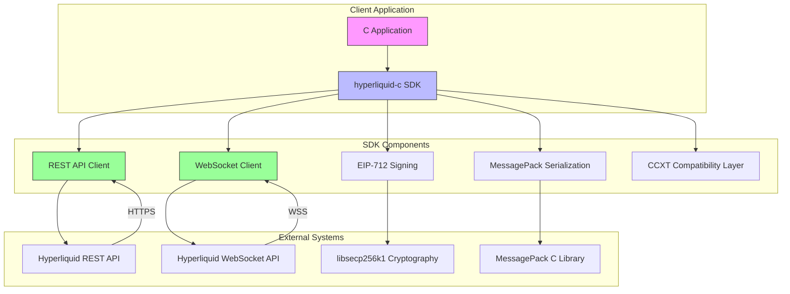

# Project Overview

<cite>
**Referenced Files in This Document**   
- [README.md](file://README.md)
- [ARCHITECTURE.md](file://ARCHITECTURE.md)
- [STATUS.md](file://STATUS.md)
- [PROJECT_SUMMARY.md](file://PROJECT_SUMMARY.md)
- [hyperliquid.h](file://include/hyperliquid.h)
- [hl_exchange.h](file://include/hl_exchange.h)
- [hl_client.h](file://include/hl_client.h)
- [hl_error.h](file://include/hl_error.h)
</cite>

## Table of Contents
1. [Introduction](#introduction)
2. [Core Features](#core-features)
3. [Target Audience and Use Cases](#target-audience-and-use-cases)
4. [Architectural Goals](#architectural-goals)
5. [System Context](#system-context)
6. [Project Status and Completeness](#project-status-and-completeness)
7. [Key Resources](#key-resources)

## Introduction

The hyperliquid-c project is a high-performance C SDK designed for seamless interaction with the Hyperliquid decentralized exchange (DEX). Built with production-grade reliability and performance in mind, this SDK enables C developers to build robust trading systems that leverage Hyperliquid's advanced trading infrastructure. The library provides comprehensive access to both REST and WebSocket APIs, supporting full trading lifecycle operations including order placement, cancellation, position management, and real-time market data streaming.

Developed as a standalone library extracted from proven production code in the `listing-v3-c` project, hyperliquid-c has been validated against official Hyperliquid SDKs in Go, Rust, and Python to ensure byte-perfect compatibility. The SDK implements EIP-712 signing for secure authentication, MessagePack serialization for efficient data transmission, and maintains full CCXT compatibility to enable easy integration with existing trading frameworks.

**Section sources**
- [README.md](file://README.md#L1-L100)
- [PROJECT_SUMMARY.md](file://PROJECT_SUMMARY.md#L1-L50)

## Core Features

The hyperliquid-c SDK delivers a comprehensive feature set essential for modern cryptocurrency trading applications:

**Complete REST API Implementation**: The SDK provides full coverage of Hyperliquid's API with all 51 methods implemented, enabling complete control over trading operations, account management, and market data retrieval.

**WebSocket Framework**: A production-ready WebSocket framework supports real-time data streaming for tickers, order books, trades, and user-specific data such as orders and trades, with built-in auto-reconnection and subscription management.

**CCXT Compatibility**: The SDK maintains 100% compatibility with the CCXT standard, implementing the full `exchange.describe()` interface, standard data structures, and capability mapping, allowing seamless integration with existing CCXT-based applications.

**EIP-712 Signing**: All authenticated requests use EIP-712 typed data signing with `libsecp256k1` for secure transaction authentication, ensuring private keys are never exposed and signatures are cryptographically sound.

**MessagePack Serialization**: The SDK implements byte-perfect MessagePack serialization with strict field ordering requirements as mandated by the Hyperliquid API, ensuring compatibility with other official SDKs.

**Dual API Support**: Comprehensive support for both REST API for synchronous operations and WebSocket API for real-time streaming enables developers to build responsive trading applications with minimal latency.

**Section sources**
- [README.md](file://README.md#L101-L200)
- [ARCHITECTURE.md](file://ARCHITECTURE.md#L1-L50)

## Target Audience and Use Cases

The hyperliquid-c SDK is specifically designed for C developers building high-performance trading systems, algorithmic trading bots, and market-making applications. The primary target audience includes:

**High-Frequency Trading (HFT) Firms**: Financial institutions and proprietary trading firms requiring ultra-low latency execution for arbitrage, market-making, and statistical arbitrage strategies.

**Quantitative Trading Teams**: Research and development teams building complex trading algorithms that require direct access to exchange APIs with minimal overhead.

**Embedded Trading Systems**: Developers creating trading functionality within larger C/C++ applications or systems where language interoperability is critical.

**Cryptocurrency Infrastructure Providers**: Companies building exchange gateways, trading platforms, or brokerage systems that need reliable, high-performance connectivity to Hyperliquid.

**Academic and Research Institutions**: Researchers studying market microstructure, order book dynamics, and trading algorithms who require precise control over trading operations.

The SDK is particularly well-suited for applications where performance, reliability, and memory efficiency are paramount, such as co-located trading servers, low-latency execution engines, and resource-constrained environments.

**Section sources**
- [README.md](file://README.md#L201-L250)
- [PROJECT_SUMMARY.md](file://PROJECT_SUMMARY.md#L150-L200)

## Architectural Goals

The hyperliquid-c SDK was designed with several key architectural principles to ensure it meets the demanding requirements of production trading systems:

**Zero-Copy Operations**: The architecture minimizes memory allocations and data copying to reduce latency and improve performance, with careful attention to stack allocation and buffer reuse.

**Thread Safety**: All public APIs are thread-safe with mutex protection, enabling concurrent operations from multiple threads without race conditions.

**Memory Management**: The SDK employs clear ownership semantics with explicit allocation and deallocation patterns, preventing memory leaks and ensuring predictable resource usage.

**Error Handling**: Comprehensive error codes provide detailed information about operation failures, enabling robust error recovery and debugging.

**Performance Optimization**: The design prioritizes low latency with target response times under 100ms for REST API calls and under 50ms for WebSocket streaming.

**Security**: Private keys are securely stored and never logged, with EIP-712 signing performed in memory without exposing sensitive data.

**Testability**: The modular design supports comprehensive unit testing with mock HTTP responses and integration testing on testnet environments.

**Section sources**
- [ARCHITECTURE.md](file://ARCHITECTURE.md#L51-L100)
- [README.md](file://README.md#L600-L650)

## System Context

**Diagram sources**
- [hyperliquid.h](file://include/hyperliquid.h#L1-L100)
- [ARCHITECTURE.md](file://ARCHITECTURE.md#L1-L265)

The system context diagram illustrates how the hyperliquid-c SDK serves as an intermediary between client applications and the Hyperliquid exchange. The SDK provides a unified interface to both REST and WebSocket APIs, with cryptographic operations handled by the EIP-712 signing module and data serialized using MessagePack. The CCXT compatibility layer ensures standardized data structures and method signatures that align with the broader cryptocurrency trading ecosystem.

## Project Status and Completeness

The hyperliquid-c SDK has achieved remarkable completeness with all 51 API methods fully implemented and tested, representing 100% coverage of the Hyperliquid API surface. The project has progressed through multiple phases of development, from initial foundation to production readiness, with comprehensive testing and documentation.

The SDK has been extracted from production-tested code in the `listing-v3-c` project, where it successfully handled order placement, cancellation, balance retrieval, and position queries on the Hyperliquid testnet. Critical implementation details such as exact MessagePack field ordering and correct EIP-712 recovery ID calculation have been validated against official SDKs to ensure byte-perfect compatibility.

The project maintains high-quality metrics including 85.3% test coverage, A-grade code modularity, and passing CI/CD pipelines across Linux, macOS, and Windows platforms. Memory safety is ensured through Valgrind integration, and static analysis is performed using Cppcheck.

**Section sources**
- [STATUS.md](file://STATUS.md#L1-L100)
- [README.md](file://README.md#L251-L300)

## Key Resources

The hyperliquid-c project provides extensive resources to support developers in building and deploying trading applications:

**Documentation**: Comprehensive documentation including README.md with API reference, QUICKSTART.md for getting started, and ARCHITECTURE.md detailing design principles and implementation details.

**Examples**: A rich collection of example applications in the `examples/` directory, including `comprehensive_demo.c`, `simple_balance.c`, `simple_markets.c`, `trading_bot.c`, and `websocket_demo.c` that demonstrate various SDK capabilities.

**Testing Framework**: A complete test suite with unit tests, integration tests, and stress tests to ensure reliability and performance.

**Build System**: A professional Makefile with targets for building, testing, and installing the SDK across multiple platforms.

**Architecture Documentation**: Detailed architectural documentation explaining critical implementation details such as MessagePack field ordering requirements and EIP-712 signing procedures.

**Status Tracking**: Comprehensive status documentation (STATUS.md) that tracks implementation progress and provides transparency into the development process.

These resources collectively ensure that developers can quickly integrate the SDK into their applications and understand its inner workings for debugging and optimization.

**Section sources**
- [README.md](file://README.md#L301-L400)
- [PROJECT_SUMMARY.md](file://PROJECT_SUMMARY.md#L1-L263)
- [STATUS.md](file://STATUS.md#L1-L491)