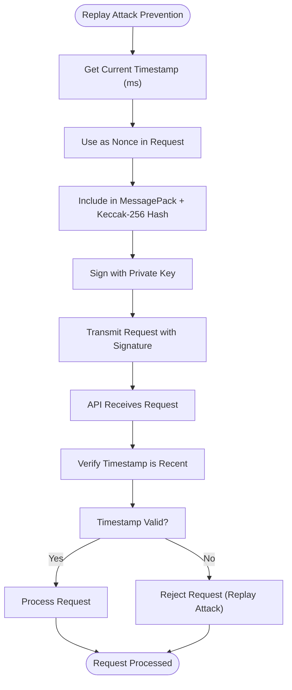

# EIP-712 Signing

<cite>
**Referenced Files in This Document**   
- [eip712.c](file://src/crypto/eip712.c)
- [keccak.c](file://src/crypto/keccak.c)
- [serialize.c](file://src/msgpack/serialize.c)
- [trading.c](file://src/trading.c)
- [hl_crypto_internal.h](file://include/hl_crypto_internal.h)
- [hl_msgpack.h](file://include/hl_msgpack.h)
</cite>

## Table of Contents
1. [Introduction](#introduction)
2. [EIP-712 Implementation Overview](#eip-712-implementation-overview)
3. [Domain Separator Construction](#domain-separator-construction)
4. [Message Hashing with Keccak-256](#message-hashing-with-keccak-256)
5. [ECDSA Signature Generation with libsecp256k1](#ecdsa-signature-generation-with-libsecp256k1)
6. [MessagePack Serialization](#messagepack-serialization)
7. [Order Placement Workflow](#order-placement-workflow)
8. [Balance Query and Account Requests](#balance-query-and-account-requests)
9. [Replay Attack Prevention](#replay-attack-prevention)
10. [Common Issues and Troubleshooting](#common-issues-and-troubleshooting)
11. [Performance Considerations](#performance-considerations)
12. [Conclusion](#conclusion)

## Introduction
This document provides a comprehensive analysis of the EIP-712 signing implementation used for Hyperliquid API authentication. The implementation leverages Ethereum-style cryptographic signatures to authenticate trading operations, ensuring message integrity and user identity verification. The system combines EIP-712 typed data signing with MessagePack serialization and ECDSA cryptography to create a secure authentication mechanism for API requests.

## EIP-712 Implementation Overview
The EIP-712 signing implementation provides a structured approach to signing typed data for Hyperliquid API authentication. The process involves constructing a domain separator, serializing messages using MessagePack, hashing with Keccak-256, and generating ECDSA signatures using libsecp256k1. This implementation ensures that API requests are authenticated and tamper-proof, preventing unauthorized access to trading accounts.

The signing workflow follows a multi-step process:
1. Construct the EIP-712 domain separator
2. Serialize trading requests into MessagePack format
3. Hash the serialized message with Keccak-256
4. Generate ECDSA signatures using libsecp256k1
5. Include the signature in API requests

This approach provides a secure method for authenticating API requests while maintaining compatibility with Ethereum's cryptographic standards.

**Section sources**
- [eip712.c](file://src/crypto/eip712.c#L260-L295)
- [trading.c](file://src/trading.c#L216-L250)

## Domain Separator Construction
The domain separator construction follows the EIP-712 specification for typed data signing. The implementation creates a domain hash using the domain name "Exchange", chain ID 1337, version "1", and a zero verifying contract address. This domain separator ensures that signatures are specific to the Hyperliquid exchange and cannot be reused across different domains.

The domain hash is computed by concatenating the typehash for "EIP712Domain" with the hashed components of the domain (name, version, chainId, and verifyingContract), then applying Keccak-256 to the concatenated data. This creates a unique domain separator that binds all signed messages to the Hyperliquid exchange context.

The domain separator prevents signature replay attacks across different applications and ensures that signed messages are only valid within the intended domain context.

**Diagram sources**
- [eip712.c](file://src/crypto/eip712.c#L200-L230)

## Message Hashing with Keccak-256
Message hashing is performed using the Keccak-256 algorithm, implemented through the SHA3IUF library. The implementation specifically uses Ethereum-style Keccak (not NIST SHA3) to ensure compatibility with Ethereum's cryptographic standards. The keccak256 function takes input data and produces a 32-byte hash output.

The hashing process is used at multiple stages:
1. Computing the domain separator hash
2. Hashing the Agent struct
3. Creating the final signing hash
4. Hashing MessagePack-serialized actions with nonce and vault address

The implementation ensures that all hash computations follow the Ethereum Keccak-256 standard, producing identical results to other Ethereum-compatible systems. This consistency is critical for interoperability and verification of signatures.

**Section sources**
- [keccak.c](file://src/crypto/keccak.c#L0-L323)
- [eip712.c](file://src/crypto/eip712.c#L0-L297)

## ECDSA Signature Generation with libsecp256k1
ECDSA signature generation is implemented using the libsecp256k1 library, which provides production-grade elliptic curve cryptography. The implementation follows RFC 6979 for deterministic signature generation, ensuring that the same message and private key always produce the same signature.

A critical aspect of the implementation is the recovery ID calculation. The system derives the public key from the private key, computes the expected Ethereum address, and tests all four possible recovery IDs (0-3) to find which one recovers to the correct address. The v value in the signature is set to recovery_id + 27, following Ethereum's signature format.

This approach ensures that signatures are compatible with Ethereum's signature verification process and can be properly recovered by the Hyperliquid API.

**Diagram sources**
- [eip712.c](file://src/crypto/eip712.c#L100-L180)

## MessagePack Serialization
MessagePack serialization is a critical component of the signing process, with field ordering being particularly important. The implementation ensures that fields are serialized in the exact order expected by the Hyperliquid API, as any deviation would result in a different hash and signature.

For order objects, the field order must be: a (asset_id), b (is_buy), p (price), s (size), r (reduce_only), t (order_type). For order actions, the order must be: type, orders, grouping. This specific ordering is essential because different field orders produce different MessagePack byte sequences, leading to different hashes and signatures that would be rejected by the API.

The serialization process converts trading requests into a compact binary format before hashing, ensuring efficient transmission and consistent interpretation across different platforms.

**Diagram sources**
- [serialize.c](file://src/msgpack/serialize.c#L50-L100)

## Order Placement Workflow
The order placement workflow demonstrates the complete signing process for placing a limit order on Hyperliquid. The process begins with constructing an order structure containing the asset ID, buy/sell direction, price, size, and order type. This structure is then serialized to MessagePack format, combined with a nonce (timestamp in milliseconds), and hashed using Keccak-256 to create the connection_id.

The connection_id serves as the struct hash in the EIP-712 signing process. This hash is combined with the domain separator hash according to EIP-191 (0x19 0x01 || domain_hash || struct_hash) and hashed again with Keccak-256 to create the final signing hash. This hash is then signed with the user's private key using ECDSA, producing a signature with r, s, and v components.

The resulting signature, along with the original order data and nonce, is sent to the Hyperliquid API in a JSON request. The API verifies the signature by reconstructing the same hash and confirming it matches the provided signature.

**Diagram sources**
- [trading.c](file://src/trading.c#L216-L250)
- [eip712.c](file://src/crypto/eip712.c#L260-L295)

## Balance Query and Account Requests
Balance queries and other account requests follow a similar signing process to order placement, with adjustments for the specific request type. For balance queries, the system constructs a request to retrieve the user's clearinghouse state, which includes balance information. This request is not a trading action, so it may not require the same EIP-712 signing process as trading operations.

The implementation supports various account-related requests, including balance queries, position inquiries, and trade history retrieval. These requests use the same authentication framework but may have different payload structures depending on the specific API endpoint being accessed.

For requests that require signing, the same EIP-712 process is followed, ensuring consistent authentication across all API operations that modify account state or access sensitive information.

**Section sources**
- [trading.c](file://src/trading.c#L54-L96)

## Replay Attack Prevention
Replay attack prevention is implemented through the use of timestamps and nonces in the signing process. Each request includes a nonce derived from the current timestamp in milliseconds, ensuring that each signature is unique and time-bound. This prevents attackers from capturing a valid signed request and reusing it at a later time.

The timestamp-based nonce serves as a moving target, making replay attacks ineffective after a short period. Even if an attacker intercepts a valid request, they cannot reuse it because the timestamp will be outdated when they attempt to replay it, causing the API to reject the request.

This approach provides a simple yet effective defense against replay attacks without requiring complex session management or additional infrastructure.

**Diagram sources**
- [trading.c](file://src/trading.c#L0-L52)
- [serialize.c](file://src/msgpack/serialize.c#L133-L204)

## Common Issues and Troubleshooting
Several common issues can arise in the EIP-712 signing implementation, with the most frequent being incorrect struct hashing due to MessagePack field ordering. As documented in the project's README, field order is critical: for orders, the sequence must be a → b → p → s → r → t, and for actions, type → orders → grouping. Any deviation from this order results in a different hash and signature, leading to API rejection.

Other common issues include malformed payloads, where the data structure does not match the expected format, and signature verification failures, which can occur due to incorrect recovery ID calculation or private key mismatches. The implementation addresses these by using libsecp256k1 with proper recovery ID calculation, testing all four possible recovery IDs to find the one that produces the correct Ethereum address.

Debugging these issues often involves comparing byte-for-byte output with reference implementations (Go, Rust, Python SDKs) to identify subtle differences in serialization or hashing.

**Section sources**
- [README_GITHUB.md](file://README_GITHUB.md#L83-L148)
- [PHASE2_COMPLETE.md](file://PHASE2_COMPLETE.md#L238-L289)

## Performance Considerations
Performance considerations for cryptographic operations focus on minimizing latency in high-frequency trading scenarios. The implementation uses optimized libraries for critical operations: libsecp256k1 for ECDSA operations and SHA3IUF for Keccak-256 hashing. These libraries are written in C and optimized for performance, providing fast cryptographic operations.

To minimize latency, the system can pre-compute certain elements when possible, such as the domain separator hash, which remains constant for a given domain. However, the connection_id (struct hash) must be computed for each request since it includes the timestamp-based nonce.

Memory allocation and deallocation are also performance factors, with the current implementation using malloc/free for temporary buffers during the hashing process. In high-frequency scenarios, these allocations could be optimized using memory pools or pre-allocated buffers to reduce allocation overhead.

**Section sources**
- [keccak.c](file://src/crypto/keccak.c#L0-L323)
- [eip712.c](file://src/crypto/eip712.c#L0-L297)

## Conclusion
The EIP-712 signing implementation provides a robust and secure authentication mechanism for Hyperliquid API requests. By combining Ethereum-style cryptographic standards with careful attention to implementation details like MessagePack field ordering and recovery ID calculation, the system ensures reliable and secure trading operations.

The implementation has been thoroughly tested and verified against reference SDKs, with all core cryptographic modules passing validation tests. This foundation provides a solid basis for building reliable trading applications on the Hyperliquid platform, with performance characteristics suitable for high-frequency trading scenarios when properly optimized.