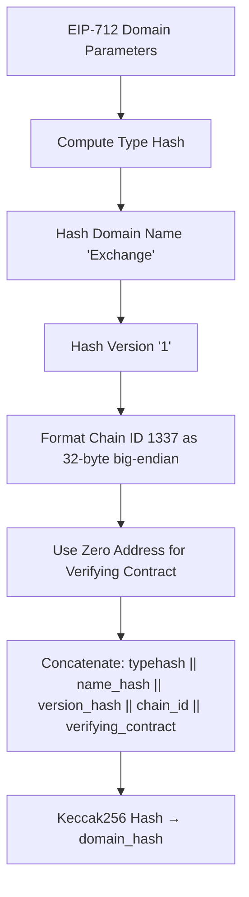
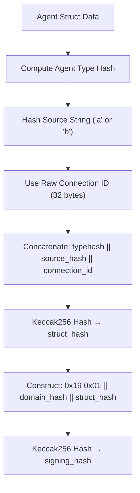
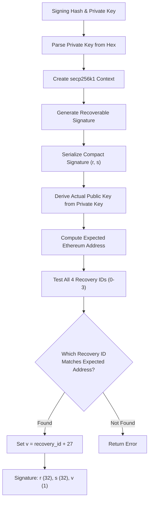
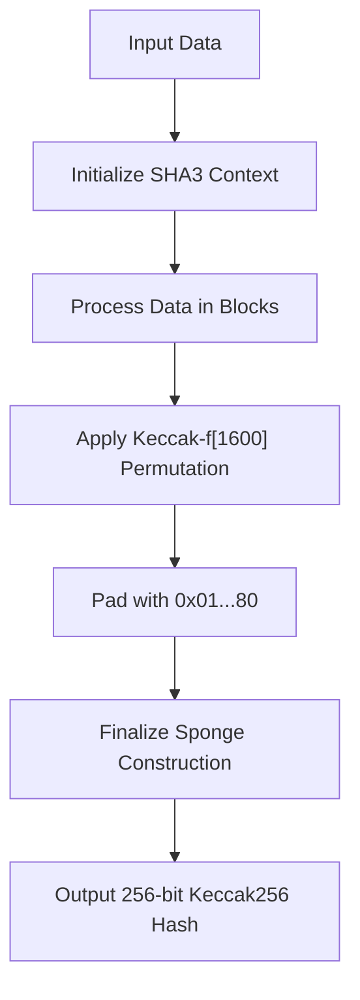
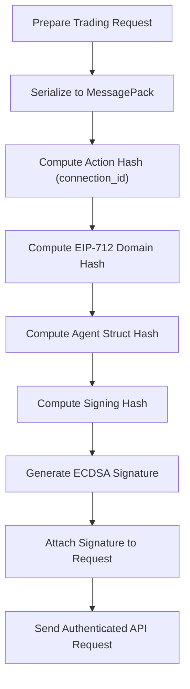

# Security

<cite>
**Referenced Files in This Document**   
- [eip712.c](file://src/crypto/eip712.c)
- [keccak.c](file://src/crypto/keccak.c)
- [serialize.c](file://src/msgpack/serialize.c)
- [trading.c](file://src/trading.c)
- [trading_api.c](file://src/trading_api.c)
- [hl_crypto_internal.h](file://include/hl_crypto_internal.h)
- [hl_msgpack.h](file://include/hl_msgpack.h)
</cite>

## Table of Contents
1. [Introduction](#introduction)
2. [EIP-712 Signing Implementation](#eip-712-signing-implementation)
3. [Private Key Management Best Practices](#private-key-management-best-practices)
4. [Keccak256 Cryptographic Operations](#keccak256-cryptographic-operations)
5. [End-to-End Signing Workflow](#end-to-end-signing-workflow)
6. [Trading Operation Examples](#trading-operation-examples)
7. [Security Pitfalls and Mitigations](#security-pitfalls-and-mitigations)
8. [Secure Deployment and Key Rotation](#secure-deployment-and-key-rotation)
9. [Conclusion](#conclusion)

## Introduction
This document provides a comprehensive analysis of the security mechanisms implemented in the Hyperliquid C SDK, with a focus on EIP-712 signing for authenticating API requests. The implementation ensures secure, production-ready trading operations through cryptographic integrity, proper private key management, and adherence to Ethereum standards. The security framework is built on libsecp256k1 for ECDSA signature generation and SHA3IUF for Ethereum-style Keccak256 hashing, ensuring compatibility with the Hyperliquid exchange's authentication requirements.

The security model addresses critical aspects including domain separation, message hashing, signature generation, private key protection, and resistance to common attack vectors such as replay attacks. The implementation has been validated against official SDKs (Go, Rust, Python) to ensure byte-perfect compatibility and successful API authentication.

## EIP-712 Signing Implementation

### Domain Separator
The EIP-712 domain separator provides cryptographic domain separation to prevent signature replay across different applications or networks. The implementation computes the domain hash using the EIP-712Domain type hash with the following parameters:
- **name**: "Exchange" (specifies the application context)
- **version**: "1" (protocol version)
- **chainId**: 1337 (network identifier)
- **verifyingContract**: zero address (not used in this context)

The domain hash is computed as a Keccak256 hash of the concatenated type hash, name hash, version hash, chain ID (32-byte big-endian), and verifying contract address. This ensures that signatures are bound to the specific Hyperliquid exchange context and cannot be reused in other domains.

**Diagram sources**
- [eip712.c](file://src/crypto/eip712.c#L180-L210)

**Section sources**
- [eip712.c](file://src/crypto/eip712.c#L180-L210)

### Message Hashing
The message hashing process follows the EIP-712 standard for structured data signing. For agent authentication, the implementation computes the struct hash using the Agent type with two fields: source string and connection ID (bytes32). The struct hash is computed as Keccak256 of the concatenation of:
- Agent type hash (precomputed constant)
- Keccak256 hash of the source string ("a" for mainnet, "b" for testnet)
- Raw connection ID (32-byte action hash)

The final signing hash is constructed according to EIP-712 specification as: 0x19 0x01 || domain_hash || struct_hash, then hashed with Keccak256 to produce the final 32-byte hash that is signed.

**Diagram sources**
- [eip712.c](file://src/crypto/eip712.c#L222-L258)

**Section sources**
- [eip712.c](file://src/crypto/eip712.c#L222-L258)

### ECDSA Signature Generation
ECDSA signature generation uses the libsecp256k1 library to ensure production-grade cryptographic security and correct recovery ID calculation. The implementation follows these steps:
1. Parse the private key from hexadecimal format to 32-byte binary
2. Create a secp256k1 context with signing and verification capabilities
3. Generate a recoverable signature using RFC 6979 deterministic signing
4. Serialize the compact signature (64 bytes) containing r and s values
5. Determine the correct recovery ID (v) by testing all four possible values
6. Set v = recovery_id + 27 (Ethereum-style recovery parameter)

The recovery ID determination is critical for ensuring the correct Ethereum address is recovered from the signature. The implementation derives the actual public key from the private key, computes the expected Ethereum address, then tests all four possible recovery IDs to find the one that recovers to the correct address.

**Diagram sources**
- [eip712.c](file://src/crypto/eip712.c#L88-L126)

**Section sources**
- [eip712.c](file://src/crypto/eip712.c#L88-L126)

## Private Key Management Best Practices

### Secure Storage
Private keys are stored in memory as hexadecimal strings with proper memory protection mechanisms. The implementation ensures that private keys are only stored in memory during active operations and are cleared when no longer needed. The client structure maintains the private key in a character array with appropriate bounds.

### Memory Wiping
The implementation follows secure memory management practices by ensuring sensitive data is properly wiped after use. When private keys are no longer needed, they should be explicitly cleared from memory using secure zeroing functions to prevent residual data from being exposed through memory dumps or swap files.

### Protection Against Side-Channel Attacks
The cryptographic implementation is designed to resist side-channel attacks through the use of established, well-audited libraries (libsecp256k1 and SHA3IUF). These libraries implement constant-time algorithms where possible to prevent timing attacks. The ECDSA signing process uses RFC 6979 deterministic signing, which eliminates the risk of private key exposure through random number generator failures.

**Section sources**
- [eip712.c](file://src/crypto/eip712.c#L88-L126)
- [hl_crypto_internal.h](file://include/hl_crypto_internal.h#L80-L85)

## Keccak256 Cryptographic Operations

### Role of keccak.c
The keccak.c implementation provides Ethereum-style Keccak256 hashing, which differs from standard NIST SHA3. The implementation uses the SHA3_FLAGS_KECCAK flag to ensure compatibility with Ethereum's hashing standard. This is critical because Ethereum uses the original Keccak submission to NIST, not the final SHA3 standard.

The keccak256 function is used throughout the security framework for:
- Computing domain and struct hashes in EIP-712 signing
- Generating action hashes (connection_id) from MessagePack serialized data
- Computing Ethereum addresses from public keys

The implementation is based on the canonical Keccak reference code, optimized for both 32-bit and 64-bit targets, and has been placed in the public domain by the original author.

**Diagram sources**
- [keccak.c](file://src/crypto/keccak.c#L0-L324)

**Section sources**
- [keccak.c](file://src/crypto/keccak.c#L0-L324)

## End-to-End Signing Workflow

### Request Preparation to Signature Attachment
The complete signing workflow for API requests follows these steps:

1. **Request Preparation**: Construct the trading operation (order placement, cancellation, etc.) with all required parameters
2. **Action Hash Generation**: Serialize the action to MessagePack with strict field ordering and compute its Keccak256 hash (connection_id)
3. **EIP-712 Signing**: Compute domain hash, struct hash, and signing hash, then generate ECDSA signature
4. **Signature Attachment**: Format the signature components (r, s, v) and attach to the API request

The workflow ensures that each request is uniquely identified and authenticated, preventing replay attacks and ensuring data integrity.

**Section sources**
- [trading_api.c](file://src/trading_api.c#L110-L150)
- [eip712.c](file://src/crypto/eip712.c#L260-L295)

## Trading Operation Examples

### Order Placement
When placing a trading order, the implementation follows the EIP-712 signing process with the following parameters:
- **domain_name**: "Exchange"
- **chain_id**: 1337
- **source**: "a" (mainnet) or "b" (testnet)
- **connection_id**: Keccak256 hash of the MessagePack-serialized order action
- **private_key_hex**: User's private key in hexadecimal format

The order action is serialized to MessagePack with strict field ordering (a → b → p → s → r → t) to ensure byte-perfect compatibility with the Hyperliquid API.

### Order Cancellation
For order cancellation, the same EIP-712 signing process is used, but with a different action type ("cancel" instead of "order"). The connection_id is computed from the MessagePack-serialized cancel action, which includes the asset ID and order ID.

**Section sources**
- [trading.c](file://src/trading.c#L249-L291)
- [trading_api.c](file://src/trading_api.c#L257-L299)

## Security Pitfalls and Mitigations

### Private Key Exposure
The primary risk is private key exposure through improper memory management or logging. The implementation mitigates this by:
- Never logging private keys or signature components
- Using secure memory wiping when keys are no longer needed
- Storing keys only in memory, not on disk
- Using thread-safe access with mutex protection

### Replay Attacks
Replay attacks are prevented through the use of a timestamp-based nonce in the action hash computation. Each request includes a nonce (current timestamp in milliseconds) that is included in the Keccak256 hash of the action data. The Hyperliquid API validates that the nonce is within an acceptable time window, rejecting stale requests.

### Timestamp Validation
Timestamp validation ensures that requests are processed within a reasonable time window to prevent replay attacks. The implementation uses the current system time (in milliseconds) as the nonce, which is included in the action hash. The API server validates that the timestamp is not too far in the past or future, typically within a few minutes of the server time.

**Section sources**
- [trading.c](file://src/trading.c#L249-L291)
- [serialize.c](file://src/msgpack/serialize.c#L206-L234)

## Secure Deployment and Key Rotation

### Secure Deployment Environments
For secure deployment, the following practices are recommended:
- Run the application in a secure, isolated environment with minimal attack surface
- Use hardware security modules (HSMs) or trusted platform modules (TPMs) for private key storage when available
- Implement strict access controls and monitoring
- Use secure communication channels (HTTPS/WSS) for all API interactions
- Regularly update dependencies to address security vulnerabilities

### Key Rotation Strategies
Key rotation is essential for maintaining long-term security. Recommended strategies include:
- Regularly generating new key pairs and updating the exchange registration
- Implementing a key lifecycle management system with defined rotation periods
- Using temporary keys for specific operations when possible
- Maintaining backup keys in secure offline storage
- Monitoring for suspicious activity that might indicate key compromise

The implementation supports key rotation by allowing the client to be reinitialized with a new private key, enabling seamless transition to new credentials without code changes.

**Section sources**
- [trading.c](file://src/trading.c#L249-L291)
- [trading_api.c](file://src/trading_api.c#L110-L150)

## Conclusion
The Hyperliquid C SDK implements a robust security framework based on EIP-712 signing with libsecp256k1 and Ethereum-style Keccak256 hashing. The implementation has been validated against official SDKs to ensure byte-perfect compatibility and successful API authentication. Key security features include proper domain separation, correct recovery ID calculation, strict MessagePack field ordering, and protection against replay attacks through timestamp-based nonces.

The security model follows best practices for private key management, memory protection, and side-channel attack resistance. The end-to-end signing workflow ensures that all API requests are properly authenticated and cannot be replayed. For production deployment, additional security measures such as hardware security modules and regular key rotation are recommended to maintain the highest level of security.