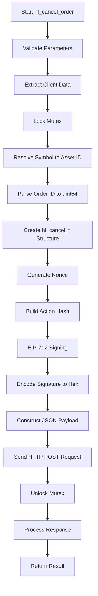

# Order Cancellation

<cite>
**Referenced Files in This Document**   
- [trading_api.c](file://src/trading_api.c)
- [hl_msgpack.h](file://include/hl_msgpack.h)
- [hyperliquid.h](file://include/hyperliquid.h)
- [eip712.c](file://src/crypto/eip712.c)
- [hl_markets.h](file://include/hl_markets.h)
- [simple_trade.c](file://examples/simple_trade.c)
- [hl_http.h](file://include/hl_http.h)
- [hl_crypto_internal.h](file://include/hl_crypto_internal.h)
- [hl_internal.h](file://include/hl_internal.h)
</cite>

## Table of Contents
1. [Function Parameters](#function-parameters)
2. [Internal Process Flow](#internal-process-flow)
3. [Response Handling](#response-handling)
4. [Code Examples](#code-examples)
5. [Common Issues and Error Handling](#common-issues-and-error-handling)
6. [Thread Safety and Error Propagation](#thread-safety-and-error-propagation)

## Function Parameters

The `hl_cancel_order()` function accepts four parameters that define the cancellation request and capture the result:

- `hl_client_t* client`: Pointer to the initialized client context containing authentication credentials, network configuration, and state management components. This includes wallet address, private key, testnet flag, HTTP client, and mutex for thread safety.
- `const char* symbol`: String representing the trading symbol (e.g., "BTC", "ETH") whose order is to be canceled. This is used to resolve the corresponding asset ID required by the exchange API.
- `const char* order_id`: String representation of the order ID to cancel, which will be parsed into a `uint64_t` for inclusion in the cancellation payload.
- `hl_cancel_result_t* result`: Pointer to a result structure that will be populated with cancellation status and any error messages upon completion.

These parameters are validated at the beginning of the function to ensure they are not null, returning `HL_ERROR_INVALID_PARAMS` if validation fails.

**Section sources**
- [trading_api.c](file://src/trading_api.c#L225-L230)
- [hyperliquid.h](file://include/hyperliquid.h#L223-L226)

## Internal Process Flow

The order cancellation process follows a structured sequence of operations to ensure secure and reliable execution:

1. **Client State Validation**: The function first extracts essential client components using accessor functions: wallet address, private key, testnet flag, HTTP client, and mutex. If any component is missing, it returns an invalid parameters error.

2. **Symbol to Asset ID Resolution**: The `get_asset_id()` function is called with the client and symbol to determine the numeric asset ID. This involves:
   - Constructing a full symbol string (e.g., "BTC/USDC:USDC")
   - Fetching market data via `hl_fetch_markets()` if not cached
   - Looking up the asset ID using `hl_get_asset_id()`
   - Returning `HL_ERROR_INVALID_SYMBOL` if the symbol is not found

3. **Order ID Parsing**: The string `order_id` is converted to `uint64_t` using `strtoull()` for inclusion in the cancellation structure.

4. **Cancellation Structure Creation**: A `hl_cancel_t` structure is populated with the resolved asset ID and parsed order ID.

5. **Action Hash Generation**: The `hl_build_cancel_hash()` function creates a MessagePack serialization of the cancellation action, which internally calls `hl_build_action_hash()` to produce a Keccak256 hash (connection_id) of the action data, nonce, and vault address.

6. **EIP-712 Signing**: The hash is signed using `eip712_sign_agent()` which:
   - Computes the EIP-712 domain hash
   - Computes the struct hash for the agent action
   - Combines these into a signing hash
   - Signs with ECDSA using the client's private key via `ecdsa_sign_secp256k1()`

7. **Signature Encoding**: The 65-byte signature is split into R and S components, each converted to hexadecimal strings using `bytes_to_hex()`.

8. **JSON Payload Construction**: A JSON request body is formatted with:
   - Action type "cancel" and the cancel structure
   - Current timestamp as nonce
   - Signature components (R, S, V)
   - Null vault address

9. **HTTP Request Execution**: The POST request is sent to the appropriate endpoint (`/exchange`) based on the testnet flag, with proper Content-Type headers.



**Diagram sources**
- [trading_api.c](file://src/trading_api.c#L225-L338)
- [hl_msgpack.h](file://include/hl_msgpack.h#L48-L51)
- [eip712.c](file://src/crypto/eip712.c#L260-L295)

**Section sources**
- [trading_api.c](file://src/trading_api.c#L230-L285)
- [hl_msgpack.h](file://include/hl_msgpack.h#L112-L116)
- [eip712.c](file://src/crypto/eip712.c#L260-L295)
- [hl_markets.h](file://include/hl_markets.h#L103-L103)

## Response Handling

The response handling logic processes the HTTP response from the exchange API:

- The mutex is unlocked immediately after the HTTP request completes to minimize critical section duration.
- If the HTTP request fails (network error or non-200 status), the function returns a mapped error code using `lv3_to_hl_error()`.
- On successful HTTP response, the function checks for `"status":"ok"` in the response body to determine cancellation success.
- When successful, `result->cancelled` is set to `true`.
- If cancellation fails, the error message from the response body is copied to `result->error`.
- The HTTP response is always freed using `http_response_free()` to prevent memory leaks.
- The final return value is `HL_SUCCESS` if cancelled, otherwise `HL_ERROR_API`.

**Section sources**
- [trading_api.c](file://src/trading_api.c#L315-L338)
- [hl_http.h](file://include/hl_http.h#L108-L108)

## Code Examples

To cancel an open order retrieved from the order book or trading history:

```c
// After placing an order and receiving result.order_id
hl_order_result_t result;
// ... order placement code ...

if (result.status == HL_ORDER_STATUS_OPEN && result.order_id > 0) {
    printf("Canceling order %llu...\n", result.order_id);
    
    hl_cancel_result_t cancel_result;
    hl_error_t err = hl_cancel_order(client, "BTC", result.order_id, &cancel_result);
    
    if (err == HL_SUCCESS && cancel_result.cancelled) {
        printf("Order canceled successfully\n");
    } else {
        printf("Failed to cancel order: %s\n", cancel_result.error);
    }
}
```

This pattern is demonstrated in the `simple_trade.c` example where a limit order is intentionally placed below market price and subsequently canceled if it remains open.

**Section sources**
- [simple_trade.c](file://examples/simple_trade.c#L115-L130)

## Common Issues and Error Handling

Several common issues may occur during order cancellation:

- **Non-existent Orders**: Attempting to cancel an order that doesn't exist returns an API error captured in the response body and propagated through `result.error`.
- **Rate Limits**: HTTP 429 responses are treated as network errors and returned as `HL_ERROR_NETWORK`.
- **Symbol Mapping**: Incorrect symbol names fail during asset ID lookup, returning `HL_ERROR_INVALID_SYMBOL`. The function expects base symbols (e.g., "BTC") which are internally mapped to full symbols.
- **Invalid Order IDs**: Malformed order ID strings may cause undefined behavior during `strtoull()` conversion, though the function assumes valid numeric strings.
- **Network Failures**: Any connectivity issues result in `HL_ERROR_NETWORK` being returned after HTTP layer translation.

The function systematically handles these through proper error code mapping and descriptive error messages in the result structure.

**Section sources**
- [trading_api.c](file://src/trading_api.c#L250-L255)
- [trading_api.c](file://src/trading_api.c#L315-L325)

## Thread Safety and Error Propagation

Thread safety is ensured through the use of a client-level mutex:

- The mutex is obtained at the beginning of the function using `pthread_mutex_lock()`
- It is held throughout the critical section including signing and request execution
- The mutex is released with `pthread_mutex_unlock()` before processing the response
- This prevents race conditions when multiple threads access the same client

Error propagation follows a consistent pattern:
- Internal errors (invalid params, signature failures) return specific `hl_error_t` codes
- HTTP layer errors from `lv3_error_t` are mapped through `lv3_to_hl_error()`
- API-level errors are captured in the response and returned as `HL_ERROR_API`
- All error conditions populate the `result->error` field with descriptive messages

This layered approach ensures callers receive meaningful error information at the appropriate abstraction level.

**Section sources**
- [trading_api.c](file://src/trading_api.c#L245-L250)
- [trading_api.c](file://src/trading_api.c#L55-L74)
- [hl_internal.h](file://include/hl_internal.h#L55-L55)