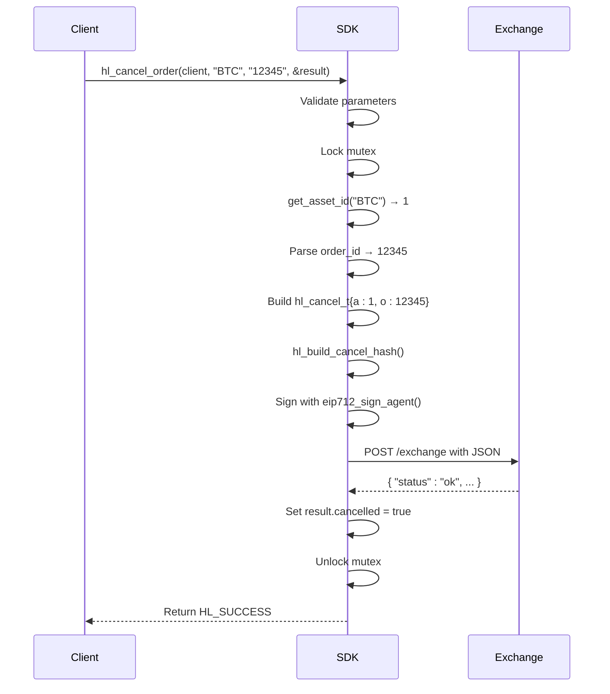

# Order Management

<cite>
**Referenced Files in This Document**   
- [trading_api.c](file://src/trading_api.c)
- [hyperliquid.h](file://include/hyperliquid.h)
- [hl_msgpack.h](file://include/hl_msgpack.h)
- [serialize.c](file://src/msgpack/serialize.c)
- [eip712.c](file://src/crypto/eip712.c)
- [simple_trade.c](file://examples/simple_trade.c)
</cite>

## Table of Contents
1. [Order Cancellation Process](#order-cancellation-process)
2. [Order Modification Process](#order-modification-process)
3. [Response Handling and Success Detection](#response-handling-and-success-detection)
4. [Error Conditions and Failure Modes](#error-conditions-and-failure-modes)
5. [Thread Safety and Concurrency](#thread-safety-and-concurrency)
6. [Integration Example from simple_trade.c](#integration-example-from-simple_tradec)

## Order Cancellation Process

The `hl_cancel_order` function enables the cancellation of an existing open order on the Hyperliquid exchange. It requires four parameters: a client context (`hl_client_t*`), the trading symbol (e.g., "BTC"), the order ID as a string, and a pointer to a `hl_cancel_result_t` structure to capture the outcome.

Internally, the cancellation process follows a secure and structured workflow:
1. **Parameter Validation**: Ensures all inputs are valid and non-null.
2. **Client State Extraction**: Retrieves essential client data such as wallet address, private key, testnet flag, HTTP client, and mutex via accessor functions.
3. **Thread Safety**: Acquires a mutex lock to prevent race conditions during critical operations.
4. **Asset ID Lookup**: Converts the symbol (e.g., "BTC") into its corresponding numeric asset ID using `get_asset_id`, which queries market data if necessary.
5. **Order ID Parsing**: Converts the string-based `order_id` into a 64-bit unsigned integer.
6. **Cancel Structure Construction**: Builds a `hl_cancel_t` structure containing the asset ID and order ID.
7. **Nonce Generation**: Obtains the current timestamp in milliseconds as a nonce to ensure request uniqueness.
8. **Hash Generation**: Calls `hl_build_cancel_hash` to generate a cryptographic hash of the cancellation action using MessagePack serialization and Keccak256 hashing.
9. **Signature Creation**: Signs the hash using EIP-712 compliant signing via `eip712_sign_agent`, producing a 65-byte signature.
10. **Signature Encoding**: Converts the R and S components of the signature into hexadecimal strings.
11. **JSON Request Assembly**: Constructs a JSON payload containing the cancel action, nonce, signature, and vault address (null in this case).
12. **HTTP Transmission**: Sends the request to the appropriate exchange endpoint (`/exchange`) using a POST request.
13. **Response Parsing**: Upon receiving the response, checks for HTTP success and the presence of `"status":"ok"` in the body to determine cancellation success.

**Section sources**
- [trading_api.c](file://src/trading_api.c#L225-L338)
- [hyperliquid.h](file://include/hyperliquid.h#L289-L292)

## Order Modification Process

The `hl_modify_order` function allows updating an existing order by replacing it with a new specification defined in a `hl_order_request_t` structure. Unlike cancellation, modification involves placing a new order with updated parameters while atomically canceling the old one on the exchange side.

Key steps in the modification workflow:
1. **Input Validation**: Validates the client, order ID, new order request, and result structure.
2. **Client Data Access**: Extracts wallet, private key, testnet status, HTTP client, and mutex using internal accessors.
3. **Concurrency Control**: Locks the client mutex to ensure thread-safe access during the operation.
4. **Asset Resolution**: Resolves the symbol in the new order to its corresponding asset ID.
5. **Re-validation**: Ensures all fields in the `hl_order_request_t` are valid and properly formatted.
6. **Re-signing**: Generates a new nonce and signs the modified order using the same EIP-712 signing process as order placement.
7. **Atomic Replacement**: The exchange handles the modification as an atomic "cancel and replace" operation, ensuring no race condition between cancellation and new order placement.
8. **Result Propagation**: Returns the result through the `hl_order_result_t` structure, including the new order ID if successful.

This approach ensures that trading strategies relying on dynamic order adjustments (e.g., trailing stops, price updates) maintain consistency and avoid exposure gaps.

**Section sources**
- [hyperliquid.h](file://include/hyperliquid.h#L312-L315)
- [trading_api.c](file://src/trading_api.c#L79-L220)

## Response Handling and Success Detection

The `hl_cancel_result_t` structure is used to convey the outcome of a cancellation request. It contains two primary fields:
- `cancelled`: A boolean indicating whether the cancellation was successful.
- `error`: A character buffer (256 bytes) storing any error message in case of failure.

Success is determined by parsing the JSON response from the server. Specifically, the presence of `"status":"ok"` within the response body indicates success. This check is performed using `strstr(response.body, "\"status\":\"ok\"")`. If found, the `cancelled` field is set to `true`; otherwise, an error message is populated with details from the response or HTTP status.

For modification operations, the `hl_order_result_t` structure is used instead, which includes:
- `order_id`: Dynamically allocated string containing the new order ID.
- `status`: Enum indicating order state (open, filled, etc.).
- `filled_quantity` and `average_price`: Fill details if partially or fully executed.
- `error`: Error message buffer.

These structures allow clients to programmatically assess outcomes and react accordingly.

**Section sources**
- [hyperliquid.h](file://include/hyperliquid.h#L148-L151)
- [hyperliquid.h](file://include/hyperliquid.h#L139-L145)
- [trading_api.c](file://src/trading_api.c#L225-L338)

## Error Conditions and Failure Modes

Several error conditions can occur during order cancellation and modification:

- **Invalid Parameters**: Null client, symbol, order ID, or result pointer triggers `HL_ERROR_INVALID_PARAMS`.
- **Unknown Symbol**: If `get_asset_id` fails to resolve the symbol (except for "SOL", which has special handling), returns `HL_ERROR_INVALID_SYMBOL`.
- **Signature Failure**: Issues during hash generation or EIP-712 signing return `HL_ERROR_SIGNATURE`.
- **Network Errors**: HTTP failures due to connectivity issues, timeouts, or non-200 responses are mapped via `lv3_to_hl_error` to `HL_ERROR_NETWORK` or `HL_ERROR_API`.
- **Already-Filled Orders**: Attempting to cancel an already-filled order results in an API-level error, typically indicated in the JSON response body.
- **Invalid Order ID**: Non-existent or malformed order IDs lead to API rejection.
- **Rate Limiting**: Excessive requests may be throttled by the server, resulting in HTTP 429 or similar.

All errors are captured in the `error` field of the result structure, enabling detailed diagnostics.

**Section sources**
- [trading_api.c](file://src/trading_api.c#L225-L338)
- [trading_api.c](file://src/trading_api.c#L55-L74)

## Thread Safety and Concurrency

The Hyperliquid C SDK ensures thread safety through the use of a mutex embedded within the `hl_client_t` structure. All critical operations—including order placement, cancellation, and modification—acquire this mutex via `hl_client_get_mutex_old` and `pthread_mutex_lock` before proceeding.

This prevents race conditions when multiple threads attempt to sign or submit orders simultaneously, which could otherwise result in nonce reuse or inconsistent state. The mutex is held from the beginning of the operation (after parameter validation) until after the HTTP response is received and processed, ensuring atomicity of the entire request-sign-transmit cycle.

Clients integrating with multi-threaded trading systems must ensure proper linking and initialization of pthread libraries.

**Section sources**
- [trading_api.c](file://src/trading_api.c#L225-L338)
- [client.c](file://src/client.c#L34-L87)
- [hl_internal.h](file://include/hl_internal.h#L55)

## Integration Example from simple_trade.c

The `simple_trade.c` example demonstrates the complete lifecycle of order management, including cancellation. After placing a limit buy order for BTC, the code checks the result status. If the order is open (`HL_ORDER_STATUS_OPEN`), it proceeds to cancel the order using `hl_cancel_order` with the same symbol and retrieved order ID.

This pattern illustrates safe usage:
- Proper error checking after each API call.
- Conditional cancellation only for open orders.
- Use of environment variables for secure credential management.
- Cleanup of dynamically allocated strings (e.g., `order_id`).

The example reinforces best practices for robust trading bot development, including fallback pricing, connection testing, and balance verification.

**Diagram sources**
- [trading_api.c](file://src/trading_api.c#L225-L338)
- [simple_trade.c](file://examples/simple_trade.c#L0-L165)

**Section sources**
- [simple_trade.c](file://examples/simple_trade.c#L0-L165)