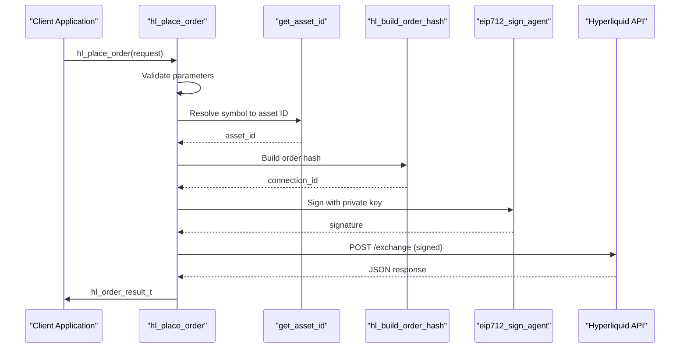

# Order Placement

<cite>
**Referenced Files in This Document**   
- [hyperliquid.h](file://include/hyperliquid.h)
- [trading_api.c](file://src/trading_api.c)
- [hl_msgpack.h](file://include/hl_msgpack.h)
- [serialize.c](file://src/msgpack/serialize.c)
- [eip712.c](file://src/crypto/eip712.c)
- [simple_trade.c](file://examples/simple_trade.c)
- [trading_bot.c](file://examples/trading_bot.c)
</cite>

## Table of Contents
1. [Introduction](#introduction)
2. [Order Request Structure](#order-request-structure)
3. [Order Placement Workflow](#order-placement-workflow)
4. [Response Handling](#response-handling)
5. [Idempotency and Rate Limiting](#idempotency-and-rate-limiting)
6. [Thread Safety and Error Handling](#thread-safety-and-error-handling)
7. [Usage Examples](#usage-examples)
8. [Conclusion](#conclusion)

## Introduction
The `hl_place_order` function enables users to submit trading orders to the Hyperliquid exchange via a secure, structured workflow. This document details the complete order placement process, including request construction, cryptographic signing, HTTP communication, and response interpretation. The system ensures reliability through thread safety, idempotent operations, and comprehensive error handling.

## Order Request Structure

The `hl_order_request_t` structure defines all parameters required for placing an order on the Hyperliquid exchange. It includes essential trading attributes such as symbol, side, price, quantity, and order behavior flags.

```c
typedef struct {
    const char *symbol;          
    hl_side_t side;              
    double price;                
    double quantity;             
    hl_order_type_t order_type;  
    hl_time_in_force_t time_in_force;
    bool reduce_only;            
    uint32_t slippage_bps;       
} hl_order_request_t;
```

### Key Fields:
- **symbol**: Trading pair identifier (e.g., "BTC", "ETH")
- **side**: Trade direction using `HL_SIDE_BUY` or `HL_SIDE_SELL`
- **price**: Limit price; set to 0 for market orders
- **quantity**: Amount of asset to trade
- **order_type**: `HL_ORDER_TYPE_LIMIT` or `HL_ORDER_TYPE_MARKET`
- **reduce_only**: If true, order can only reduce existing position
- **slippage_bps**: Allowed slippage in basis points (for market orders)

**Section sources**
- [hyperliquid.h](file://include/hyperliquid.h#L127-L136)

## Order Placement Workflow

The `hl_place_order` function orchestrates a multi-step process to securely submit an order to the exchange. The workflow ensures data integrity, authentication, and reliable delivery.



**Diagram sources**
- [trading_api.c](file://src/trading_api.c#L79-L220)
- [serialize.c](file://src/msgpack/serialize.c#L206-L219)
- [eip712.c](file://src/crypto/eip712.c#L260-L295)

### Step-by-Step Process:

1. **Parameter Validation**: Ensures client, request, and result pointers are valid
2. **Asset ID Resolution**: Converts symbol (e.g., "BTC") to numeric asset ID via `get_asset_id`
3. **Order Construction**: Formats price and size as strings and builds `hl_order_t`
4. **Nonce Generation**: Uses `get_timestamp_ms()` for unique request identification
5. **MessagePack Serialization**: `hl_build_order_hash` serializes order data into a hashable format
6. **EIP-712 Signing**: `eip712_sign_agent` signs the hash with the user's private key
7. **HTTP POST Request**: Sends signed JSON payload to `/exchange` endpoint

**Section sources**
- [trading_api.c](file://src/trading_api.c#L79-L220)
- [serialize.c](file://src/msgpack/serialize.c#L206-L219)
- [eip712.c](file://src/crypto/eip712.c#L260-L295)

## Response Handling

The `hl_order_result_t` structure captures the outcome of an order submission, including success status, identifiers, fill details, and error information.

```c
typedef struct {
    char *order_id;              
    hl_order_status_t status;    
    double filled_quantity;      
    double average_price;        
    char error[256];             
} hl_order_result_t;
```

### Response Interpretation:
- **order_id**: Unique identifier for the placed order (caller must free)
- **status**: Current state (`HL_ORDER_STATUS_OPEN`, `HL_ORDER_STATUS_FILLED`, etc.)
- **filled_quantity**: Amount of order already executed
- **average_price**: Weighted average price of fills
- **error**: Human-readable error message if operation failed

Upon successful submission, the response is parsed from JSON to extract the `oid` (order ID). If parsing fails or the API returns an error, appropriate error codes are returned.

**Section sources**
- [hyperliquid.h](file://include/hyperliquid.h#L139-L145)
- [trading_api.c](file://src/trading_api.c#L79-L220)

## Idempotency and Rate Limiting

### Idempotency via Nonce
Each order request includes a timestamp-based nonce generated by `get_timestamp_ms()`, ensuring each request is unique and preventing replay attacks. This timestamp also serves as a de facto idempotency key when combined with the wallet address and order content.

```c
uint64_t nonce = get_timestamp_ms();
```

### Rate Limiting Considerations
While the SDK does not enforce client-side rate limiting, users should:
- Avoid rapid-fire order submissions
- Implement exponential backoff on failures
- Respect exchange rate limits (not explicitly documented in code)
- Use WebSocket feeds for market data instead of polling

**Section sources**
- [trading_api.c](file://src/trading_api.c#L79-L220)
- [trading_api.c](file://src/trading_api.c#L22-L26)

## Thread Safety and Error Handling

### Thread Safety
The `hl_place_order` function is thread-safe through mutex locking. The client's mutex is acquired at the beginning and released before returning:

```c
pthread_mutex_lock(mutex);
// ... critical section ...
pthread_mutex_unlock(mutex);
```

This prevents race conditions when multiple threads access the same client instance.

### Error Codes
The function returns standardized error codes:
- `HL_ERROR_INVALID_PARAMS`: Null client, request, or result
- `HL_ERROR_INVALID_SYMBOL`: Unrecognized trading symbol
- `HL_ERROR_SIGNATURE`: Failure in hash building or EIP-712 signing
- `HL_ERROR_API`: HTTP request failure or invalid response
- `HL_SUCCESS`: Order submission successful

Error messages are written to `result->error` for diagnostic purposes.

**Section sources**
- [trading_api.c](file://src/trading_api.c#L79-L220)
- [client.c](file://src/client.c#L153-L170)

## Usage Examples

### Simple Trade Example
The `simple_trade.c` example demonstrates a basic limit order placement:

```c
hl_order_request_t order = {
    .symbol = "BTC",
    .side = HL_SIDE_BUY,
    .price = 95000.0,
    .quantity = 0.001,
    .order_type = HL_ORDER_TYPE_LIMIT,
    .time_in_force = HL_TIF_GTC,
    .reduce_only = false,
    .slippage_bps = 0
};

hl_order_result_t result;
hl_error_t ret = hl_place_order(client, &order, &result);
```

It includes full error handling and optional order cancellation if the order remains open.

### Trading Bot Automation
The `trading_bot.c` example shows automated strategy implementation:
- Real-time ticker fetching before order placement
- Dynamic price calculation (e.g., 5% below market)
- WebSocket integration for real-time updates
- Interactive menu system for manual control
- Signal handling for graceful shutdown

Both examples validate connection and handle memory management properly.

**Section sources**
- [simple_trade.c](file://examples/simple_trade.c#L0-L165)
- [trading_bot.c](file://examples/trading_bot.c#L0-L381)

## Conclusion
The `hl_place_order` function provides a robust, secure, and thread-safe interface for placing orders on the Hyperliquid exchange. By combining parameter validation, asset resolution, MessagePack serialization, EIP-712 signing, and proper HTTP communication, it ensures reliable order submission. Developers should leverage the provided examples, handle errors appropriately, and follow best practices for rate limiting and idempotency when building trading applications.