# Position Management

<cite>
**Referenced Files in This Document**   
- [simple_positions.c](file://examples/simple_positions.c)
- [hl_account.h](file://include/hl_account.h)
- [account.c](file://src/account.c)
- [hl_types.h](file://include/hl_types.h)
- [leverage.c](file://src/leverage.c)
</cite>

## Table of Contents
1. [Introduction](#introduction)
2. [Position Retrieval Workflow](#position-retrieval-workflow)
3. [Interpreting hl_position_t Fields](#interpreting-hl_position_t-fields)
4. [Polling Position State and Margin Changes](#polling-position-state-and-margin-changes)
5. [Position Updates from Order Execution](#position-updates-from-order-execution)
6. [Reduce-Only Orders and Position Sizing](#reduce-only-orders-and-position-sizing)
7. [Polling Frequency and Rate Limits](#polling-frequency-and-rate-limits)
8. [Error Handling and Data Consistency](#error-handling-and-data-consistency)
9. [Integration with Leverage Settings](#integration-with-leverage-settings)

## Introduction
This document provides a comprehensive guide to position management within the Hyperliquid C SDK. It details how to retrieve and interpret current positions using `hl_fetch_positions`, explains the structure of `hl_position_t`, and demonstrates practical usage through the `simple_positions.c` example. The document also covers advanced topics such as position updates triggered by order execution, reduce-only order behavior, polling best practices, error handling for stale data, and integration with leverage settings via `hl_set_leverage`.

**Section sources**
- [simple_positions.c](file://examples/simple_positions.c#L1-L120)

## Position Retrieval Workflow
The primary method for retrieving current positions is through the `hl_fetch_positions` function, which queries the Hyperliquid API for all open positions associated with a user's wallet. This function constructs a request to the `/info` endpoint with a `clearinghouseState` type, including the user's wallet address. Upon receiving the response, it parses the `assetPositions` array from the JSON payload and converts each entry into an `hl_position_t` structure.

A secondary function, `hl_fetch_position`, allows retrieval of a single position by symbol. Internally, this function calls `hl_fetch_positions` and searches for the specified coin within the returned array, making it less efficient for frequent queries but convenient for targeted lookups.

**Diagram sources**
- [account.c](file://src/account.c#L450-L540)
- [hl_account.h](file://include/hl_account.h#L162-L166)

**Section sources**
- [account.c](file://src/account.c#L450-L540)
- [hl_account.h](file://include/hl_account.h#L162-L166)

## Interpreting hl_position_t Fields
The `hl_position_t` structure contains comprehensive information about an open position. Key fields include:

- **symbol**: The market symbol (e.g., "BTC/USDC:USDC") representing the trading pair.
- **size**: The absolute value of the position size, indicating the quantity held.
- **entry_price**: The average price at which the position was opened.
- **unrealized_pnl**: The current profit or loss of the position, calculated against the mark price.
- **leverage**: The current leverage applied to the position, affecting margin requirements and liquidation risk.

Additional fields such as `mark_price`, `liquidation_price`, `margin_used`, and `position_value` provide further context for risk assessment and performance monitoring. The `side` field indicates whether the position is long or short, while `is_isolated` specifies the margin mode.

**Section sources**
- [hl_account.h](file://include/hl_account.h#L85-L108)

## Polling Position State and Margin Changes
The `simple_positions.c` example demonstrates how to poll position state by repeatedly calling `hl_fetch_positions`. This approach allows applications to monitor changes in position size, unrealized P&L, and margin usage over time. When a position's margin usage approaches maintenance levels, the application can trigger alerts or automated actions such as adding margin or closing the position.

To detect margin changes, applications should compare consecutive position snapshots, focusing on the `margin_used` and `unrealized_pnl` fields. A significant change in these values may indicate adverse price movement requiring intervention.

**Section sources**
- [simple_positions.c](file://examples/simple_positions.c#L48-L78)

## Position Updates from Order Execution
Position updates are directly tied to order execution. When an order is filled, the exchange recalculates the position size, average entry price, and unrealized P&L based on the fill details. These changes are reflected in subsequent calls to `hl_fetch_positions`.

Account synchronization ensures that position data remains consistent with the latest order fills. The SDK does not maintain an internal state; instead, it relies on the API to provide the authoritative view of positions after each update.

**Section sources**
- [account.c](file://src/account.c#L276-L397)

## Reduce-Only Orders and Position Sizing
Reduce-only orders are designed to decrease or close existing positions without increasing them. In the SDK, this behavior is controlled by the `reduce_only` flag in the order parameters. When set to true, the order will only execute if it reduces the current position size.

The interaction between order fills and position sizing follows strict rules: long positions can only be reduced by sell orders, and short positions by buy orders. Partial fills of reduce-only orders proportionally decrease the position size while adjusting the average entry price accordingly.

```mermaid
flowchart TD
Start([Order Execution]) --> CheckReduceOnly{reduce_only flag?}
CheckReduceOnly --> |Yes| ValidateSize["Validate: fill size ≤ position size"]
ValidateSize --> |Valid| UpdatePosition["Update position: reduce size"]
ValidateSize --> |Invalid| RejectOrder["Reject order"]
CheckReduceOnly --> |No| StandardExecution["Standard order execution"]
UpdatePosition --> End([Position Updated])
RejectOrder --> End
StandardExecution --> End
```

**Diagram sources**
- [src/msgpack/serialize.c](file://src/msgpack/serialize.c#L23-L69)
- [src/trading_api.c](file://src/trading_api.c#L110-L150)

**Section sources**
- [src/msgpack/serialize.c](file://src/msgpack/serialize.c#L23-L69)

## Polling Frequency and Rate Limits
Applications should implement appropriate polling intervals to avoid hitting rate limits. While the exact limits are not specified in the code, best practices suggest polling no more than once every 1-2 seconds for position data. For high-frequency monitoring, consider using WebSocket feeds if available.

Handling partial liquidations requires careful polling strategy, as rapid price movements may trigger multiple liquidation events. Applications should be prepared to handle sudden position reductions and adjust their logic accordingly.

**Section sources**
- [simple_positions.c](file://examples/simple_positions.c#L18-L118)

## Error Handling and Data Consistency
Error handling for stale data involves checking the timestamp of position responses and comparing them with the last known state. If a position appears to be outdated, the application should re-fetch the data. The SDK returns specific error codes such as `HL_ERROR_PARSE` for JSON parsing failures and `HL_ERROR_API` for HTTP-level issues.

Consistency with balance updates is maintained by ensuring that position value calculations align with available margin and account equity. Applications should verify that the sum of position values does not exceed total account value, accounting for unrealized P&L.

**Section sources**
- [account.c](file://src/account.c#L450-L540)

## Integration with Leverage Settings
Leverage settings are managed through the `hl_set_leverage` function, which sends a `updateLeverage` action to the exchange. This function integrates with position management by allowing users to adjust leverage for specific symbols or globally. The current leverage is reflected in the `leverage` field of `hl_position_t`, while `max_leverage` indicates the upper limit permitted by the exchange.

When leverage is changed, the system recalculates margin requirements and liquidation prices, which are then visible in subsequent position queries. Applications should monitor these changes to ensure they remain within risk tolerance levels.

**Diagram sources**
- [leverage.c](file://src/leverage.c#L14-L125)
- [hl_account.h](file://include/hl_account.h#L85-L108)

**Section sources**
- [leverage.c](file://src/leverage.c#L14-L125)