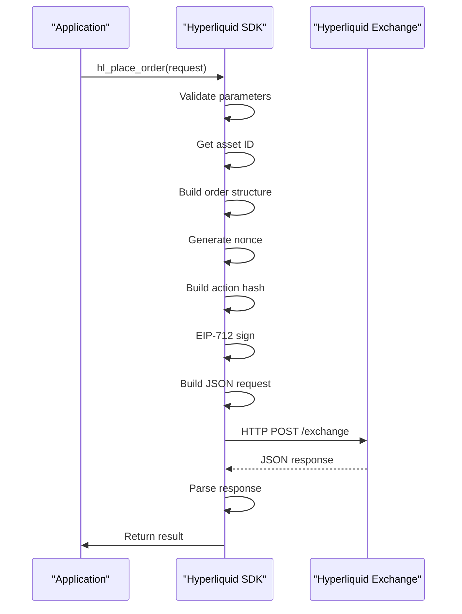
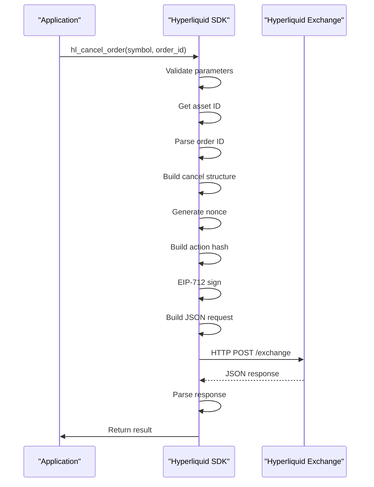
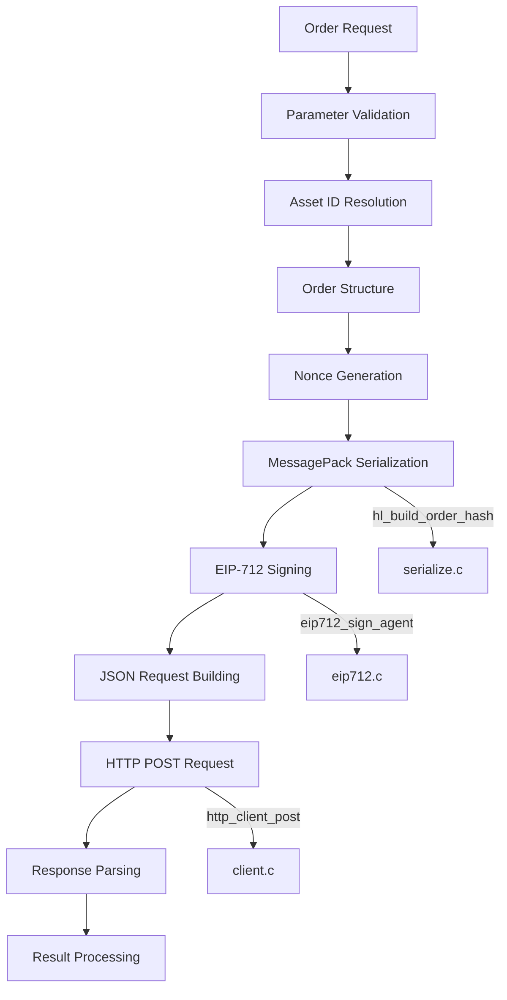
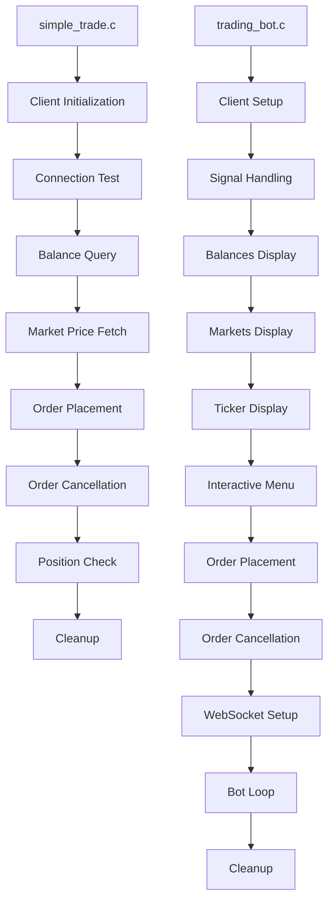

# Trading Operations

<cite>
**Referenced Files in This Document**   
- [simple_trade.c](file://examples/simple_trade.c)
- [trading_bot.c](file://examples/trading_bot.c)
- [hyperliquid.h](file://include/hyperliquid.h)
- [trading_api.c](file://src/trading_api.c)
- [serialize.c](file://src/msgpack/serialize.c)
- [eip712.c](file://src/crypto/eip712.c)
- [client.c](file://src/http/client.c)
</cite>

## Table of Contents
1. [Introduction](#introduction)
2. [Order Request Structure](#order-request-structure)
3. [Order Placement Workflow](#order-placement-workflow)
4. [Order Cancellation and Modification](#order-cancellation-and-modification)
5. [Batch Operations](#batch-operations)
6. [Underlying Process Flow](#underlying-process-flow)
7. [Error Handling and Result Processing](#error-handling-and-result-processing)
8. [Idempotency, Rate Limiting, and Lifecycle Management](#idempotency-rate-limiting-and-lifecycle-management)
9. [Best Practices](#best-practices)
10. [Real Usage Examples](#real-usage-examples)

## Introduction
This document provides comprehensive coverage of trading operations within the Hyperliquid C SDK. It details the complete workflow for placing, canceling, and modifying orders, including the structure of order requests, batch operations, error handling, and underlying implementation processes. The documentation explains the full sequence from request validation through MessagePack serialization, EIP-712 signing, HTTP transmission, and response parsing. Real-world usage patterns are illustrated through analysis of example implementations in simple_trade.c and trading_bot.c.

## Order Request Structure
The order request structure defines all parameters necessary for executing trades on the Hyperliquid exchange. The `hl_order_request_t` structure contains essential trading parameters that control order execution behavior.

**Section sources**
- [hyperliquid.h](file://include/hyperliquid.h#L127-L136)

### Core Parameters
The order request includes the following key parameters:

- **symbol**: Trading symbol (e.g., "BTC", "ETH") specifying the asset to trade
- **side**: Order direction using `hl_side_t` enum (HL_SIDE_BUY or HL_SIDE_SELL)
- **price**: Limit price for the order (set to 0 for market orders)
- **quantity**: Amount of the asset to buy or sell
- **order_type**: Using `hl_order_type_t` enum (HL_ORDER_TYPE_LIMIT or HL_ORDER_TYPE_MARKET)
- **time_in_force**: Execution instruction via `hl_time_in_force_t` enum (HL_TIF_GTC, HL_TIF_IOC, or HL_TIF_ALO)
- **reduce_only**: Boolean flag indicating if the order should only reduce existing positions
- **slippage_bps**: Slippage tolerance in basis points (used for market orders)

These parameters provide complete control over order execution characteristics, allowing traders to specify precise trading strategies.

## Order Placement Workflow
The order placement workflow involves a series of steps from request validation to API response processing. The `hl_place_order` function implements this workflow, ensuring secure and reliable order submission.

**Diagram sources**
- [trading_api.c](file://src/trading_api.c#L79-L220)
- [hyperliquid.h](file://include/hyperliquid.h#L276-L278)

**Section sources**
- [trading_api.c](file://src/trading_api.c#L79-L220)
- [hyperliquid.h](file://include/hyperliquid.h#L276-L278)

### Workflow Steps
1. **Parameter Validation**: The function first validates that the client, request, and result pointers are not null
2. **Client Data Extraction**: Wallet address, private key, testnet flag, HTTP client, and mutex are extracted from the client structure
3. **Asset ID Resolution**: The symbol is converted to an asset ID by querying market data
4. **Order Construction**: An `hl_order_t` structure is built with formatted price and size strings
5. **Nonce Generation**: Current timestamp in milliseconds is used as a nonce for request uniqueness
6. **Action Hash Creation**: MessagePack serialization creates a hash of the order action
7. **EIP-712 Signing**: The hash is signed using Ethereum's EIP-712 standard for secure authentication
8. **Request Building**: A JSON request is constructed containing the action, nonce, signature, and vault address
9. **HTTP Transmission**: The request is sent via POST to the appropriate API endpoint (testnet or mainnet)
10. **Response Processing**: The JSON response is parsed to extract the order ID and status

The workflow ensures thread safety through mutex locking during critical sections and proper memory management throughout the process.

## Order Cancellation and Modification
Order cancellation and modification operations allow traders to manage their active orders. The SDK provides functions for canceling individual orders, canceling all orders for a symbol, and modifying existing orders.

**Diagram sources**
- [trading_api.c](file://src/trading_api.c#L225-L338)
- [hyperliquid.h](file://include/hyperliquid.h#L289-L292)

**Section sources**
- [trading_api.c](file://src/trading_api.c#L225-L338)
- [hyperliquid.h](file://include/hyperliquid.h#L289-L292)

### Cancellation Process
The `hl_cancel_order` function follows a similar security workflow to order placement:

1. **Parameter Validation**: Validates input parameters including symbol and order ID
2. **Asset Resolution**: Converts the trading symbol to its corresponding asset ID
3. **Order ID Parsing**: Converts the string order ID to a numeric value
4. **Cancel Structure Creation**: Builds an `hl_cancel_t` structure with asset ID and order ID
5. **Nonce Generation**: Uses current timestamp as nonce for request uniqueness
6. **Hash Generation**: Creates a MessagePack hash of the cancel action
7. **EIP-712 Signing**: Signs the hash using the private key
8. **Request Construction**: Builds a JSON request with the cancel action, nonce, and signature
9. **API Submission**: Sends the request to the exchange endpoint
10. **Response Handling**: Parses the response to determine cancellation success

The `hl_modify_order` function (not fully implemented in provided code) would typically follow a cancel-and-replace pattern, first canceling the existing order and then placing a new one with modified parameters.

## Batch Operations
The SDK supports batch operations for placing or canceling multiple orders atomically. These operations improve efficiency by reducing the number of API calls and network round trips.

**Section sources**
- [hyperliquid.h](file://include/hyperliquid.h#L338-L354)

### Batch Placement
The `hl_create_orders` function allows placing multiple orders in a single API call:

- Accepts an array of `hl_order_request_t` structures
- Processes each order request through validation and construction
- Combines multiple orders into a single action with appropriate grouping
- Signs the combined action hash using EIP-712
- Submits all orders atomically in one HTTP request

### Batch Cancellation
The `hl_cancel_orders` function enables canceling multiple orders simultaneously:

- Takes an array of order IDs to cancel
- Builds a cancel action containing multiple cancel requests
- Generates a single signature for the entire batch operation
- Submits the batch cancellation request to the exchange

Batch operations maintain the same security model as individual operations while providing significant performance benefits for algorithmic trading strategies that require multiple order adjustments.

## Underlying Process Flow
The trading operations rely on a sophisticated underlying process that ensures security, reliability, and compatibility with the Hyperliquid exchange. This process spans multiple layers of the SDK architecture.

**Diagram sources**
- [trading_api.c](file://src/trading_api.c#L79-L338)
- [serialize.c](file://src/msgpack/serialize.c#L206-L219)
- [eip712.c](file://src/crypto/eip712.c#L260-L295)
- [client.c](file://src/http/client.c#L120-L167)

**Section sources**
- [trading_api.c](file://src/trading_api.c#L79-L338)
- [serialize.c](file://src/msgpack/serialize.c#L206-L219)
- [eip712.c](file://src/crypto/eip712.c#L260-L295)
- [client.c](file://src/http/client.c#L120-L167)

### Key Components
#### MessagePack Serialization
The `hl_build_order_hash` function in serialize.c implements MessagePack serialization to create a deterministic byte representation of the order action. This ensures compatibility with the Go-based backend and provides a secure foundation for cryptographic operations.

#### EIP-712 Signing
The `eip712_sign_agent` function in eip712.c implements Ethereum's EIP-712 standard for structured data signing. This provides secure authentication by:
- Computing domain hash with exchange name and chain ID
- Creating struct hash for the agent action
- Generating signing hash with the EIP-191 prefix
- Using secp256k1 ECDSA with proper recovery ID determination

#### HTTP Communication
The `http_client_post` function in client.c handles the HTTP transport layer, managing:
- Connection configuration and timeout settings
- Request body and header construction
- Response handling and error detection
- Memory management for response data

The process flow ensures that all trading operations are secure, reliable, and efficient, with proper error handling at each stage.

## Error Handling and Result Processing
The SDK implements comprehensive error handling and result processing to provide clear feedback on trading operations.

**Section sources**
- [hyperliquid.h](file://include/hyperliquid.h#L139-L151)
- [trading_api.c](file://src/trading_api.c#L79-L338)

### Order Result Structure
The `hl_order_result_t` structure provides detailed information about order execution:

- **order_id**: Allocated string containing the exchange-assigned order ID (caller must free)
- **status**: Order status using `hl_order_status_t` enum (OPEN, FILLED, PARTIALLY_FILLED, CANCELLED, REJECTED)
- **filled_quantity**: Amount of the order that has been filled
- **average_price**: Average execution price for filled portions
- **error**: Character array containing error messages (256 bytes)

### Cancel Result Structure
The `hl_cancel_result_t` structure indicates cancellation success:

- **cancelled**: Boolean flag indicating successful cancellation
- **error**: Character array containing error messages (256 bytes)

### Error Codes
The SDK returns specific error codes to help diagnose issues:

- **HL_SUCCESS**: Operation completed successfully
- **HL_ERROR_INVALID_PARAMS**: Invalid input parameters
- **HL_ERROR_NETWORK**: Network communication failure
- **HL_ERROR_API**: API request failed
- **HL_ERROR_INVALID_SYMBOL**: Unknown trading symbol
- **HL_ERROR_SIGNATURE**: Signature generation failed

Applications should check the return value and inspect the result structure's error field for detailed error information when operations fail.

## Idempotency, Rate Limiting, and Lifecycle Management
Effective trading operations require understanding of idempotency, rate limiting, and order lifecycle management.

**Section sources**
- [trading_api.c](file://src/trading_api.c#L79-L338)

### Idempotency
The system uses timestamp-based nonces to ensure request uniqueness. Each request includes a nonce derived from the current timestamp in milliseconds, preventing replay attacks and ensuring that identical requests are treated as distinct operations.

### Rate Limiting
While specific rate limits are not exposed in the SDK code, applications should implement appropriate throttling to avoid overwhelming the exchange API. Best practices include:
- Implementing exponential backoff for failed requests
- Limiting the frequency of order operations
- Using batch operations to reduce API call volume
- Monitoring response times for signs of throttling

### Order Lifecycle Management
Orders progress through a defined lifecycle:
1. **OPEN**: Order is placed and waiting for execution
2. **PARTIALLY_FILLED**: Order has executed partially
3. **FILLED**: Order has been completely filled
4. **CANCELLED**: Order was canceled before complete execution
5. **REJECTED**: Order was rejected by the exchange

Applications should regularly poll for order status updates or use WebSocket subscriptions to receive real-time updates on order state changes.

## Best Practices
Implementing effective trading operations requires adherence to several best practices.

**Section sources**
- [simple_trade.c](file://examples/simple_trade.c)
- [trading_bot.c](file://examples/trading_bot.c)

### Handling Partial Fills
When dealing with partial fills:
- Regularly check the `filled_quantity` field in order results
- Implement logic to handle partially filled orders appropriately
- Consider using IOC (Immediate or Cancel) orders for strategies requiring full execution
- Monitor for additional fills on partially filled orders

### Order Status Updates
For reliable order status tracking:
- Use `hl_fetch_order` to get detailed information about specific orders
- Implement periodic polling of open orders using `hl_fetch_open_orders`
- Consider using WebSocket connections for real-time order updates
- Store order IDs locally to track order state across application sessions

### Resource Management
Proper resource management is critical:
- Always free allocated strings in result structures (order_id)
- Handle mutex locking appropriately in multi-threaded environments
- Clean up client resources using `hl_client_destroy`
- Free dynamically allocated arrays returned by fetch functions

### Error Recovery
Implement robust error recovery:
- Retry failed operations with appropriate backoff
- Validate order parameters before submission
- Check balance and position information before placing orders
- Implement circuit breaker patterns for sustained failures

## Real Usage Examples
The SDK provides example implementations that demonstrate real-world usage patterns for trading operations.

**Diagram sources**
- [simple_trade.c](file://examples/simple_trade.c)
- [trading_bot.c](file://examples/trading_bot.c)

**Section sources**
- [simple_trade.c](file://examples/simple_trade.c)
- [trading_bot.c](file://examples/trading_bot.c)

### simple_trade.c Analysis
The simple_trade.c example demonstrates a complete trading workflow:
- Initializes the client with wallet and private key from environment variables
- Tests the connection to ensure API accessibility
- Retrieves account balance information
- Fetches current market price for BTC
- Places a limit buy order at 20% below market price
- Checks order status and cancels the order if still open
- Retrieves and displays open positions
- Properly cleans up resources

This example serves as a template for basic trading operations and error handling.

### trading_bot.c Analysis
The trading_bot.c example implements a more sophisticated trading bot:
- Uses signal handlers for graceful shutdown
- Implements an interactive menu system
- Demonstrates WebSocket integration for real-time data
- Shows balance and market information display
- Implements a bot loop with periodic updates
- Handles order placement and cancellation through user interaction
- Includes comprehensive error handling and cleanup

This example illustrates how to build a production-ready trading application with real-time data feeds and user interaction.

Both examples provide valuable insights into proper SDK usage patterns, error handling, and resource management for trading applications.