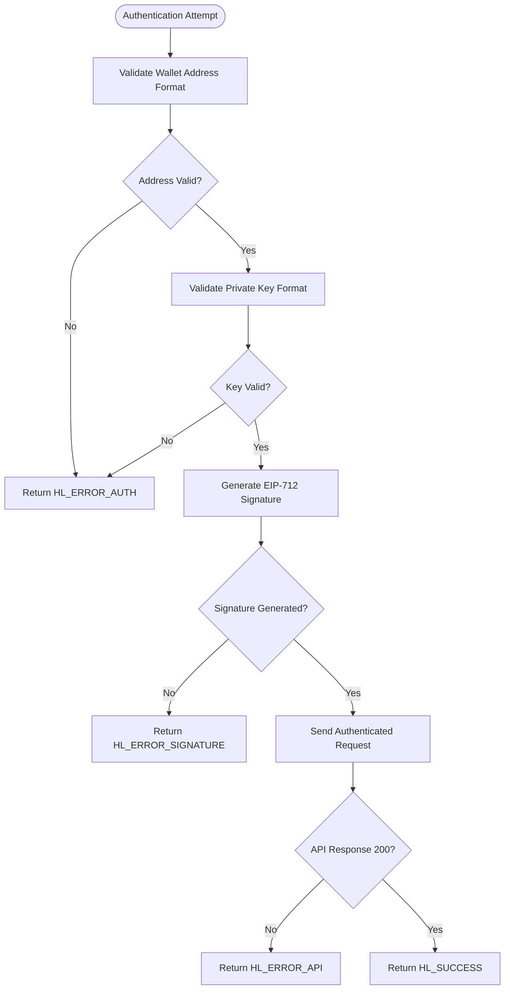
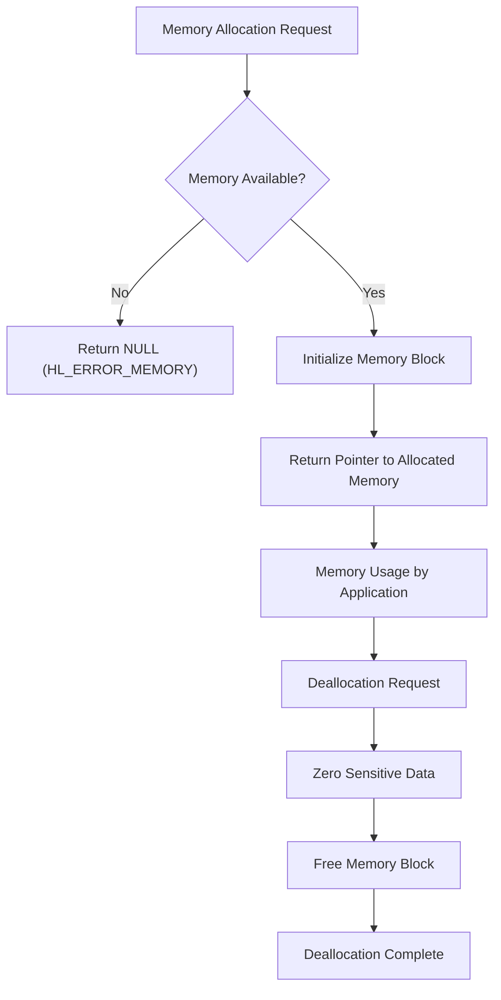

# Troubleshooting

<cite>
**Referenced Files in This Document**   
- [hl_logger.h](file://include/hl_logger.h)
- [hl_client.h](file://include/hl_client.h)
- [hl_http.h](file://include/hl_http.h)
- [hl_ws_client.h](file://include/hl_ws_client.h)
- [hl_crypto_internal.h](file://include/hl_crypto_internal.h)
- [hyperliquid.h](file://include/hyperliquid.h)
- [client.c](file://src/client.c)
- [http/client.c](file://src/http/client.c)
- [hl_account.h](file://include/hl_account.h)
- [hl_exchange.h](file://include/hl_exchange.h)
</cite>

## Table of Contents
1. [Introduction](#introduction)
2. [Connection Problems](#connection-problems)
3. [Authentication Failures](#authentication-failures)
4. [Parsing Errors](#parsing-errors)
5. [Memory Issues](#memory-issues)
6. [Error Code Reference](#error-code-reference)
7. [Platform-Specific Issues](#platform-specific-issues)
8. [Network Troubleshooting](#network-troubleshooting)
9. [Systematic Debugging Approach](#systematic-debugging-approach)
10. [Known Limitations and Workarounds](#known-limitations-and-workarounds)

## Introduction
This document provides comprehensive troubleshooting guidance for developers using the hyperliquid-c library. It covers common issues encountered during integration and operation, with detailed diagnostic procedures and solutions. The content is organized by problem category, with specific focus on connection issues, authentication failures, parsing errors, and memory management problems. Each section includes step-by-step diagnostic procedures, error code explanations, and practical solutions.

## Connection Problems

Connection issues are among the most common problems when using the hyperliquid-c library. These typically manifest as timeouts, refused connections, or failed handshakes with the Hyperliquid API servers.

### Common Symptoms
- `HL_ERROR_NETWORK` or `LV3_ERROR_NETWORK` error codes
- `HL_ERROR_TIMEOUT` responses from API calls
- WebSocket connection failures
- Intermittent connectivity issues

### Diagnostic Procedures
To diagnose connection problems, follow these steps:

1. **Test basic connectivity** using the built-in connection test function:
```c
bool success = hl_client_test_connection(client);
```

2. **Verify API endpoints** based on network configuration:
   - Testnet: `https://api.hyperliquid-testnet.xyz`
   - Mainnet: `https://api.hyperliquid.xyz`

3. **Check HTTP client connectivity** directly:
```c
bool connected = http_client_test_connection(http_client, NULL);
```

4. **Validate network reachability** to the API endpoints using system tools like ping or curl.

### Solutions
- Ensure the correct network (testnet/mainnet) is specified during client creation
- Verify that the system has internet connectivity
- Check that firewall settings allow outbound connections on port 443
- Increase timeout values if experiencing timeout errors:
```c
hl_set_timeout(client, 60000); // Set 60-second timeout
```

**Section sources**
- [hl_client.h](file://include/hl_client.h#L150-L170)
- [hl_http.h](file://include/hl_http.h#L110-L130)
- [client.c](file://src/client.c#L150-L180)

## Authentication Failures

Authentication failures occur when the library cannot properly authenticate with the Hyperliquid API, typically due to incorrect credentials or signature generation issues.

### Common Causes
- Invalid wallet address format
- Incorrect private key format
- EIP-712 signature generation failures
- Expired or invalid authentication tokens

### Verification Procedures
1. **Validate wallet address format**: Must be a valid Ethereum address starting with "0x" followed by 40 hexadecimal characters.

2. **Check private key format**: Should be 64 hexadecimal characters (without "0x" prefix) or 66 characters (with "0x" prefix).

3. **Enable debug logging** to trace authentication steps:
```c
#define DEBUG
#include "hl_logger.h"
HL_LOG_DEBUG("Authentication attempt with wallet: %s", wallet_address);
```

4. **Verify key parsing** in the client creation process:
```c
hl_client_t* client = hl_client_create(wallet_address, private_key, testnet);
if (!client) {
    HL_LOG_ERROR("Client creation failed - check credentials");
}
```

### Solutions
- Ensure wallet addresses are properly formatted with "0x" prefix
- Remove "0x" prefix from private keys or ensure they are exactly 64 characters
- Validate that private keys are in raw hexadecimal format
- Test with known valid credentials to isolate the issue



**Diagram sources**
- [client.c](file://src/client.c#L50-L100)
- [hl_crypto_internal.h](file://include/hl_crypto_internal.h#L70-L80)

**Section sources**
- [client.c](file://src/client.c#L50-L100)
- [hl_crypto_internal.h](file://include/hl_crypto_internal.h#L70-L80)
- [hyperliquid.h](file://include/hyperliquid.h#L250-L270)

## Parsing Errors

Parsing errors occur when the library cannot properly parse responses from the Hyperliquid API or when there are issues with data serialization.

### Common Error Codes
- `HL_ERROR_JSON`: JSON parsing failures
- `HL_ERROR_MSGPACK`: MessagePack serialization errors
- `HL_ERROR_PARSE`: General response parsing failures

### Diagnostic Steps
1. **Enable debug logging** to capture raw API responses:
```c
#define DEBUG
#include "hl_logger.h"
```

2. **Inspect HTTP response bodies** for malformed JSON:
```c
http_response_t response = {0};
lv3_error_t result = http_client_post(client->http, url, body, headers, &response);
if (result == LV3_SUCCESS) {
    HL_LOG_DEBUG("Raw response: %s", response.body);
}
```

3. **Validate JSON structure** against expected API response formats.

4. **Check MessagePack serialization** for binary data encoding issues.

### Solutions
- Ensure all JSON responses are properly formatted
- Validate that MessagePack serialization maintains data type integrity
- Handle edge cases in numeric parsing (very large or very small numbers)
- Implement proper error handling around parsing functions

**Section sources**
- [hyperliquid.h](file://include/hyperliquid.h#L120-L140)
- [hl_http.h](file://include/hl_http.h#L60-L80)
- [src/http/client.c](file://src/http/client.c#L150-L200)

## Memory Issues

Memory issues in the hyperliquid-c library typically involve allocation failures, memory leaks, or improper memory management.

### Common Symptoms
- `HL_ERROR_MEMORY` error codes
- Application crashes during extended operation
- Increasing memory usage over time
- Segmentation faults

### Memory Management Analysis
The library uses standard C memory management functions:
- `calloc()` for allocation with zero initialization
- `realloc()` for resizing allocated memory
- `free()` for deallocation

Key memory management patterns:
- Client structure allocation in `hl_client_create()`
- HTTP response body allocation in `write_callback()`
- Order result string allocation (caller responsible for freeing)

### Diagnostic Procedures
1. **Check for memory allocation failures**:
```c
hl_client_t *client = (hl_client_t*)calloc(1, sizeof(hl_client_t));
if (!client) {
    return NULL; // Will result in HL_ERROR_MEMORY
}
```

2. **Verify proper deallocation** in cleanup functions:
```c
void hl_client_destroy(hl_client_t *client) {
    if (client) {
        // Zero out sensitive data
        memset(client->private_key, 0, sizeof(client->private_key));
        // Cleanup resources
        if (client->http) {
            http_client_destroy(client->http);
        }
        pthread_mutex_destroy(&client->mutex);
        free(client);
    }
}
```

3. **Use memory analysis tools** like Valgrind to detect leaks:
```bash
valgrind --leak-check=full ./your_application
```

### Solutions
- Always check return values of memory allocation functions
- Ensure all allocated memory is properly freed
- Zero out sensitive data (like private keys) before freeing
- Implement proper error handling for memory allocation failures



**Diagram sources**
- [client.c](file://src/client.c#L80-L100)
- [src/http/client.c](file://src/http/client.c#L50-L70)

**Section sources**
- [client.c](file://src/client.c#L80-L100)
- [src/http/client.c](file://src/http/client.c#L50-L70)
- [hl_internal.h](file://include/hl_internal.h#L90-L100)

## Error Code Reference

This section provides a comprehensive reference for all error codes used in the hyperliquid-c library, with explanations and remediation steps.

### Error Code Lookup Table

| Error Code | Numeric Value | Description | Common Causes | Remediation Steps |
|------------|---------------|-------------|---------------|-------------------|
| HL_SUCCESS | 0 | Operation successful | N/A | No action required |
| HL_ERROR_INVALID_PARAMS | -1 | Invalid parameters provided | Incorrect argument types, null pointers, invalid values | Validate all input parameters before calling functions |
| HL_ERROR_NETWORK | -2 | Network communication failure | No internet connection, firewall blocking, DNS issues | Check network connectivity, verify firewall settings, test with ping |
| HL_ERROR_API | -3 | API returned error response | Invalid API usage, rate limiting, server-side issues | Check API documentation, implement rate limiting, retry with exponential backoff |
| HL_ERROR_AUTH | -4 | Authentication failure | Invalid credentials, incorrect signature | Verify wallet address and private key format, check network setting (testnet/mainnet) |
| HL_ERROR_INSUFFICIENT_BALANCE | -5 | Insufficient funds for operation | Account balance too low | Check account balance, reduce order size, deposit funds |
| HL_ERROR_INVALID_SYMBOL | -6 | Trading symbol not recognized | Misspelled symbol, unsupported market | Verify symbol format (e.g., "BTC/USDC:USDC"), check available markets with hl_fetch_markets() |
| HL_ERROR_ORDER_REJECTED | -7 | Order rejected by exchange | Invalid order parameters, market conditions | Validate order parameters, check price against current market, ensure sufficient margin |
| HL_ERROR_SIGNATURE | -8 | Signature generation failed | Invalid private key, cryptographic library issues | Verify private key format, ensure cryptographic libraries are properly linked |
| HL_ERROR_MSGPACK | -9 | MessagePack serialization error | Data type mismatches, buffer overflows | Validate data types, ensure sufficient buffer sizes, check MessagePack library |
| HL_ERROR_JSON | -10 | JSON parsing error | Malformed JSON response, encoding issues | Enable debug logging to view raw responses, validate JSON structure |
| HL_ERROR_MEMORY | -11 | Memory allocation failed | System memory exhaustion, allocation errors | Check system memory, implement proper error handling, reduce memory footprint |
| HL_ERROR_TIMEOUT | -12 | Operation timed out | Slow network, server overload, long-running operations | Increase timeout values, check network quality, retry operation |
| HL_ERROR_NOT_IMPLEMENTED | -13 | Feature not implemented | Calling unimplemented function | Check documentation for supported features, use alternative methods |
| HL_ERROR_NOT_FOUND | -14 | Resource not found | Invalid order ID, non-existent symbol | Verify resource identifiers, check existence before access |
| HL_ERROR_PARSE | -15 | Response parsing failure | Unexpected response format, protocol changes | Update library to latest version, check API documentation, implement robust parsing |

### Error Handling Best Practices
- Always check return values of library functions
- Implement appropriate error handling for each error type
- Use `hl_error_string()` to get human-readable error descriptions
- Log errors appropriately for debugging purposes
- Implement retry logic for transient errors (network, timeout)

**Section sources**
- [hyperliquid.h](file://include/hyperliquid.h#L90-L150)
- [hl_client.h](file://include/hl_client.h#L150-L170)
- [hl_http.h](file://include/hl_http.h#L30-L50)

## Platform-Specific Issues

The hyperliquid-c library may exhibit different behaviors across various operating systems due to differences in system libraries, threading models, and network stacks.

### Linux Issues
- **Memory alignment issues**: Ensure proper structure padding
- **pthread compatibility**: Verify pthread library linking
- **CURL configuration**: Ensure libcurl is properly installed

### macOS Issues
- **System Integrity Protection**: May affect library loading
- **Xcode command line tools**: Required for compilation
- **Dynamic library paths**: May require DYLD_LIBRARY_PATH setting

### Windows Issues
- **MSYS2/MinGW environment**: Required for compilation
- **Windows Defender**: May block network connections
- **Path separators**: Use forward slashes in URLs and paths

### Cross-Platform Solutions
- Use standard C99 features consistently
- Avoid platform-specific APIs when possible
- Test on all target platforms regularly
- Use platform-independent build systems (Make, CMake)

**Section sources**
- [hl_internal.h](file://include/hl_internal.h#L70-L90)
- [src/http/client.c](file://src/http/client.c#L20-L40)
- [Makefile](file://Makefile)

## Network Troubleshooting

Network issues can significantly impact the reliability of the hyperliquid-c library. This section covers techniques for diagnosing and resolving network-related problems.

### Firewall Settings
Check if firewall software is blocking connections to Hyperliquid API endpoints:
- **Testnet**: `api.hyperliquid-testnet.xyz` (port 443)
- **Mainnet**: `api.hyperliquid.xyz` (port 443)

Diagnostic commands:
```bash
# Test connectivity
telnet api.hyperliquid.xyz 443

# Or using curl
curl -v https://api.hyperliquid.xyz/info
```

### DNS Resolution
Verify DNS can resolve Hyperliquid domains:
```bash
nslookup api.hyperliquid.xyz
dig api.hyperliquid.xyz
```

If DNS resolution fails:
- Try alternative DNS servers (Google DNS: 8.8.8.8, Cloudflare: 1.1.1.1)
- Check local DNS cache
- Verify network configuration

### Proxy Configuration
If behind a corporate proxy, configure the HTTP client:
```c
lv3_error_t result = http_client_set_proxy(http_client, "http://proxy.company.com:8080");
```

### Network Diagnostics
Use system tools to diagnose network issues:
```bash
# Check routing
traceroute api.hyperliquid.xyz

# Monitor connections
netstat -an | grep :443

# Test latency
ping api.hyperliquid.xyz
```

**Section sources**
- [hl_http.h](file://include/hl_http.h#L100-L120)
- [src/http/client.c](file://src/http/client.c#L200-L230)

## Systematic Debugging Approach

When encountering issues with the hyperliquid-c library, follow this systematic approach to isolate and resolve problems.

### Step 1: Reproduce with Simple Examples
Start with the simplest possible example that reproduces the issue:
```c
// Use simple_balance.c example as starting point
hl_client_t* client = hl_client_create(wallet, key, true);
hl_balance_t balance = {0};
hl_fetch_balance(client, HL_ACCOUNT_PERPETUAL, &balance);
hl_client_destroy(client);
```

### Step 2: Enable Debug Logging
Compile with DEBUG flag to enable detailed logging:
```c
#define DEBUG
#include "hl_logger.h"
```

### Step 3: Isolate the Problem
Determine which component is failing:
- **Network layer**: Test with `hl_client_test_connection()`
- **Authentication**: Verify credentials with simple API call
- **Parsing**: Check raw responses for formatting issues
- **Memory**: Monitor memory usage and allocation patterns

### Step 4: Verify Dependencies
Ensure all required libraries are properly installed:
- libcurl
- cJSON
- libsecp256k1
- libuuid

### Step 5: Check Configuration
Verify all configuration settings:
- Testnet vs Mainnet setting
- Timeout values
- Rate limiting
- Proxy settings

### Step 6: Test Incrementally
Build up from simple to complex operations:
1. Test connection
2. Fetch market data
3. Check balance
4. Place simple order
5. Implement advanced features

**Section sources**
- [examples/simple_balance.c](file://examples/simple_balance.c)
- [hl_logger.h](file://include/hl_logger.h)
- [client.c](file://src/client.c#L150-L180)

## Known Limitations and Workarounds

This section documents known limitations in the current version of the hyperliquid-c library and provides practical workarounds.

### Current Limitations
- **WebSocket reconnection**: Automatic reconnection logic may not handle all network failure scenarios
- **Memory management**: Some allocated strings require manual freeing by the caller
- **Error granularity**: Some error codes are broad and don't provide specific failure reasons
- **Thread safety**: While basic thread safety is implemented, complex multi-threaded scenarios may require additional synchronization

### Documented Workarounds
1. **For WebSocket reconnection issues**:
   - Implement application-level heartbeat monitoring
   - Use exponential backoff for reconnection attempts
   - Maintain local state to resynchronize after reconnection

2. **For memory management**:
   - Always check documentation for ownership of returned pointers
   - Implement RAII-style patterns in wrapper code
   - Use static analysis tools to detect memory leaks

3. **For error handling**:
   - Implement logging to capture context around errors
   - Use multiple error codes in combination for better diagnosis
   - Implement retry logic with circuit breaker patterns

4. **For thread safety**:
   - Limit concurrent access to single client instances
   - Use connection pooling for high-concurrency scenarios
   - Implement message queues for ordered operations

### Recommended Practices
- Always check return values and handle errors appropriately
- Use the provided examples as reference implementations
- Monitor library updates for bug fixes and improvements
- Contribute to the project by reporting issues and suggesting improvements

**Section sources**
- [README.md](file://README.md#L100-L200)
- [hl_client.h](file://include/hl_client.h)
- [hl_exchange.h](file://include/hl_exchange.h)