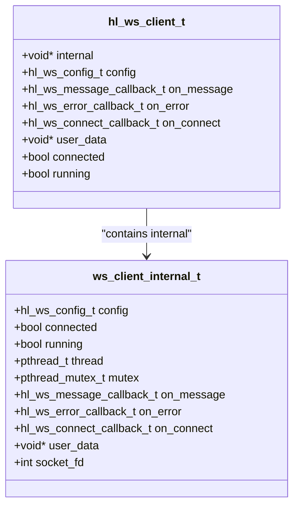
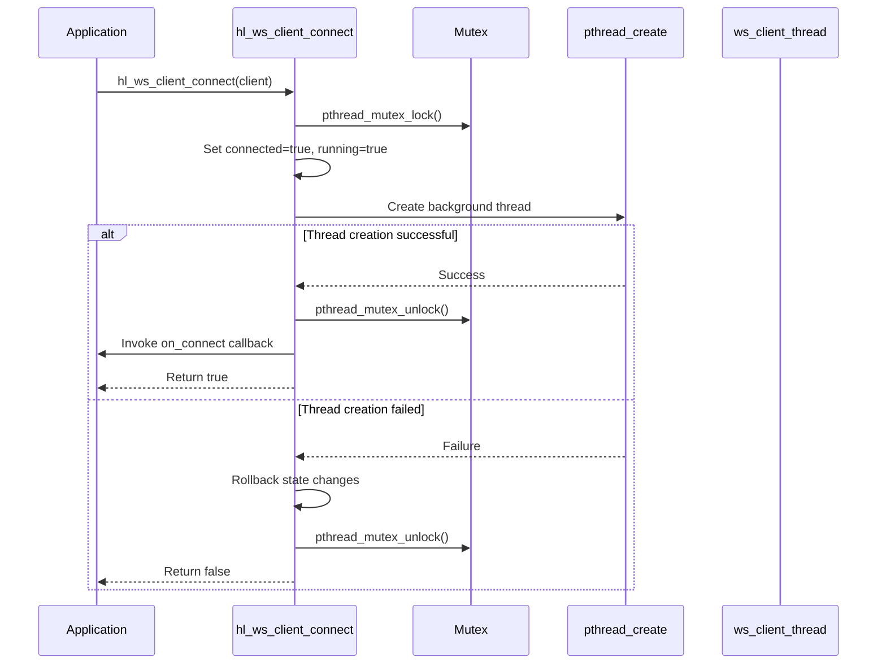
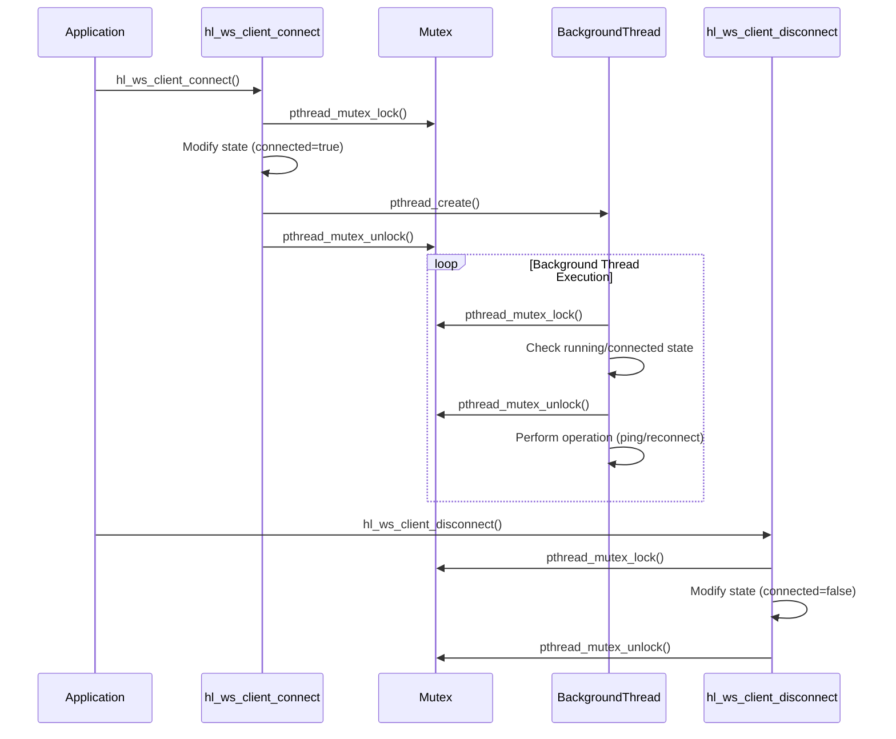
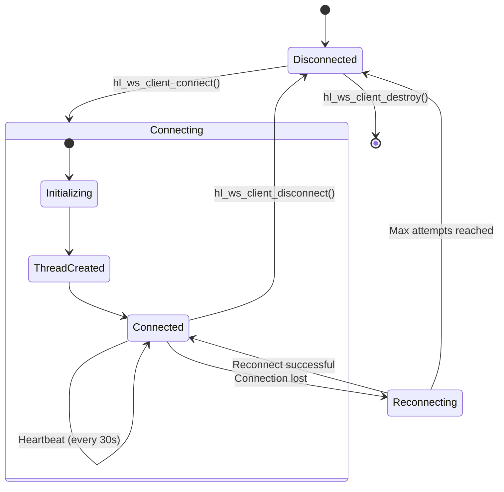

# Connection Management

<cite>
**Referenced Files in This Document**   
- [ws_client.c](file://src/ws_client.c)
- [hl_ws_client.h](file://include/hl_ws_client.h)
</cite>

## Table of Contents
1. [Introduction](#introduction)
2. [WebSocket Client Structure](#websocket-client-structure)
3. [Connection Establishment](#connection-establishment)
4. [Connection Lifecycle Management](#connection-lifecycle-management)
5. [Thread Management and Synchronization](#thread-management-and-synchronization)
6. [State Transitions and Connection Status](#state-transitions-and-connection-status)
7. [Error Handling and Failure Conditions](#error-handling-and-failure-conditions)
8. [Client Initialization and Teardown](#client-initialization-and-teardown)
9. [Best Practices for Thread-Safe Operations](#best-practices-for-thread-safe-operations)
10. [Conclusion](#conclusion)

## Introduction
This document provides a comprehensive analysis of the WebSocket connection management system in the Hyperliquid C SDK. It focuses on the implementation of the `hl_ws_client_connect()` function, the internal `ws_client_internal_t` structure, and the mechanisms for thread creation, mutex synchronization, and connection state transitions. The documentation covers proper initialization, connection lifecycle, error handling, and best practices for thread-safe operations during WebSocket client usage.

**Section sources**
- [ws_client.c](file://src/ws_client.c#L1-L287)
- [hl_ws_client.h](file://include/hl_ws_client.h#L1-L137)

## WebSocket Client Structure
The WebSocket client implementation uses a dual-structure design with public and internal components. The `hl_ws_client_t` structure provides the public interface, while `ws_client_internal_t` encapsulates the implementation details, including thread management, synchronization primitives, and connection state.

The `ws_client_internal_t` structure contains the following key components:
- **Configuration**: Stores the WebSocket connection parameters (`hl_ws_config_t`)
- **State flags**: `connected` and `running` boolean indicators
- **Thread handle**: `pthread_t` for the background WebSocket thread
- **Mutex**: `pthread_mutex_t` for thread-safe access to shared state
- **Callbacks**: Function pointers for message, error, and connect events
- **User data**: Pointer for callback context
- **Socket state**: File descriptor placeholder for the WebSocket connection

This separation allows for a clean public API while maintaining thread safety and encapsulation of implementation details.



**Diagram sources**
- [ws_client.c](file://src/ws_client.c#L13-L28)
- [hl_ws_client.h](file://include/hl_ws_client.h#L43-L96)

**Section sources**
- [ws_client.c](file://src/ws_client.c#L13-L28)
- [hl_ws_client.h](file://include/hl_ws_client.h#L43-L96)

## Connection Establishment
The `hl_ws_client_connect()` function orchestrates the WebSocket connection process, handling thread creation, state transitions, and synchronization. The function follows a careful sequence to ensure thread safety and proper initialization.

Connection establishment involves:
1. **Parameter validation**: Checks for valid client pointer
2. **Mutex acquisition**: Locks the internal mutex to prevent race conditions
3. **State initialization**: Sets both internal and external connected/running flags
4. **Thread creation**: Spawns the background WebSocket thread using `pthread_create()`
5. **Error handling**: Rolls back state changes if thread creation fails
6. **Callback invocation**: Calls the user-provided connect callback upon success

The function returns `true` on successful connection establishment and `false` if any step fails, including thread creation or mutex operations.



**Diagram sources**
- [ws_client.c](file://src/ws_client.c#L127-L161)

**Section sources**
- [ws_client.c](file://src/ws_client.c#L127-L161)

## Connection Lifecycle Management
The WebSocket client manages its lifecycle through a series of stateful operations that control connection establishment, maintenance, and termination. The lifecycle is governed by the `connected` and `running` state flags, which are maintained in both the public `hl_ws_client_t` structure and the internal `ws_client_internal_t` structure.

Key lifecycle functions include:
- **hl_ws_client_connect()**: Establishes the WebSocket connection and starts the background thread
- **hl_ws_client_disconnect()**: Terminates the connection and stops message processing
- **hl_ws_client_is_connected()**: Checks the current connection status
- **hl_ws_client_destroy()**: Completely tears down the client instance

The background thread (`ws_client_thread`) continuously monitors the `running` and `connected` flags, performing heartbeat operations when connected and reconnection attempts when disconnected. This design ensures that the client can maintain persistent connections and automatically recover from temporary network disruptions.

```mermaid
flowchart TD
A[Client Created] --> B{hl_ws_client_connect() called?}
B --> |No| C[Idle State]
B --> |Yes| D[Connection Attempt]
D --> E{Connection Successful?}
E --> |Yes| F[Connected State]
E --> |No| G[Connection Failed]
F --> H{Running?}
H --> |Yes| I[Heartbeat/Ping]
H --> |No| J[Shutdown]
I --> F
G --> K{Auto Reconnect?}
K --> |Yes| L[Wait Reconnect Delay]
L --> D
K --> |No| M[Disconnected]
J --> N[Cleanup Resources]
M --> N
N --> O[Client Destroyed]
```

**Diagram sources**
- [ws_client.c](file://src/ws_client.c#L33-L51)
- [ws_client.c](file://src/ws_client.c#L166-L185)

**Section sources**
- [ws_client.c](file://src/ws_client.c#L33-L51)
- [ws_client.c](file://src/ws_client.c#L127-L185)

## Thread Management and Synchronization
The WebSocket client employs pthreads for concurrent operation and mutexes for synchronization, ensuring thread-safe access to shared state. The implementation uses a single background thread for WebSocket operations, with a mutex protecting all shared data structures.

### Thread Creation
The `hl_ws_client_connect()` function creates a background thread using `pthread_create()`:
- The thread executes the `ws_client_thread()` function
- The client instance is passed as the thread argument
- Thread creation failure triggers a complete rollback of connection state

### Mutex Synchronization
A `pthread_mutex_t` protects critical sections in the following functions:
- `hl_ws_client_connect()`: During state initialization
- `hl_ws_client_disconnect()`: During state modification
- `hl_ws_client_destroy()`: During cleanup operations
- `hl_ws_client_set_*_callback()`: During callback updates

The mutex ensures that state modifications are atomic and prevents race conditions when multiple threads access the client simultaneously. All state changes to `connected`, `running`, and callback pointers are protected by the mutex.



**Diagram sources**
- [ws_client.c](file://src/ws_client.c#L127-L161)
- [ws_client.c](file://src/ws_client.c#L166-L185)
- [ws_client.c](file://src/ws_client.c#L218-L262)

**Section sources**
- [ws_client.c](file://src/ws_client.c#L127-L161)
- [ws_client.c](file://src/ws_client.c#L166-L185)
- [ws_client.c](file://src/ws_client.c#L218-L262)

## State Transitions and Connection Status
The WebSocket client maintains connection state through boolean flags that are synchronized between the public and internal structures. The state model is designed to be simple yet effective for managing the connection lifecycle.

### State Variables
- **connected**: Indicates whether the WebSocket handshake has completed successfully
- **running**: Controls whether the background thread should continue executing
- Both flags exist in both `hl_ws_client_t` and `ws_client_internal_t` for efficient access

### State Transition Diagram


### Status Checking
The `hl_ws_client_is_connected()` function provides a thread-safe way to check connection status:
- Takes a const pointer to the client
- Returns the value of the `connected` flag
- No mutex locking required as it only reads a single boolean value

This design allows applications to frequently check connection status without incurring the overhead of mutex operations.

**Diagram sources**
- [ws_client.c](file://src/ws_client.c#L248-L252)

**Section sources**
- [ws_client.c](file://src/ws_client.c#L248-L252)

## Error Handling and Failure Conditions
The WebSocket client implementation includes comprehensive error handling for various failure conditions that may occur during connection establishment and operation.

### Connection Failure Scenarios
- **Invalid client pointer**: `hl_ws_client_connect()` returns `false` if the client parameter is NULL
- **Thread creation failure**: If `pthread_create()` fails, the function rolls back all state changes and returns `false`
- **Mutex operations**: Failure to lock/unlock the mutex could lead to undefined behavior, though the current implementation assumes mutex operations succeed

### Error Recovery
The background thread implements a simple reconnection strategy:
- When not connected, it sleeps for the duration specified in `reconnect_delay_ms`
- After the delay, it attempts to reconnect (in a complete implementation)
- The number of reconnection attempts can be limited by `max_reconnect_attempts` when auto-reconnect is enabled

### Error Indicators
Applications can detect connection failures through:
- Return value of `hl_ws_client_connect()` (false indicates failure)
- Connection status via `hl_ws_client_is_connected()`
- Error callbacks when implemented in a complete version

The current implementation is a framework that simulates connection behavior, with actual WebSocket handshake and error detection to be implemented in the final version.

**Section sources**
- [ws_client.c](file://src/ws_client.c#L127-L161)
- [ws_client.c](file://src/ws_client.c#L33-L51)

## Client Initialization and Teardown
Proper initialization and teardown are critical for resource management and preventing memory leaks in the WebSocket client.

### Initialization Process
The `hl_ws_client_create()` function follows these steps:
1. Validates configuration parameters
2. Allocates memory for the client and internal structures
3. Copies configuration settings
4. Initializes the mutex with `pthread_mutex_init()`
5. Sets initial state flags to false
6. Returns the initialized client or NULL on failure

Failure at any step results in proper cleanup of previously allocated resources.

### Teardown Process
The `hl_ws_client_destroy()` function performs a complete teardown:
1. Sets `running` to false to stop the background thread
2. Joins the thread with `pthread_join()` if it was running
3. Closes the socket file descriptor if open
4. Destroys the mutex with `pthread_mutex_destroy()`
5. Frees internal and client memory

The teardown process ensures that all resources are properly released and prevents resource leaks.

```mermaid
flowchart TD
A[hl_ws_client_create] --> B{Valid config?}
B --> |No| C[Return NULL]
B --> |Yes| D[Allocate client memory]
D --> E{Success?}
E --> |No| C
E --> |Yes| F[Allocate internal memory]
F --> G{Success?}
G --> |No| H[Free client memory, Return NULL]
G --> |Yes| I[Initialize mutex]
I --> J{Success?}
J --> |No| K[Free internal and client memory, Return NULL]
J --> |Yes| L[Set default state]
L --> M[Return client]
N[hl_ws_client_destroy] --> O{Client valid?}
O --> |No| P[Return]
O --> |Yes| Q[Set running=false]
Q --> R{Was running?}
R --> |Yes| S[pthread_join()]
R --> |No| T[Close socket]
S --> T
T --> U[Destroy mutex]
U --> V[Free internal memory]
V --> W[Free client memory]
```

**Diagram sources**
- [ws_client.c](file://src/ws_client.c#L56-L93)
- [ws_client.c](file://src/ws_client.c#L98-L122)

**Section sources**
- [ws_client.c](file://src/ws_client.c#L56-L122)

## Best Practices for Thread-Safe Operations
To ensure safe and reliable operation of the WebSocket client in multithreaded environments, the following best practices should be observed:

### Mutex Usage
- Always lock the mutex before modifying shared state
- Keep critical sections as small as possible to minimize contention
- Unlock the mutex before calling user callbacks to avoid potential deadlocks
- Never hold the mutex across blocking operations

### State Modification
- Update both internal and external state flags atomically within mutex protection
- Use consistent state transition patterns across all functions
- Validate state before performing operations (e.g., don't disconnect if not connected)

### Callback Safety
- Store callback pointers and user data within the mutex-protected section
- Call callbacks after releasing the mutex to prevent deadlocks
- Ensure callback functions are reentrant and thread-safe

### Resource Management
- Always join threads during teardown to prevent zombie threads
- Properly destroy mutexes after joining threads
- Close socket resources before destroying synchronization primitives
- Free all allocated memory in reverse order of allocation

### Connection Management
- Check connection status with `hl_ws_client_is_connected()` before sending messages
- Handle connection failures gracefully with retry logic
- Use the connect callback to initiate operations that require an active connection
- Implement proper timeout mechanisms for connection attempts

Following these practices ensures that the WebSocket client operates reliably in concurrent environments and prevents common threading issues such as race conditions, deadlocks, and resource leaks.

**Section sources**
- [ws_client.c](file://src/ws_client.c#L56-L287)

## Conclusion
The WebSocket connection management system in the Hyperliquid C SDK provides a robust framework for real-time communication with the exchange. The implementation uses a clean separation between public API and internal state, with comprehensive thread safety measures through pthread mutexes. The `hl_ws_client_connect()` function orchestrates connection establishment with proper error handling and state management, while the background thread maintains the connection lifecycle. The dual structure design with `hl_ws_client_t` and `ws_client_internal_t` enables efficient, thread-safe operations while maintaining a simple public interface. By following the documented best practices for initialization, connection management, and teardown, applications can reliably use the WebSocket client for real-time market data and trading operations.