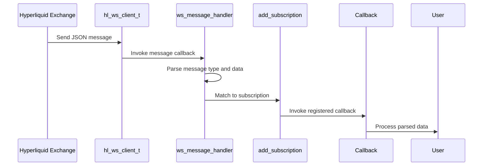
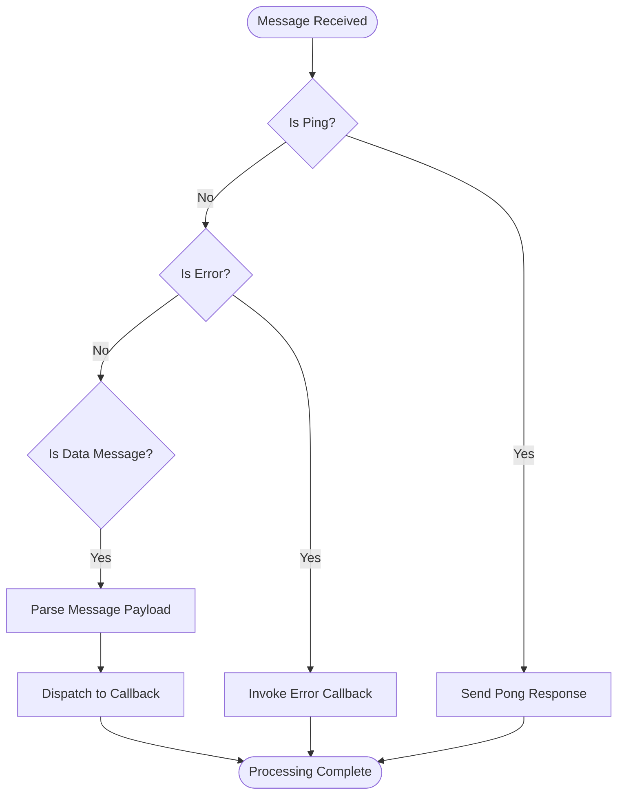

# Message Processing and Payload Structure

<cite>
**Referenced Files in This Document**   
- [websocket.c](file://src/websocket.c)
- [hl_ws_client.h](file://include/hl_ws_client.h)
- [hl_msgpack.h](file://include/hl_msgpack.h)
- [comprehensive_demo.c](file://examples/comprehensive_demo.c)
- [ws_client.c](file://src/ws_client.c)
</cite>

## Table of Contents
1. [Introduction](#introduction)
2. [WebSocket Message Handling Framework](#websocket-message-handling-framework)
3. [Incoming Message Parsing and Dispatch](#incoming-message-parsing-and-dispatch)
4. [Raw Message Payload Structures](#raw-message-payload-structures)
5. [MessagePack Decoding into C Structures](#messagepack-decoding-into-c-structures)
6. [Error Handling and System Messages](#error-handling-and-system-messages)
7. [Performance Optimization for High-Frequency Streams](#performance-optimization-for-high-frequency-streams)
8. [Message Integrity and Sequence Validation](#message-integrity-and-sequence-validation)
9. [Common Parsing Issues and Recovery](#common-parsing-issues-and-recovery)

## Introduction
This document provides comprehensive documentation on the WebSocket message processing system in the Hyperliquid C SDK. It details how incoming messages from the Hyperliquid exchange are parsed, dispatched, and transformed from MessagePack format into usable C structures. The documentation covers ticker updates, order book deltas, trade executions, error handling, heartbeat responses, and subscription acknowledgments. Implementation patterns are illustrated using examples from comprehensive_demo.c, with guidance on validating message integrity and handling out-of-sequence updates in high-frequency trading environments.

## WebSocket Message Handling Framework

The Hyperliquid C SDK implements a WebSocket client framework that manages real-time data streaming from the exchange. The architecture consists of a client extension that maintains WebSocket state, subscription management, and callback dispatching. The framework handles connection lifecycle events including connection establishment, error conditions, and message receipt.

```mermaid
graph TB
subgraph "WebSocket Client"
WSClient[hl_ws_client_t]
Config[hl_ws_config_t]
Callbacks[Message/Error/Connect Callbacks]
end
subgraph "Client Extension"
Extension[hl_client_ws_extension_t]
Subscriptions[hl_ws_subscription_t[]]
end
Client[hl_client_t] --> Extension
Extension --> WSClient
WSClient --> Config
WSClient --> Callbacks
```

**Diagram sources**
- [websocket.c](file://src/websocket.c#L72-L79)
- [hl_ws_client.h](file://include/hl_ws_client.h#L43-L96)

**Section sources**
- [websocket.c](file://src/websocket.c#L72-L138)
- [hl_ws_client.h](file://include/hl_ws_client.h#L43-L96)

## Incoming Message Parsing and Dispatch

The message dispatch system routes incoming WebSocket messages to appropriate callbacks based on subscription type and symbol. When a message is received, the framework parses the JSON payload and determines which registered callback should handle the data. The dispatch mechanism supports multiple subscription types including ticker updates, order book changes, trade executions, and user-specific order updates.

The current implementation contains a placeholder message handler that logs raw messages to stdout. In the production implementation, this handler would parse the JSON message and dispatch to registered callbacks based on the message type and subscription parameters.



**Diagram sources**
- [websocket.c](file://src/websocket.c#L72-L79)
- [websocket.c](file://src/websocket.c#L45-L89)

**Section sources**
- [websocket.c](file://src/websocket.c#L72-L89)

## Raw Message Payload Structures

The Hyperliquid exchange uses specific JSON message formats for different types of real-time data. Subscription messages follow a standardized format with method and subscription parameters, while data messages contain the actual market information.

For ticker updates, the subscription message format is:
```json
{"method":"subscribe","subscription":{"type":"ticker","coin":"BTC/USDC:USDC"}}
```

Order book subscriptions use:
```json
{"method":"subscribe","subscription":{"type":"l2Book","coin":"BTC/USDC:USDC"}}
```

Trade execution subscriptions follow:
```json
{"method":"subscribe","subscription":{"type":"trades","coin":"BTC/USDC:USDC"}}
```

User order updates require wallet authentication:
```json
{"method":"subscribe","subscription":{"type":"orderUpdates","user":"0x..."}}
```

User trade notifications (fills) also require authentication:
```json
{"method":"subscribe","subscription":{"type":"userFills","user":"0x..."}}
```

Subscription acknowledgments and error messages follow the standard WebSocket JSON format, with system messages including ping/pong heartbeats for connection maintenance.

**Section sources**
- [websocket.c](file://src/websocket.c#L150-L181)
- [websocket.c](file://src/websocket.c#L190-L215)

## MessagePack Decoding into C Structures

The SDK uses the msgpack-c library to decode MessagePack-formatted data into C structures. The decoding process maintains strict field ordering requirements that match the Hyperliquid API specification. For order objects, the field order must be: asset_id (a), is_buy (b), price (p), size (s), reduce_only (r), and order_type (t).

The order action structure requires field ordering: type, orders, and grouping. Cancel actions must follow: type, cancels. This specific ordering is critical as it affects the resulting MessagePack bytes and subsequent hash verification.

The hl_order_request_t structure maps directly to the MessagePack format:
```c
typedef struct {
    uint32_t a;        /**< Asset ID */
    bool b;            /**< Is buy */
    const char *p;     /**< Limit price (string) */
    const char *s;     /**< Size (string) */
    bool r;            /**< Reduce only */
    hl_limit_t limit;  /**< Limit order config */
} hl_order_request_t;
```

The hl_cancel_t structure follows alphabetical field ordering:
```c
typedef struct {
    uint32_t a;  /**< Asset ID */
    uint64_t o;  /**< Order ID to cancel */
} hl_cancel_t;
```

**Section sources**
- [hl_msgpack.h](file://include/hl_msgpack.h#L23-L51)
- [src/msgpack/serialize.c](file://src/msgpack/serialize.c#L23-L69)

## Error Handling and System Messages

The WebSocket framework includes comprehensive error handling for connection issues, message parsing failures, and subscription management. Error messages are delivered through the registered error callback, while system messages such as ping/pong heartbeats maintain connection health.

The ws_error_handler function receives error notifications and logs them to stdout in the current implementation. In production, this would trigger appropriate recovery actions such as reconnection attempts or alerting.

Subscription acknowledgments are handled implicitly through successful message delivery. The framework generates unique subscription IDs using UUID generation, allowing clients to track multiple simultaneous subscriptions to different data streams.

Heartbeat management is configured through the WebSocket client settings, with a default ping interval of 30 seconds. The auto-reconnect feature attempts reconnection with exponential backoff up to a maximum number of attempts.



**Diagram sources**
- [websocket.c](file://src/websocket.c#L98-L105)
- [websocket.c](file://src/websocket.c#L110-L115)

**Section sources**
- [websocket.c](file://src/websocket.c#L98-L138)

## Performance Optimization for High-Frequency Streams

The WebSocket client is designed for high-frequency trading applications with performance optimizations including connection pooling, efficient memory management, and minimal message processing overhead. The client maintains a single connection for multiple subscriptions, reducing network overhead.

Subscription management uses dynamic array allocation with exponential growth to minimize reallocation frequency. The initial subscription capacity is 8, doubling when additional space is needed.

Message processing is optimized to avoid unnecessary copying and parsing. The framework passes message size along with the payload pointer, allowing callbacks to process data without strlen() calls. The use of fixed-size buffers for subscription messages (256 bytes) prevents dynamic allocation during subscription operations.

The background thread model allows non-blocking message processing, ensuring that high message volumes do not block the main application thread. Mutex protection ensures thread-safe access to shared state while minimizing contention.

**Section sources**
- [websocket.c](file://src/websocket.c#L45-L60)
- [ws_client.c](file://src/ws_client.c#L0-L59)

## Message Integrity and Sequence Validation

Message integrity is maintained through strict adherence to MessagePack field ordering requirements. The SDK ensures that serialized data matches the byte format expected by the Hyperliquid API, which is critical for hash verification and signature validation.

For order book updates, applications should implement sequence number validation to detect and recover from out-of-sequence messages. While not implemented in the current framework, this would involve tracking a sequence number sent by the exchange and verifying that each subsequent message has a higher sequence number.

The comprehensive_demo.c example demonstrates proper subscription patterns and error handling, showing how to validate that subscriptions are successfully established before relying on the data stream. The demo also illustrates proper cleanup procedures to prevent resource leaks.

**Section sources**
- [comprehensive_demo.c](file://examples/comprehensive_demo.c#L250-L300)
- [websocket.c](file://src/websocket.c#L350-L370)

## Common Parsing Issues and Recovery

Common parsing issues include malformed JSON messages, unexpected field types, and network interruptions. The framework should implement defensive parsing with appropriate error checking at each step of message processing.

Recovery from malformed messages involves isolating the error to prevent it from affecting subsequent message processing. The client should maintain connection state and automatically resubscribe to all active subscriptions after reconnection.

When handling high-frequency message streams, applications should be prepared for message bursts during market events. The subscription management system should handle rapid subscription/unsubscription cycles without memory leaks or race conditions.

The UUID-based subscription ID system provides a reliable way to track subscriptions across connection cycles, allowing applications to reconstruct their subscription state after reconnection.

**Section sources**
- [websocket.c](file://src/websocket.c#L300-L350)
- [comprehensive_demo.c](file://examples/comprehensive_demo.c#L300-L350)