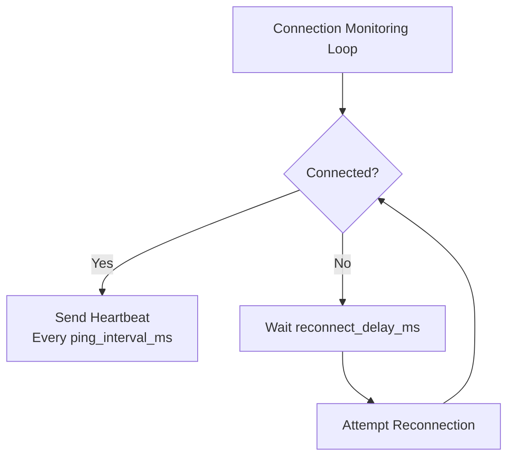
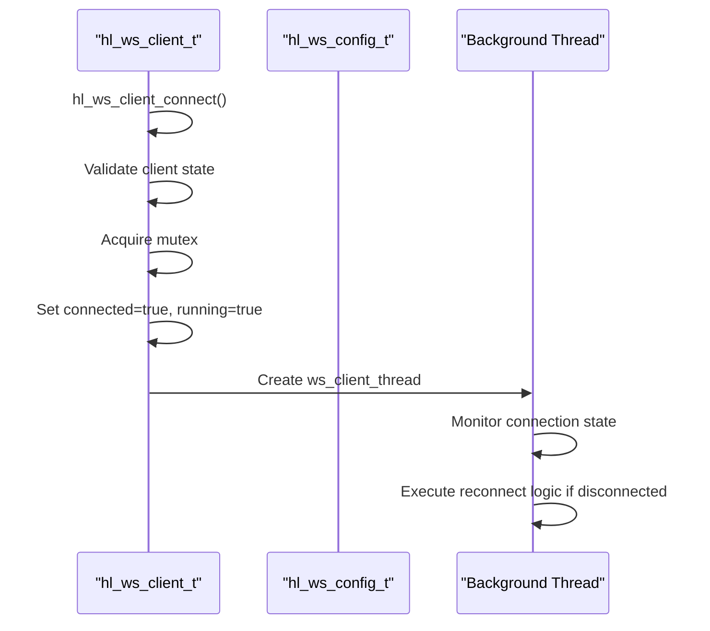
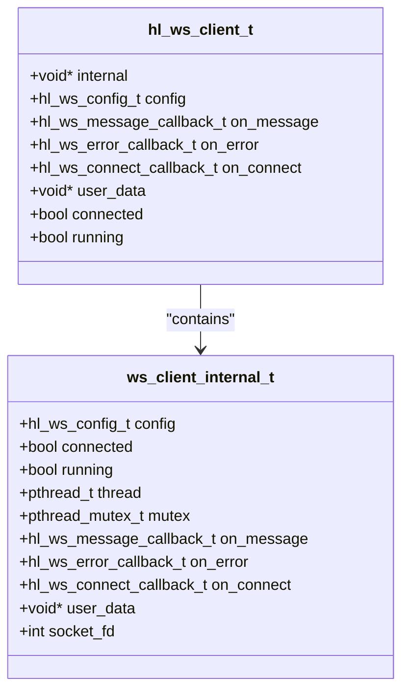
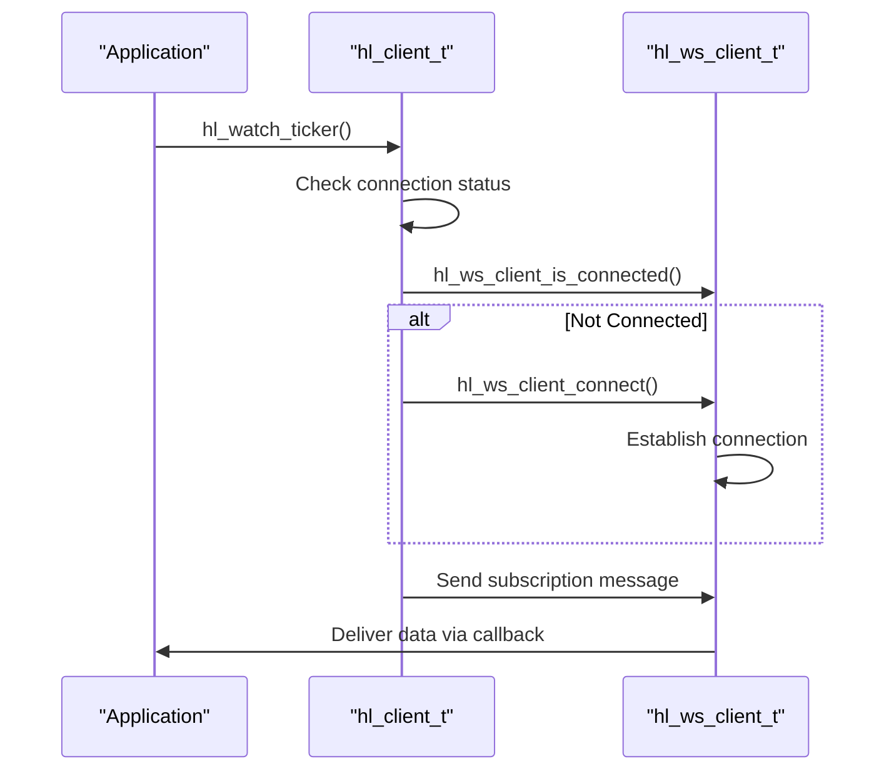
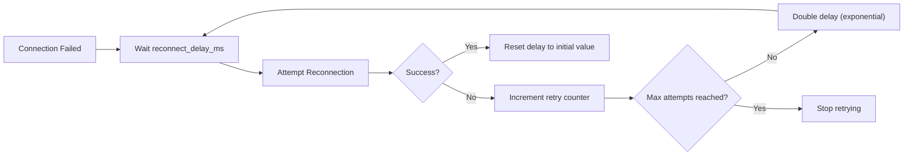

# Reconnection and Resilience

<cite>
**Referenced Files in This Document**   
- [websocket_demo.c](file://examples/websocket_demo.c)
- [ws_client.c](file://src/ws_client.c)
- [hl_ws_client.h](file://include/hl_ws_client.h)
- [websocket.c](file://src/websocket.c)
</cite>

## Table of Contents
1. [Introduction](#introduction)
2. [Connection Health Monitoring](#connection-health-monitoring)
3. [Automatic Reconnection Mechanism](#automatic-reconnection-mechanism)
4. [State Management and Thread Safety](#state-management-and-thread-safety)
5. [Subscription Restoration After Reconnection](#subscription-restoration-after-reconnection)
6. [Exponential Backoff Implementation](#exponential-backoff-implementation)
7. [Best Practices for Trading Systems](#best-practices-for-trading-systems)
8. [Conclusion](#conclusion)

## Introduction
This document details the reconnection and fault tolerance mechanisms implemented in the Hyperliquid C SDK's WebSocket client. It covers how connection health is monitored, automatic reconnection strategies, state synchronization, and best practices for maintaining reliable real-time data feeds in trading applications.

## Connection Health Monitoring

The WebSocket client detects connection loss through a combination of heartbeat monitoring and thread status checks. The background thread continuously monitors connection state and triggers appropriate actions based on connectivity status.

**Diagram sources**
- [ws_client.c](file://src/ws_client.c#L33-L51)
- [hl_ws_client.h](file://include/hl_ws_client.h#L40-L44)

**Section sources**
- [ws_client.c](file://src/ws_client.c#L33-L51)
- [hl_ws_client.h](file://include/hl_ws_client.h#L40-L44)

## Automatic Reconnection Mechanism

The client implements automatic reconnection with configurable parameters. The `hl_ws_client_connect()` function can be safely retried when the client is not already connected or running. Connection attempts are governed by configuration settings that control retry behavior.

**Diagram sources**
- [ws_client.c](file://src/ws_client.c#L127-L161)
- [ws_client.c](file://src/ws_client.c#L33-L51)

**Section sources**
- [ws_client.c](file://src/ws_client.c#L127-L161)
- [ws_client.c](file://src/ws_client.c#L33-L51)
- [hl_ws_client.h](file://include/hl_ws_client.h#L66-L66)

## State Management and Thread Safety

The WebSocket client maintains synchronized state across threads using mutex protection. Client state is reset properly during disconnection and destruction sequences to prevent race conditions during reconnection attempts.

**Diagram sources**
- [ws_client.c](file://src/ws_client.c#L13-L28)
- [ws_client.c](file://src/ws_client.c#L56-L93)

**Section sources**
- [ws_client.c](file://src/ws_client.c#L13-L28)
- [ws_client.c](file://src/ws_client.c#L98-L122)
- [ws_client.c](file://src/ws_client.c#L166-L185)

## Subscription Restoration After Reconnection

When using the high-level client interface, subscriptions are automatically managed through the WebSocket extension. The system ensures that active subscriptions are restored after reconnection by maintaining a subscription registry.

**Diagram sources**
- [websocket.c](file://src/websocket.c#L156-L181)
- [websocket.c](file://src/websocket.c#L32-L67)

**Section sources**
- [websocket.c](file://src/websocket.c#L156-L181)
- [websocket.c](file://src/websocket.c#L197-L222)
- [websocket.c](file://src/websocket.c#L257-L282)

## Exponential Backoff Implementation

While the current implementation uses fixed delay reconnection, the framework supports configurable retry strategies. The example in `websocket_demo.c` demonstrates the pattern for implementing exponential backoff in client applications.

**Diagram sources**
- [websocket_demo.c](file://examples/websocket_demo.c#L134-L175)
- [ws_client.c](file://src/ws_client.c#L275-L286)

**Section sources**
- [websocket_demo.c](file://examples/websocket_demo.c#L134-L175)
- [ws_client.c](file://src/ws_client.c#L275-L286)
- [hl_ws_client.h](file://include/hl_ws_client.h#L133-L133)

## Best Practices for Trading Systems

To minimize downtime in trading systems, applications should implement proper session resumption and subscription management. The client provides mechanisms to safely handle connection interruptions while maintaining data integrity.

### Connection Lifecycle Management
- Always check connection status with `hl_ws_client_is_connected()` before sending messages
- Use the high-level subscription functions (`hl_watch_*`) which handle automatic reconnection
- Implement application-level heartbeat monitoring complementary to the client's built-in mechanisms

### Error Handling Strategy
- Register error callbacks to receive connection failure notifications
- Implement circuit breaker patterns to prevent overwhelming the server with retry attempts
- Maintain local state of critical trading data to survive brief disconnections

### Configuration Recommendations
- Set `reconnect_delay_ms` to 5000ms (default) for production systems
- Enable `auto_reconnect` to ensure continuous operation
- Configure `max_reconnect_attempts` based on application requirements
- Set appropriate `timeout_ms` values based on network conditions

**Section sources**
- [hl_ws_client.h](file://include/hl_ws_client.h#L30-L38)
- [ws_client.c](file://src/ws_client.c#L275-L286)
- [websocket_demo.c](file://examples/websocket_demo.c#L49-L129)

## Conclusion
The Hyperliquid C SDK provides a robust foundation for building resilient WebSocket clients for trading applications. By leveraging the built-in reconnection mechanisms, proper state management, and subscription restoration features, developers can create reliable systems that maintain connectivity even in unstable network conditions. The combination of thread-safe design, configurable retry policies, and comprehensive callback system enables the development of fault-tolerant trading applications with minimal downtime.