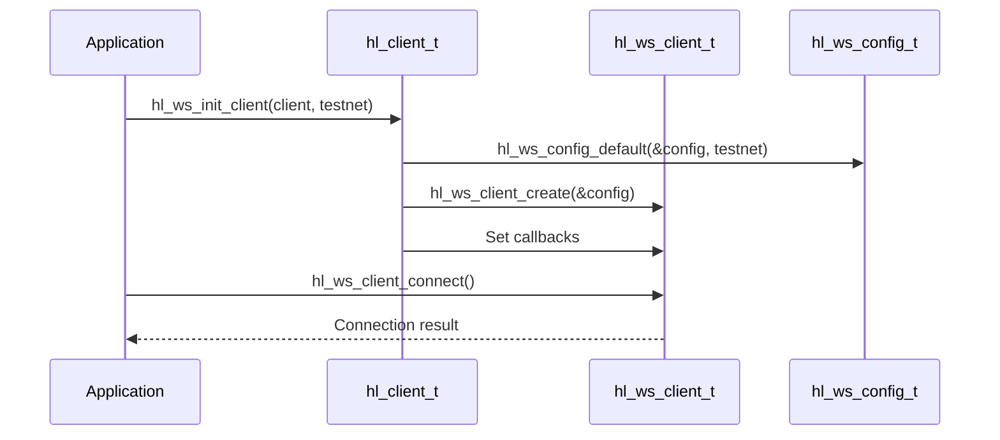
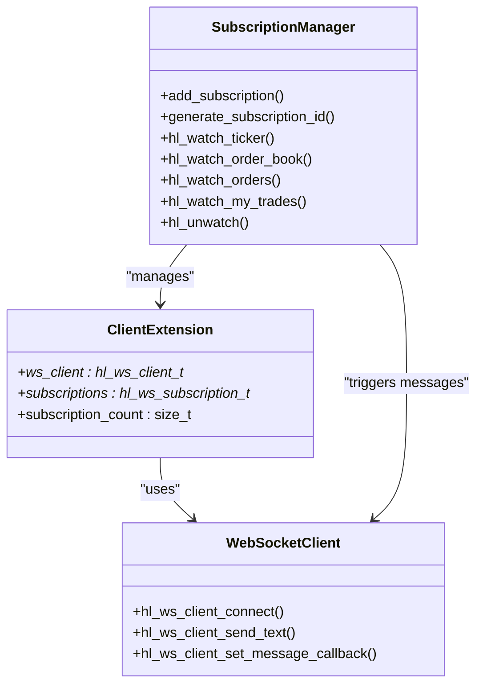
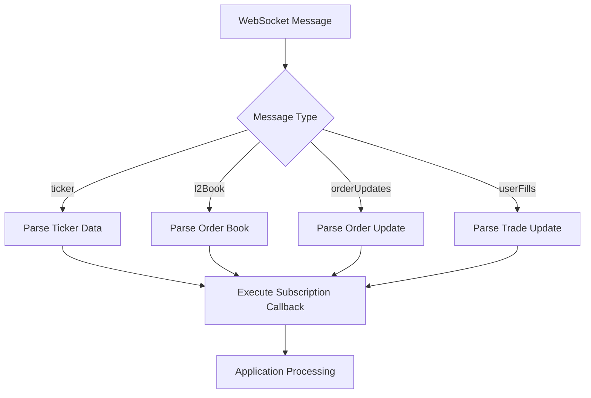
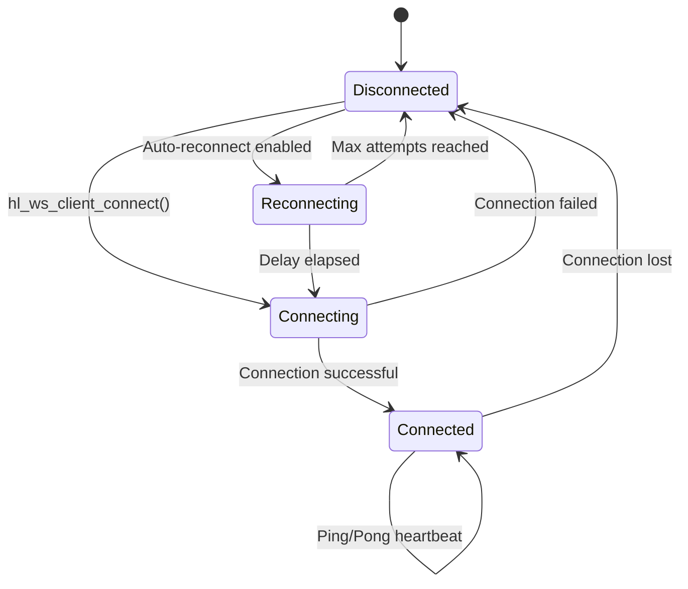
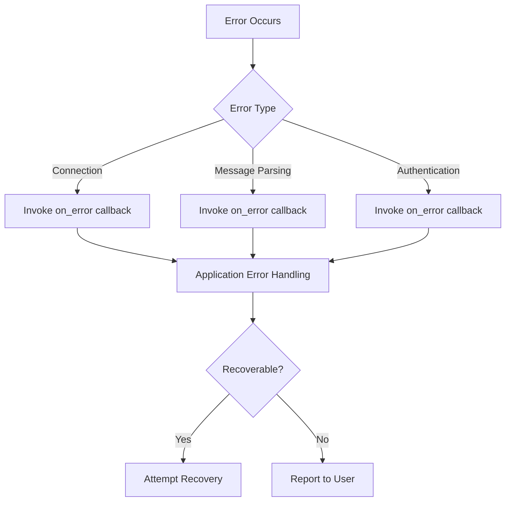
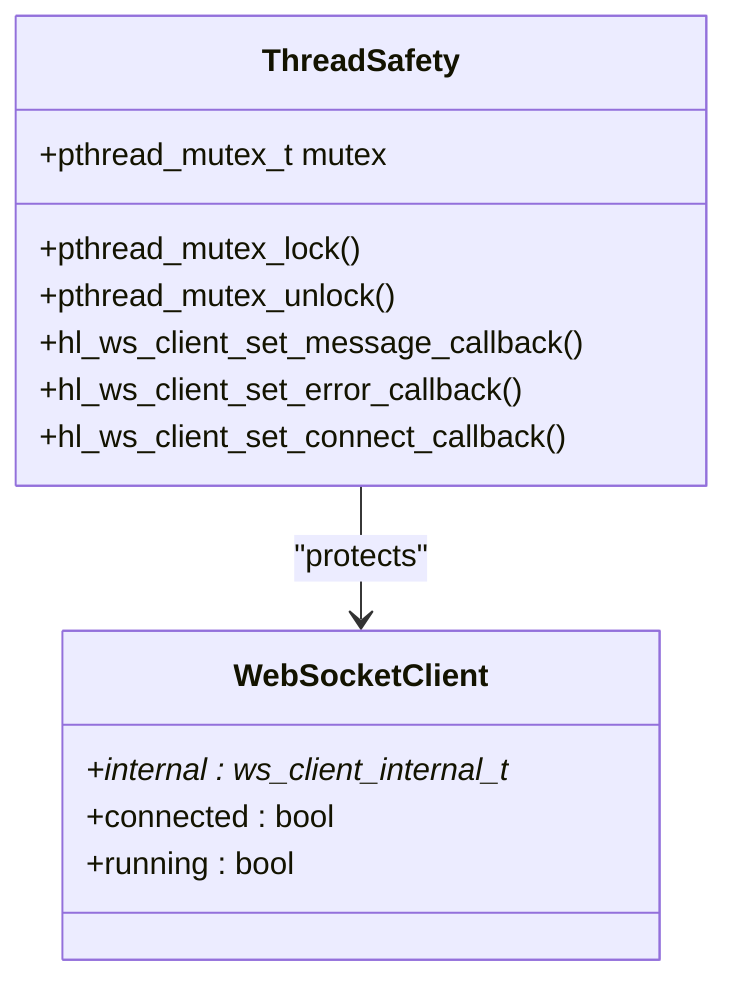
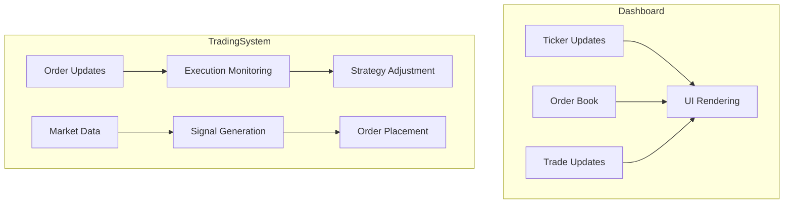
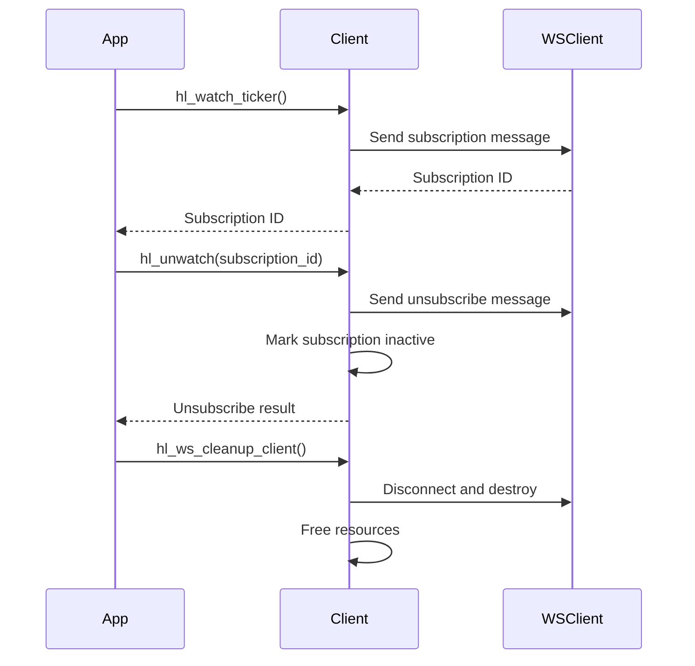

# WebSocket Integration

<cite>
**Referenced Files in This Document**   
- [hl_ws_client.h](file://include/hl_ws_client.h)
- [ws_client.c](file://src/ws_client.c)
- [websocket.c](file://src/websocket.c)
- [websocket_demo.c](file://examples/websocket_demo.c)
</cite>

## Table of Contents
1. [Introduction](#introduction)
2. [Connection Establishment](#connection-establishment)
3. [Subscription Management](#subscription-management)
4. [Message Dispatch and Callback Registration](#message-dispatch-and-callback-registration)
5. [Reconnection Strategies and Heartbeat Monitoring](#reconnection-strategies-and-heartbeat-monitoring)
6. [Real-Time Data Payloads](#real-time-data-payloads)
7. [Error Handling During Streaming](#error-handling-during-streaming)
8. [Thread Safety and Callback Execution](#thread-safety-and-callback-execution)
9. [Performance Considerations](#performance-considerations)
10. [Use Case Examples](#use-case-examples)
11. [Subscription Limits and Lifecycle Management](#subscription-limits-and-lifecycle-management)

## Introduction
The Hyperliquid C SDK provides a WebSocket-based real-time data streaming interface for accessing market data and user-specific updates. This document details the implementation and usage patterns for establishing WebSocket connections, managing subscriptions for ticker, order book, and trade updates, and handling high-frequency data streams in trading applications.

**Section sources**
- [websocket_demo.c](file://examples/websocket_demo.c#L1-L202)

## Connection Establishment
WebSocket connections are established using the `hl_ws_client_connect()` function, which initiates a connection to the Hyperliquid WebSocket server. The connection process is managed through a client configuration structure (`hl_ws_config_t`) that specifies the WebSocket URL, reconnection parameters, and timeout settings.

The `hl_ws_config_default()` function provides default configuration values, including testnet and production URLs. Connection establishment is handled by the `hl_ws_init_client()` function, which creates and configures the WebSocket client extension within the main client structure.

**Diagram sources**
- [hl_ws_client.h](file://include/hl_ws_client.h#L66-L66)
- [ws_client.c](file://src/ws_client.c#L127-L161)
- [websocket.c](file://src/websocket.c#L104-L130)

**Section sources**
- [hl_ws_client.h](file://include/hl_ws_client.h#L133-L133)
- [ws_client.c](file://src/ws_client.c#L275-L286)

## Subscription Management
The SDK supports subscription to multiple real-time data channels including ticker updates, order book changes, and trade executions. Subscriptions are managed through dedicated functions that handle both the WebSocket message transmission and internal subscription tracking.

Each subscription function returns a unique subscription ID that can be used to unsubscribe later. The subscription process automatically establishes a WebSocket connection if one does not already exist.

**Diagram sources**
- [websocket.c](file://src/websocket.c#L156-L181)
- [websocket.c](file://src/websocket.c#L197-L222)
- [websocket.c](file://src/websocket.c#L287-L315)
- [websocket.c](file://src/websocket.c#L320-L348)

**Section sources**
- [websocket.c](file://src/websocket.c#L156-L181)
- [websocket.c](file://src/websocket.c#L197-L222)
- [websocket.c](file://src/websocket.c#L287-L315)
- [websocket.c](file://src/websocket.c#L320-L348)

## Message Dispatch and Callback Registration
The WebSocket client supports callback registration for handling incoming messages, connection events, and errors. Callbacks are registered using dedicated setter functions that ensure thread-safe updates to the callback pointers.

Message dispatch is handled by the internal `ws_message_handler()` function, which receives raw WebSocket messages and routes them to appropriate subscription callbacks based on the message type and content. The callback system allows applications to process real-time data without blocking the main event loop.

**Diagram sources**
- [websocket.c](file://src/websocket.c#L75-L80)
- [websocket.c](file://src/websocket.c#L45-L54)
- [ws_client.c](file://src/ws_client.c#L221-L234)
- [ws_client.c](file://src/ws_client.c#L239-L252)

**Section sources**
- [websocket.c](file://src/websocket.c#L75-L80)
- [ws_client.c](file://src/ws_client.c#L221-L234)
- [ws_client.c](file://src/ws_client.c#L239-L252)
- [ws_client.c](file://src/ws_client.c#L257-L270)

## Reconnection Strategies and Heartbeat Monitoring
The WebSocket client implements automatic reconnection capabilities with configurable parameters. The `hl_ws_config_t` structure includes fields for reconnection delay, maximum reconnection attempts, and ping interval for heartbeat monitoring.

The client runs in a background thread that periodically checks the connection status and attempts reconnection if the connection is lost. Heartbeat messages are simulated with a 30-second interval in the current implementation, though a production implementation would use WebSocket ping/pong frames.

**Diagram sources**
- [ws_client.c](file://src/ws_client.c#L35-L55)
- [hl_ws_client.h](file://include/hl_ws_client.h#L15-L25)

**Section sources**
- [ws_client.c](file://src/ws_client.c#L35-L55)
- [hl_ws_client.h](file://include/hl_ws_client.h#L15-L25)

## Real-Time Data Payloads
The WebSocket interface delivers real-time updates for various market data channels. Each payload type follows a specific structure that includes the data type, symbol, and relevant market information.

Ticker updates include price, volume, and market statistics. Order book updates provide bid and ask levels with depth information. Trade updates contain execution details including price, amount, and timestamp. User-specific updates include order status changes and trade executions associated with the authenticated account.

**Section sources**
- [hl_types.h](file://include/hl_types.h#L50-L144)

## Error Handling During Streaming
Error handling is implemented through a dedicated error callback mechanism. The `hl_ws_error_callback_t` type defines the signature for error callbacks, which are invoked when WebSocket communication errors occur.

The error handling system captures both connection-level errors and message processing issues. Applications should implement robust error handling to maintain data integrity during network disruptions or server-side issues.

**Diagram sources**
- [websocket.c](file://src/websocket.c#L85-L90)
- [ws_client.c](file://src/ws_client.c#L239-L252)

**Section sources**
- [websocket.c](file://src/websocket.c#L85-L90)

## Thread Safety and Callback Execution
The WebSocket client implementation ensures thread safety for callback execution and state management. Mutex locks are used to protect shared data structures during callback registration and connection state changes.

All callback functions are executed in the context of the WebSocket client's background thread. Applications should ensure that callback implementations are thread-safe and do not perform blocking operations that could interfere with the WebSocket message processing loop.

**Diagram sources**
- [ws_client.c](file://src/ws_client.c#L221-L234)
- [ws_client.c](file://src/ws_client.c#L239-L252)
- [ws_client.c](file://src/ws_client.c#L257-L270)

**Section sources**
- [ws_client.c](file://src/ws_client.c#L221-L234)

## Performance Considerations
The WebSocket client is designed for high-frequency data processing with minimal overhead. The implementation uses efficient data structures for subscription management and message routing.

For applications processing high volumes of market data, consider implementing message filtering at the application level to reduce processing load. Batch processing of updates can also improve performance by reducing the frequency of UI updates or database writes.

Applications should monitor memory usage when maintaining long-running subscriptions, as the subscription tracking system dynamically allocates memory for new subscriptions.

**Section sources**
- [websocket.c](file://src/websocket.c#L45-L54)
- [websocket.c](file://src/websocket.c#L156-L181)

## Use Case Examples
The SDK supports various real-time applications including trading dashboards and low-latency trading systems. The `websocket_demo.c` example demonstrates basic subscription patterns for market data and user updates.

Real-time dashboards can subscribe to multiple ticker and order book streams to provide comprehensive market views. Low-latency trading systems can use the real-time order and trade updates to implement sophisticated execution algorithms and risk management systems.

**Diagram sources**
- [websocket_demo.c](file://examples/websocket_demo.c#L30-L100)

**Section sources**
- [websocket_demo.c](file://examples/websocket_demo.c#L30-L100)

## Subscription Limits and Lifecycle Management
Subscription lifecycle is managed through explicit subscribe and unsubscribe operations. The `hl_unwatch()` function allows applications to terminate subscriptions using the subscription ID returned during subscription.

Applications should properly manage the WebSocket client lifecycle by calling `hl_ws_cleanup_client()` when the client is no longer needed. This ensures proper cleanup of resources including memory and network connections.

The subscription system automatically handles reconnection scenarios, resubscribing to active channels when the connection is reestablished (when auto-reconnect is enabled).

**Diagram sources**
- [websocket.c](file://src/websocket.c#L353-L375)
- [websocket.c](file://src/websocket.c#L135-L151)

**Section sources**
- [websocket.c](file://src/websocket.c#L353-L375)
- [websocket.c](file://src/websocket.c#L135-L151)